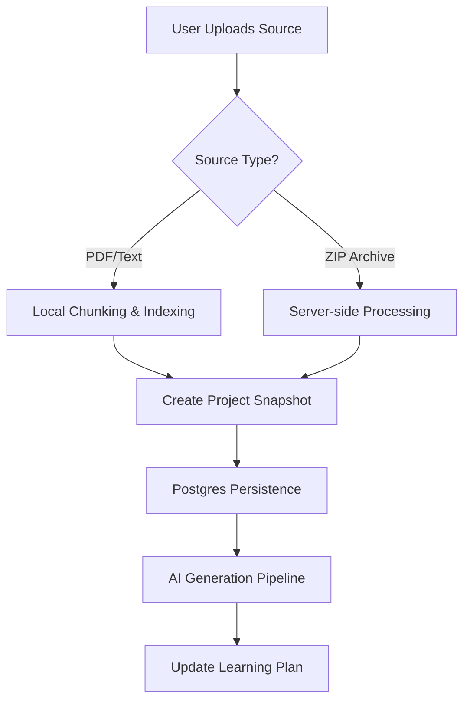
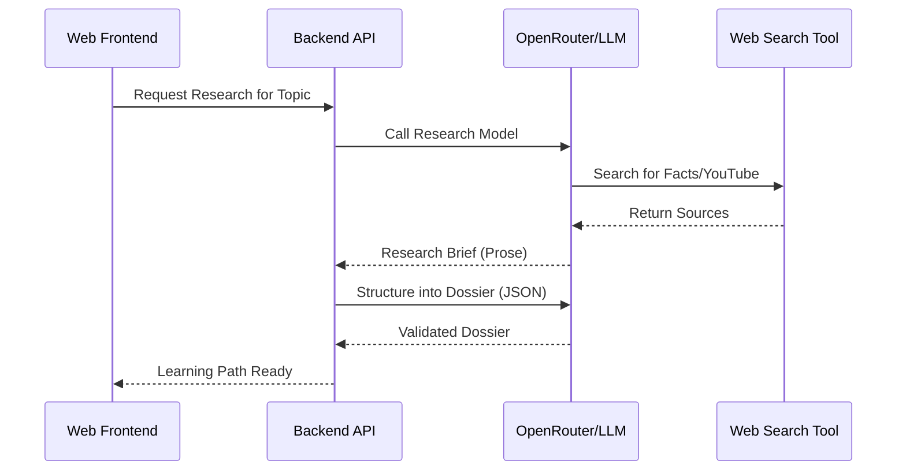

Relevant source files

The following files were used as context for generating this wiki page:

- [README.md](README.md)
- [AGENTS.md](AGENTS.md)
- [apps/web/services/projects/projectSnapshot.ts](apps/web/services/projects/projectSnapshot.ts)
- [apps/backend/tests/routes/projects.test.ts](apps/backend/tests/routes/projects.test.ts)
- [apps/backend/tests/projects/postgresProjectStore.test.ts](apps/backend/tests/projects/postgresProjectStore.test.ts)
- [apps/web/services/projects/courseSources.ts](apps/web/services/projects/courseSources.ts)
- [apps/backend/src/services/lessonGenerationPrompt.ts](apps/backend/src/services/lessonGenerationPrompt.ts)

# Project Overview

Nous Reader is a specialized learning platform designed to transform uploaded documents and researched topics into personalized, AI-backed courses. Unlike generic chat applications, it focuses on an "ADHD-friendly" pedagogical approach, providing step-by-step learning environments through structured lessons, reflection prompts, and application exercises.

The project follows a modular architecture with a Vite-based React frontend and an Express-based Node.js backend. It utilizes PostgreSQL for project storage and Supabase for authentication, supporting both local development and production-grade deployments.

Sources: [README.md:3-8](README.md#L3-L8), [AGENTS.md:65-71](AGENTS.md#L65-L71)

## Core Architecture

Nous Reader is structured as a monorepo containing a frontend web application, a backend API server, and shared packages for contracts and types.

### System Components

| Component | Path | Responsibility |
| :--- | :--- | :--- |
| **Frontend** | `apps/web/` | React/Vite UI, workspace management, and local source processing. |
| **Backend** | `apps/backend/src/` | Express API, AI orchestration, and PostgreSQL persistence. |
| **Shared Types** | `packages/shared-types/` | Cross-boundary data contracts and validation schemas. |
| **Tooling** | `scripts/` | Feature mapping, database migrations, and CI utilities. |

Sources: [README.md:43-48](README.md#L43-L48), [apps/web/services/projects/projectSnapshot.ts:1-20](apps/web/services/projects/projectSnapshot.ts#L1-L20)

### Technical Stack
*  **Runtime:** Bun
*  **Persistence:** PostgreSQL (via `DATABASE_URL`)
*  **Auth:** Supabase Auth (or `local-bypass` for development)
*  **AI Integration:** OpenRouter (primary), OpenAI, or self-hosted Codex
*  **Testing:** Vitest with JSDOM and Supabase local stack probes

Sources: [README.md:10-38](README.md#L10-L38), [AGENTS.md:95-107](AGENTS.md#L95-L107)

## Data Model and Persistence

The system centers around the **Project Snapshot**, a versioned data structure that encapsulates the state of a learning journey, including source materials, the learning plan, and AI-generated dossiers.

### Project Lifecycle Flow
The following diagram illustrates the flow from document upload to project persistence.

The system distinguishes between three primary source strategies: `learn` (AI research only), `archive` (codebase ingestion), and `source-set` (document-based learning).
Sources: [apps/backend/src/workflows/courseGenerationPreparation.ts:89-100](apps/backend/src/workflows/courseGenerationPreparation.ts#L89-L100), [apps/web/services/projects/projectSnapshot.ts:68-80](apps/web/services/projects/projectSnapshot.ts#L68-L80)

### Persistence Logic
Project data is stored in PostgreSQL, but large binary assets (like PDFs or original ZIP files) are moved to immutable object storage to keep snapshots lightweight.

*  **Snapshots:** Versioned JSON representations of the learning state.
*  **Source Files:** Stored separately; only references (`ProjectSourceRef`) are kept in the primary snapshot.
*  **Revisions:** Optimistic concurrency control using `expectedRevision` to prevent data loss during concurrent edits.

Sources: [apps/backend/tests/projects/postgresProjectStore.test.ts:315-340](apps/backend/tests/projects/postgresProjectStore.test.ts#L315-L340), [apps/web/services/projects/projectSnapshot.ts:400-420](apps/web/services/projects/projectSnapshot.ts#L400-L420)

## Learning and AI Orchestration

Nous Reader uses a "Professor Nous" persona to guide the AI in generating pedagogically sound content. The generation process is governed by strict writing and visual contracts.

### Pedagogical Rules
The system enforces specific rules to ensure content accessibility:
*  **Propedeutic Order:** Concepts must be introduced before they are used.
*  **Language:** Direct, accessible lexicon avoiding unnecessary jargon.
*  **Active Pauses:** Integration of quizzes and exercises to verify understanding.
*  **Visual Planning:** AI decides where `illustrative_image`, `flowchart_svg`, or `interactive_html` artifacts are needed based on the text.

Sources: [packages/shared-types/lessonWritingContract.ts:15-35](packages/shared-types/lessonWritingContract.ts#L15-L35), [apps/backend/src/services/lessonGenerationPrompt.ts:70-95](apps/backend/src/services/lessonGenerationPrompt.ts#L70-L95)

### Research and Dossier Generation
For topics requiring external information, the system performs "Deep Research" to collocate facts, examples, and recent developments.

Sources: [apps/web/services/openrouter/research.ts:340-380](apps/web/services/openrouter/research.ts#L340-L380), [apps/backend/src/services/lessonGenerationPrompt.ts:100-110](apps/backend/src/services/lessonGenerationPrompt.ts#L100-L110)

## Project Organization

Users organize their learning through a library system supporting folders and custom ordering.

| Feature | Description |
| :--- | :--- |
| **Folders** | Hierarchical containers for projects. |
| **Favorites** | Quick access markers persisted on the server. |
| **Source Library** | Centralized view of all uploaded original documents across projects. |
| **Covers** | Auto-generated visual representations for projects in the home dashboard. |

Sources: [apps/backend/tests/routes/projects.test.ts:600-630](apps/backend/tests/routes/projects.test.ts#L600-L630), [apps/web/tests/components/newHome/newHomeData.test.tsx:20-50](apps/web/tests/components/newHome/newHomeData.test.tsx#L20-L50)

## Development and Quality Gates

The project emphasizes code quality through the `bun run doctor` and `bun run gate` commands.

*  **Doctor:** A read-only diagnostic tool that checks local Supabase health and migration parity.
*  **Gate:** A full quality suite including TypeScript checks, Biome linting, and Vitest execution.
*  **Graphify:** An internal knowledge graph tool used for cross-module dependency analysis and architectural boundary verification.

Sources: [AGENTS.md:10-25](AGENTS.md#L10-L25), [AGENTS.md:120-135](AGENTS.md#L120-L135), [README.md:100-105](README.md#L100-L105)

***

The Nous Reader architecture prioritizes pedagogical integrity and state stability. By separating heavy source assets from transactional metadata and enforcing strict AI generation contracts, the system provides a robust platform for personalized education.
