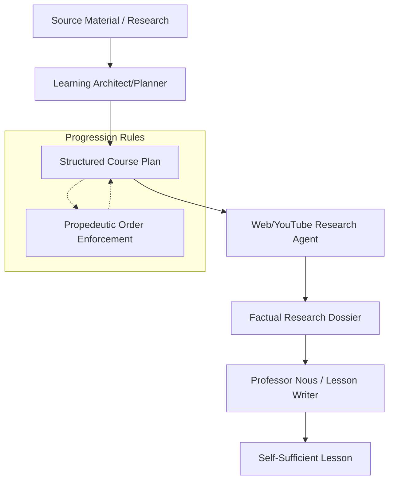

Relevant source files

The following files were used as context for generating this wiki page:

- [AGENTS.md](AGENTS.md)
- [packages/shared-types/lessonWritingContract.ts](packages/shared-types/lessonWritingContract.ts)
- [apps/backend/src/services/lessonGenerationPrompt.ts](apps/backend/src/services/lessonGenerationPrompt.ts)
- [packages/shared-types/lessonVisualContracts.ts](packages/shared-types/lessonVisualContracts.ts)
- [apps/web/services/openrouter/prompts.ts](apps/web/services/openrouter/prompts.ts)
- [apps/web/services/openrouter/research.ts](apps/web/services/openrouter/research.ts)

# Product Manifesto & Design Strategy

Nous Reader is defined as an ADHD-friendly, step-by-step learning environment designed for deep understanding of complex subjects. Unlike generic chat applications or content creation suites, its design strategy centers on pedagogical rigor, propedeutic progression, and a focused user experience that minimizes cognitive load while maximizing retention through active learning.

The core philosophy dictates that the system must act as an expert "Learning Architect" or "Professor," transforming dense source materials—such as 800-page textbooks or complex research dossiers—into digestible, autonomous lessons. This strategy is enforced through strict writing contracts, visual planning rules, and a structured generation workflow that prioritizes clarity over academic jargon.

Sources: [AGENTS.md:124-129](AGENTS.md#L124-L129), [apps/web/services/openrouter/prompts.ts:20-25](apps/web/services/openrouter/prompts.ts#L20-L25)

## Core Strategic Pillars

The project is governed by a set of working rules and a strategic manifesto that serves as the "north star" for all architectural and UX decisions.

### Pedagogical Tone and Style
The "Professor Nous" persona is required to generate lessons that are rigorous but accessible. The strategy explicitly forbids lists as the primary body of text, favoring discursive, exhaustive prose that builds a narrative flow.

| Requirement | Strategic Rule |
| :--- | :--- |
| **Lexicon** | Use clear, accessible language; avoid unnecessary jargon or "academic posing." |
| **Definitions** | Always start with a positive, autonomous definition before using contrast/negation. |
| **Self-Sufficiency** | Lessons must be autonomous; students should not need the source document open. |
| **Language** | Prefer natural native terms over foreignisms (e.g., Italian equivalents over English). |

Sources: [packages/shared-types/lessonWritingContract.ts:46-77](packages/shared-types/lessonWritingContract.ts#L46-L77), [apps/backend/src/services/lessonGenerationPrompt.ts:88-92](apps/backend/src/services/lessonGenerationPrompt.ts#L88-L92)

### Propedeutic Order
A fundamental design requirement is strict propedeutic progression. Concepts must be introduced such that every step only requires knowledge already covered or explained within the same block.

- **No Future References**: Do not use concepts that will be explained in later sections.
- **Immediate Clarification**: Technical terms, symbols, or formulas must be linked to common-language explanations immediately (same or next paragraph).
- **Reduced Density**: When a student reports difficulty in a domain, the system must introduce only one new abstraction at a time.

Sources: [packages/shared-types/lessonWritingContract.ts:7-17](packages/shared-types/lessonWritingContract.ts#L7-L17), [apps/web/services/openrouter/prompts.ts:50-57](apps/web/services/openrouter/prompts.ts#L50-L57)

## Architecture of Knowledge Transformation

The design strategy leverages a multi-stage workflow to transform raw data into pedagogical content.

This diagram illustrates the flow from raw source documents to the final lesson, highlighting the mid-stage research and the enforcement of propedeutic order during syllabus creation.

Sources: [apps/web/services/openrouter/research.ts:255-300](apps/web/services/openrouter/research.ts#L255-L300), [apps/web/services/openrouter/prompts.ts:20-35](apps/web/services/openrouter/prompts.ts#L20-L35)

### The Research Strategy
Research is not merely a data-gathering exercise but a structured process to collocate factual summaries, key examples, and potential controversies. A unique aspect of the strategy is the evaluation of YouTube transcripts to find moments where movement or visual succession adds instructional value that static images cannot provide.

Sources: [apps/web/services/openrouter/research.ts:33-70](apps/web/services/openrouter/research.ts#L33-L70), [packages/shared-types/lessonWritingContract.ts:20-26](packages/shared-types/lessonWritingContract.ts#L20-L26)

## Visual and Interactive Design Strategy

The manifesto emphasizes that visuals must earn their existence. They are never decorative and must serve a specific pedagogical goal.

### Visual Format Selection
The system selects visual formats based on the nature of the information:
- **Illustrative Image (Raster)**: Used for physical reality, textures, anatomy, or complex spatial relationships.
- **SVG (Structural/Flowchart)**: Used for abstract relationships, pipelines, or simple containment architectures.
- **Interactive HTML**: Used when real interaction is indispensable for exploring or comparing concepts.
- **Mermaid**: Reserved strictly for Entity-Relationship (ER) or Class diagrams.

Sources: [packages/shared-types/lessonVisualContracts.ts:162-185](packages/shared-types/lessonVisualContracts.ts#L162-L185), [packages/shared-types/lessonVisualContracts.ts:205-235](packages/shared-types/lessonVisualContracts.ts#L205-L235)

### Active Learning via Active Pauses
Design strategy integrates "Active Pauses" (inline quizzes) within lessons. These are not simple recall tests but require application, diagnosis, or sequencing.
- **Self-Sufficiency**: Each pause must be answerable based on the local markdown block.
- **Plausibility**: Distractors must be plausible, and the exercise must avoid simple paraphrasing.

Sources: [apps/backend/src/services/lessonGenerationPrompt.ts:109-118](apps/backend/src/services/lessonGenerationPrompt.ts#L109-L118), [packages/shared-types/lessonWritingContract.ts:16-17](packages/shared-types/lessonWritingContract.ts#L16-L17)

## Development and Automation Discipline

The manifesto extends to the development workflow, emphasizing "Simplicity and Cognitive Complexity" (keeping functions below a complexity of 15). Developers are instructed to prioritize existing architecture over inventing new patterns and to centralize aesthetic constants (colors, spacing, timing) to prevent visual drift.

### Graphify Integration
The architecture uses a "Graphify" knowledge graph (`graphify-out/`) to manage cross-module ownership and dependency questions. This ensures that architectural boundaries remain clear as the system evolves.

Sources: [AGENTS.md:5-20](AGENTS.md#L5-L20), [AGENTS.md:143-155](AGENTS.md#L143-L155)

### Source Citation Rules
A critical component of the design strategy is the "Single Source of Truth." The system centralizes error messages, visual constants, and business logic to ensure that one change updates the entire system.

Sources: [AGENTS.md:167-173](AGENTS.md#L167-L173), [AGENTS.md:204-208](AGENTS.md#L204-L208)

## Conclusion
The Nous Reader Design Strategy is a commitment to pedagogical integrity. By enforcing strict writing contracts, propedeutic ordering, and purposeful visual integration, the system ensures that complex subjects are rendered accessible without sacrificing depth. Every architectural component—from the Graphify-monitored codebase to the Professor Nous generation prompt—is aligned to support a focused, ADHD-friendly learning flow.
