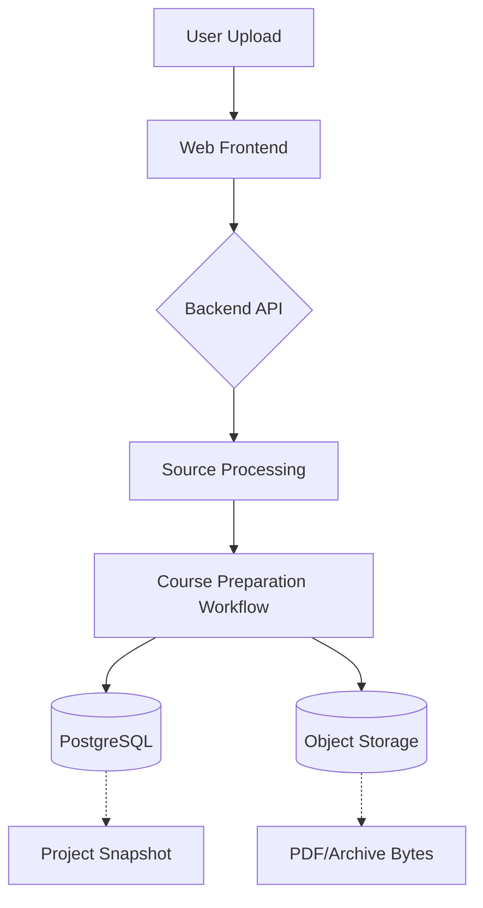
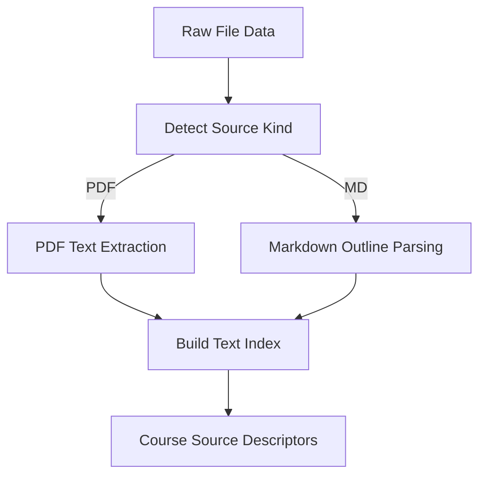
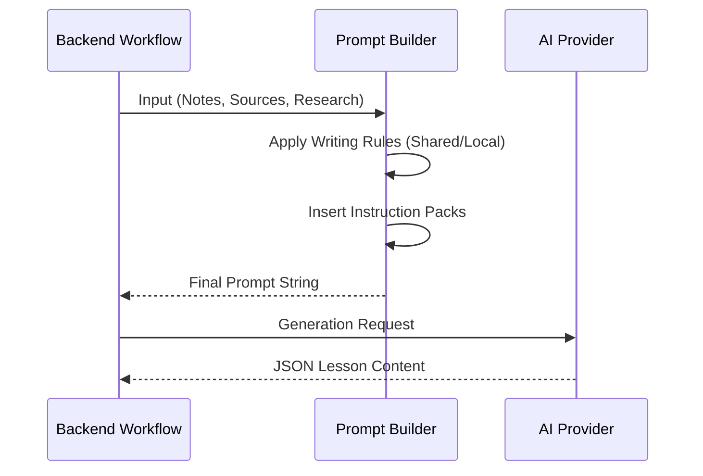

Relevant source files

The following files were used as context for generating this wiki page:

- [README.md](../../../README.md)
- [AGENTS.md](../../../AGENTS.md)
- [apps/web/services/projects/projectSnapshot.ts](../../../apps/web/services/projects/projectSnapshot.ts)
- [apps/web/services/projects/courseSources.ts](../../../apps/web/services/projects/courseSources.ts)
- [apps/backend/src/workflows/courseGenerationPreparation.ts](../../../apps/backend/src/workflows/courseGenerationPreparation.ts)
- [packages/shared-types/lessonWritingContract.ts](../../../packages/shared-types/lessonWritingContract.ts)
- [apps/backend/tests/routes/projects.test.ts](../../../apps/backend/tests/routes/projects.test.ts)

# Project Overview

Nous Reader is an AI-powered educational platform designed to transform uploaded documents and researched topics into personalized, structured courses. It focuses on providing an ADHD-friendly, step-by-step learning environment that includes lessons, reflection prompts, and application exercises with AI-driven feedback. The system is built on a monorepo architecture utilizing a Vite frontend and an Express backend, coordinated through a comprehensive set of AI agent instructions and strict architectural boundaries.

Sources: [README.md:3-8](../../../README.md#L3-L8), [AGENTS.md:65-71](../../../AGENTS.md#L65-L71)

## Core Architecture

The project follows a modular structure where concerns are separated into a frontend application, a backend API server, shared packages for contracts, and tooling scripts.

### System Components
*  **Frontend (`apps/web/`):** A React-based SPA that handles document uploads, project management, and the interactive learning interface.
*  **Backend (`apps/backend/`):** An Express server managing project persistence, source processing, and the orchestration of AI generation workflows.
*  **Shared Types (`packages/shared-types/`):** Centralized definitions for API contracts, lesson writing rules, and pedagogical policies.
*  **Persistence:** Primary project storage is handled by PostgreSQL, while binary assets (like PDFs and images) are stored in an authenticated server storage system.

Sources: [README.md:43-51](../../../README.md#L43-L51), [README.md:27-38](../../../README.md#L27-L38), [README.md:54-55](../../../README.md#L54-L55)

### Data Flow for Project Creation
The following diagram illustrates the flow from a user providing source material to the persistence of a project snapshot.

Sources: [apps/backend/src/workflows/courseGenerationPreparation.ts](../../../apps/backend/src/workflows/courseGenerationPreparation.ts), [apps/web/services/projects/courseSources.ts](../../../apps/web/services/projects/courseSources.ts)

## Project and Source Management

Projects in Nous are encapsulated in **Snapshots**, which represent the complete state of a course at a specific version. Sources are handled distinctly based on their type, such as PDF, Markdown, or Codebase Archives.

### Project Snapshots
A `ProjectSnapshot` includes metadata, the learning plan, user profile settings, and references to source material. The system uses a versioning scheme (e.g., version 4.1) to maintain compatibility between stored data and application logic.

| Field | Type | Description |
| :--- | :--- | :--- |
| `id` | `ProjectId` | Unique identifier for the project. |
| `sourceKind` | `ProjectSourceKind` | Indicates if the source is a document, codebase, or learn-mode. |
| `state` | `AppState` | Current state of the app (e.g., LIBRARY, READING). |
| `learningPlan` | `LearningPlan` | The structured modules and lessons. |
| `source` | `ProjectSource` | Reference to the underlying data (PDF, ZIP, etc). |

Sources: [apps/web/services/projects/projectSnapshot.ts:121-155](../../../apps/web/services/projects/projectSnapshot.ts#L121-L155)

### Source Processing and Indexing
Sources are processed to create a `PdfTextIndex`, which breaks content into manageable chunks for AI processing. For Markdown files, the system performs deterministic outline parsing to identify headings and structure.

Sources: [apps/web/services/projects/courseSources.ts:162-185](../../../apps/web/services/projects/courseSources.ts#L162-L185), [apps/web/services/projects/courseSources.ts:250-280](../../../apps/web/services/projects/courseSources.ts#L250-L280)

## AI Pedagogy and Generation Rules

Nous utilizes specific "Instruction Packs" and writing rules to ensure that generated lessons are pedagogically sound. The `SYSTEM_INSTRUCTION_TEACHER` defines the persona of "Professor Nous," a rigorous yet accessible educator.

### Fundamental Pedagogical Principles
1.  **Strict Propaedeutic Order:** Passages must only require concepts already introduced or explained in the same block.
2.  **Discursive Style:** Content must be exhaustively written in paragraphs, avoiding bulleted lists as the primary body.
3.  **Self-Sufficiency:** Lessons must work as standalone texts without requiring the user to have the original source open.
4.  **Formula Relevance:** Mathematical formulas are used only when natural to the subject, avoiding "decorative" equations for qualitative concepts.

Sources: [packages/shared-types/lessonWritingContract.ts:1-9](../../../packages/shared-types/lessonWritingContract.ts#L1-L9), [packages/shared-types/lessonWritingContract.ts:50-64](../../../packages/shared-types/lessonWritingContract.ts#L50-L64)

### Content Generation Blocks
The backend orchestrates the construction of prompts by combining user notes, research dossiers, and source contexts.

Sources: [apps/backend/src/services/lessonGenerationPrompt.ts:51-71](../../../apps/backend/src/services/lessonGenerationPrompt.ts#L51-L71)

## Technical Validation and Quality Gates

CI owns the complete Bun test suite and dependency graph check. After CI passes, `bun run gate:full` runs local quality, coverage, and Sonar analysis on the same final commit.

### Available Developer Commands
*  `bun run doctor`: Read-only health report of local services.
*  `bun run quality`: TypeScript type checks and Biome linting.
*  `bun run test`: Runs the Vitest suite under the Bun runtime.

Sources: [AGENTS.md:73-100](../../../AGENTS.md#L73-L100), [README.md:63-66](../../../README.md#L63-L66)

## Conclusion

Nous Reader provides a robust architecture for transforming static documents into dynamic learning experiences. By leveraging structured project snapshots, comprehensive source indexing, and strictly defined pedagogical AI instructions, it ensures a consistent and high-quality educational output for users. The system is designed for maintainability through enforced modularity and rigorous validation pipelines.

Sources: [README.md:3-8](../../../README.md#L3-L8), [AGENTS.md:120-125](../../../AGENTS.md#L120-L125)
