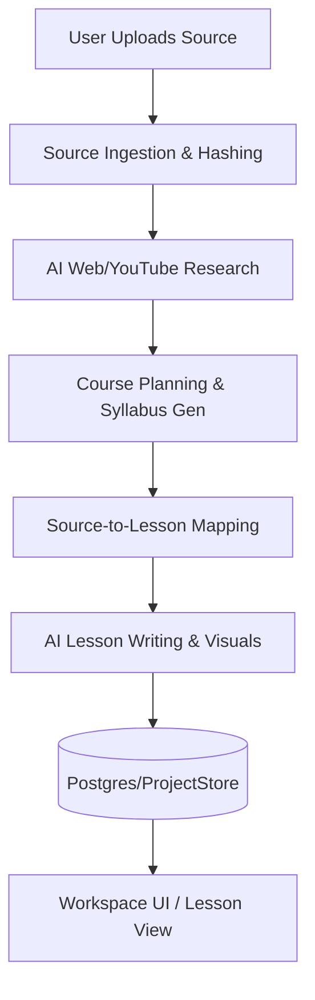
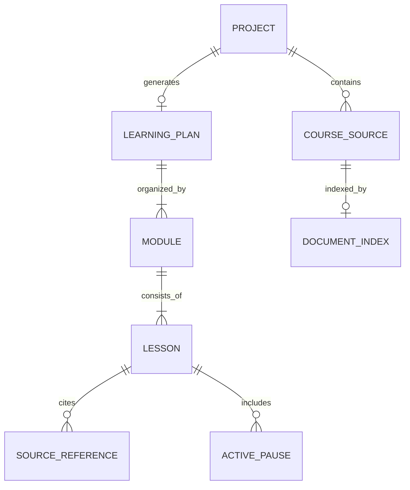
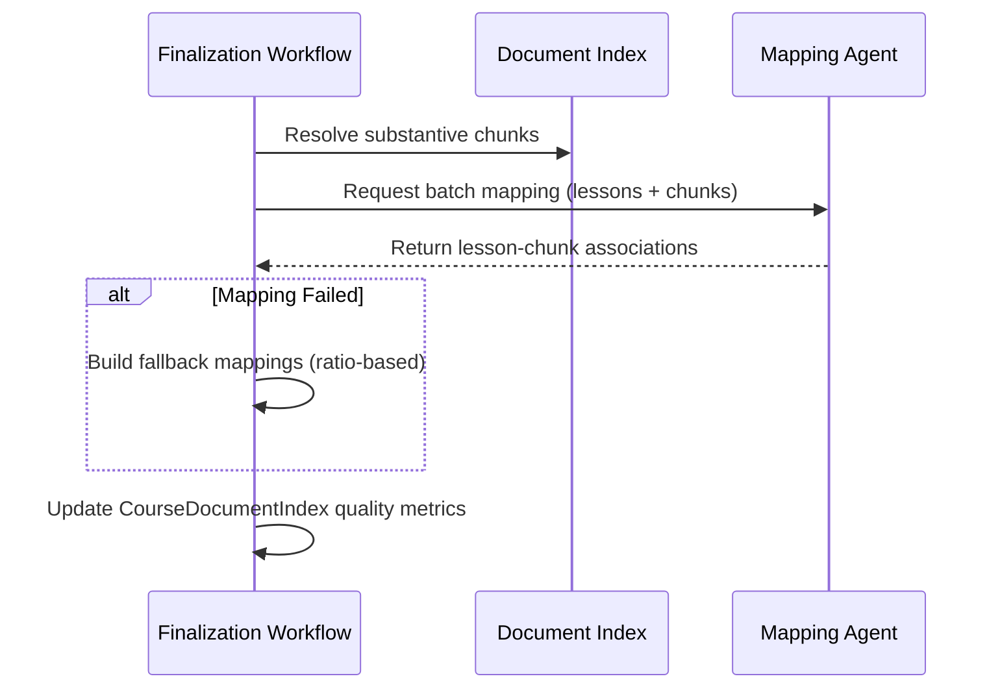

Relevant source files

The following files were used as context for generating this wiki page:

- [README.md](../../../README.md)
- [AGENTS.md](../../../AGENTS.md)
- [apps/web/services/projects/projectSnapshot.ts](../../../apps/web/services/projects/projectSnapshot.ts)
- [apps/backend/src/workflows/courseSourceFinalization.ts](../../../apps/backend/src/workflows/courseSourceFinalization.ts)
- [apps/web/services/projects/courseSources.ts](../../../apps/web/services/projects/courseSources.ts)
- [apps/backend/tests/routes/projects.test.ts](../../../apps/backend/tests/routes/projects.test.ts)
- [packages/shared-types/lessonWritingContract.ts](../../../packages/shared-types/lessonWritingContract.ts)

# Project Overview

Nous Reader (also referred to as Lumina-Reader) is an ADHD-friendly, step-by-step learning environment designed to transform uploaded documents and researched topics into personalized courses. Unlike generic chat applications, it focuses on helping users understand entire subjects through structured lessons, reflection prompts, and AI-backed application exercises. The system leverages AI agents to process source materials—including PDFs, Markdown, and codebases—and generates pedagogical content that maintains strict propedeutic order, ensuring concepts are explained before they are used in subsequent sections.

Sources: [README.md:3-5](../../../README.md#L3-L5), [AGENTS.md:52-56](../../../AGENTS.md#L52-L56), [packages/shared-types/lessonWritingContract.ts:10-18](../../../packages/shared-types/lessonWritingContract.ts#L10-L18)

## System Architecture

The project is structured as a monorepo containing a Vite-based frontend and an Express-based backend. It utilizes a Bun workspace for dependency management and task execution. The architecture separates concerns between UI rendering, AI orchestration workflows, and persistent project storage.

### Core Components

| Component | Path | Description |
| :--- | :--- | :--- |
| **Frontend** | `apps/web/` | Vite/React application providing the workspace UI and document viewer. |
| **Backend** | `apps/backend/src/` | Express API server handling AI workflows, project storage, and source processing. |
| **Shared Types** | `packages/shared-types/` | Shared contracts for lesson writing, visual planning, and project snapshots. |
| **Tooling** | `scripts/` | Diagnostic (doctor), quality gate, and deployment scripts. |

Sources: [README.md:19-32](../../../README.md#L19-L32), [README.md:73-77](../../../README.md#L73-L77)

### High-Level Data Flow

The following diagram illustrates the lifecycle of a course, from source ingestion to personalized lesson delivery.

The flow highlights the transition from raw data to a structured `LearningPlan` through specialized AI stages.
Sources: [apps/backend/src/workflows/courseSourceFinalization.ts:250-320](../../../apps/backend/src/workflows/courseSourceFinalization.ts#L250-L320), [apps/web/services/projects/projectSnapshot.ts:133-160](../../../apps/web/services/projects/projectSnapshot.ts#L133-L160)

## Project Data Model

The central entity in Lumina-Reader is the **Project**, represented by a `ProjectSnapshot`. This structure encapsulates the entire state of a learning journey, including source materials, user profiles, and the generated pedagogical structure.

### Project Snapshot Structure
A `ProjectSnapshot` (currently version 4.1) includes:
*  **Metadata**: Project ID, version, and timestamps.
*  **Source**: A `ProjectSource` object containing file references (PDF, archive, or document) and indices.
*  **Learning Plan**: A hierarchy of modules and lessons (sections).
*  **Research Context**: Factual dossiers, YouTube transcripts, and web research results.
*  **User Profile**: Experience level, learning style, and goals.

Sources: [apps/web/services/projects/projectSnapshot.ts:21-43](../../../apps/web/services/projects/projectSnapshot.ts#L21-L43), [apps/web/services/projects/projectSnapshot.ts:133-160](../../../apps/web/services/projects/projectSnapshot.ts#L133-L160)

### Entity Relationship Diagram

The relationship between the project, its sources, and the resulting learning plan is shown below.

A project maintains a list of source descriptors and maps them to specific lessons within a learning plan.
Sources: [apps/web/services/projects/projectSnapshot.ts:133-160](../../../apps/web/services/projects/projectSnapshot.ts#L133-L160), [apps/web/services/projects/courseSources.ts:392-414](../../../apps/web/services/projects/courseSources.ts#L392-L414)

## Source Material Processing

Lumina-Reader supports various source types, each processed into a standardized internal representation to facilitate AI understanding.

### Source Types and Indices
*  **PDF/Text Documents**: Processed into a `PdfTextIndex` containing text chunks with heading paths and page numbers.
*  **Archives (Codebases)**: Ingested as ZIP files and mapped via a `SourceArchiveIndex` that tracks file paths and previews.
*  **Web/YouTube Research**: Supplements original documents with "Dossiers" containing factual summaries, key examples, and timestamped video clips.

Sources: [apps/web/services/projects/courseSources.ts:31-35](../../../apps/web/services/projects/courseSources.ts#L31-L35), [apps/web/services/projects/courseSources.ts:153-180](../../../apps/web/services/projects/courseSources.ts#L153-L180), [apps/web/services/projects/projectSnapshot.ts:275-300](../../../apps/web/services/projects/projectSnapshot.ts#L275-L300)

### Source Mapping Workflow
The `courseSourceFinalization` workflow maps specific chunks of source material to lessons in the learning plan. If AI mapping fails, the system implements a fallback mechanism based on substantive page ranges.

The workflow ensures that every lesson is linked to at least one source reference before finalization.
Sources: [apps/backend/src/workflows/courseSourceFinalization.ts:98-132](../../../apps/backend/src/workflows/courseSourceFinalization.ts#L98-L132), [apps/backend/src/workflows/courseSourceFinalization.ts:250-280](../../../apps/backend/src/workflows/courseSourceFinalization.ts#L250-L280)

## Pedagogical Constraints & Writing Rules

AI-generated content is governed by strict pedagogical principles called "Contracts." The `SYSTEM_INSTRUCTION_TEACHER` defines the persona of "Professor Nous," a rigorous yet accessible instructor.

### Core Writing Principles
1.  **Propedeutic Order**: Concepts must be explained before they are used.
2.  **Self-Sufficiency**: Lessons must work as standalone texts without requiring the original document to be open.
3.  **Lexical Clarity**: Technical terms must be immediately linked to practical meanings.
4.  **Active Pauses**: Lessons include inline quizzes (Application, Inference, Diagnosis, etc.) to reinforce learning.

Sources: [packages/shared-types/lessonWritingContract.ts:10-24](../../../packages/shared-types/lessonWritingContract.ts#L10-L24), [packages/shared-types/lessonWritingContract.ts:47-68](../../../packages/shared-types/lessonWritingContract.ts#L47-L68)

### Lesson Generation Parameters
| Parameter | Rule | Source |
| :--- | :--- | :--- |
| **Max Visuals** | Up to 3 generated visuals per lesson. | [lessonGenerationPrompt.ts:168](../../../apps/backend/src/services/lessonGenerationPrompt.ts#L168) |
| **Active Pauses** | 0 to 3 per lesson; must be self-sufficient. | [lessonGenerationPrompt.ts:140](../../../apps/backend/src/services/lessonGenerationPrompt.ts#L140) |
| **Formulas** | Use only when natural or present in source; avoid decorative math. | [lessonWritingContract.ts:2](../../../packages/shared-types/lessonWritingContract.ts#L2) |
| **Language** | Primarily Italian by default, or user-specified. | [lessonGenerationPrompt.ts:70](../../../apps/backend/src/services/lessonGenerationPrompt.ts#L70) |

## Developer Workflow & Validation

The project uses a set of custom commands for health checks and quality assurance, centered around the `doctor` and `gate` scripts.

*  `bun run doctor`: Read-only diagnostics for environment and services (Supabase, Sonar).
*  `bun run gate`: Executes full quality checks, including linting (Biome), type checks, and Vitest test suites.
*  `bun run dev`: Launches Vite (port 5173) and Express (port 3301), with automatic Docker infrastructure checks for local Supabase.

Sources: [AGENTS.md:95-107](../../../AGENTS.md#L95-L107), [README.md:15-17](../../../README.md#L15-L17)

## Conclusion
Lumina-Reader is a sophisticated pedagogical system that integrates multi-modal source analysis (text, code, video) with a structured AI writing workflow. By enforcing strict architectural boundaries and pedagogical rules, it ensures that generated courses provide a coherent, ADHD-friendly learning experience tailored to the user's specific context and source materials.
