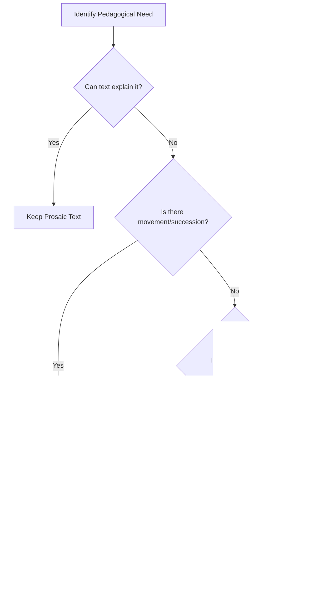
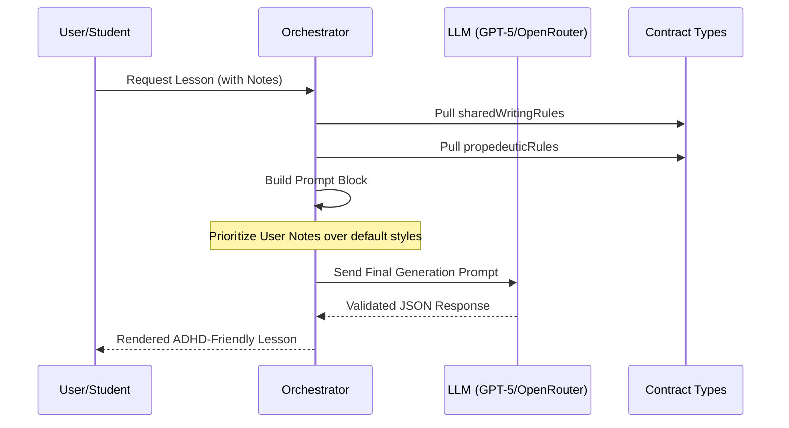

Relevant source files

The following files were used as context for generating this wiki page:

- [AGENTS.md](AGENTS.md)
- [packages/shared-types/lessonWritingContract.ts](packages/shared-types/lessonWritingContract.ts)
- [apps/backend/src/services/lessonGenerationPrompt.ts](apps/backend/src/services/lessonGenerationPrompt.ts)
- [apps/web/services/openrouter/prompts.ts](apps/web/services/openrouter/prompts.ts)
- [README.md](README.md)
- [packages/shared-types/lessonVisualContracts.ts](packages/shared-types/lessonVisualContracts.ts)

# Product Manifesto & Design Strategy

The Product Manifesto and Design Strategy for Nous Reader define a specialized learning environment designed specifically for deep comprehension of complex subjects. Unlike generic chat interfaces or content creation suites, the system is architected as an ADHD-friendly, step-by-step educational platform that prioritizes pedagogical rigor, propedeutic ordering, and cognitive accessibility.

The core strategy involves transforming dense, high-volume source materials (such as 800+ page books or technical papers) into structured, autonomous lessons. This is achieved through a strict adherence to a "pedagogical north star" that governs everything from AI behavior and prompt construction to UI interaction and visual design.

Sources: [AGENTS.md:126-136](AGENTS.md#L126-L136), [apps/web/services/openrouter/prompts.ts:12-22](apps/web/services/openrouter/prompts.ts#L12-L22), [README.md:3-8](README.md#L3-L8)

## Core Pedagogical Principles

The system follows a strict set of rules to ensure lessons are accessible without sacrificing technical depth. These principles are codified into "writing contracts" that the AI orchestrators must follow during content generation.

### Propedeutic Ordering & Scope
Lessons and course modules must follow a strict propedeutic order, meaning every concept introduced must rely only on previously explained material. The scope is limited to the current lesson to prevent cognitive overload.

*  **Strict Dependencies:** Prerequisites and basics must precede intermediate and advanced topics.
*  **Immediate Clarification:** Any technical term, symbol, or formula must be explained in common language within the same or subsequent paragraph.
*  **Focus Preservation:** AI agents are forbidden from detailing future topics or creating "deep dive" sections that aren't strictly necessary for the current learning objective.

Sources: [packages/shared-types/lessonWritingContract.ts:5-24](packages/shared-types/lessonWritingContract.ts#L5-L24), [apps/web/services/openrouter/prompts.ts:37-55](apps/web/services/openrouter/prompts.ts#L37-L55)

### Content Density & Style
The manifesto dictates a discursive and exhaustive style over bulleted lists. The goal is to create a "Professor Nous" persona that is rigorous but accessible.

| Rule Category | Design Strategy |
| :--- | :--- |
| **Vocabulary** | Use clear, accessible lexicon; avoid unnecessary academic jargon or un-explained acronyms. |
| **Analogies** | Limit to maximum one per lesson, only for truly difficult concepts. |
| **Formulas** | Use only when natural to the subject; never use decorative or "invented" equations for qualitative concepts. |
| **Structure** | Use natural section headings rather than rigid templates or English-only headers. |

Sources: [packages/shared-types/lessonWritingContract.ts:30-55](packages/shared-types/lessonWritingContract.ts#L30-L55), [packages/shared-types/lessonWritingContract.ts:2-4](packages/shared-types/lessonWritingContract.ts#L2-L4)

## Technical Design Strategy

The architectural strategy supports the product manifesto by enforcing consistency across different AI models and system modules.

### The Single Source of Truth
To prevent "context drift," the system centralizes shared AI prompt constants and environment rules. All visual, layout, and behavioral constants are centralized to ensure a consistent aesthetic that does not distract the learner.

*  **Logic Centralization:** Formulas, validation rules, and business logic are not duplicated.
*  **Visual Stability:** Layout dimensions, timing, and colors are defined once to avoid "UI jitter" or subtle design drift.
*  **Markdown Sanitization:** Text undergoes extensive cleaning (e.g., `prepareMarkdownForSpeech`) to ensure compatibility with various output modes like Text-to-Speech.

Sources: [AGENTS.md:143-150](AGENTS.md#L143-L150), [AGENTS.md:214-222](AGENTS.md#L214-L222), [apps/web/utils/reader/readingText.ts:246-264](apps/web/utils/reader/readingText.ts#L246-L264)

### Visual and Interactive Strategy
Visual elements are strictly regulated to ensure they serve a pedagogical purpose rather than acting as decoration.

The diagram shows the decision flow for selecting visual aids, prioritizing text and only moving to complex visuals when pedagogical goals require it. 
Sources: [packages/shared-types/lessonWritingContract.ts:25-29](packages/shared-types/lessonWritingContract.ts#L25-L29), [packages/shared-types/lessonVisualContracts.ts:121-140](packages/shared-types/lessonVisualContracts.ts#L121-L140)

## AI Behavior & Instruction Layers

Nous uses a layered instruction approach to ensure the AI adheres to the manifesto. The "Writing Contract" is merged with "Instruction Packs" and user-specific "Generation Notes" to form the final prompt.

### Prompt Composition Hierarchy
1.  **System Instruction:** Defines the "Professor Nous" persona and core pedagogical rules.
2.  **Instruction Packs:** Specialized rules for specific subjects or teaching styles.
3.  **User Generation Notes:** High-priority student preferences for tone, density, and register.
4.  **Source Context:** The primary factual material (PDF chunks, research dossiers).

The sequence diagram illustrates how the system assembles various rule blocks and context before querying the LLM to ensure pedagogical alignment.
Sources: [apps/backend/src/services/lessonGenerationPrompt.ts:39-75](apps/backend/src/services/lessonGenerationPrompt.ts#L39-L75), [packages/shared-types/lessonWritingContract.ts:98-112](packages/shared-types/lessonWritingContract.ts#L98-L112)

## Visual Contract Specifications

The system defines strict boundaries for generated artifacts (SVG, HTML, Mermaid) to maintain a clean, high-contrast, and performant UI.

*  **SVG Rules:** Reserved for simple information schemes. No shadows, blurs, or gradients are allowed. Text must use sentence case and follow strict color rands (`c-purple`, `c-teal`, etc.).
*  **HTML Artifacts:** Used for interactive labs. Must use project CSS variables (e.g., `--bg-surface`, `--accent`) and avoid external network calls or script imports to ensure security and theme compatibility.
*  **Image References:** AI must only use `assetId` provided from original source PDF extractions; it is forbidden from "guessing" or inventing figures.

Sources: [packages/shared-types/lessonVisualContracts.ts:167-200](packages/shared-types/lessonVisualContracts.ts#L167-L200), [packages/shared-types/lessonVisualContracts.ts:202-231](packages/shared-types/lessonVisualContracts.ts#L202-L231), [apps/backend/src/services/lessonGenerationPrompt.ts:20-30](apps/backend/src/services/lessonGenerationPrompt.ts#L20-L30)

## Conclusion
The Nous Reader Design Strategy is built on the belief that for deep learning to occur, the interface and content must be predictable, logically sequenced, and free of aesthetic or cognitive noise. By codifying pedagogical principles into technical contracts and AI prompt hierarchies, the system ensures that every generated lesson functions as a rigorous, autonomous educational unit aligned with the strategic manifesto.

Sources: [AGENTS.md:126-136](AGENTS.md#L126-L136), [packages/shared-types/lessonWritingContract.ts:68-80](packages/shared-types/lessonWritingContract.ts#L68-L80)
