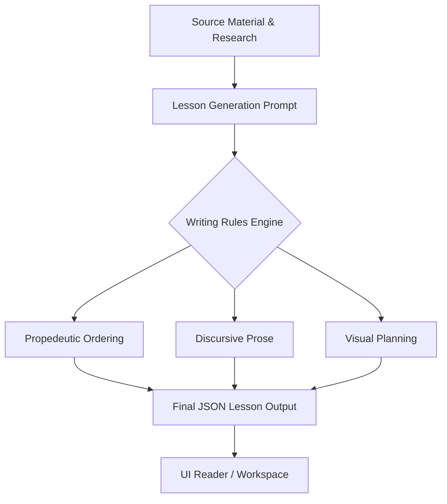
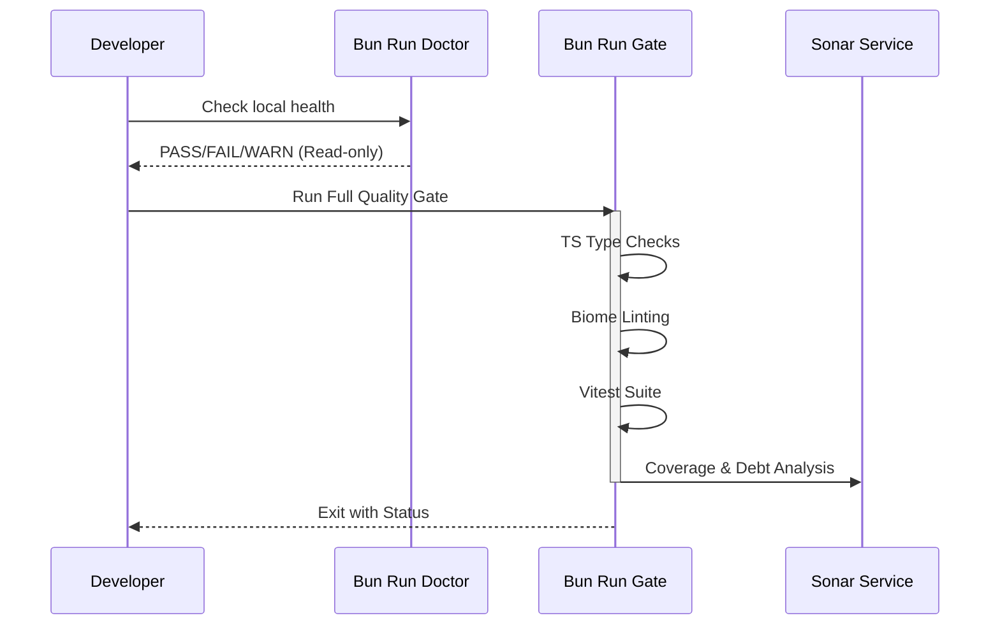

Relevant source files

The following files were used as context for generating this wiki page:

- [AGENTS.md](AGENTS.md)
- [packages/shared-types/lessonWritingContract.ts](packages/shared-types/lessonWritingContract.ts)
- [apps/backend/src/services/lessonGenerationPrompt.ts](apps/backend/src/services/lessonGenerationPrompt.ts)
- [packages/shared-types/lessonVisualContracts.ts](packages/shared-types/lessonVisualContracts.ts)
- [README.md](README.md)

# Product Manifesto & Design Strategy

## Introduction
The Product Manifesto and Design Strategy for Lumina-Reader (referred to internally as Nous Reader) establishes the strategic "North Star" for the project. It defines the application not as a generic chat tool or file drive, but as an ADHD-friendly, step-by-step learning environment designed for deep understanding of complex subjects. The strategy prioritizes pedagogical integrity, cognitive accessibility, and professional technical execution over simple content aggregation.

Sources: [AGENTS.md:121-127](AGENTS.md#L121-L127), [README.md:3-5](README.md#L3-L5)

## Core Product Philosophy
The project operates under a core philosophy of writing code that is "easy to understand, easy to change, and difficult to misuse." This extends to the user experience, where the platform aims to transform dense documents and researched topics into personalized, structured courses.

### Key Pedagogical Principles
The design strategy emphasizes several fundamental pedagogical rules for content generation:
*  **Discursive Style:** Lessons must be structured as exhaustive narratives rather than simple bulleted lists.
*  **Self-Sufficiency:** Every lesson must function as a standalone text, integrating relevant source content directly so the user does not need to cross-reference original documents.
*  **Propedeutic Order:** Content is built in a strictly propedeutic sequence, where new terms are immediately connected to common explanations and no concepts are used before they are introduced.
*  **Accessibility:** Use of accessible vocabulary is mandatory, avoiding unnecessary jargon, acronyms, or foreign terms when natural alternatives exist.

Sources: [AGENTS.md:183-185](AGENTS.md#L183-L185), [packages/shared-types/lessonWritingContract.ts:47-58](packages/shared-types/lessonWritingContract.ts#L47-L58), [packages/shared-types/lessonWritingContract.ts:60-68](packages/shared-types/lessonWritingContract.ts#L60-L68)

## Technical Design Strategy
The technical architecture supports the product manifesto through strict modularity and centralized configuration. The system utilizes "Contracts" to enforce design consistency across AI-generated content and UI components.

### Implementation Consistency
To prevent "context drift" and ensure architectural integrity, the strategy mandates:
*  **Centralized Constants:** Aesthetic decisions (colors, spacing, timing) and visual thresholds must be centralized to prevent subtle UI drift.
*  **Modern API Usage:** Standardized use of modern APIs for safety and clarity (e.g., explicit radix in parsing, sets/maps for lookups).
*  **Stable Data Ordering:** Deterministic iteration orders are required for UI rendering to reduce visual jitter and debugging confusion.

Sources: [AGENTS.md:5-7](AGENTS.md#L5-L7), [AGENTS.md:246-250](AGENTS.md#L246-L250), [AGENTS.md:364-367](AGENTS.md#L364-L367)

### AI Content Generation Flow
The generation of educational material follows a strict pipeline defined by prompt contracts, ensuring the AI behaves according to the Professor Nous persona.

*This diagram illustrates the transformation flow from raw sources into a pedagogical lesson governed by the Writing Contract.*

Sources: [apps/backend/src/services/lessonGenerationPrompt.ts:46-86](apps/backend/src/services/lessonGenerationPrompt.ts#L46-L86), [packages/shared-types/lessonWritingContract.ts:43-98](packages/shared-types/lessonWritingContract.ts#L43-L98)

## Visual and Interactive Strategy
The visual strategy is functional, not decorative. Visuals must teach something that text alone cannot efficiently convey.

### Visual Planning Rules
| Rule Type | Constraint |
| :--- | :--- |
| **Quantity** | 0 to 3 visuals per lesson; only the minimum necessary. |
| **Purpose** | Must serve a pedagogical goal; strictly no decorative variants. |
| **Format Selection** | PDF images have priority; generated visuals only fill gaps. |
| **Clarity** | Must be understandable in seconds using previously introduced terms. |

Sources: [packages/shared-types/lessonVisualContracts.ts:167-179](packages/shared-types/lessonVisualContracts.ts#L167-L179)

### Artifact Rendering Logic
The system supports multiple artifact types, each with specific design constraints:
*  **illustrative_image:** Raster illustrations for physical/spatial reality.
*  **flowchart_svg:** Abstract relations and al trees.
*  **interactive_html:** For concepts requiring real exploration/modification.
*  **mermaid_erd/class:** Strictly for entity-relationship or class diagrams.

Sources: [packages/shared-types/lessonVisualContracts.ts:145-165](packages/shared-types/lessonVisualContracts.ts#L145-L165)

## Development Workflow & Gates
To maintain the manifesto's quality standards, the project employs a rigorous validation suite.

*The validation workflow ensures that no code violates the technical strategy before deployment.*

Sources: [AGENTS.md:144-165](AGENTS.md#L144-L165), [README.md:105-108](README.md#L105-L108)

## Summary
The Product Manifesto and Design Strategy of Lumina-Reader centers on creating a high-integrity learning experience by strictly controlling AI behavior, UI consistency, and pedagogical flow. By enforcing these rules through centralized contracts and automated quality gates, the project ensures it remains a specialized tool for understanding rather than a generic document viewer.

Sources: [AGENTS.md:121-127](AGENTS.md#L121-L127), [packages/shared-types/lessonWritingContract.ts:43-50](packages/shared-types/lessonWritingContract.ts#L43-L50)
