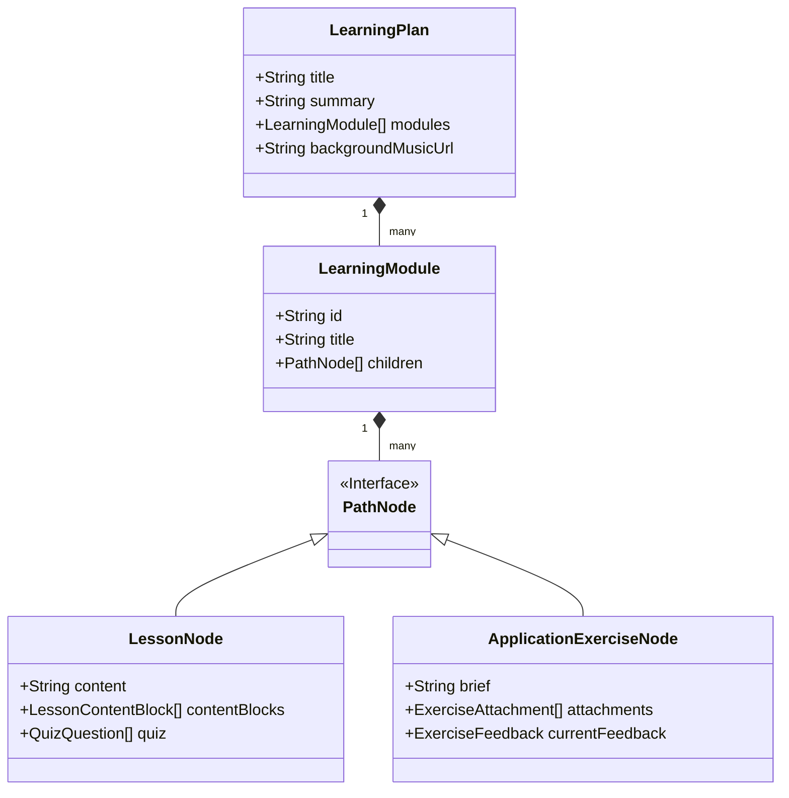
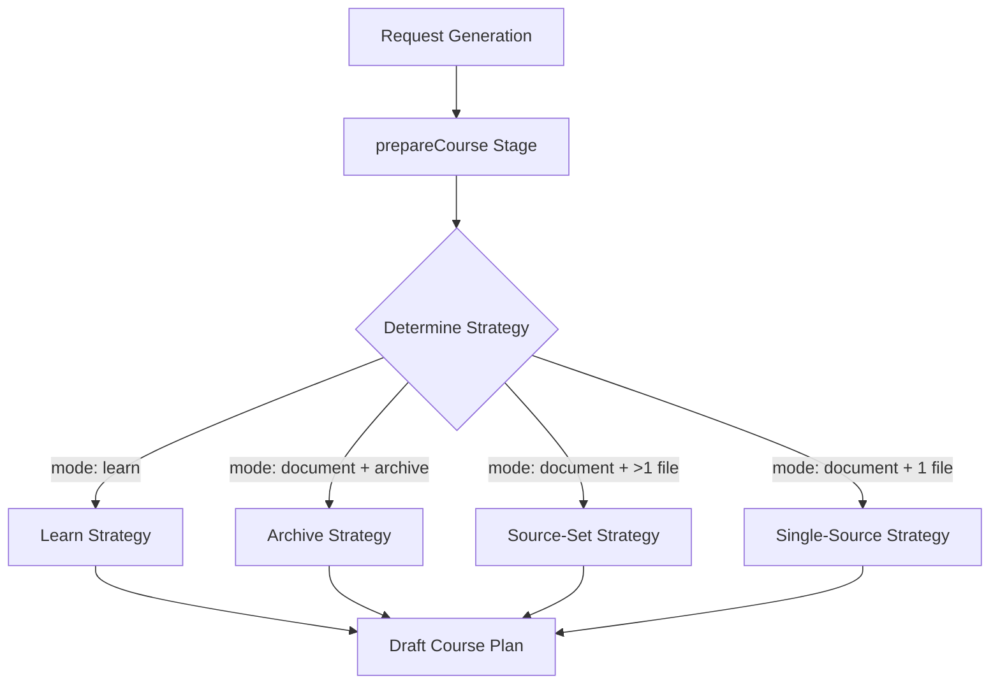

Relevant source files

The following files were used as context for generating this wiki page:

- [apps/web/types.ts](apps/web/types.ts)
- [apps/backend/tests/routes/projects.test.ts](apps/backend/tests/routes/projects.test.ts)
- [apps/web/services/projects/projectSnapshot.ts](apps/web/services/projects/projectSnapshot.ts)
- [apps/backend/src/workflows/courseGenerationPreparation.ts](apps/backend/src/workflows/courseGenerationPreparation.ts)
- [apps/backend/tests/projects/postgresProjectStore.test.ts](apps/backend/tests/projects/postgresProjectStore.test.ts)
- [packages/shared-types/lessonVisualContracts.ts](packages/shared-types/lessonVisualContracts.ts)
- [AGENTS.md](AGENTS.md)

# System Architecture

Nous is an ADHD-friendly learning platform designed to transform dense source materials into structured, step-by-step pedagogical journeys. The system architecture follows a decoupled client-server model, utilizing a TypeScript-based full-stack environment (Bun, React, and a Node.js/Bun backend) supported by a PostgreSQL persistence layer and specialized AI workflow orchestration for course generation.

The architecture is built around the concept of a **Project**, which serves as the container for learning plans, source materials (PDFs, archives, or text), and generated pedagogical content like active pauses and interactive visuals.

Sources: [AGENTS.md:65-72](AGENTS.md#L65-L72), [apps/web/types.ts:251-270](apps/web/types.ts#L251-L270)

## Core Data Structures and Entities

The system revolves around several high-level data structures that define the state of a user's learning environment.

### Project Snapshot
The `ProjectSnapshot` is the primary unit of state. It contains the versioned learning plan, source metadata, and user preferences.

| Field | Type | Description |
| :--- | :--- | :--- |
| `id` | `ProjectId` | Unique identifier for the project. |
| `source` | `ProjectSource` | Metadata and references to the raw input material (PDF, ZIP, etc). |
| `learningPlan` | `LearningPlan` | The structured pedagogical path divided into modules and nodes. |
| `state` | `AppState` | Current state of the application (LIBRARY, READING, etc). |
| `isLearnMode` | `boolean` | Flag indicating if the project was generated via AI chat rather than document upload. |

Sources: [apps/web/types.ts:646-666](apps/web/types.ts#L646-L666), [apps/web/services/projects/projectSnapshot.ts:133-162](apps/web/services/projects/projectSnapshot.ts#L133-L162)

### Learning Hierarchy
Content is organized into a nested hierarchy to facilitate progressive learning. A `LearningPlan` consists of `LearningModules`, which contain `PathNodes`.

*The diagram above shows the relationship between pedagogical planning structures.*
Sources: [apps/web/types.ts:586-639](apps/web/types.ts#L586-L639)

## Backend Architecture and Persistence

The backend provides a REST API for project management and coordinates complex long-running workflows for content generation.

### Persistence Layer: PostgresProjectStore
The system uses a PostgreSQL store for metadata and a separate object storage for large binary assets (PDFs, ZIPs). The `PostgresProjectStore` manages transactions to ensure consistency between the relational database and object storage.

*  **Atomic Saves:** Projects, detached snapshots, and source metadata are created in single transactions.
*  **Immutable Storage:** Source bytes are stored in immutable object paths derived from content hashes (e.g., `users/{userId}/projects/{projectId}/{sourceId}/{hash}/original`).
*  **Asset Cleanup:** Replaced or deleted source objects are queued for background deletion to prevent dangling files.

Sources: [apps/backend/tests/projects/postgresProjectStore.test.ts:223-260](apps/backend/tests/projects/postgresProjectStore.test.ts#L223-L260), [apps/backend/tests/projects/postgresProjectStore.test.ts:358-400](apps/backend/tests/projects/postgresProjectStore.test.ts#L358-L400)

### API Operations
The backend exposes endpoints for library management, project lifecycle, and chunked binary imports.

| Endpoint | Method | Purpose |
| :--- | :--- | :--- |
| `/api/projects/projects` | GET/PUT | List or save project snapshots. |
| `/api/projects/import/chunks` | PUT | Handle multi-part binary uploads for large source files. |
| `/api/projects/placements/move` | POST | Move projects between library folders. |
| `/api/projects/projects/:id/touch` | POST | Update `lastOpenedAt` without modifying content. |

Sources: [apps/backend/tests/routes/projects.test.ts:99-124](apps/backend/tests/routes/projects.test.ts#L99-L124), [apps/backend/tests/routes/projects.test.ts:241-260](apps/backend/tests/routes/projects.test.ts#L241-L260)

## Pedagogical Generation Workflow

Content generation is handled through a multi-stage workflow that processes source material into a structured course.

### Course Preparation and Strategy
The `prepareCourse` stage determines the processing strategy based on the input mode (Learn Mode vs. Document Mode) and the nature of the source (Archive vs. Single Source).

*Logic for selecting the ingestion strategy based on user input and source types.*
Sources: [apps/backend/src/workflows/courseGenerationPreparation.ts:89-130](apps/backend/src/workflows/courseGenerationPreparation.ts#L89-L130)

### Lesson Generation and Visual Planning
Lessons are generated as "exhaustives" in Markdown, potentially including:
*  **Active Pauses:** `inline-quiz` blocks for self-assessment.
*  **Visual Artifacts:** Planned Pedagogical visuals (SVG, HTML, Mermaid, or Raster).
*  **YouTube Clips:** Timestamped video segments derived from research transcripts.

Sources: [apps/backend/src/services/lessonGenerationPrompt.ts:60-120](apps/backend/src/services/lessonGenerationPrompt.ts#L60-L120), [packages/shared-types/lessonVisualContracts.ts:121-140](packages/shared-types/lessonVisualContracts.ts#L121-L140)

## Visual Artifact System

A key feature of the architecture is the generation of interactive and structural visual aids.

### Visual Planner
The `LessonVisualPlanner` decides which type of visual is best for a specific concept based on the final lesson text.

| Visual Type | Description |
| :--- | :--- |
| `illustrative_image` | Raster illustration for physical or stylized reality (volume, texture, anatomy). |
| `flowchart_svg` | Abstract relations between process steps. |
| `structural_svg` | Information schemas for architecture or systems. |
| `interactive_html` | HTML/JS labs where interaction is pedagogically indispensable. |
| `mermaid_erd` / `mermaid_class` | Entity-relationship or class diagrams. |

Sources: [packages/shared-types/lessonVisualContracts.ts:142-162](packages/shared-types/lessonVisualContracts.ts#L142-L162)

### Rendering Rules
Each artifact type has strict rendering rules to maintain visual consistency and security. For example, HTML artifacts must use specific CSS variables (e.g., `--bg-surface`, `--accent`) and are prohibited from using external network resources or cookies.

Sources: [packages/shared-types/lessonVisualContracts.ts:219-245](packages/shared-types/lessonVisualContracts.ts#L219-L245)

## Conclusion
The Nous architecture provides a robust, transational foundation for pedagogical content generation. By separating raw source ingestion, pedagogical planning, and interactive artifact rendering, the system ensures that complex technical materials are systematically broken down into accessible, multi-modal learning paths for the user.
