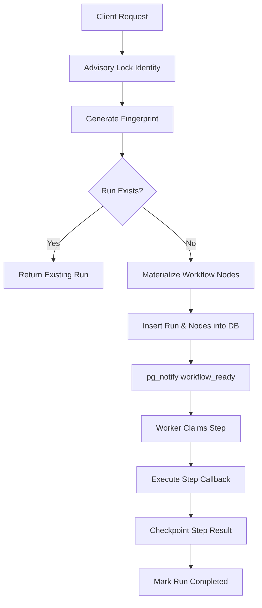
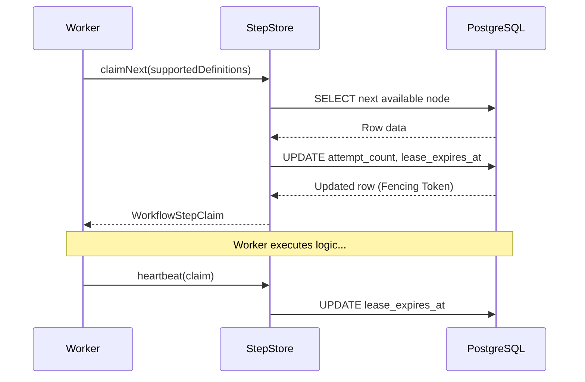

Relevant source files

The following files were used as context for generating this wiki page:

- [apps/backend/src/workflows/postgresWorkflowStore.ts](apps/backend/src/workflows/postgresWorkflowStore.ts)
- [apps/backend/src/workflows/postgresWorkflowPersistence.ts](apps/backend/src/workflows/postgresWorkflowPersistence.ts)
- [apps/backend/src/workflows/postgresWorkflowStepStore.ts](apps/backend/src/workflows/postgresWorkflowStepStore.ts)
- [apps/backend/src/workflows/validation.ts](apps/backend/src/workflows/validation.ts)
- [apps/backend/src/workflows/courseGenerationWorkflow.ts](apps/backend/src/workflows/courseGenerationWorkflow.ts)

# Postgres Workflow Engine

The **Postgres Workflow Engine** is a durable, transactional execution framework designed to manage complex multi-step processes within the backend. It leverages PostgreSQL as a reliable state machine to ensure that workflows—such as large-scale course generation—can survive service restarts, handle process crashes gracefully, and maintain strict idempotency.

The engine operates by materializing workflow definitions into database records, tracking individual step progress through leases and fencing tokens, and using transactional outboxes for side effects. This architecture guarantees that every state transition is persisted before execution proceeds, providing a "durable execution" environment.

Sources: [apps/backend/src/workflows/postgresWorkflowStore.ts](apps/backend/src/workflows/postgresWorkflowStore.ts), [apps/backend/src/workflows/courseGenerationWorkflow.ts](apps/backend/src/workflows/courseGenerationWorkflow.ts)

## Core Components

### PostgresWorkflowStore
The central coordinator of the system. It implements the `WorkflowRuntimeStore` interface and aggregates specialized stores for cancellations, signals, steps, and waits. It manages the high-level lifecycle of a "Run," from creation and deduplication to state retrieval.

Key responsibilities include:
*  **Run Creation**: Implementing `createRun` to initialize a workflow instance while enforcing unique request keys and deduplication logic.
*  **Advisory Locking**: Using `pg_advisory_xact_lock` to prevent race conditions during concurrent run requests for the same user or project.
*  **State Reconstruction**: Aggregating data from `workflow_runs`, `workflow_node_runs`, and `workflow_waits` to provide a unified `WorkflowRunState`.

Sources: [apps/backend/src/workflows/postgresWorkflowStore.ts:316-444](apps/backend/src/workflows/postgresWorkflowStore.ts#L316-L444)

### PostgresWorkflowStepStore
Dedicated to the management of individual workflow steps. It handles the "Claim" logic, where workers compete to execute the next available node in a workflow.

*  **Lease Management**: Assigns temporary ownership of a step to a worker via `lease_expires_at`.
*  **Fencing**: Increments an `attempt_count` (used as a fencing token) to ensure that late-arriving results from timed-out or crashed workers are rejected if a newer attempt has started.
*  **Failure Recording**: Categorizes and persists failures as either operational (retryable) or permanent.

Sources: [apps/backend/src/workflows/postgresWorkflowStepStore.ts](apps/backend/src/workflows/postgresWorkflowStepStore.ts), [apps/backend/src/workflows/postgresWorkflowStore.ts:517-521](apps/backend/src/workflows/postgresWorkflowStore.ts#L517-L521)

## Workflow Execution Flow

The following diagram illustrates the lifecycle of a workflow run from initial request to step execution.

This flowchart describes the transactional path taken to initialize a workflow and begin its execution.
Sources: [apps/backend/src/workflows/postgresWorkflowStore.ts:316-412](apps/backend/src/workflows/postgresWorkflowStore.ts#L316-L412), [apps/backend/src/workflows/postgresWorkflowPersistence.ts:37-56](apps/backend/src/workflows/postgresWorkflowPersistence.ts#L37-L56)

### Step Claiming Sequence
Workers interact with the `PostgresWorkflowStepStore` to retrieve work. The process uses PostgreSQL's `FOR UPDATE SKIP LOCKED` (internally handled by the store logic) to allow high-concurrency claiming without blocking.

The sequence shows how workers maintain ownership of a step through leases and fencing tokens.
Sources: [apps/backend/src/workflows/postgresWorkflowStepStore.ts](apps/backend/src/workflows/postgresWorkflowStepStore.ts), [apps/backend/src/workflows/postgresWorkflowStore.ts:517-521](apps/backend/src/workflows/postgresWorkflowStore.ts#L517-L521)

## Data Persistence & Model

The engine uses a set of specialized tables to track state. Persistence logic is encapsulated in utility functions that handle JSON serialization and sequence management.

### Core Tables Summary

| Table | Description | Key Fields |
| :--- | :--- | :--- |
| `workflow_runs` | Main run metadata and global status. | `id`, `status`, `input`, `output`, `definition_hash` |
| `workflow_node_runs` | State of individual steps within a run. | `node_instance_id`, `status`, `attempt_count`, `lease_expires_at` |
| `workflow_outbox` | Durable events to be delivered to external systems. | `id`, `event_type`, `payload`, `sequence` |
| `workflow_ai_usage` | Telemetry for LLM token usage per step. | `model`, `input_tokens`, `output_tokens`, `provider_cost` |

Sources: [apps/backend/src/workflows/postgresWorkflowStore.ts:46-136](apps/backend/src/workflows/postgresWorkflowStore.ts#L46-L136), [apps/backend/src/workflows/postgresWorkflowPersistence.ts:60-101](apps/backend/src/workflows/postgresWorkflowPersistence.ts#L60-L101)

### Persistence Utilities
The engine provides helper functions in `postgresWorkflowPersistence.ts` to maintain database integrity:
*  **`insertMaterializedNode`**: Performs the initial insertion of workflow nodes when a run is created.
*  **`appendWorkflowOutboxEvents`**: Updates the `next_event_sequence` on the main run and inserts new events into the outbox atomically.
*  **`insertWorkflowAiUsage`**: Records AI token consumption, supporting reasoning tokens and provider-specific costs.

Sources: [apps/backend/src/workflows/postgresWorkflowPersistence.ts:37-101](apps/backend/src/workflows/postgresWorkflowPersistence.ts#L37-L101)

## Workflow Integrity & Validation

Before execution, workflow definitions are validated to ensure they meet structural and schema requirements. This prevents runtime errors due to incompatible step connections or invalid configurations.

### Validation Rules
1.  **Unique IDs**: Every node within a workflow must have a unique identifier.
2.  **Schema Matching**: Input and output schemas (Zod types) must match between connected nodes in a `sequence` or `fanOut`.
3.  **Hash Stability**: A `WorkflowManifest` is generated and hashed using SHA-256. This hash is stored with the Run to ensure the engine uses the exact same logic even if the code is updated during a long-running process.

Sources: [apps/backend/src/workflows/validation.ts:109-247](apps/backend/src/workflows/validation.ts#L109-L247)

### Manifest Generation
The `nodeManifest` function converts the runtime workflow tree into a serializable JSON structure. This structure includes:
*  Zod schemas transformed into durable shapes via `durableSchemaShape`.
*  Metadata about external effects (e.g., `provider`, `provider-with-postprocessing`).
*  Definition of durable vs. transient events.

Sources: [apps/backend/src/workflows/validation.ts:249-338](apps/backend/src/workflows/validation.ts#L249-L338)

## Conclusion

The Postgres Workflow Engine provides the foundational durability required for the project's most critical operations. By strictly separating workflow definition (code) from materialized execution state (database), it achieves a high degree of resilience against infrastructure failures while maintaining a simple developer interface for defining complex asynchronous logic.

Sources: [apps/backend/src/workflows/postgresWorkflowStore.ts](apps/backend/src/workflows/postgresWorkflowStore.ts), [apps/backend/src/workflows/validation.ts](apps/backend/src/workflows/validation.ts)
