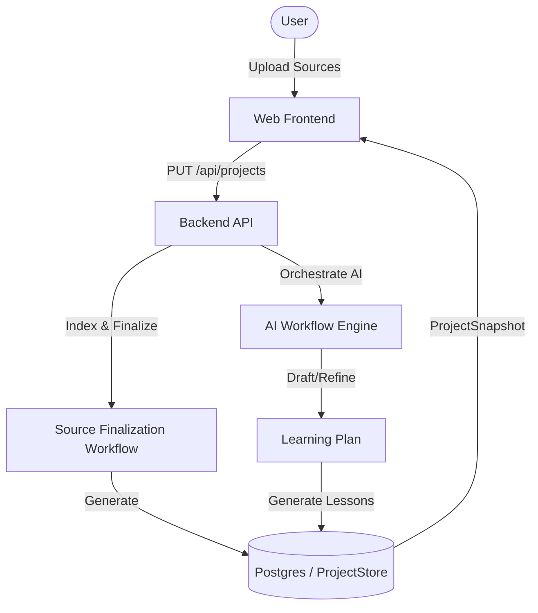
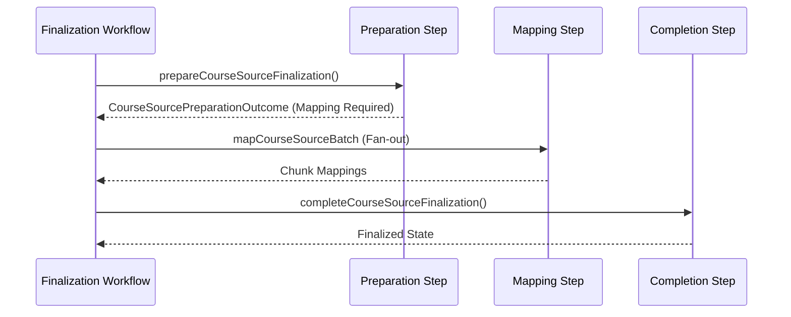
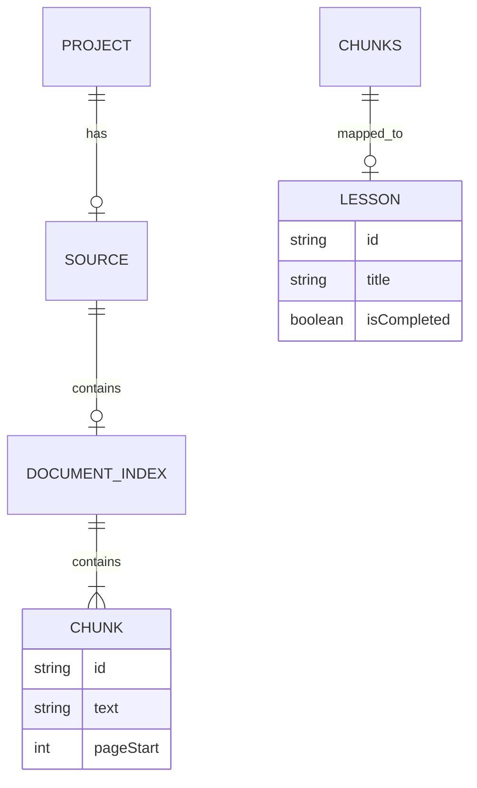

Relevant source files

The following files were used as context for generating this wiki page:

- [AGENTS.md](AGENTS.md)
- [README.md](README.md)
- [apps/backend/tests/routes/projects.test.ts](apps/backend/tests/routes/projects.test.ts)
- [apps/backend/src/workflows/courseSourceFinalization.ts](apps/backend/src/workflows/courseSourceFinalization.ts)
- [scripts/feature-map.ts](scripts/feature-map.ts)
- [apps/web/types.ts](apps/web/types.ts)
- [packages/shared-types/lessonVisualContracts.ts](packages/shared-types/lessonVisualContracts.ts)

# High-Level Architecture

Nous Reader is an ADHD-friendly pedagogical platform designed to transform dense source materials—such as PDFs, text files, and codebases—into structured, step-by-step learning environments. The architecture follows a modern full-stack TypeScript approach, leveraging a monorepo structure to share types and policies between a Vite-powered frontend and an Express-based backend.

The system is designed around a pedagogical workflow that includes source ingestion, AI-driven course planning, and lesson generation. It prioritizes a "Context Before Code" philosophy, ensuring that AI agents and developers alike adhere to strict modular boundaries and single sources of truth for pedagogical rules.

Sources: [AGENTS.md:87-90](AGENTS.md#L87-L90), [README.md:3-5](README.md#L3-L5), [README.md:120-125](README.md#L120-L125)

## System Overview

The project is organized into three primary layers: the frontend application, the backend API server, and shared packages.

*  **Frontend (`apps/web/`):** A React/Vite application that handles the user interface, project workspace, and interactive pedagogical artifacts.
*  **Backend (`apps/backend/`):** An Express server managing project persistence, AI workflow orchestration, and source indexing.
*  **Shared Packages (`packages/shared-types/`):** Defines the "contracts" for lesson writing, visual generation, and project snapshots, ensuring consistency across the network boundary.

### Core Components & Data Flow

The architecture facilitates a flow from raw input data to a generated `ProjectSnapshot`, which serves as the primary state container for a course.

Sources: [README.md:120-125](README.md#L120-L125), [apps/backend/src/workflows/courseSourceFinalization.ts:285-300](apps/backend/src/workflows/courseSourceFinalization.ts#L285-L300), [apps/backend/tests/routes/projects.test.ts:135-155](apps/backend/tests/routes/projects.test.ts#L135-L155)

## Backend Architecture

The backend is built as a modular Express server. It handles project management through a `ProjectStore` and manages complex multi-step processes via an internal workflow engine.

### Project Persistence and API
The backend exposes RESTful endpoints under `/api/projects` for lifecycle management, including saving, loading, exporting, and deleting projects. In production, Postgres is the primary storage engine, while an in-memory `InMemoryProjectStore` is utilized for testing.

| Feature | Description |
| :--- | :--- |
| **ProjectSnapshot** | The canonical data structure representing the entire state of a course, including source metadata, the learning plan, and generated content. |
| **ProjectStore** | Interface for persisting snapshots. PostgreSQL is the only runtime implementation. |
| **Import Diagnostics** | A specialized service for recording and auditing failures during large-scale library imports. |

Sources: [README.md:40-45](README.md#L40-L45), [apps/backend/tests/routes/projects.test.ts:135-180](apps/backend/tests/routes/projects.test.ts#L135-L180), [apps/backend/tests/routes/projects.test.ts:720-730](apps/backend/tests/routes/projects.test.ts#L720-L730)

### Workflow Engine
Workflows are defined as a sequence of steps or "fan-out" operations. A critical example is `courseSourceFinalization`, which handles the transformation of raw materials into an indexed structure for AI retrieval.

Sources: [apps/backend/src/workflows/courseSourceFinalization.ts:254-282](apps/backend/src/workflows/courseSourceFinalization.ts#L254-L282), [apps/backend/src/workflows/courseSourceFinalization.ts:394-406](apps/backend/src/workflows/courseSourceFinalization.ts#L394-L406)

## Shared Types and Contracts

The system relies heavily on shared contracts to enforce pedagogical standards and data integrity. These are defined in `packages/shared-types`.

*  **Lesson Visual Contracts:** Defines rules for generating SVG, HTML, and Mermaid diagrams. It enforces constraints like avoiding "decorative" visuals and ensuring variety in formats is not a goal itself.
*  **Lesson Writing Contract:** Contains the "Professor Nous" system instructions, propedeutic rules (ensuring concepts are introduced in order), and guidelines for accessibility and lexical clarity.
*  **Project Snapshot Wire:** Defines the serialization format for transferring project data between the server and client.

Sources: [packages/shared-types/lessonVisualContracts.ts:130-150](packages/shared-types/lessonVisualContracts.ts#L130-L150), [packages/shared-types/lessonWritingContract.ts:28-40](packages/shared-types/lessonWritingContract.ts#L28-L40), [apps/web/services/projects/projectSnapshot.ts:630-645](apps/web/services/projects/projectSnapshot.ts#L630-L645)

## Data Models

### Project Snapshot Structure
The `ProjectSnapshot` is the central domain object. It tracks the versioning, source kind (e.g., codebase, document, learn-mode), and the hierarchical `LearningPlan`.

| Field | Type | Description |
| :--- | :--- | :--- |
| `id` | `ProjectId` | Unique identifier for the project. |
| `source` | `ProjectSource` | The original material (PDF, Archive, or Document). |
| `learningPlan` | `LearningPlan` | The structured modules and lessons. |
| `documentIndex`| `PdfTextIndex` | Chunks and page mappings for the source material. |
| `state` | `AppState` | Current UI state (e.g., LIBRARY, READING). |

Sources: [apps/web/types.ts:510-530](apps/web/types.ts#L510-L530), [apps/web/services/projects/projectSnapshot.ts:125-150](apps/web/services/projects/projectSnapshot.ts#L125-L150)

### Source Indexing
For document-based projects, the system generates a `PdfTextIndex`. This index breaks sources into `PdfTextChunks` which are then mapped to specific lessons during the planning phase.

Sources: [apps/web/types.ts:466-485](apps/web/types.ts#L466-L485), [apps/backend/src/workflows/courseSourceFinalization.ts:182-200](apps/backend/src/workflows/courseSourceFinalization.ts#L182-L200)

## Infrastructure & Tooling

The project utilizes several utility scripts and configurations to maintain system health:
*  **Doctor Script:** A read-only diagnostic tool (`bun run doctor`) that reports on service health, Supabase connectivity, and migration parity.
*  **Feature Map:** A static analysis tool (`scripts/feature-map.ts`) that generates a map of reachable modules and backend routes by traversing the TypeScript import graph.
*  **Quality Gate:** A comprehensive check (`bun run gate`) that combines TypeScript type checking, Biome linting, and Vitest test suites.

Sources: [AGENTS.md:65-75](AGENTS.md#L65-L75), [scripts/feature-map.ts:1-20](scripts/feature-map.ts#L1-L20), [README.md:127-130](README.md#L127-L130)

The High-Level Architecture of Nous Reader ensures a strict separation between pedagogical logic (contracts), workflow execution (backend), and user interaction (frontend), supported by a robust data model focused on structured learning.
