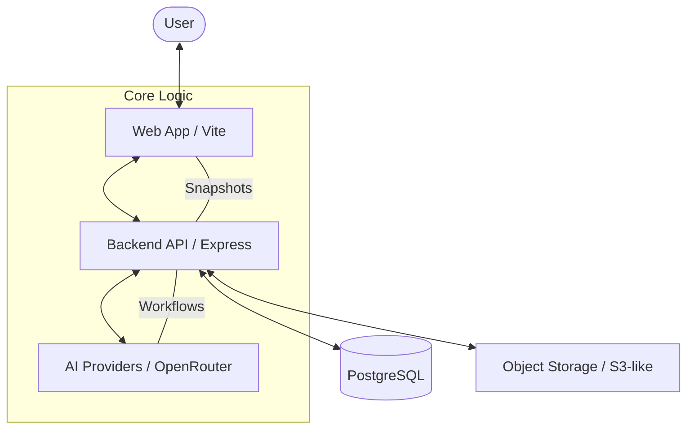
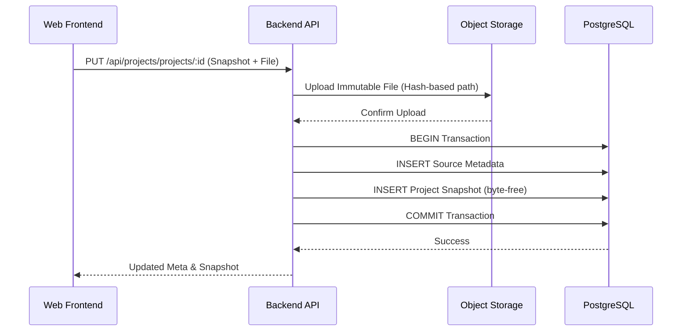
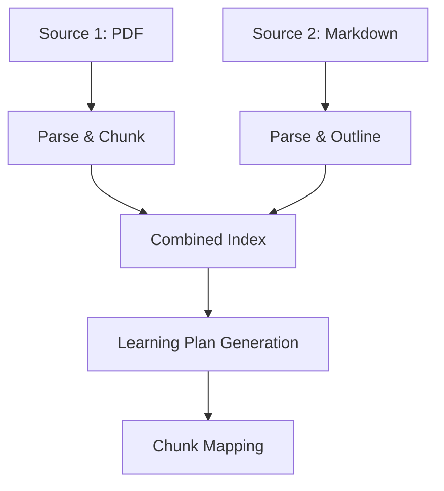

<details>
<summary>Relevant source files</summary>

The following files were used as context for generating this wiki page:

- [apps/web/services/projects/projectSnapshot.ts](../../../apps/web/services/projects/projectSnapshot.ts)
- [apps/backend/src/projects/postgresProjectStore.ts](../../../apps/backend/src/projects/postgresProjectStore.ts)
- [apps/web/services/projects/courseSources.ts](../../../apps/web/services/projects/courseSources.ts)
- [apps/backend/src/workflows/courseGenerationPreparation.ts](../../../apps/backend/src/workflows/courseGenerationPreparation.ts)
- [README.md](../../../README.md)
- [apps/backend/tests/routes/projects.test.ts](../../../apps/backend/tests/routes/projects.test.ts)
</details>

# System Architecture

The Nous Reader system architecture is designed to transform static documents and research topics into interactive, AI-driven educational courses. It follows a decoupled client-server model where the frontend manages user interactions and state normalization, while the backend handles persistent storage, complex workflows, and external service integrations.

The core of the architecture revolves around **Projects**, which serve as the primary container for source materials, learning plans, and user progress. The system utilizes a specialized snapshotting mechanism to maintain state consistency across different processing stages, ensuring that large source files (like PDFs and ZIP archives) are handled efficiently through immutable object storage and metadata indexing.

Sources: [README.md:1-5](../../../README.md#L1-L5), [apps/web/services/projects/projectSnapshot.ts:1-20](../../../apps/web/services/projects/projectSnapshot.ts#L1-L20)

## High-Level Component Overview

The system is partitioned into two main applications and a shared logic layer:

*  **Web Frontend (apps/web):** A Vite-powered React application that manages the "Project Snapshot" lifecycle, handles file uploads, and renders the learning interface.
*  **Backend API (apps/backend):** An Express-based server that interacts with PostgreSQL for project metadata and handles long-running workflows like course generation.
*  **Shared Types/Logic (packages/shared-types):** Contains the "Project Snapshot Wire" format and generation policies used by both tiers.

### Component Relationship Diagram



The diagram shows the interaction between the frontend, backend, and external dependencies.
Sources: [README.md:15-25](../../../README.md#L15-L25), [apps/backend/tests/routes/projects.test.ts:90-120](../../../apps/backend/tests/routes/projects.test.ts#L90-L120)

## Data Persistence & Storage Model

Nous employs a hybrid storage strategy to optimize for performance and scalability. Metadata and small state structures are stored in **PostgreSQL**, while large binary assets (PDFs, ZIPs) are offloaded to **Immutable Object Storage**.

### Project Snapshots
The `ProjectSnapshot` is the single source of truth for a project's state. To minimize database bloat, large data fields (like file content) are stripped from the snapshot and replaced with `ProjectSourceRef` objects pointing to external storage.

| Component | Storage Type | Purpose |
| :--- | :--- | :--- |
| **Project Metadata** | PostgreSQL | ID, Title, Timestamps, Completion Counts |
| **Project Snapshot** | PostgreSQL (JSONB) | Learning Plan, Syllabus, User Profile |
| **Source Files** | Object Storage | Original PDF/ZIP binary data |
| **Document Index** | PostgreSQL (JSONB) | Text chunks, offsets, and mapping data |

Sources: [apps/backend/src/projects/postgresProjectStore.ts:350-400](../../../apps/backend/src/projects/postgresProjectStore.ts#L350-L400), [apps/web/services/projects/projectSnapshot.ts:77-105](../../../apps/web/services/projects/projectSnapshot.ts#L77-L105)

### Storage Flow Sequence
When a user saves a project with a new source file, the system follows a specific transactional flow:



This sequence ensures that binary data is stored safely before database records are committed.
Sources: [apps/backend/src/index.ts:254-265](../../../apps/backend/src/index.ts#L254-L265), [apps/backend/src/routes/projects.ts:740-755](../../../apps/backend/src/routes/projects.ts#L740-L755), [apps/backend/src/projects/postgresProjectStore.ts:415-450](../../../apps/backend/src/projects/postgresProjectStore.ts#L415-L450), [apps/backend/tests/routes/projects.test.ts:240-270](../../../apps/backend/tests/routes/projects.test.ts#L240-L270)

## Course Generation Workflow

The generation of a course is a multi-stage process handled by the backend. It transitions through several states defined in `CoursePreparationStateSchema`.

### Preparation & Strategy Selection
The system determines a "Strategy" based on the input mode and source type:
*  **learn**: Pure AI-generated topic without source files.
*  **archive**: Processing a codebase or ZIP source.
*  **single-source**: Processing one document (PDF/Markdown).
*  **source-set**: Processing multiple documents.

Sources: [apps/backend/src/workflows/courseGenerationPreparation.ts:85-110](../../../apps/backend/src/workflows/courseGenerationPreparation.ts#L85-L110)

### Multi-Source Indexing
For documents, the system builds a `combinedSourceIndex` which flattens multiple files into a unified searchable index of `PdfTextChunk` objects.



The workflow illustrates how disparate source types are unified for AI processing.
Sources: [apps/web/services/projects/courseSources.ts:335-360](../../../apps/web/services/projects/courseSources.ts#L335-L360), [apps/backend/src/workflows/courseGenerationPreparation.ts:115-130](../../../apps/backend/src/workflows/courseGenerationPreparation.ts#L115-L130)

## Key Data Structures

### ProjectSource
Defined in the web types, this structure distinguishes between single documents and archives.

```typescript
// From apps/web/types.ts referenced in projectSnapshot.ts
export type ProjectSource = 
  | { kind: 'pdf'; file: FileData; ref?: ProjectSourceRef; sources?: CourseSourceDescriptor[] }
  | { kind: 'document'; file: FileData; ref?: ProjectSourceRef; sources?: CourseSourceDescriptor[] }
  | { kind: 'archive'; file: FileData; index: SourceArchiveIndex; name: string; ref?: ProjectSourceRef };
```

Sources: [apps/web/services/projects/projectSnapshot.ts:285-320](../../../apps/web/services/projects/projectSnapshot.ts#L285-L320)

### File Identification
The system derives a deterministic hash from each source's bytes, then includes a hash of the project ID in the immutable object path. Identical uploads can therefore retain the same source hash while being stored separately in different projects.

Sources: [apps/backend/src/projects/projectSource.ts:70-85](../../../apps/backend/src/projects/projectSource.ts#L70-L85), [apps/backend/src/projects/projectSource.ts:129-136](../../../apps/backend/src/projects/projectSource.ts#L129-L136)

## Conclusion
The Nous architecture prioritizes data integrity and performance by separating heavy binary assets from light JSON snapshots. This modular design allows the system to scale its storage independently of its processing logic, facilitating complex AI workflows while maintaining a stable, versioned record of the user's learning journey.

Sources: [README.md:40-50](../../../README.md#L40-L50), [apps/web/services/projects/projectSnapshot.ts:150-165](../../../apps/web/services/projects/projectSnapshot.ts#L150-L165)
