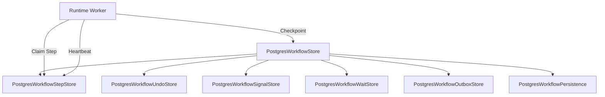
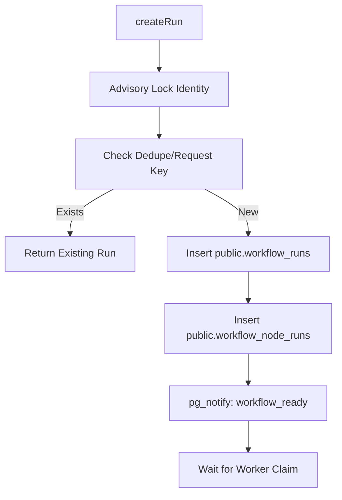
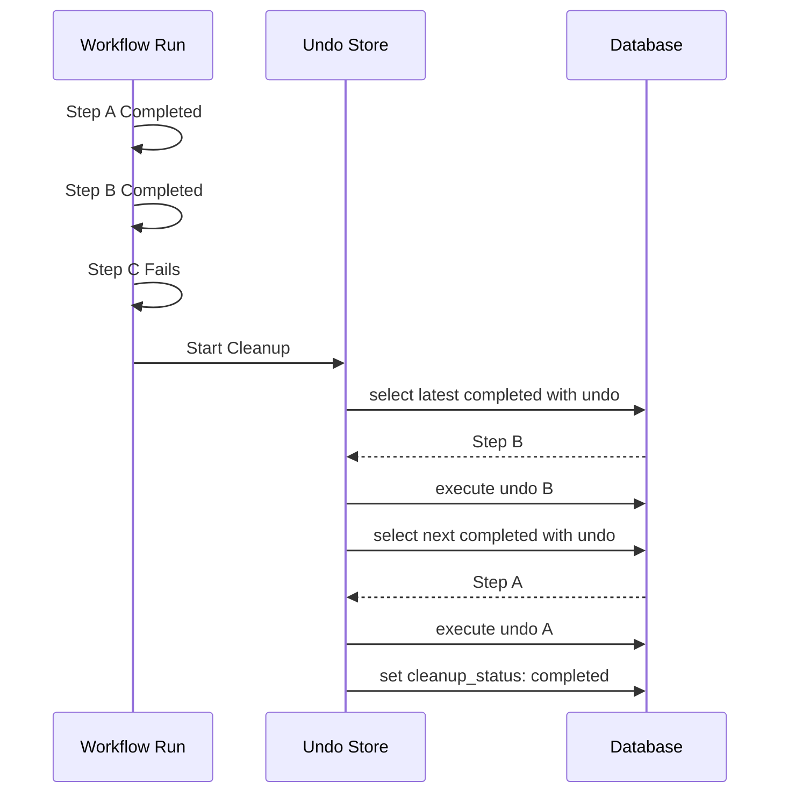

Relevant source files

The following files were used as context for generating this wiki page:

- [apps/backend/src/workflows/postgresWorkflowStore.ts](apps/backend/src/workflows/postgresWorkflowStore.ts)
- [apps/backend/src/workflows/postgresWorkflowPersistence.ts](apps/backend/src/workflows/postgresWorkflowPersistence.ts)
- [apps/backend/tests/workflows/postgresWorkflowObservability.test.ts](apps/backend/tests/workflows/postgresWorkflowObservability.test.ts)
- [apps/backend/tests/workflows/postgresWorkflowExecutionStore.integration.test.ts](apps/backend/tests/workflows/postgresWorkflowExecutionStore.integration.test.ts)
- [apps/backend/tests/workflows/postgresWorkflowUndoStore.integration.test.ts](apps/backend/tests/workflows/postgresWorkflowUndoStore.integration.test.ts)

# Postgres Workflow Engine

The Postgres Workflow Engine is a durable execution framework designed to manage long-running, multi-step processes with built-in persistence, retry logic, and observability. It leverages PostgreSQL as both a state store and a message broker (via `pg_notify`) to ensure that workflows can survive service restarts and handle complex failure modes like network partitions or process crashes.

The engine coordinates the materialization of workflow definitions into executable runs, managing the lifecycle of steps, compensation logic (undo), and signal waits. It is primarily used in Lumina-Reader for heavy asynchronous tasks such as course generation, research, and project indexing.

## Architecture and Core Components

The architecture is centered around the `PostgresWorkflowStore`, which acts as the primary coordinator for persistence. It delegates specialized responsibilities to sub-stores (StepStore, SignalStore, WaitStore, OutboxStore) and integrates with project-specific persistence layers for domain data.

### Component Relationship
The diagram below illustrates how the central store interacts with various specialized sub-stores and external workers.

Sources: [apps/backend/src/workflows/postgresWorkflowStore.ts:250-295](apps/backend/src/workflows/postgresWorkflowStore.ts#L250-L295), [apps/backend/tests/workflows/postgresWorkflowExecutionStore.integration.test.ts:70-95](apps/backend/tests/workflows/postgresWorkflowExecutionStore.integration.test.ts#L70-L95)

### Key Classes and Roles

| Component | Description |
| :--- | :--- |
| `PostgresWorkflowStore` | The main entry point for creating runs, fetching state, and managing workflow lifecycle. |
| `PostgresWorkflowStepStore` | Manages step-level attempts, including claiming work, recording failures, and lease management. |
| `PostgresWorkflowUndoStore` | Handles compensation logic when a workflow fails, ensuring steps are rolled back in reverse order. |
| `PostgresWorkflowOutboxStore` | A durable outbox for reliable event delivery to external systems or SSE clients. |
| `PostgresWorkflowPersistence` | Utility layer for low-level SQL insertions of materialized nodes and AI usage records. |

Sources: [apps/backend/src/workflows/postgresWorkflowStore.ts:250-325](apps/backend/src/workflows/postgresWorkflowStore.ts#L250-L325), [apps/backend/src/workflows/postgresWorkflowPersistence.ts:25-80](apps/backend/src/workflows/postgresWorkflowPersistence.ts#L25-L80)

## Workflow Lifecycle and Execution

Workflows transition through several statuses, primarily managed via atomic transactions to prevent duplicate execution or race conditions during high concurrency.

### Execution Flow
When a workflow is started, it is "materialized"—transformed from a logical definition into a concrete set of database rows representing nodes (steps, waits, or fan-outs).

Sources: [apps/backend/src/workflows/postgresWorkflowStore.ts:333-380](apps/backend/src/workflows/postgresWorkflowStore.ts#L333-L380), [apps/backend/tests/workflows/postgresWorkflowExecutionStore.integration.test.ts:70-90](apps/backend/tests/workflows/postgresWorkflowExecutionStore.integration.test.ts#L70-L90)

### Durable Step Execution
Steps are executed by workers that "claim" them. A claim includes a **fencing token** to ensure that only the current lease holder can commit results. If a lease expires, another worker can reclaim the step, incrementing the fencing token and invalidating the previous worker's attempt.

- **Checkpoints**: As steps complete, results are written to `public.workflow_node_runs`.
- **Retries**: Operational failures trigger retries based on policies defined in the workflow configuration.
- **AI Usage**: Token counts and costs are recorded in `public.workflow_ai_usage` during step attempts.

Sources: [apps/backend/src/workflows/postgresWorkflowStore.ts:503-510](apps/backend/src/workflows/postgresWorkflowStore.ts#L503-L510), [apps/backend/src/workflows/postgresWorkflowPersistence.ts:98-115](apps/backend/src/workflows/postgresWorkflowPersistence.ts#L98-L115), [apps/backend/tests/workflows/postgresWorkflowExecutionStore.integration.test.ts:110-150](apps/backend/tests/workflows/postgresWorkflowExecutionStore.integration.test.ts#L110-L150)

## Compensation and Undo Logic

The engine supports reversible operations. If a workflow fails, the `PostgresWorkflowUndoStore` manages the execution of `undo` functions for all completed steps that registered compensation logic.

### Undo Execution Order
Compensation is executed in the strict reverse order of completion.

Sources: [apps/backend/tests/workflows/postgresWorkflowUndoStore.integration.test.ts:80-140](apps/backend/tests/workflows/postgresWorkflowUndoStore.integration.test.ts#L80-L140), [apps/backend/src/workflows/postgresWorkflowStore.ts:316-320](apps/backend/src/workflows/postgresWorkflowStore.ts#L316-L320)

## Durable Outbox and Events

The `PostgresWorkflowOutboxStore` ensures that events (like "lesson.ready") are delivered even if the immediate notification fails. 

- **Reliability**: Events are written to the `public.workflow_outbox` table within the same transaction as the step checkpoint.
- **Ordering**: Events are assigned a monotonically increasing `sequence` per run.
- **Dead-lettering**: Permanently failing notifications are moved to a "dead-letter" status to prevent blocking the delivery of subsequent events in the queue.

Sources: [apps/backend/src/workflows/postgresWorkflowPersistence.ts:64-96](apps/backend/src/workflows/postgresWorkflowPersistence.ts#L64-L96), [apps/backend/tests/workflows/postgresWorkflowExecutionStore.integration.test.ts:440-500](apps/backend/tests/workflows/postgresWorkflowExecutionStore.integration.test.ts#L440-L500)

## Data Schema Summary

The engine relies on a set of core tables in the `public` schema:

| Table | Purpose |
| :--- | :--- |
| `workflow_runs` | Stores the top-level state, input, output, and configuration for a specific workflow instance. |
| `workflow_node_runs` | Tracks the status (`queued`, `running`, `completed`, `failed`) and I/O of individual steps. |
| `workflow_node_attempts` | Detailed log of every worker attempt, lease expiration, and fencing token. |
| `workflow_waits` | Stores active signal waits, including signal types and expiration timestamps. |
| `workflow_outbox` | Queue for events generated by workflows that require reliable external delivery. |
| `workflow_ai_usage` | Metrics for AI model calls, including provider, model, tokens, and cost. |

Sources: [apps/backend/src/workflows/postgresWorkflowStore.ts:40-100](apps/backend/src/workflows/postgresWorkflowStore.ts#L40-L100), [apps/backend/src/workflows/postgresWorkflowPersistence.ts:30-105](apps/backend/src/workflows/postgresWorkflowPersistence.ts#L30-L105), [apps/backend/tests/workflows/postgresWorkflowObservability.test.ts:60-120](apps/backend/tests/workflows/postgresWorkflowObservability.test.ts#L60-L120)

## Observability and Logging

The system uses a `WorkflowLogger` to record significant events. Crucially, logs are emitted **after** transactions commit to ensure that recorded observability data accurately reflects the persisted state. Logged actions include `created`, `claimed`, `checkpoint-replayed`, `retry-scheduled`, and `lease-lost`.

Sources: [apps/backend/tests/workflows/postgresWorkflowObservability.test.ts:130-160](apps/backend/tests/workflows/postgresWorkflowObservability.test.ts#L130-L160), [apps/backend/src/workflows/postgresWorkflowStore.ts:420-435](apps/backend/src/workflows/postgresWorkflowStore.ts#L420-L435)

### Summary
The Postgres Workflow Engine provides Lumina-Reader with a resilient backbone for asynchronous operations. By combining strict transactional integrity, lease-based concurrency control, and reverse-order compensation, it allows developers to build complex, reliable subject-learning features that can scale and recover from failures automatically.
