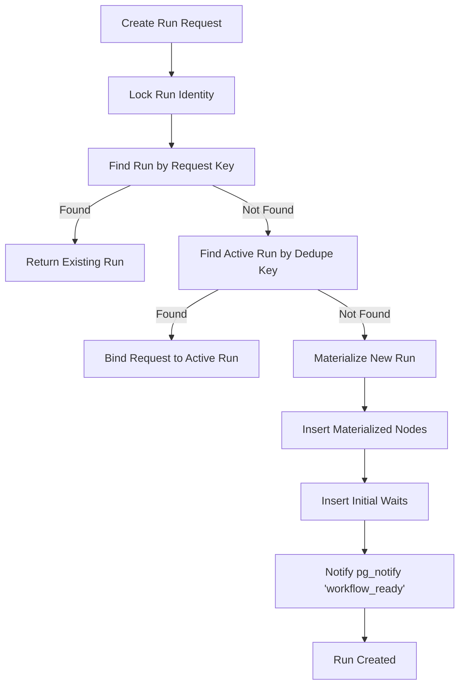
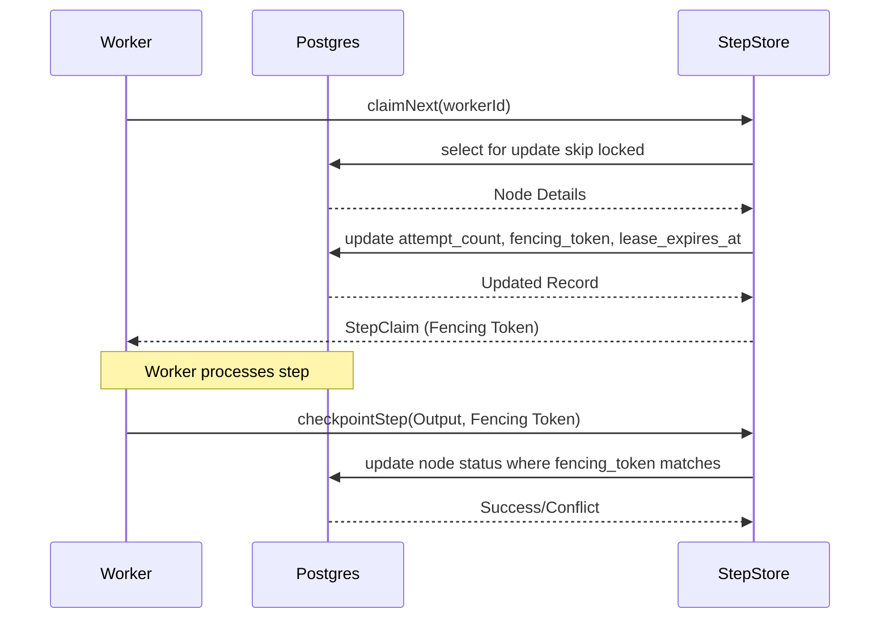

<details>
<summary>Relevant source files</summary>

The following files were used as context for generating this wiki page:

- [apps/backend/src/workflows/persistence/postgresWorkflowStore.ts](../../../apps/backend/src/workflows/persistence/postgresWorkflowStore.ts)
- [apps/backend/src/workflows/postgresWorkflowPersistence.ts](../../../apps/backend/src/workflows/postgresWorkflowPersistence.ts)
- [apps/backend/src/workflows/validation.ts](../../../apps/backend/src/workflows/validation.ts)
- [apps/backend/tests/workflows/postgresWorkflowExecutionStore.integration.test.ts](../../../apps/backend/tests/workflows/postgresWorkflowExecutionStore.integration.test.ts)
- [apps/backend/tests/workflows/postgresWorkflowObservability.test.ts](../../../apps/backend/tests/workflows/postgresWorkflowObservability.test.ts)
- [apps/backend/src/workflows/workflowStepRunner.ts](../../../apps/backend/src/workflows/workflowStepRunner.ts)
- [apps/backend/src/workflows/jsonSnapshot.ts](../../../apps/backend/src/workflows/jsonSnapshot.ts)
</details>

# Postgres Workflow Engine

The Postgres Workflow Engine is the core orchestration layer responsible for managing complex, long-running processes within the project. It leverages PostgreSQL as a reliable state store, ensuring durability, consistency, and recoverability for workflow executions. The engine handles various node types, including steps, fan-outs, and waits, while providing mechanisms for retries, idempotency, and transactional integrity.

Sources: [apps/backend/src/workflows/persistence/postgresWorkflowStore.ts](../../../apps/backend/src/workflows/persistence/postgresWorkflowStore.ts), [apps/backend/src/workflows/validation.ts](../../../apps/backend/src/workflows/validation.ts)

## System Architecture

The engine is built around the `PostgresWorkflowStore`, which serves as the primary interface for persistence. It coordinates several specialized stores that handle specific aspects of workflow lifecycle management.

### Core Components

The architecture consists of a central registry of workflow definitions and a runtime store that manages active runs.

| Component | Responsibility |
| --- | --- |
| **PostgresWorkflowStore** | Orchestrates run creation, status tracking, and sub-store coordination. |
| **PostgresWorkflowStepStore** | Manages worker claims for individual workflow steps and failure recording. |
| **PostgresWorkflowOutboxStore** | Handles durable event delivery for external notifications. |
| **PostgresWorkflowWaitStore** | Manages workflows paused while waiting for external signals. |
| **PostgresWorkflowUndoStore** | Manages the cleanup/rollback of completed steps upon failure. |

Sources: [apps/backend/src/workflows/persistence/postgresWorkflowStore.ts:407-435](../../../apps/backend/src/workflows/persistence/postgresWorkflowStore.ts#L407-L435)

### Data Flow for Run Creation

The engine ensures that workflow runs are created with strictly defined identities and input fingerprints to prevent duplicate executions.



Sources: [apps/backend/src/workflows/persistence/postgresWorkflowStore.ts:511-576](../../../apps/backend/src/workflows/persistence/postgresWorkflowStore.ts#L511-L576)

## Workflow Materialization and Persistence

Workflows are materialised into a set of database rows representing nodes (steps), waits, and events. This allows the engine to track the granular state of every execution path.

### Node Persistence

Each node within a workflow is persisted in the `public.workflow_node_runs` table. This includes input/output data, runtime state, and execution constraints like timeouts and retry limits.

```typescript
export const insertMaterializedNode = async (
  sql: postgres.TransactionSql,
  runId: string,
  node: MaterializedWorkflowNode
): Promise<void> => {
  await sql`
    insert into public.workflow_node_runs (
      run_id, node_instance_id, node_definition_id, parent_instance_id, item_key,
      kind, status, input, output, runtime_state, max_attempts, timeout_ms, has_undo,
      completed_at
    ) values (
      ${runId}, ${node.instanceId}, ${node.definitionId}, ${node.parentInstanceId ?? null},
      ${node.itemKey ?? null}, ${node.kind}, ${node.status},
      ${sql.json(asPostgresJson(node.input))},
      ${node.output === undefined ? null : sql.json(asPostgresJson(node.output))},
      ${node.runtimeState === undefined ? null : sql.json(asPostgresJson(node.runtimeState))},
      ${node.maxAttempts}, ${node.timeoutMs}, ${node.hasUndo},
      ${node.status === 'completed' ? sql`clock_timestamp()` : null}
    )
  `;
};
```

Sources: [apps/backend/src/workflows/postgresWorkflowPersistence.ts:31-50](../../../apps/backend/src/workflows/postgresWorkflowPersistence.ts#L31-L50)

## Execution Lifecycle and Worker Fencing

The engine uses a fencing token mechanism and lease-based locking to ensure that only one worker processes a specific step at a time, protecting against distributed race conditions.

### Step Claiming Process

Workers claim steps by obtaining a lease. The `fencing_token` is incremented with every claim, allowing the database to reject any updates from workers holding stale leases.



Sources: [apps/backend/tests/workflows/postgresWorkflowExecutionStore.integration.test.ts:71-110](../../../apps/backend/tests/workflows/postgresWorkflowExecutionStore.integration.test.ts#L71-L110), [apps/backend/tests/workflows/postgresWorkflowObservability.test.ts:250-290](../../../apps/backend/tests/workflows/postgresWorkflowObservability.test.ts#L250-L290)

### Transactional Guarantees

The engine heavily utilizes PostgreSQL transactions and advisory locks. `pg_advisory_xact_lock` is used to prevent concurrent run creation for the same `userId` and `requestKey`.

Sources: [apps/backend/src/workflows/persistence/postgresWorkflowStore.ts:488-498](../../../apps/backend/src/workflows/persistence/postgresWorkflowStore.ts#L488-L498)

### Provider effect results

Provider effects record an external provider result before the step continues. The runner validates the result with the effect schema and then takes an immutable JSON snapshot. Durable snapshots reject data URLs and binary objects. A provider operation that produces an image must therefore stage the bytes in object storage before it returns, and return only the asset reference and JSON metadata. A retry reads the recorded provider result instead of repeating the completed extraction or model call. Sources: [apps/backend/src/workflows/workflowStepRunner.ts](../../../apps/backend/src/workflows/workflowStepRunner.ts), [apps/backend/src/workflows/jsonSnapshot.ts](../../../apps/backend/src/workflows/jsonSnapshot.ts)

## Workflow Integrity and Validation

To maintain consistency as code evolves, the engine validates workflow definitions before they are materialised and checks their integrity during runtime.

### Definition Hashing

Workflow definitions are hashed using SHA-256. This hash is stored with the run to ensure that a resumed workflow uses the exact same logic it started with. The engine supports different hash modes to handle backward compatibility during rolling deployments.

| Hash Mode | Purpose |
| --- | --- |
| **current** | Standard hashing for active definitions. |
| **pre-compatibility-id** | Reconstructs hashes for runs created before compatibility IDs were added. |
| **pre-external-effect** | Reconstructs hashes for runs created before provider effect tracking. |

Sources: [apps/backend/src/workflows/validation.ts:26-32, 545-562](../../../apps/backend/src/workflows/validation.ts#L26-L32)

### Node Kind Validation

The engine validates that every node in a workflow definition belongs to one of the supported types:
- `emit`: Sends durable or transient events.
- `fanOut`: Executes a worker node for a collection of items.
- `repeat`: Iterates logic based on a decision schema.
- `routeBy`: Branching logic based on input.
- `sequence`: Linear execution of multiple nodes.
- `step`: A single unit of executable work.
- `waitForSignal`: Pauses execution until an external signal is received.

Sources: [apps/backend/src/workflows/validation.ts:41-50](../../../apps/backend/src/workflows/validation.ts#L41-L50)

## Observability and Logging

The engine implements a decoupled logging system. Workflow events (creation, claiming, completion, failure) are logged only after their respective database transactions have successfully committed.

### Logged Actions

The system tracks granular actions for debugging and monitoring:
- **workflow.run**: created, deduplicated, cancellation-requested.
- **workflow.attempt**: claimed, completed, retry-scheduled, recovered.
- **workflow.wait**: created, signal-replayed, expired.

Sources: [apps/backend/tests/workflows/postgresWorkflowObservability.test.ts:145-180, 520-550](../../../apps/backend/tests/workflows/postgresWorkflowObservability.test.ts#L145-L180)

### Correlated Failure Lifecycle

Workflow runs persist the originating request correlation ID and propagate it through run creation or deduplication, worker claims, retries, definition reconciliation, cancellation, undo, and recovery events. Course, lesson, artifact, and PDF mapping repair snapshots may expose that same support code so the browser can record terminal HTTP 200 workflow failures. Expected absence probes such as “no active workflow” do not enter the failure diagnostics buffer. Observability projects only allowlisted identifiers, status, operation, and sanitized failure metadata; prompts, source content, provider payloads, and credentials are excluded. Sources: [apps/backend/src/workflows/workflowObservability.ts](../../../apps/backend/src/workflows/workflowObservability.ts), [apps/backend/src/workflows/persistence/postgresWorkflowStore.ts](../../../apps/backend/src/workflows/persistence/postgresWorkflowStore.ts), [apps/web/services/feedback/browserDiagnostics.ts](../../../apps/web/services/feedback/browserDiagnostics.ts), [apps/web/services/auth/supabaseAuth.ts](../../../apps/web/services/auth/supabaseAuth.ts)

## Summary

The Postgres Workflow Engine provides a robust foundation for distributed task orchestration by treating PostgreSQL as a reliable state machine. Through the use of fencing tokens, transactional run creation, and strictly validated manifests, it ensures that complex workflows remain consistent and recoverable despite process crashes or concurrent worker activity. Its modular store architecture allows for clear separation of concerns between work execution, signal handling, and failure recovery.
