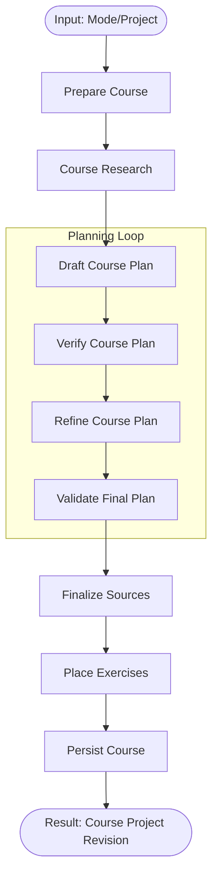
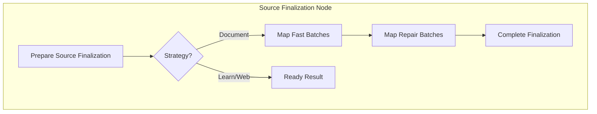

<details>
<summary>Relevant source files</summary>

The following files were used as context for generating this wiki page:

- [apps/backend/src/workflows/courseGenerationWorkflow.ts](apps/backend/src/workflows/courseGenerationWorkflow.ts)
- [apps/backend/src/workflows/courseGenerationPlanning.ts](apps/backend/src/workflows/courseGenerationPlanning.ts)
- [apps/backend/src/workflows/courseSourceFinalization.ts](apps/backend/src/workflows/courseSourceFinalization.ts)
- [apps/backend/src/workflows/courseGenerationWorkflowContract.ts](apps/backend/src/workflows/courseGenerationWorkflowContract.ts)
- [apps/backend/src/workflows/courseGenerationPreparation.ts](apps/backend/src/workflows/courseGenerationWorkflowContract.ts)
- [apps/backend/src/workflows/courseGenerationProduction.ts](apps/backend/src/workflows/courseGenerationProduction.ts)
</details>

# Course Generation Workflow

The Course Generation Workflow is a durable, multi-stage orchestration system designed to transform raw inputs—such as user assessments, learning profiles, and source documents—into a structured educational course. It leverages a sequence of AI-driven and deterministic steps to handle research, planning, verification, and source mapping. The workflow is built using a functional pipeline approach, ensuring that each stage produces a validated state transitions before proceeding to the next.

This system is central to the "Nous Reader" philosophy of providing ADHD-friendly, step-by-step learning environments. It supports multiple strategies including `learn` (generation from scratch/web), `single-source` (document-based), `source-set` (multiple documents), and `archive` (code/repository based).

Sources: [apps/backend/src/workflows/courseGenerationWorkflow.ts:281-306](apps/backend/src/workflows/courseGenerationWorkflow.ts#L281-L306), [apps/backend/src/workflows/courseGenerationPreparation.ts:133-143](apps/backend/src/workflows/courseGenerationPreparation.ts#L133-L143), [AGENTS.md:58-65](AGENTS.md#L58-L65)

## Workflow Architecture and Stages

The workflow is defined as a series of sequential nodes and fan-out operations. It utilizes a `current` topology for new runs and maintains a `previous` topology for backward compatibility with resumed durable executions.

### Execution Flow

The standard execution path follows these logical phases:

1.  **Preparation**: Validates user profiles and project sources to determine the generation strategy.
2.  **Research**: Conducts web and YouTube research to gather factual context.
3.  **Planning**: Drafs a course structure, verifies it against pedagogical rules, and refines it based on feedback.
4.  **Source Finalization**: Maps course lessons to specific chunks of the input documents (PDFs/Markdown).
5.  **Production**: Generates application exercises and persists the final course result to the database.



Sources: [apps/backend/src/workflows/courseGenerationWorkflow.ts:281-306](apps/backend/src/workflows/courseGenerationWorkflow.ts#L281-L306), [apps/backend/src/workflows/courseGenerationProduction.ts:74-106](apps/backend/src/workflows/courseGenerationProduction.ts#L74-L106)

## Planning and Verification

The planning stage is responsible for creating a `CourseLearningPlan`. This process is not a single shot; it includes a verification and refinement loop to ensure structural quality.

### Structural Quality Dimensions
The workflow enforces several quality dimensions during the `verifyCoursePlan` and `refineCoursePlan` steps:
*  **Coverage**: Ensures all relevant topics from the research/source are addressed.
*  **Progression**: Validates that concepts follow a propedeutic order (simple to complex).
*  **Granularity**: Checks if lessons are appropriately sized for digestibility.
*  **Module Cohesion**: Ensures lessons within a module are related.

| Dimension | Purpose | Validation Result |
| :--- | :--- | :--- |
| `coverage` | Checks if source materials are fully utilized | `pass` / `needs-refinement` |
| `fragmentation` | Detects if topics are too broken up | `canGroupCoherently` (boolean) |
| `prerequisites` | Ensures propedeutic order is respected | `pass` / `needs-refinement` |
| `verdict` | Final decision for the refinement loop | `pass` / `refine` |

Sources: [apps/backend/src/workflows/courseGenerationWorkflowContract.ts:251-266](apps/backend/src/workflows/courseGenerationWorkflowContract.ts#L251-L266), [apps/backend/src/workflows/courseGenerationPlanning.ts:316-339](apps/backend/src/workflows/courseGenerationPlanning.ts#L316-L339)

### Refinement Logic
If the `verifyCoursePlan` stage returns a verdict of `refine`, the `refineCoursePlan` step is triggered. It passes the draft plan and the verification feedback back to the AI model to produce a `rawRefinedPlan`. The final `validateCoursePlan` step ensures no structural findings remain before the plan is finalized.

Sources: [apps/backend/src/workflows/courseGenerationWorkflow.ts:133-176](apps/backend/src/workflows/courseGenerationWorkflow.ts#L133-L176), [apps/backend/src/workflows/courseGenerationPlanning.ts:223-261](apps/backend/src/workflows/courseGenerationPlanning.ts#L223-L261)

## Source Finalization and Mapping

For document-based courses (`single-source`, `source-set`), the workflow must link lessons to the actual text chunks in the uploaded files. This is handled by the `finalize-course-sources` sequence.

### Chunk Mapping Strategy
The mapping process uses a "Fan-Out" architecture to process chunks in parallel:
1.  **Fast Batches**: Attempts to map lessons to chunks using high-concurrency requests.
2.  **Repair Batches**: Identifies missing or failed mappings and attempts to resolve them with specific corrective feedback.
3.  **Fallback**: If model-based mapping fails after retries, the system applies a deterministic fallback based on document position.



Sources: [apps/backend/src/workflows/courseSourceFinalization.ts:401-496](apps/backend/src/workflows/courseSourceFinalization.ts#L401-L496), [apps/backend/src/workflows/courseSourceFinalization.ts:109-123](apps/backend/src/workflows/courseSourceFinalization.ts#L109-L123)

### Mapping Data Structure
The `CourseDocumentIndex` stores the relationship between lessons and the physical document structure.

| Field | Type | Description |
| :--- | :--- | :--- |
| `chunks` | `Array<Chunk>` | Text segments with offsets and page numbers. |
| `mappingQuality` | `Object` | Stores `coverageRatio`, `gapCount`, and `mappingSource`. |
| `mappingSource` | `Enum` | Either `mapped` (AI-derived) or `fallback` (Deterministic). |

Sources: [apps/backend/src/workflows/courseGenerationWorkflowContract.ts:200-229](apps/backend/src/workflows/courseGenerationWorkflowContract.ts#L200-L229), [apps/backend/src/workflows/courseSourceFinalization.ts:210-244](apps/backend/src/workflows/courseSourceFinalization.ts#L210-L244)

## Service Integration

The workflow is decoupled from implementation details through the `CourseGenerationWorkflowServices` interface. The `ProductionCourseGenerationServices` implementation provides the actual logic for project loading, model interaction, and persistence.

### Key Services
*  **Preparation**: Uses `loadProjectWithRevision` to fetch the project snapshot and `readProfile` to extract user goals.
*  **Planning**: Uses `generateCourseObject` to interact with LLMs via `CourseModelConfig`.
*  **Persistence**: Performs an atomic commit of the generated course data and generates a `projectRevision`.
*  **Undo**: Provides an idempotent cleanup mechanism if the workflow fails during persistence.

Sources: [apps/backend/src/workflows/courseGenerationWorkflow.ts:57-89](apps/backend/src/workflows/courseGenerationWorkflow.ts#L57-L89), [apps/backend/src/workflows/courseGenerationProduction.ts:58-106](apps/backend/src/workflows/courseGenerationProduction.ts#L58-L106), [apps/backend/src/workflows/courseGenerationPreparation.ts:77-130](apps/backend/src/workflows/courseGenerationPreparation.ts#L77-L130)

## Implementation Details

### State Schema Example
The workflow utilizes Zod schemas for strict state transitions. The `CoursePlanState` represents the workflow state after planning is completed.

```typescript
// apps/backend/src/workflows/courseGenerationWorkflowContract.ts:273-277
export const CoursePlanStateSchema = CoursePreparationStateSchema.omit({ stage: true }).extend({
  ...CoursePlanOutputSchema.shape,
  stage: z.literal('plan'),
});
```

### Prompt Construction
The workflow constructs complex prompts for lesson generation, incorporating writing rules such as the "No Meta-discourse" rule and KaTeX formatting requirements.

Sources: [apps/backend/src/services/lessonGenerationPrompt.ts:74-100](apps/backend/src/services/lessonGenerationPrompt.ts#L74-L100), [packages/shared-types/lessonWritingContract.ts:31-50](packages/shared-types/lessonWritingContract.ts#L31-L50)

## Conclusion

The Course Generation Workflow provides a robust, resilient framework for creating educational content. By combining modular workflow nodes with strict validation and fallback strategies, it ensures that even non-deterministic AI outputs result in a cohesive, pedagogically sound learning experience for the user. Its support for multiple input strategies and durable execution makes it a scalable core component of the Nous platform.
