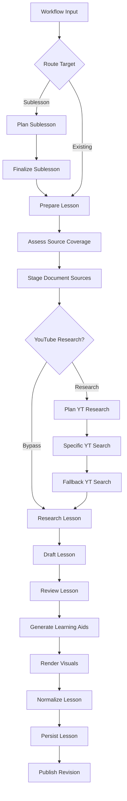

<details>
<summary>Relevant source files</summary>

The following files were used as context for generating this wiki page:

- [apps/backend/src/workflows/lessonGenerationWorkflow.ts](apps/backend/src/workflows/lessonGenerationWorkflow.ts)
- [apps/backend/src/services/lessonGenerationPrompt.ts](apps/backend/src/services/lessonGenerationPrompt.ts)
- [apps/backend/src/workflows/lessonGenerationStageServices.ts](apps/backend/src/workflows/lessonGenerationStageServices.ts)
- [apps/backend/src/services/lessonGenerationModel.ts](apps/backend/src/services/lessonGenerationModel.ts)
- [packages/shared-types/lessonWritingContract.ts](packages/shared-types/lessonWritingContract.ts)
- [apps/backend/src/workflows/lessonGenerationWorkflowContract.ts](apps/backend/src/workflows/lessonGenerationWorkflowContract.ts)
- [apps/backend/src/services/lessonGenerationNormalization.ts](apps/backend/src/services/lessonGenerationNormalization.ts)

</details>

# Lesson Generation Pipeline

The **Lesson Generation Pipeline** is a sophisticated asynchronous workflow within the Nous project designed to transform raw source materials, research data, and pedagogical contexts into structured, high-quality educational lessons. The system orchestrates multiple AI-driven stages—including research, drafting, reviewing, and visual asset generation—to ensure that each lesson is autonomous, technically accurate, and propedeutically sound.

The pipeline is implemented as a resumable workflow, allowing it to handle transient failures through retry policies and maintain state across long-running operations. It supports different generation modes, such as creating new core lessons or "deep-dive" sublessons based on specific user annotations.

Sources: [apps/backend/src/workflows/lessonGenerationWorkflow.ts](apps/backend/src/workflows/lessonGenerationWorkflow.ts), [apps/backend/src/workflows/lessonGenerationStageServices.ts](apps/backend/src/workflows/lessonGenerationStageServices.ts)

## Pipeline Architecture

The pipeline follows a sequential execution model with specialized routing for different lesson types and research requirements. It is built using a custom workflow engine that defines steps, sequences, and fan-out operations for parallel processing.

### High-Level Workflow Sequence

The following diagram illustrates the primary path of a lesson through the generation pipeline.



The workflow manages transitions between transient generation states and durable persistence states. 
Sources: [apps/backend/src/workflows/lessonGenerationWorkflow.ts:400-505](apps/backend/src/workflows/lessonGenerationWorkflow.ts#L400-L505), [apps/backend/src/workflows/lessonGenerationWorkflowContract.ts](apps/backend/src/workflows/lessonGenerationWorkflowContract.ts)

## Key Workflow Stages

### 1. Preparation and Coverage Assessment
The pipeline begins by loading the project snapshot and determining if the lesson target already exists or requires new generation. The `assessSourceCoverage` stage identifies if the provided source materials (PDFs, text) are sufficient or if external research is needed to fill "coverage gaps."
Sources: [apps/backend/src/workflows/lessonGenerationStageServices.ts:200-244](apps/backend/src/workflows/lessonGenerationStageServices.ts#L200-L244), [apps/backend/src/workflows/lessonGenerationWorkflow.ts:251-274](apps/backend/src/workflows/lessonGenerationWorkflow.ts#L251-L274)

### 2. Multi-Source Research
The research phase integrates three primary inputs:
*  **Source Context:** Extracted text from the project's primary documents.
*  **Web Research:** A factual research dossier generated by AI models (e.g., OpenRouter or Codex) to collocate recent developments and controversies.
*  **YouTube Research:** A specific search for timestamped video clips that provide visual demonstrations or practical examples.

Sources: [apps/backend/src/services/lessonGenerationModel.ts:210-270](apps/backend/src/services/lessonGenerationModel.ts#L210-L270), [apps/backend/src/workflows/lessonGenerationStageServices.ts:380-415](apps/backend/src/workflows/lessonGenerationStageServices.ts#L380-L415)

### 3. AI Drafting and Pedagogical Alignment
The `draftLesson` stage uses the `Professor Nous` system prompt. This prompt enforces strict writing rules:
*  **Propedeutic Order:** Concepts must be introduced before they are used.
*  **Self-Sufficiency:** Lessons must function without the student needing the original document open.
*  **Markdown Structure:** Use of specific headings, KaTeX for formulas, and standard code fences.

Sources: [apps/backend/src/services/lessonGenerationPrompt.ts:35-115](apps/backend/src/services/lessonGenerationPrompt.ts#L35-L115), [packages/shared-types/lessonWritingContract.ts:12-60](packages/shared-types/lessonWritingContract.ts#L12-L60)

### 4. Visual Rendering (Fan-Out)
Visuals are generated in parallel using a `fanOut` operation. The pipeline identifies "slots" for generated visuals (SVGs, Mermaid diagrams, or illustrative images) and executes the `LessonVisualWorkflow` for each unique slot ID.
Sources: [apps/backend/src/workflows/lessonGenerationWorkflow.ts:474-497](apps/backend/src/workflows/lessonGenerationWorkflow.ts#L474-L497), [apps/backend/src/services/lessonGenerationNormalization.ts:88-105](apps/backend/src/services/lessonGenerationNormalization.ts#L88-L105)

## Data Structures and Contracts

### Lesson Content Blocks
The generated lesson is stored as an array of `contentBlocks`, allowing the UI to render different media types inline.

| Block Type | Description | Key Fields |
| :--- | :--- | :--- |
| `markdown` | Standard text content | `markdown` |
| `inline-quiz` | Active pause exercises | `quiz` (question, options, correctIndex) |
| `youtube-clips` | Embedded video intervals | `clips` (sourceIndex, startSeconds, endSeconds) |
| `generated-visual` | AI-generated diagrams | `slotId`, `visualId` |

Sources: [apps/backend/src/services/lessonGenerationModel.ts:45-100](apps/backend/src/services/lessonGenerationModel.ts#L45-L100), [apps/backend/src/workflows/lessonGenerationWorkflowSchemas.ts:180-210](apps/backend/src/workflows/lessonGenerationWorkflowSchemas.ts#L180-L210)

### Writing Rules Table
The `LESSON_SHARED_WRITING_RULES` define the technical and stylistic constraints for the AI models.

| Rule ID | Category | Description |
| :--- | :--- | :--- |
| 7-11 | Lexicon | Use clear, accessible Italian; avoid unexplained acronyms or unnecessary foreign terms. |
| 13-15 | Analogies | Limit to max 1 per lesson; prefer concrete examples over meta-metaphors. |
| 19-23 | Propedeuticity | Connect technical terms immediately to common word explanations; no "forward-referencing" concepts. |
| Formula | Precision | Only use formulas if they add real precision; never for decorative humanistic concepts. |

Sources: [packages/shared-types/lessonWritingContract.ts:25-50](packages/shared-types/lessonWritingContract.ts#L25-L50)

## Implementation Details: The Prompt Builder

The `buildLessonGenerationPrompt` function is the core logic for translating workflow state into AI instructions.

```typescript
// apps/backend/src/services/lessonGenerationPrompt.ts:35-45
export const buildLessonGenerationPrompt = (
  input: Omit<LessonGenerationInput, 'config' | 'signal'>
): string => {
  const isFirstLesson = input.previousLessonTitles.length === 0;
  const previousContext = input.previousLessonTitles.join(', ') || 'Inizio percorso';
  const continuityRule = isFirstLesson
    ? "PRIMA LEZIONE: non citare lezioni precedenti..."
    : 'Se fai riferimenti al percorso, usa soltanto i titoli delle lezioni completate...';
  // ... configuration logic for sourceModeRules, imageRules, and KaTeX
```

This function dynamically injects `pedagogicalContext`, `sourceContext`, and `researchContext` to ensure the model stays grounded in the specific source material provided for that lesson.
Sources: [apps/backend/src/services/lessonGenerationPrompt.ts:35-80](apps/backend/src/services/lessonGenerationPrompt.ts#L35-L80)

## Conclusion
The Lesson Generation Pipeline represents a robust architectural solution for automated education. By decoupling research from stesura (writing) and using a resumable workflow, the system ensures that high-density educational content is generated reliably while adhering to strict pedagogical principles such as propedeuticity and autonomous readability.
