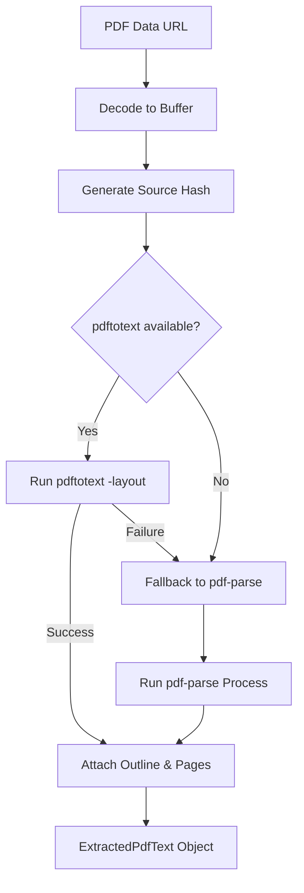
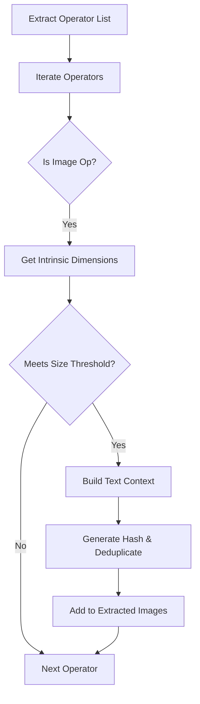

Relevant source files

The following files were used as context for generating this wiki page:

- [apps/backend/src/services/pdfTextExtractor.ts](apps/backend/src/services/pdfTextExtractor.ts)
- [apps/backend/src/services/pdfImageExtractor.ts](apps/backend/src/services/pdfImageExtractor.ts)
- [packages/shared-types/pdfTextIndex.ts](packages/shared-types/pdfTextIndex.ts)
- [apps/web/services/projects/courseSources.ts](apps/web/services/projects/courseSources.ts)
- [apps/backend/src/services/lessonGenerationSources.ts](apps/backend/src/services/lessonGenerationSources.ts)
- [apps/web/services/openrouter/pdfReasoning.ts](apps/web/services/openrouter/pdfReasoning.ts)

# Document Processing & PDF Extraction

Document Processing and PDF Extraction in the Nous project is a multi-layered system designed to transform raw PDF data and other document formats into structured, machine-readable text and assets. The primary goal is to provide high-quality educational context for lesson generation, ensuring that text, outlines, and images are accurately recovered while maintaining semantic relationships.

The system utilizes a tiered extraction strategy for text—prioritizing specialized tools like `pdftotext` before falling back to `pdf-parse`—and employs sophisticated visual analysis to extract standalone figures and diagrams. Extracted content is subsequently indexed into chunks and mapped to specific lesson modules, allowing for efficient retrieval and reasoning by AI agents.

## Text Extraction Pipeline

The text extraction logic is primarily handled in the backend and follows a failover architecture. It attempts high-fidelity extraction first and falls back to broader parsers if necessary.

### Tiered Parser Logic
The system uses a primary parser and a secondary fallback parser to ensure reliability:
1.  **pdftotext**: The preferred parser, invoked with `-layout` to preserve column structures and tabular data. It is executed as a child process with configurable memory and time limits.
2.  **pdf-parse**: A secondary fallback parser used when `pdftotext` is missing or fails. It provides lower fidelity for complex layouts but ensures text is always recovered.

Sources: [apps/backend/src/services/pdfTextExtractor.ts:316-350](apps/backend/src/services/pdfTextExtractor.ts#L316-L350), [apps/web/services/openrouter/pdfReasoning.ts:33-46](apps/web/services/openrouter/pdfReasoning.ts#L33-L46)

### Outline Generation
Outlines are derived in two ways to facilitate document navigation:
*  **Native Outlines**: Extracted directly from PDF metadata (bookmarks) using `PDFParse.getInfo()`.
*  **Deterministic Outlines**: If no native outline is found, the system scans the text for numbered headings (e.g., "1.1 Introduction") or specific keywords like "Chapter" or "Section" to build a hierarchical tree.

Sources: [apps/backend/src/services/pdfTextExtractor.ts:241-275](apps/backend/src/services/pdfTextExtractor.ts#L241-L275), [apps/backend/src/services/pdfTextExtractor.ts:293-306](apps/backend/src/services/pdfTextExtractor.ts#L293-L306)

## Content Indexing and Chunking

Once text is extracted, it is transformed into a `PdfTextIndex`. This index breaks the document into small, overlapping chunks that serve as the fundamental units for AI context.

### The Chunking Algorithm
The system builds a `PdfTextIndex` by:
1.  **Splitting into Paragraphs**: Identifying breaks based on double newlines.
2.  **Identifying Headings**: Using word counts and casing patterns to detect section boundaries.
3.  **Targeting Character Counts**: Chunks are targeted to `PDF_TEXT_CHUNK_TARGET_CHARS` (approx. 8,000 characters) to fit within LLM context windows while maintaining semantic continuity.

Sources: [packages/shared-types/pdfTextIndex.ts:213-261](packages/shared-types/pdfTextIndex.ts#L213-L261), [apps/web/services/projects/courseSources.ts:6-7](apps/web/services/projects/courseSources.ts#L6-L7)

| Component | Responsibility |
| :--- | :--- |
| `PdfTextChunk` | Stores specific segments of text, their offsets, and the heading path (breadcrumb). |
| `PdfTextIndex` | Aggregates all chunks, page counts, and source metadata for a document. |
| `SectionBuffer` | Temporary structure used during parsing to group paragraphs by heading. |

Sources: [packages/shared-types/pdfTextIndex.ts:16-43](packages/shared-types/pdfTextIndex.ts#L16-L43)

## Visual and Image Extraction

The `pdfImageExtractor` service identifies and extracts significant images, diagrams, and figures from PDF documents.

### Extraction Heuristics
Not every image in a PDF is useful. The system applies strict thresholds to filter out incidental graphics, watermarks, and icons.

| Threshold Type | Value / Rule |
| :--- | :--- |
| **Minimum Size** | Standalone images must exceed `10,000` rendered square pixels. |
| **Dimension Check** | Standalone intrinsic images must have a short side of at least `110` pixels. |
| **Context Recovery** | Captures `5` lines of text before and after the image to provide semantic context. |
| **Deduplication** | Images are hashed (SHA-256) to prevent redundant extraction of shared assets. |

Sources: [apps/backend/src/services/pdfImageExtractor.ts:8-23](apps/backend/src/services/pdfImageExtractor.ts#L8-L23), [apps/backend/src/services/pdfImageExtractor.ts:182-225](apps/backend/src/services/pdfImageExtractor.ts#L182-L225)

Sources: [apps/backend/src/services/pdfImageExtractor.ts:474-515](apps/backend/src/services/pdfImageExtractor.ts#L474-L515)

## Course and Lesson Integration

Extracted data is integrated into the "Nous" educational workflow through specialized services that map sources to specific lessons.

### Source Mapping
The `lessonGenerationSources` service provides functions to build context for AI teachers. This includes:
*  **Mapped Source Context**: Retrieving specific chunks identified as relevant to a lesson via the `documentIndex`.
*  **Source References**: Tracking which pages and chunks were used for specific content generation.
*  **Dossier Management**: Merging original course materials with external research (e.g., YouTube transcripts or web searches).

Sources: [apps/backend/src/services/lessonGenerationSources.ts:114-165](apps/backend/src/services/lessonGenerationSources.ts#L114-L165), [apps/web/services/projects/courseSources.ts:168-185](apps/web/services/projects/courseSources.ts#L168-L185)

### Reasoning Context
For AI reasoning, the system prepares a "Reasoning Content" block. This includes "Extraction Notes" that inform the AI about the parser used (e.g., informing the AI that `pdftotext` preserved the layout) and truncated text to stay within token budgets.

Sources: [apps/web/services/openrouter/pdfReasoning.ts:21-42](apps/web/services/openrouter/pdfReasoning.ts#L21-L42)

## Summary of Processing Flow

Document Processing ensures that every source file—whether a PDF, Markdown file, or ZIP archive—is converted into a stable, indexed format. The tiered extraction strategy ensures high-fidelity text recovery, while the heuristic-based image extraction filters out noise, providing the AI agents with clean, contextually rich data for generating lessons. Sources: [apps/backend/src/services/pdfTextExtractor.ts](apps/backend/src/services/pdfTextExtractor.ts), [apps/backend/src/services/pdfImageExtractor.ts](apps/backend/src/services/pdfImageExtractor.ts), [packages/shared-types/pdfTextIndex.ts](packages/shared-types/pdfTextIndex.ts)
