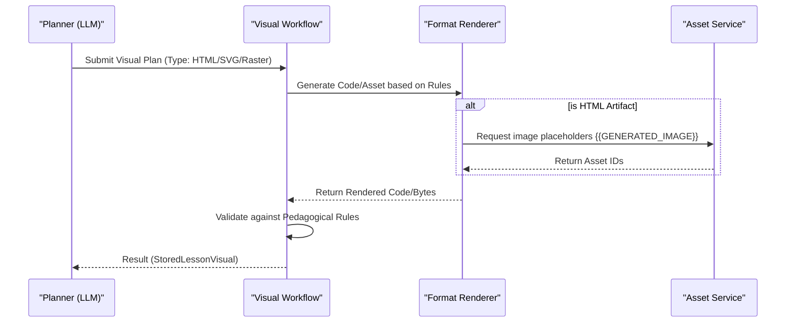

<details>
<summary>Relevant source files</summary>

The following files were used as context for generating this wiki page:

- [apps/web/utils/reader/readingText.ts](apps/web/utils/reader/readingText.ts)
- [packages/shared-types/lessonVisualContracts.ts](packages/shared-types/lessonVisualContracts.ts)
- [apps/backend/src/services/lessonGenerationPrompt.ts](apps/backend/src/services/lessonGenerationPrompt.ts)
- [apps/web/types.ts](apps/web/types.ts)
- [apps/backend/src/workflows/lessonGenerationWorkflowSchemas.ts](apps/backend/src/workflows/lessonGenerationWorkflowSchemas.ts)
- [packages/shared-types/lessonWritingContract.ts](packages/shared-types/lessonWritingContract.ts)
</details>

# Multimedia: TTS, STT & Visuals

Multimedia in the Nous project encompasses the systems responsible for converting lesson content into speech (Text-to-Speech), processing video transcripts (Speech-to-Text contexts), and generating pedagogical visual artifacts. These systems are designed to enhance the learning experience by providing multimodal access to information, ranging from interactive HTML/JS labs to automated SVG diagrams and synchronized audio reading.

The architecture relies on a structured generation workflow where lessons are parsed into "content blocks," including specialized blocks for YouTube clips, generated visuals, and markdown text optimized for speech synthesis. The system prioritizes pedagogical utility, ensuring that visuals and audio cues are not decorative but serve specific educational goals defined during the research and planning phases.

## Text-to-Speech (TTS) & Audio Reader

The audio system is primarily focused on the "Nous Reader" experience, which transforms generated markdown lessons into a readable format for speech synthesis. This involves complex text normalization to remove non-speech elements such as mathematical formulas (KaTeX), code blocks, and visual placeholders.

### Text Normalization Logic
Before text is sent to a TTS engine, it undergoes a "speech preparation" phase. This process strips markdown syntax that would result in auditory noise, such as list markers, backticks for code, and complex HTML tags.

```mermaid
flowchart TD
    RawMD[Raw Markdown Content] --> StripPlaceholders[Strip Visual/PDF Placeholders]
    StripPlaceholders --> ProtectInlineCode[Extract Inline Code Content]
    ProtectInlineCode --> RemoveComplexHTML[Drop figure/picture/figcaption]
    RemoveComplexHTML --> NormalizeLinks[Convert links to plain label text]
    NormalizeLinks --> StripMarkers[Remove * _ ~ | formatting]
    StripMarkers --> CollapseWS[Collapse Whitespace & Newlines]
    CollapseWS --> CleanSpeech[Speech-Ready Text]
```

*The diagram shows the sequential transformation of lesson markdown into a clean text stream for audio playback.*
Sources: [apps/web/utils/reader/readingText.ts:251-270](apps/web/utils/reader/readingText.ts#L251-L270), [apps/web/utils/reader/readingText.test.ts:74-100](apps/web/utils/reader/readingText.test.ts#L74-L100)

### Audio Synchronization & Segments
The system calculates "Readable Blocks" to map text segments to their position in the UI, allowing the reader to highlight the active paragraph during playback.

| Data Structure | Description | Key Fields |
| :--- | :--- | :--- |
| `AudioState` | Manages the global audio playback state. | `isPlaying`, `currentVoice`, `playbackRate`, `chunks` |
| `AudioChunk` | A single unit of audio data processed by the TTS engine. | `text`, `blobUrl`, `duration`, `isLoading` |
| `ReadableBlock` | Maps a text segment to its visual coordinates and audio timing. | `startAudio`, `endAudio`, `top`, `bottom`, `text` |

Sources: [apps/web/types.ts:602-618](apps/web/types.ts#L602-L618), [apps/web/utils/reader/readingText.ts:326-340](apps/web/utils/reader/readingText.ts#L326-L340)

## Pedagogical Visuals

Visuals are categorized into original PDF assets and "Generated Visuals." The system uses a specialized workflow to determine when a visual is pedagogically necessary and which format (SVG, HTML, Mermaid, or Raster) best suits the concept.

### Visual Formats and Selection Rules
The system follows strict rules for selecting visual formats based on the complexity and nature of the content.

| Format | Purpose | Constraint |
| :--- | :--- | :--- |
| `illustrative_image` | Physical reality, textures, 3D forms, anatomy. | Must be Raster (JPEG/PNG/WebP). |
| `flowchart_svg` | Abstract relations between process steps. | No dimensional lighting or textures. |
| `structural_svg` | System architecture or layers. | Simple nodes, boxes, and arrows only. |
| `interactive_html` | Interactive labs for exploring concepts. | HTML/CSS/JS; No external network calls. |
| `mermaid_erd` | Entity-Relationship diagrams. | Restricted to standard ER syntax. |
| `mermaid_class` | Class hierarchies/associations. | Restricted to standard Class syntax. |

Sources: [packages/shared-types/lessonVisualContracts.ts:133-145](packages/shared-types/lessonVisualContracts.ts#L133-L145), [packages/shared-types/lessonVisualContracts.ts:168-200](packages/shared-types/lessonVisualContracts.ts#L168-L200)

### Visual Generation Pipeline
Visuals are planned during lesson generation. A `LessonVisualPlan` is created, describing the pedagogical goal, factual requirements, and visual direction.



*The sequence illustrates how the system transitions from a conceptual visual plan to a rendered, validated artifact.*
Sources: [apps/backend/src/workflows/lessonGenerationWorkflowSchemas.ts:143-160](apps/backend/src/workflows/lessonGenerationWorkflowSchemas.ts#L143-L160), [apps/backend/tests/workflows/lessonVisualWorkflow.test.ts:109-140](apps/backend/tests/workflows/lessonVisualWorkflow.test.ts#L109-L140)

## Video and Speech-to-Text (STT) Context

Nous utilizes YouTube transcripts as a primary multimedia source. These transcripts function as the STT context for the LLM to generate lessons and identify specific "clips" that demonstrate motion or succession of steps.

### YouTube Clip Pedagogy
- **Movement over Stills**: Clips are selected when movement or temporal successions contain didactic information that static images cannot convey.
- **Self-Sufficiency**: Each clip must be understandable based on the surrounding text and the learner's current prerequisites.
- **Metadata Integration**: The system stores transcript segments, including timestamps and text, to allow the LLM to cite specific intervals within the video.

Sources: [packages/shared-types/lessonWritingContract.ts:12-20](packages/shared-types/lessonWritingContract.ts#L12-L20), [apps/web/types.ts:60-70](apps/web/types.ts#L60-L70)

### Source Reference Schema
YouTube data is integrated into the lesson research dossier using a strict schema that includes social metrics and transcript evidence.

| Field | Type | Description |
| :--- | :--- | :--- |
| `youtubeTranscript` | `Object` | Contains an array of segments with start/end seconds and text. |
| `videoClip` | `Object` | The specific interval (`startSeconds`, `endSeconds`) used in a lesson. |
| `candidateDecisions` | `Enum` | Model's decision to `reject` or `select-source` a video. |

Sources: [apps/backend/src/workflows/lessonGenerationWorkflowSchemas.ts:28-44](apps/backend/src/workflows/lessonGenerationWorkflowSchemas.ts#L28-L44), [apps/web/types.ts:98-110](apps/web/types.ts#L98-L110)

## Summary

The multimedia system in Nous is architected to prevent "decorative noise" and ensure high cognitive accessibility. By strictly separating speech-ready text from markdown, categorizing visual formats by their information density, and grounding video usage in timestamped transcripts, the project maintains a professional and ADHD-friendly pedagogical tone. The integration of TTS and generated visuals allows the "Nous Reader" to act as an autonomous instructor, guiding the student through complex subjects without requiring them to reference original dense documentation constantly.
