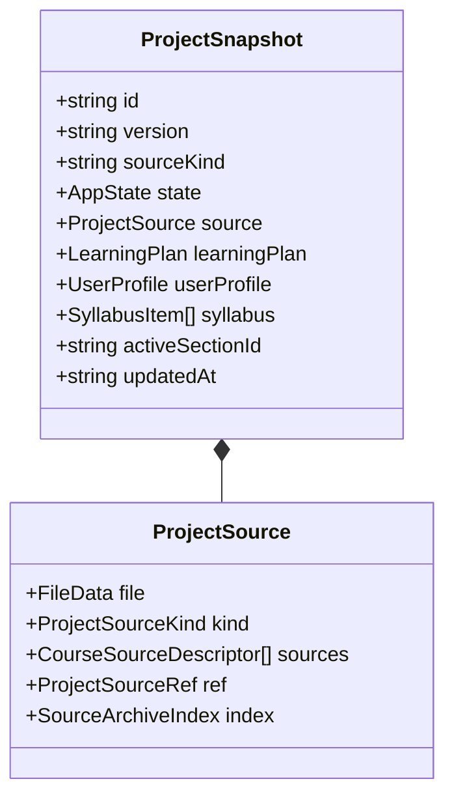
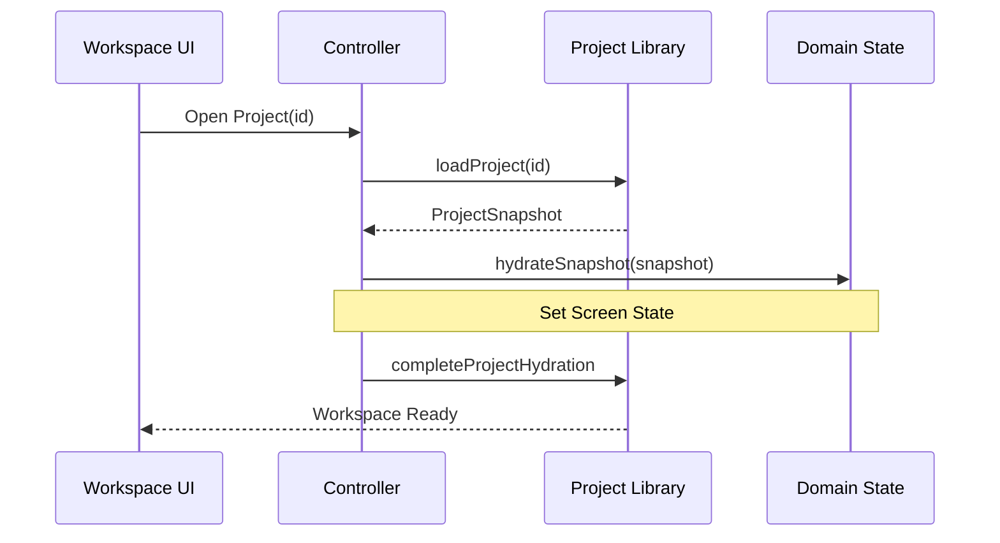
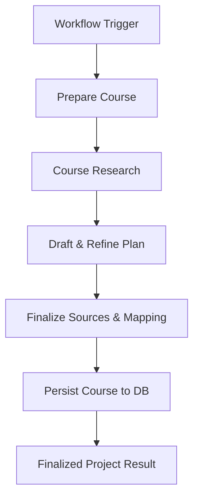

Relevant source files

The following files were used as context for generating this wiki page:

- [apps/web/services/projects/projectSnapshot.ts](apps/web/services/projects/projectSnapshot.ts)
- [apps/web/hooks/workspace/controller/controllerContext.ts](apps/web/hooks/workspace/controller/controllerContext.ts)
- [apps/backend/src/workflows/courseGenerationWorkflow.ts](apps/backend/src/workflows/courseGenerationWorkflow.ts)
- [apps/web/services/projects/courseSources.ts](apps/web/services/projects/courseSources.ts)
- [apps/backend/tests/helpers/inMemoryProjectStore.ts](apps/backend/tests/helpers/inMemoryProjectStore.ts)
- [apps/backend/src/workflows/courseGenerationPreparation.ts](apps/backend/src/workflows/courseGenerationPreparation.ts)
- [apps/backend/tests/routes/projects.test.ts](apps/backend/tests/routes/projects.test.ts)

# Project & Workspace Management

Project & Workspace Management is the core system responsible for handling the lifecycle of educational content within the Nous platform. It encompasses project creation, source ingestion (documents, PDFs, and codebase archives), state persistence through snapshots, and the orchestration of workspace environments where users interact with generated learning plans. 

The system utilizes a structured data model centered around `ProjectSnapshot` to maintain consistency between the frontend application and backend storage. It facilitates high-level operations such as project listing, exporting, and moving projects within a library, while also managing low-level binary assets like PDF source files and codebase archives.

## Core Architecture and Data Models

The architecture is built on a "Snapshot" pattern where the entire state of a project is captured in a versioned data structure. This allows for complex features like rebase-mode navigation updates and atomic persistence of multi-source projects.

### The Project Snapshot
The `ProjectSnapshot` is the primary unit of data. It contains the project version (currently '4.1'), source information, learning plans, and user profiles.

Sources: [apps/web/services/projects/projectSnapshot.ts:121-155](apps/web/services/projects/projectSnapshot.ts#L121-L155), [apps/web/services/projects/projectSnapshot.ts:25-50](apps/web/services/projects/projectSnapshot.ts#L25-L50)

### Metadata Generation
To optimize library listing, the system derives `SavedProjectMeta` from snapshots. This includes calculated fields such as `lessonCount`, `completedCount`, and a `coverLabel` which varies based on the source kind (e.g., file count for archives vs. lesson count for generated plans).
Sources: [apps/web/services/projects/projectSnapshot.ts:90-119](apps/web/services/projects/projectSnapshot.ts#L90-L119)

## Workspace Controller and Hydration

The workspace controller serves as the bridge between the UI and the domain services. It manages "Hydration"—the process of loading a project's state into the active workspace.

### Hydration Flow
When a project is opened, the controller coordinates between the project library and the domain state. It ensures that binary source data (which is often detached from the snapshot for performance) is re-attached when needed.

Sources: [apps/web/hooks/workspace/controller/controllerContext.ts:168-185](apps/web/hooks/workspace/controller/controllerContext.ts#L168-L185), [apps/web/hooks/workspace/controller/controllerContext.ts:39-78](apps/web/hooks/workspace/controller/controllerContext.ts#L39-L78)

### Source Preparation
Before a project is created, files must be prepared. The `prepareUploadedCourseSource` function handles sorting, validation, and PDF text extraction. If a PDF cannot be indexed, it is marked with an `error` status, but the overall set remains usable if at least one source is valid.
Sources: [apps/web/hooks/workspace/controller/controllerContext.ts:121-164](apps/web/hooks/workspace/controller/controllerContext.ts#L121-L164)

## Data Persistence and Storage

The system supports multiple storage strategies, primarily utilizing PostgreSQL for relational data and object storage for large binary assets.

### Persistence Strategies
Projects are stored using a `ProjectStore` interface. The `InMemoryProjectStore` is used for testing, while `PostgresProjectStore` is the production implementation.

| Feature | Description | File Reference |
| :--- | :--- | :--- |
| **Atomic Saves** | Project metadata and source references are saved in a single transaction. | `inMemoryProjectStore.ts:213` |
| **Binary Detachment** | Large files are stored in object storage; snapshots only contain references (hashes/paths). | `projectSnapshot.ts:366` |
| **Library Ordering** | Uses a sibling order system to handle project and folder placements. | `inMemoryProjectStore.ts:384` |
| **Import/Export** | Projects can be exported to JSON/Binary archives and restored later. | `inMemoryProjectStore.ts:348` |

### Course Generation Workflow
Workspace management also coordinates with the `course-generation` workflow, which prepares the environment for AI course creation.

Sources: [apps/backend/src/workflows/courseGenerationWorkflow.ts:241-260](apps/backend/src/workflows/courseGenerationWorkflow.ts#L241-L260), [apps/backend/src/workflows/courseGenerationPreparation.ts:86-125](apps/backend/src/workflows/courseGenerationPreparation.ts#L86-L125)

## Multi-Source Management

Nous allows projects to be built from multiple documents or complex codebases. The `courseSources.ts` service handles the merging and sorting of these files.

- **Stable Ordering:** Source files are sorted alphabetically by name to ensure stable chunk IDs and repeatable generation.
- **Content Deduplication:** The system uses `buildStableProjectSourceHash` to detect duplicate content across multiple uploads.
- **Chunking:** Documents are split into chunks (default 8,000 characters) for processing, with metadata tracking heading paths and offsets.
Sources: [apps/web/services/projects/courseSources.ts:13-35](apps/web/services/projects/courseSources.ts#L13-L35), [apps/web/services/projects/courseSources.ts:125-156](apps/web/services/projects/courseSources.ts#L125-L156)

### Project Source Kinds
The system automatically infers the `sourceKind` based on the input type:
Sources: [apps/web/services/projects/projectSnapshot.ts:40-61](apps/web/services/projects/projectSnapshot.ts#L40-L61)

| Source Kind | Description | Trigger |
| :--- | :--- | :--- |
| `document` | Single or multiple text/PDF files. | File upload (PDF/MD/TXT) |
| `codebase` | A ZIP archive containing multiple directories/files. | Archive upload |
| `learn-mode` | AI-generated path without immediate source files. | `isLearnMode: true` |
| `imported-json` | Restored from a previous export. | Import operation |

## Conclusion
Project & Workspace Management in Nous provides a robust framework for educational content orchestration. By decoupling snapshot state from binary storage and utilizing a formalized workflow for course generation, the system ensures data integrity and scalability across different content types. The combination of the Workspace Controller and Snapshot models provides a seamless experience for both developers and users navigating the platform's learning environments.
