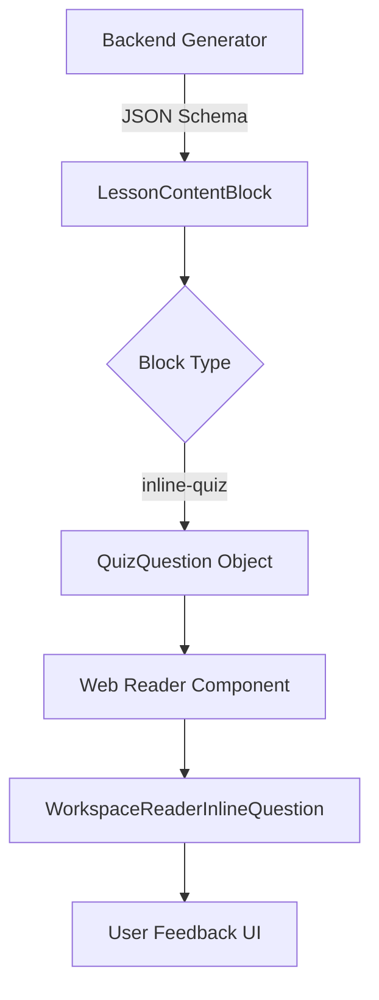
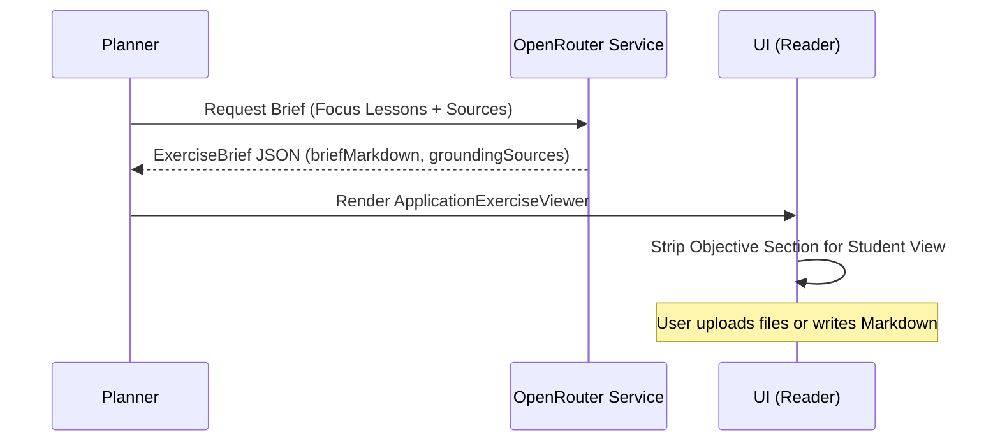

<details>
<summary>Relevant source files</summary>

The following files were used as context for generating this wiki page:

- [apps/web/components/workspace/shell/WorkspaceReaderInlineQuestion.tsx](apps/web/components/workspace/shell/WorkspaceReaderInlineQuestion.tsx)
- [packages/shared-types/lessonQuizFormatting.ts](packages/shared-types/lessonQuizFormatting.ts)
- [apps/web/utils/reader/inlineQuiz.ts](apps/web/utils/reader/inlineQuiz.ts)
- [apps/backend/src/services/lessonGenerationModel.ts](apps/backend/src/services/lessonGenerationModel.ts)
- [apps/web/components/workspace/shell/WorkspaceReaderContent.tsx](apps/web/components/workspace/shell/WorkspaceReaderContent.tsx)
- [apps/web/types.ts](apps/web/types.ts)
- [apps/web/services/openrouter/exercises/brief.ts](apps/web/services/openrouter/exercises/brief.ts)
</details>

# Interactive Exercises & Quizzes

Interactive Exercises & Quizzes in the Nous project comprise a multi-layered pedagogical system designed to reinforce learning through active participation. This system includes "Active Pauses" (inline quizzes) embedded directly within lesson content and "Application Exercises" (laboratories) that require students to produce artifacts based on learned concepts. Sources: [apps/backend/src/services/lessonGenerationPrompt.ts](apps/backend/src/services/lessonGenerationPrompt.ts), [apps/web/components/workspace/shell/WorkspaceReaderContent.tsx:432-435](apps/web/components/workspace/shell/WorkspaceReaderContent.tsx#L432-L435)

The system prioritizes active recall, inference, and practical application over rote memorization. Quizzes are strategically placed to consume explanatory context, while application exercises provide a realistic scenario for students to demonstrate mastery. Sources: [apps/backend/src/services/lessonGenerationPrompt.ts](apps/backend/src/services/lessonGenerationPrompt.ts), [apps/web/services/openrouter/exercises/brief.ts:145-155](apps/web/services/openrouter/exercises/brief.ts#L145-L155)

## Inline Quizzes (Active Pauses)

Inline quizzes, referred to as "Active Pauses," are self-contained blocks integrated within the lesson stucture. They are generated by the backend and rendered in the web reader to challenge the student's understanding immediately after relevant information is presented. Sources: [apps/backend/src/services/lessonGenerationModel.ts:48-59](apps/backend/src/services/lessonGenerationModel.ts#L48-L59), [apps/web/components/workspace/shell/WorkspaceReaderInlineQuestion.tsx](apps/web/components/workspace/shell/WorkspaceReaderInlineQuestion.tsx)

### Architecture and Data Flow

Inline quizzes are defined by a strict JSON schema during lesson generation. They must contain exactly four options and be placed after explanatory markdown blocks.



The flow ensures that every quiz is preceded by relevant context, preventing "blind" testing. Sources: [apps/backend/src/services/lessonGenerationModel.ts:413-424](apps/backend/src/services/lessonGenerationModel.ts#L413-L424), [apps/web/utils/reader/lessonContentBlocks.test.ts:37-45](apps/web/utils/reader/lessonContentBlocks.test.ts#L37-L45)

### Exercise Types
The system supports specific exercise types designed to trigger different cognitive processes:

| Exercise Type | Pedagogical Objective |
| :--- | :--- |
| `application-card` | Apply concepts to a specific case or scenario. |
| `prediction` | Predict an outcome based on provided logic. |
| `inference` | Deduce information not explicitly stated. |
| `diagnosis` | Identify errors or causes in a given setup. |
| `sequencing` | Order steps or events correctly. |

Sources: [packages/shared-types/lessonQuizFormatting.ts:1-10](packages/shared-types/lessonQuizFormatting.ts#L1-L10), [apps/backend/src/services/lessonGenerationModel.ts:48-52](apps/backend/src/services/lessonGenerationModel.ts#L48-L52)

### Implementation Details
The `WorkspaceReaderInlineQuestion` component handles the presentation and interaction logic. It manages selection states and displays color-coded feedback (emerald for correct, red for incorrect) once a choice is made. Sources: [apps/web/components/workspace/shell/WorkspaceReaderInlineQuestion.tsx:45-85](apps/web/components/workspace/shell/WorkspaceReaderInlineQuestion.tsx#L45-L85)

```typescript
// From apps/web/types.ts:326-332
export interface QuizQuestion {
  anchorExcerpt?: string;
  exerciseType?: ActivePauseExerciseType;
  question: string;
  options: string[];
  correctIndex: number;
}
```

## Application Exercises (Laboratories)

Application Exercises are high-level tasks that require the student to create deliverables such as reports, diagrams, or configurations. These are separate from standard lesson modules and appear as specific nodes in the learning plan. Sources: [apps/web/types.ts:456-470](apps/web/types.ts#L456-L470), [apps/web/components/workspace/shell/WorkspaceReaderContent.tsx:432-445](apps/web/components/workspace/shell/WorkspaceReaderContent.tsx#L432-L445)

### The Brief Generation Process
A "Brief" is generated for each exercise, providing a scenario, instructions, and constraints. The system ensures that the laboratory is self-sufficient by providing all necessary data within the traccia (track), rather than requiring external research. Sources: [apps/web/services/openrouter/exercises/brief.ts:145-160](apps/web/services/openrouter/exercises/brief.ts#L145-L160)



Sources: [apps/web/services/openrouter/exercises/brief.ts:192-210](apps/web/services/openrouter/exercises/brief.ts#L192-L210), [apps/web/components/workspace/shell/WorkspaceReaderContent.tsx:450-465](apps/web/components/workspace/shell/WorkspaceReaderContent.tsx#L450-L465)

### Deliverables and Feedback
Students interact with application exercises through a dedicated viewer that supports:
*  **Markdown Editor:** Internal text area for writing responses with formatting tools (bold, lists, code blocks). Sources: [apps/web/components/workspace/shell/WorkspaceReaderContent.tsx:505-560](apps/web/components/workspace/shell/WorkspaceReaderContent.tsx#L505-L560)
*  **File Attachments:** Support for `.zip`, `.pdf`, `.md`, and various code formats. Sources: [apps/web/components/workspace/shell/WorkspaceReaderContent.tsx:685-695](apps/web/components/workspace/shell/WorkspaceReaderContent.tsx#L685-L695)
*  **AI Feedback:** Requests a score (0-100) and qualitative analysis (strengths, improvements, caveats) from the AI teacher. Sources: [apps/web/types.ts:446-454](apps/web/types.ts#L446-L454), [apps/web/components/workspace/shell/WorkspaceReaderContent.tsx:750-765](apps/web/components/workspace/shell/WorkspaceReaderContent.tsx#L750-L765)

## Validation Rules

To maintain educational quality, the system enforces several constraints on quiz and exercise generation:

1.  **Strict Placement:** An `inline-quiz` cannot exist without preceding content or immediately follow another quiz. Sources: [apps/web/utils/reader/lessonContentBlocks.test.ts:47-60](apps/web/utils/reader/lessonContentBlocks.test.ts#L47-L60)
2.  **Self-Sufficiency:** The student must have all prerequisites explained before the pause or exercise. Sources: [packages/shared-types/lessonWritingContract.ts:6-15](packages/shared-types/lessonWritingContract.ts#L6-L15), [apps/web/services/openrouter/exercises/brief.ts:153-156](apps/web/services/openrouter/exercises/brief.ts#L153-L156)
3.  **No ASCII Art:** Visual examples must be created as programmable artifacts or images, never via ASCII characters in text. Sources: [packages/shared-types/lessonWritingContract.ts:98-102](packages/shared-types/lessonWritingContract.ts#L98-L102)
4.  **Distractor Plausibility:** Quizzes must feature distinct, plausible distractors to ensure meaningful assessment. Sources: [apps/backend/src/services/lessonGenerationPrompt.ts](apps/backend/src/services/lessonGenerationPrompt.ts)

### Quiz Layout Logic
The `buildInlineQuizLayout` utility splits lesson markdown into chunks, injecting quiz components at the correct indices defined in the content blocks. Sources: [apps/web/utils/reader/inlineQuiz.ts:38-65](apps/web/utils/reader/inlineQuiz.ts#L38-L65)

```typescript
// Simplified logic from apps/web/utils/reader/inlineQuiz.ts
export function buildInlineQuizLayout(content: string, quiz: QuizQuestion[]): QuizLayoutChunk[] {
  const parts = content.split(/{{INLINE_QUIZ:(\d+)}}/g);
  // ... maps parts to text or quiz components
}
```

## Summary
The Interactive Exercises & Quizzes system is a cornerstone of the project's ADHD-friendly, step-by-step learning philosophy. By alternating between exhaustive discursive content and active validation (Active Pauses), and culminating in practical application (Laboratories), the system ensures conceptual understanding is translated into operational skill. Sources: [AGENTS.md:95-102](AGENTS.md#L95-L102), [apps/web/components/workspace/shell/WorkspaceReaderContent.tsx:900-915](apps/web/components/workspace/shell/WorkspaceReaderContent.tsx#L900-L915)
