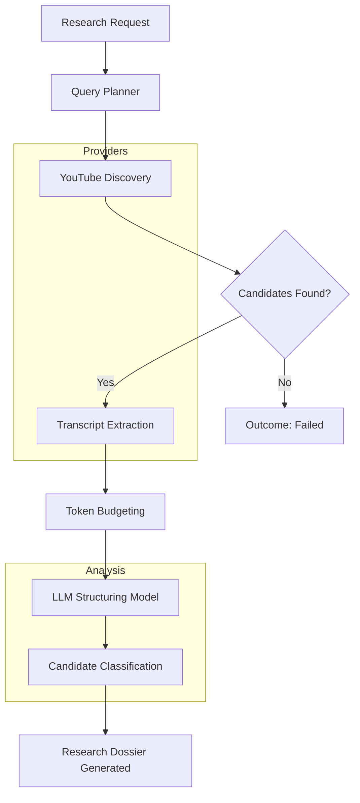
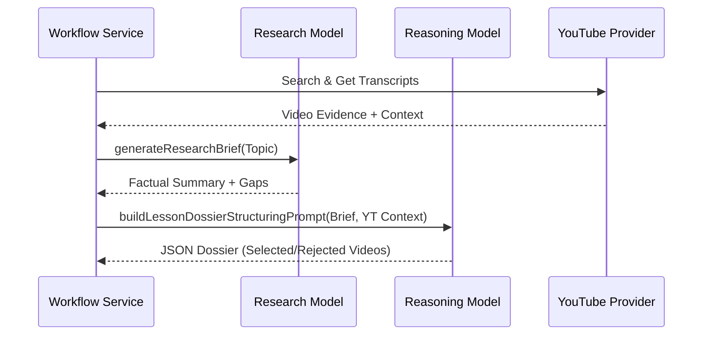
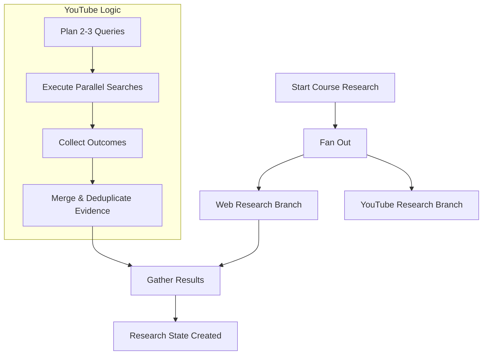

Relevant source files

The following files were used as context for generating this wiki page:

- [apps/backend/src/services/youtubeResearch.ts](apps/backend/src/services/youtubeResearch.ts)
- [apps/web/components/admin/YouTubeResearchLab.tsx](apps/web/components/admin/YouTubeResearchLab.tsx)
- [apps/web/services/openrouter/research.ts](apps/web/services/openrouter/research.ts)
- [apps/backend/src/workflows/courseGenerationResearch.ts](apps/backend/src/workflows/courseGenerationResearch.ts)
- [apps/backend/src/services/lessonGenerationResearch.ts](apps/backend/src/services/lessonGenerationResearch.ts)
- [apps/backend/src/workflows/lessonGenerationStageServices.ts](apps/backend/src/workflows/lessonGenerationStageServices.ts)
- [apps/web/tests/components/admin/YouTubeResearchLab.test.tsx](apps/web/tests/components/admin/YouTubeResearchLab.test.tsx)

# YouTube Research Lab

The **YouTube Research Lab** is a specialized subsystem within the Nous project designed to discover, evaluate, and integrate educational YouTube content into generated learning paths and lesson dossiers. It functions by programmatically searching for video candidates, extracting and analyzing their transcripts, and using Large Language Models (LLMs) to determine the pedagogical relevance of specific video segments.

This system is exposed via an administrative interface (`YouTubeResearchLab.tsx`) and integrated into backend workflows for both course-level research and individual lesson generation. It ensures that video content is not merely "recommended" but is contextually grounded through transcript evidence, supporting the project's goal of creating ADHD-friendly, step-by-step learning environments.

## System Architecture and Data Flow

The architecture follows a multi-stage pipeline that transitions from broad search queries to detailed transcript analysis and final LLM classification.

### Pipeline Stages
1.  **Query Planning:** The system generates specific and fallback search queries based on the lesson topic and goals.
2.  **Discovery:** Utilizing the `YouTubeDiscoveryProvider` (typically via the Decodo API), the system searches for videos and expands relevant playlists.
3.  **Transcript Retrieval:** The `YouTubeTranscriptProvider` fetches manual or auto-generated subtitles for candidates, adhering to a strict token budget.
4.  **LLM Structuring:** A research model evaluates the aggregated transcript context against lesson objectives to produce a "Research Dossier."
5.  **Classification:** The model explicitly selects or rejects candidates, providing evidence-based reasons for each decision.

The following diagram illustrates the high-level flow from a research request to the final dossier generation:

Sources: `apps/backend/src/services/youtubeResearch.ts:488-640`(), `apps/web/services/openrouter/research.ts:405-470`()

## Core Components and Services

### YouTube Research Service
The backend service handles the heavy lifting of discovery and transcript management. It implements a `DecodoTranscriptProvider` that interacts with external scraping APIs to bypass standard limitations and retrieve high-quality subtitle data.

Key functions include:
*  `buildYouTubeResearchOutcome`: Coordinates the discovery and transcript fetching process to return a bundle of evidence.
*  `fitTranscriptToBudget`: Ensures that large transcripts are truncated or managed to fit within LLM context windows (default 128k tokens).
*  `mergeYouTubeResearchOutcomes`: Aggregates results from multiple search queries into a single, deduplicated context string.

Sources: `apps/backend/src/services/youtubeResearch.ts:162-184`(), `apps/backend/src/services/youtubeResearch.ts:445-478`()

### Research Structuring (LLM)
Once transcripts are gathered, they are passed to an LLM using specific prompts to create a structured dossier. The system uses a two-step LLM process:
1.  **Research Brief:** A model performs a web search to identify factual gaps and recent developments.
2.  **Structuring:** A reasoning model (`MODEL_REASONING`) takes the research brief and the YouTube transcripts to produce the final JSON dossier.

Sources: `apps/web/services/openrouter/research.ts:326-403`(), `apps/backend/src/workflows/lessonGenerationStageServices.ts:420-455`()

## Data Structures

The system relies on strict Zod schemas and TypeScript interfaces to ensure consistency between the discovery providers and the LLM analysis.

| Interface / Type | Purpose | Key Fields |
| :--- | :--- | :--- |
| `YouTubeCandidate` | Metadata for discovered videos/playlists. | `id`, `kind`, `title`, `url`, `viewCount` |
| `YouTubeTranscript` | Extracted subtitle data. | `kind` (manual/auto), `language`, `segments` |
| `YouTubeVideoEvidence` | Processed video data for LLM context. | `segments`, `title`, `url`, `likeCount` |
| `YouTubeResearchOutcome`| Final bundle for a research query. | `context` (string), `videoCandidates`, `rationale` |
| `YouTubeCandidateModelDecision` | LLM's pedagogical verdict. | `decision` (selected-source/rejected), `reason`, `url` |

Sources: `apps/backend/src/services/youtubeResearch.ts:20-56`(), `apps/web/services/openrouter/research.ts:88-100`()

## Administrative Interface (The "Lab")

The `YouTubeResearchLab.tsx` component provides a diagnostic UI for developers to test the pipeline. It allows for:
*  Manual entry of course topics and lesson goals.
*  Execution of the "real" pipeline (planning -> discovery -> research -> evaluation).
*  Visualizing token budgets and timing diagnostics.
*  Previewing selected videos with specific timestamped embeds based on LLM decisions.

### Diagnostic Metrics
The Lab tracks several operations to monitor the health of the Decodo integration:
*  `discoveryRequests`: Number of search calls made.
*  `transcriptLookups`: Number of times the system checked for available subtitles.
*  `budget`: Detailed breakdown of `residualTokens`, `transcriptBudgetTokens`, and `usedTokens`.

Sources: `apps/web/components/admin/YouTubeResearchLab.tsx`(), `apps/web/tests/components/admin/YouTubeResearchLab.test.tsx:43-100`()

## Integration in Workflows

### Course Research Workflow
In the `courseGenerationResearch.ts` workflow, YouTube research is one of two parallel branches (alongside Web Research). The system generates 2-3 complementary queries to cover foundations, path, and practice.

Sources: `apps/backend/src/workflows/courseGenerationResearch.ts:185-230`()

### Lesson Generation Workflow
For individual lessons, the research is more focused. The system evaluates whether a video transcript materially helps with specific explanations, examples, or practical demonstrations. If a video is selected, its transcript segments are used by the `lessonGenerationPrompt.ts` to suggest specific `youtube-clips` blocks within the lesson Markdown.

Sources: `apps/backend/src/services/lessonGenerationResearch.ts:40-66`(), `apps/backend/src/services/lessonGenerationPrompt.ts:110-120`()

## Conclusion

The YouTube Research Lab is a critical bridge between raw video platforms and structured pedagogical content. By combining specialized scraping providers with LLM-based reasoning, it ensures that every video included in a Nous lesson is backed by transcript evidence and justified by a pedagogical rationale. This system-level rigor prevents "hallucinated" video recommendations and provides learners with high-quality visual anchors for complex topics.
