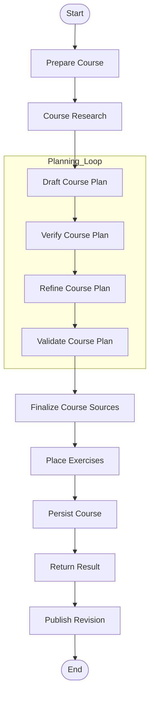
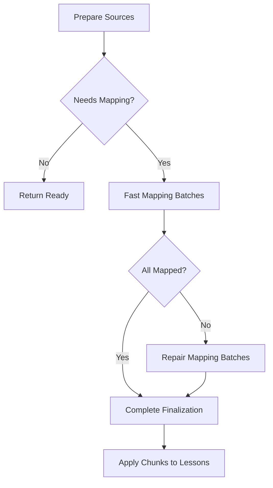

<details>
<summary>Relevant source files</summary>

The following files were used as context for generating this wiki page:

- [apps/backend/src/workflows/courseGenerationWorkflow.ts](../../../apps/backend/src/workflows/courseGenerationWorkflow.ts)
- [apps/backend/src/workflows/courseGenerationPlanning.ts](../../../apps/backend/src/workflows/courseGenerationPlanning.ts)
- [apps/backend/src/workflows/courseSourceFinalization.ts](../../../apps/backend/src/workflows/courseSourceFinalization.ts)
- [apps/backend/src/workflows/courseGenerationPreparation.ts](../../../apps/backend/src/workflows/courseGenerationPreparation.ts)
- [apps/backend/src/workflows/courseGenerationProduction.ts](../../../apps/backend/src/workflows/courseGenerationProduction.ts)
- [apps/backend/src/services/lessonGenerationPrompt.ts](../../../apps/backend/src/services/lessonGenerationPrompt.ts)
- [packages/shared-types/lessonWritingContract.ts](../../../packages/shared-types/lessonWritingContract.ts)

</details>

# Course Generation Workflow

The Course Generation Workflow is a complex, durable orchestration system responsible for transforming raw educational inputs—such as user assessments, uploaded documents, or web research—into a structured, multi-module learning path. It utilizes a state-machine-like sequence of steps including research, pedagogical planning, content verification, and source mapping to ensure high-quality educational outputs tailored to a user's specific learning profile.

The workflow is built on a modular architecture that supports different learning strategies: `learn` (pure AI-generated based on topic), `single-source` (based on one document), `source-set` (based on multiple documents), and `archive`. It leverages LLMs for drafting and refining plans while enforcing strict structural and pedagogical constraints defined in shared contracts.

Sources: [apps/backend/src/workflows/courseGenerationWorkflow.ts:1-20](../../../apps/backend/src/workflows/courseGenerationWorkflow.ts#L1-L20), [apps/backend/src/workflows/courseGenerationPreparation.ts:114-125](../../../apps/backend/src/workflows/courseGenerationPreparation.ts#L114-L125)

## Workflow Architecture and Stages

The workflow is defined as a sequence of discrete nodes, each representing a specific stage of the course creation process. The system ensures durability and idempotency, allowing runs to be resumed or rolled back in case of failure.

### High-Level Execution Flow

The following diagram illustrates the standard "current" topology of the course generation process:



Sources: [apps/backend/src/workflows/courseGenerationWorkflow.ts:297-313](../../../apps/backend/src/workflows/courseGenerationWorkflow.ts#L297-L313)

### Stage Descriptions

| Stage | Description | Key Services/Nodes |
| :--- | :--- | :--- |
| **Preparation** | Loads project data, user profiles, and identifies the generation strategy based on available sources. | `prepareCourse` |
| **Research** | Gathers external context via web search and YouTube transcripts to supplement course content. | `courseResearch` |
| **Planning** | A multi-step process involving LLM drafting, semantic verification against pedagogical rules, and refinement. | `draftCoursePlan`, `verifyCoursePlan`, `refineCoursePlan` |
| **Source Mapping** | Maps specific modules and lessons to chunks of provided PDF or Markdown documents. | `finalizeCourseSources` |
| **Persistence** | Commits the generated course to the database within a transaction, supporting atomic undo operations. | `persistCourse` |

Sources: [apps/backend/src/workflows/courseGenerationWorkflow.ts:60-100](../../../apps/backend/src/workflows/courseGenerationWorkflow.ts#L60-L100), [apps/backend/src/workflows/courseSourceFinalization.ts:400-450](../../../apps/backend/src/workflows/courseSourceFinalization.ts#L400-L450)

## Pedagogical Planning and Refinement

Planning is the core intellectual phase of the workflow. It transforms research data and source materials into a `CourseRawPlan`.

### The Refinement Loop
The workflow does not simply generate a plan; it subjects the draft to a `verifyCoursePlan` stage. If the verification identifies issues (e.g., poor granularity, broken prerequisites, or lack of progression), the `refineCoursePlan` stage is triggered with corrective feedback. Final validation is enforced by `validateRefinedCoursePlan`, which throws a permanent failure if the plan remains structurally unsound.

Sources: [apps/backend/src/workflows/courseGenerationPlanning.ts:250-280](../../../apps/backend/src/workflows/courseGenerationPlanning.ts#L250-L280), [apps/backend/src/workflows/courseGenerationWorkflow.ts:178-192](../../../apps/backend/src/workflows/courseGenerationWorkflow.ts#L178-L192)

### Plan Structural Constraints
- **Lesson Range:** For `learn` mode, the plan must contain between 8 and 24 lessons.
- **Propedeutic Order:** lections must be strictly ordered such that prerequisites are introduced before advanced concepts.
- **Source Integrity:** The plan can only reference URLs explicitly provided in the research evidence; hallucinated URLs trigger a `course_plan_source_invalid` error.

Sources: [apps/backend/src/workflows/courseGenerationPlanning.ts:19-22](../../../apps/backend/src/workflows/courseGenerationPlanning.ts#L19-L22), [apps/backend/src/workflows/courseGenerationPlanning.ts:64-75](../../../apps/backend/src/workflows/courseGenerationPlanning.ts#L64-L75)

## Source Finalization and Document Indexing

When a course is based on documents (PDFs or Markdown), the workflow must link specific lessons to the text chunks that support them.

### Mapping Logic
1. **Preparation:** Materials are read and a `CourseDocumentIndex` is built.
2. **Fan-Out Mapping:** The system performs a "fan-out" operation, sending batches of lessons to an LLM to identify the most relevant text chunks.
3. **Repair Stage:** If initial mapping fails for certain lessons, a "repair" batch is initiated with higher reasoning effort.
4. **Fallback:** If all mapping attempts fail, a deterministic fallback assigns chunks based on proportional distribution across the document.



Sources: [apps/backend/src/workflows/courseSourceFinalization.ts:460-520](../../../apps/backend/src/workflows/courseSourceFinalization.ts#L460-L520), [apps/backend/src/workflows/courseSourceFinalization.ts:133-150](../../../apps/backend/src/workflows/courseSourceFinalization.ts#L133-L150)

## Content Generation Standards

The actual writing of lessons is governed by a `lessonWritingContract`, which ensures a consistent pedagogical voice (the "Professor Nous" persona).

### Writing Rules Summary
- **Pedagogy:** Use a discursive, exhaustive style rather than simple bulleted lists.
- **Self-Sufficiency:** Lessons must be understandable without the original source document open.
- **Clarity:** Technical terms must be defined immediately upon introduction.
- **KaTeX:** All mathematical formulas must use consistent KaTeX syntax ($...$ for inline, $$...$$ for display).
- **Visuals:** Images are selected from provided `imageCandidates` and must be anchored to specific headings.

Sources: [packages/shared-types/lessonWritingContract.ts:40-80](../../../packages/shared-types/lessonWritingContract.ts#L40-L80), [apps/backend/src/services/lessonGenerationPrompt.ts:15-30](../../../apps/backend/src/services/lessonGenerationPrompt.ts#L15-L30)

## Technical Implementation Details

### Workflow Definition
The workflow is created using a factory pattern that allows for "current" and "previous" topologies to exist simultaneously, ensuring backward compatibility with active runs.

```typescript
// From apps/backend/src/workflows/courseGenerationWorkflow.ts:327-345
export const createCourseGenerationWorkflow = <Config, Services>(
  executionDefaults: Config,
  configSchema: z.ZodType<Config>
) => createCourseGenerationWorkflowDefinition(executionDefaults, configSchema, 'current');
```

### Error Handling and Retries
The workflow uses a specialized `runWorkflowStage` helper. It distinguishes between:
- **Operational Failures:** Temporary issues (e.g., rate limits) that trigger a retry.
- **Corrective Failures:** Semantic issues (e.g., invalid JSON) that provide feedback to the LLM for the next attempt.
- **Permanent Failures:** Fatal errors (e.g., missing project) that stop the workflow entirely.

Sources: [apps/backend/src/workflows/courseGenerationWorkflow.ts:75-95](../../../apps/backend/src/workflows/courseGenerationWorkflow.ts#L75-L95), [apps/backend/src/workflows/retryPolicy.ts:1-20](../../../apps/backend/src/workflows/retryPolicy.ts#L1-L20)

## Summary

The Course Generation Workflow is the backbone of the Lumina-Reader learning engine. By combining structured workflow orchestration with flexible LLM-based planning and strict pedagogical contracts, it automates the creation of high-quality, document-grounded educational content. Its ability to map plan modules to specific source chunks and its iterative refinement loop ensure that the generated courses are both technically accurate and educationally effective.
