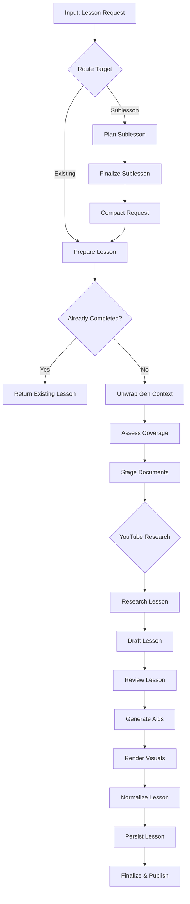
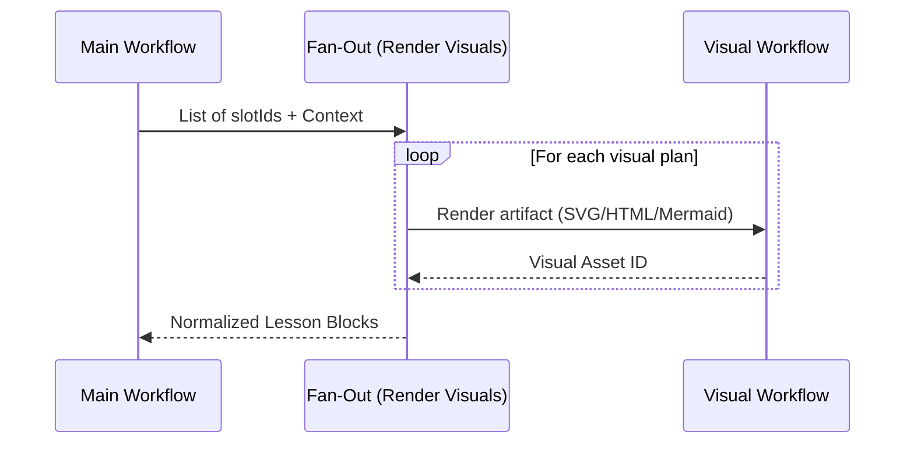

<details>
<summary>Relevant source files</summary>

The following files were used as context for generating this wiki page:

- [apps/backend/src/workflows/lessonGenerationWorkflow.ts](../../../apps/backend/src/workflows/lessonGenerationWorkflow.ts)
- [apps/backend/src/workflows/lessonGenerationProduction.ts](../../../apps/backend/src/workflows/lessonGenerationProduction.ts)
- [apps/backend/src/services/lessonGenerationPrompt.ts](../../../apps/backend/src/services/lessonGenerationPrompt.ts)
- [apps/backend/src/workflows/lessonGenerationStageServices.ts](../../../apps/backend/src/workflows/lessonGenerationStageServices.ts)
- [apps/backend/src/services/lessonGenerationModel.ts](../../../apps/backend/src/services/lessonGenerationModel.ts)
- [apps/backend/src/workflows/lessonGenerationWorkflowContract.ts](../../../apps/backend/src/workflows/lessonGenerationWorkflowContract.ts)
- [packages/shared-types/lessonWritingContract.ts](../../../packages/shared-types/lessonWritingContract.ts)

</details>

# Lesson Generation Pipeline

The Lesson Generation Pipeline is a complex, multi-stage workflow designed to transform source materials, research data, and pedagogical contexts into structured, interactive educational lessons. It utilizes Large Language Models (LLMs) to generate Markdown content, active pause exercises (quizzes), and visual aids, ensuring that each lesson is autonomous, exhaustive, and propedeutically sound.

The pipeline is built using a durable workflow engine that supports retries, idempotency, and state checkpoints. It integrates various services for document staging, YouTube research, pedagogical assessment, and visual rendering to ensure high-quality output tailored to the user's learning profile.

Sources: [apps/backend/src/workflows/lessonGenerationWorkflow.ts:608-624](../../../apps/backend/src/workflows/lessonGenerationWorkflow.ts#L608-L624), [packages/shared-types/lessonWritingContract.ts:46-77](../../../packages/shared-types/lessonWritingContract.ts#L46-L77)

## Workflow Architecture

The pipeline is organized as a sequence of discrete stages, each responsible for a specific part of the lesson lifecycle. The workflow can handle both existing lesson regenerations and new sublesson creations.

### High-Level Execution Flow
The following diagram illustrates the primary sequence of nodes within the `lesson-generation` workflow:



The workflow includes specialized routing for YouTube research (bypassing if a dossier already exists) and a fan-out mechanism for parallel visual rendering.
Sources: [apps/backend/src/workflows/lessonGenerationWorkflow.ts:488-510](../../../apps/backend/src/workflows/lessonGenerationWorkflow.ts#L488-L510), [apps/backend/src/workflows/lessonGenerationWorkflow.ts:608-624](../../../apps/backend/src/workflows/lessonGenerationWorkflow.ts#L608-L624)

## Core Generation Services

The pipeline relies on a set of `LessonGenerationStageServices` that wrap LLM calls and data transformations.

### Research and Coverage Assessment
Before writing, the pipeline assesses if the source material is sufficient. If gaps are found, it triggers a research phase.
*  **assessSourceCoverage**: Uses a model to determine if the source context covers the lesson description. Sources: [apps/backend/src/workflows/lessonGenerationStageServices.ts:245-267](../../../apps/backend/src/workflows/lessonGenerationStageServices.ts#L245-L267)
*  **researchLesson**: Generates a factual dossier by merging original sources, YouTube transcripts, and web research results. Sources: [apps/backend/src/workflows/lessonGenerationStageServices.ts:394-423](../../../apps/backend/src/workflows/lessonGenerationStageServices.ts#L394-L423)

### Content Drafting and Review
The drafting phase uses a specialized "Professor Nous" persona guided by strict pedagogical rules.
*  **draftLesson**: The core LLM turn that produces `contentBlocks` (markdown, quizzes, youtube-clips, generated-visual slots). Sources: [apps/backend/src/services/lessonGenerationModel.ts:316-339](../../../apps/backend/src/services/lessonGenerationModel.ts#L316-L339)
*  **reviewLesson**: A strict verification step that ensures valid quiz placement and balanced LaTeX environments. Sources: [apps/backend/src/services/lessonGenerationModel.ts:472-488](../../../apps/backend/src/services/lessonGenerationModel.ts#L472-L488)

### Writing & Pedagogical Rules
The pipeline enforces a "Lesson Writing Contract" to maintain quality:

| Rule Category | Description |
| :--- | :--- |
| **Propedeutic Order** | Concepts must be introduced before they are used; technical terms must be defined immediately. |
| **Autonomy** | The lesson must function without the original document open; no references to "page 5" or "section 2". |
| **Active Pauses** | Up to 3 quizzes per lesson; must require inference or application, not just paraphrase. |
| **Visuals** | Images/Visuals must be proportional and serve a specific explanation, not just decoration. |

Sources: [packages/shared-types/lessonWritingContract.ts:5-40](../../../packages/shared-types/lessonWritingContract.ts#L5-L40), [apps/backend/src/services/lessonGenerationPrompt.ts:60-90](../../../apps/backend/src/services/lessonGenerationPrompt.ts#L60-L90)

## Data Models and Contracts

The pipeline state is strictly validated using Zod schemas to ensure durability across workflow steps.

### Lesson Content Structure
The generated output is composed of various block types:

```typescript
const LessonDraftBlockSchema = z.union([
  MarkdownBlockSchema,
  InlineQuizBlockSchema,
  YouTubeClipsBlockSchema,
  GeneratedVisualSlotSchema,
]);
```

Sources: [apps/backend/src/workflows/lessonGenerationWorkflowSchemas.ts:186-191](../../../apps/backend/src/workflows/lessonGenerationWorkflowSchemas.ts#L186-L191)

### Key Data Structures
| Structure | Purpose |
| :--- | :--- |
| `LessonGenerationInput` | Aggregates sources, research, and pedagogical context for the LLM prompt. |
| `LessonResearchDossier` | A factual summary used as the "ground truth" for lesson writing. |
| `LessonVisualPlan` | Metadata for a visual aid, including pedagogical goal and factual requirements. |
| `ProjectRevisionEvent` | Emitted at the end of the pipeline to notify other services of the update. |

Sources: [apps/backend/src/workflows/lessonGenerationWorkflowSchemas.ts:74-91](../../../apps/backend/src/workflows/lessonGenerationWorkflowSchemas.ts#L74-L91), [apps/backend/src/workflows/lessonGenerationWorkflowContract.ts:211-224](../../../apps/backend/src/workflows/lessonGenerationWorkflowContract.ts#L211-L224)

## Visual Generation Logic

Visuals are handled via a `render-visuals` fan-out node. Each visual defined in the lesson draft is rendered individually by a sub-workflow.



Visuals can be `structural_svg`, `mermaid`, or `html`. If a visual requires depiction (e.g., an illustrative image), it is routed to a raster renderer.
Sources: [apps/backend/src/workflows/lessonGenerationWorkflow.ts:571-594](../../../apps/backend/src/workflows/lessonGenerationWorkflow.ts#L571-L594), [apps/backend/src/services/lessonGenerationNormalization.ts:80-92](../../../apps/backend/src/services/lessonGenerationNormalization.ts#L80-L92)

## Conclusion
The Lesson Generation Pipeline represents a sophisticated implementation of AI-driven content creation. By combining structured workflows with rigorous pedagogical constraints and multi-modal research (web, PDF, YouTube), it ensures that generated lessons are not only technically accurate but also educationally effective and cohesive within the broader course structure.
Sources: [packages/shared-types/lessonWritingContract.ts:79-100](../../../packages/shared-types/lessonWritingContract.ts#L79-L100)
