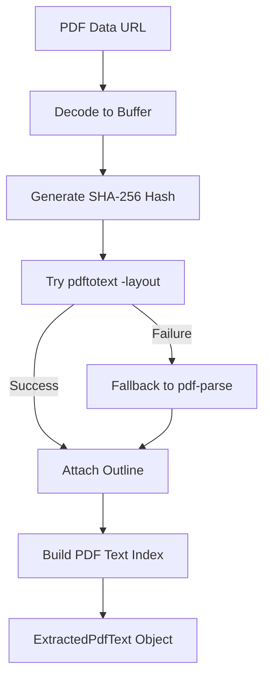
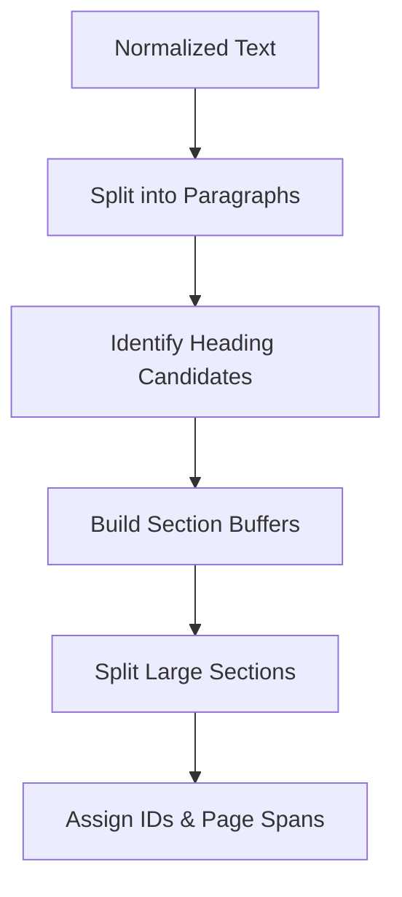
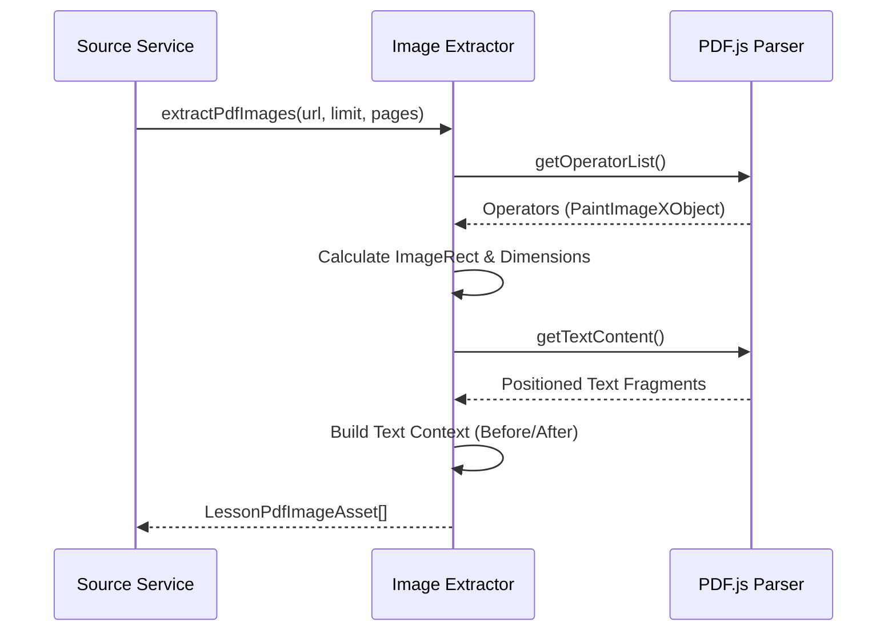

Relevant source files

The following files were used as context for generating this wiki page:

- [apps/backend/src/services/pdfTextExtractor.ts](apps/backend/src/services/pdfTextExtractor.ts)
- [apps/backend/src/services/pdfImageExtractor.ts](apps/backend/src/services/pdfImageExtractor.ts)
- [packages/shared-types/pdfTextIndex.ts](packages/shared-types/pdfTextIndex.ts)
- [packages/shared-types/pdfTextLayout.ts](packages/shared-types/pdfTextLayout.ts)
- [apps/backend/src/services/lessonGenerationSources.ts](apps/backend/src/services/lessonGenerationSources.ts)
- [apps/web/services/projects/courseSources.ts](apps/web/services/projects/courseSources.ts)

# Document Processing & PDF Extraction

Document Processing & PDF Extraction represents the core pipeline for transforming raw user-uploaded files (PDFs, Markdown, and Archives) into structured data suitable for AI-driven lesson generation. The system handles text extraction, image retrieval, and logical indexing to create a coherent knowledge base for each project.

This module is responsible for identifying document outlines, segmenting text into manageable chunks, and extracting visual assets while maintaining spatial context. This ensures that the downstream AI agents can reference specific pages, sections, and images with high precision.

## Text Extraction Pipeline

The system employs a dual-parser strategy for PDF text extraction to balance layout fidelity and reliability. It prioritizes `pdftotext` for its layout-preserving capabilities and falls back to `pdf-parse` when native tools are unavailable.

The extraction process includes normalization of line endings and removal of artifacts like page markers (e.g., "-- 1 of 10 --") to ensure clean input for the indexing phase.
Sources: [apps/backend/src/services/pdfTextExtractor.ts:258-278](apps/backend/src/services/pdfTextExtractor.ts#L258-L278), [apps/backend/src/services/pdfTextExtractor.ts:36-50](apps/backend/src/services/pdfTextExtractor.ts#L36-L50)

### Parser Comparison
| Parser | Mode | Strength | Weakness |
| :--- | :--- | :--- | :--- |
| `pdftotext` | Layout-preserving | Highly faithful to columns/tables | Requires external binary |
| `pdf-parse` | Fallback | No external dependencies | May flatten complex layouts |

Sources: [apps/backend/src/services/pdfTextExtractor.ts:162-212](apps/backend/src/services/pdfTextExtractor.ts#L162-L212), [apps/backend/src/services/pdfTextExtractor.ts:214-256](apps/backend/src/services/pdfTextExtractor.ts#L214-L256)

## Document Indexing and Chunking

Extracted text is processed into a `PdfTextIndex`, which segments the document into `PdfTextChunk` objects. This allows the system to manage large documents by providing relevant segments (chunks) to AI prompts rather than the entire text.

### Chunking Logic
The system uses a heading-based segmentation approach. Chunks are created by splitting text at detected headings or when paragraph blocks exceed target character limits.
- **Min/Max Constraints:** Chunks are governed by policies defining minimum, target, and maximum character counts.
- **Overlapping:** Large sections are split with a paragraph-level overlap to maintain semantic continuity between chunks.
Sources: [packages/shared-types/pdfTextIndex.ts:316-364](packages/shared-types/pdfTextIndex.ts#L316-L364), [packages/shared-types/pdfTextIndex.ts:18-24](packages/shared-types/pdfTextIndex.ts#L18-L24)

Sources: [packages/shared-types/pdfTextIndex.ts:98-128](packages/shared-types/pdfTextIndex.ts#L98-L128), [packages/shared-types/pdfTextIndex.ts:366-412](packages/shared-types/pdfTextIndex.ts#L366-L412)

### Heading Identification
Headings are identified using heuristics such as:
- **Numbering:** Patterns like `1.1` or `I.`.
- **Case:** Paragraphs with >70% uppercase characters.
- **Length:** Candidates must be between 3 and 120 characters and lack terminal punctuation (e.g., `.`, `?`, `!`).
Sources: [packages/shared-types/pdfTextIndex.ts:51-70](packages/shared-types/pdfTextIndex.ts#L51-L70)

## Visual Asset Extraction

Image extraction involves identifying rendered images within PDFs and extracting their data alongside surrounding text context. This allows the AI to understand not just what an image looks like, but its pedagogical role in the document.

### Extraction Constraints
To prevent processing overhead and ensure relevance, images must meet specific criteria:
- **Standalone Figures:** Evaluated based on intrinsic area and rendered dimensions (e.g., minimum 10,000 pixels area for rendered standalone images).
- **Inline Images:** Evaluated with stricter dimension requirements to filter out decorative icons or UI elements.
- **Quantity:** Limited by `LESSON_PDF_IMAGE_EXTRACTION_LIMIT`.
Sources: [apps/backend/src/services/pdfImageExtractor.ts:182-230](apps/backend/src/services/pdfImageExtractor.ts#L182-L230), [apps/backend/src/services/lessonGenerationSources.ts:394-406](apps/backend/src/services/lessonGenerationSources.ts#L394-L406)

### Spatial Context Retrieval
For every extracted image, the system identifies "text before," "text current," and "text after" by analyzing the Y-coordinates of text lines relative to the image bounding box (`ImageRect`).
Sources: [apps/backend/src/services/pdfImageExtractor.ts:98-123](apps/backend/src/services/pdfImageExtractor.ts#L98-L123)

Sources: [apps/backend/src/services/pdfImageExtractor.ts:373-431](apps/backend/src/services/pdfImageExtractor.ts#L373-L431), [apps/backend/src/services/pdfImageExtractor.ts:438-485](apps/backend/src/services/pdfImageExtractor.ts#L438-L485)

## Course Source Management

Multi-file projects are managed through `CourseSourceDescriptor` objects. This system supports stable ordering and rehydration of files that may have been detached for storage efficiency.

### Source Types and Outlines
| Source Kind | Description | Outline Method |
| :--- | :--- | :--- |
| `pdf` | PDF documents | Native outline or Regex-based deterministic |
| `markdown` | .md, .mdx files | ATX (#) and Setext (===) heading parsing |
| `text` | Plain text files | None |
| `archive` | .zip files | Entry listing (directories/files) |

Sources: [apps/web/services/projects/courseSources.ts:28-35](apps/web/services/projects/courseSources.ts#L28-L35), [apps/web/services/projects/courseSources.ts:60-116](apps/web/services/projects/courseSources.ts#L60-L116), [apps/backend/src/services/pdfTextExtractor.ts:122-140](apps/backend/src/services/pdfTextExtractor.ts#L122-L140)

### Combined Indexing
When multiple sources are present in a project, the system builds a `CombinedSourceIndex`. This merges chunks from all sources while prefixing `headingPath` with the source name and ensuring unique `sourceId` references for provenance tracking.
Sources: [apps/web/services/projects/courseSources.ts:360-384](apps/web/services/projects/courseSources.ts#L360-L384)

## Summary
The document processing architecture ensures that diverse input formats are normalized into a unified structure. By combining text chunking, outline detection, and contextual image extraction, the system provides a robust foundation for the Professor Nous agent to generate pedagogically sound lessons grounded in the original materials.
Sources: [apps/backend/src/services/lessonGenerationSources.ts:160-198](apps/backend/src/services/lessonGenerationSources.ts#L160-L198), [apps/web/services/projects/courseSources.ts:386-407](apps/web/services/projects/courseSources.ts#L386-L407)
