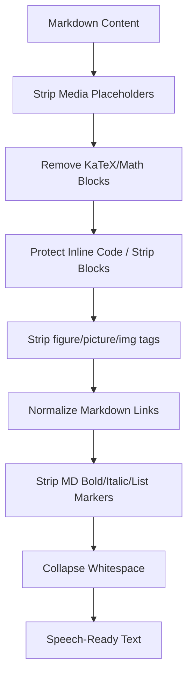
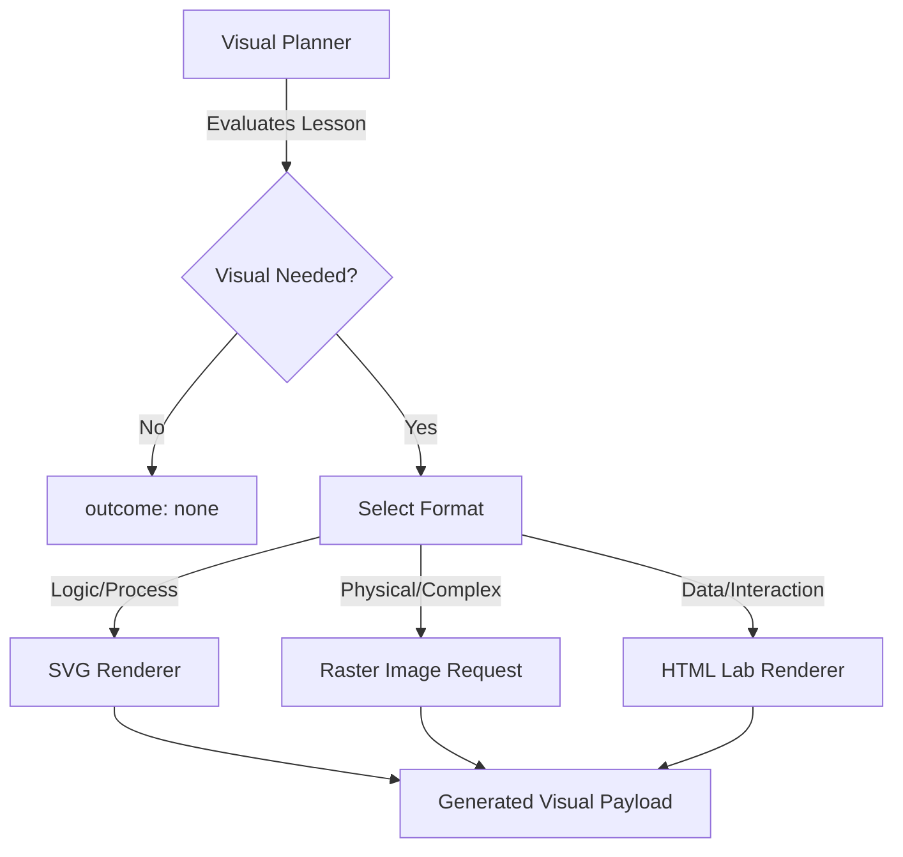
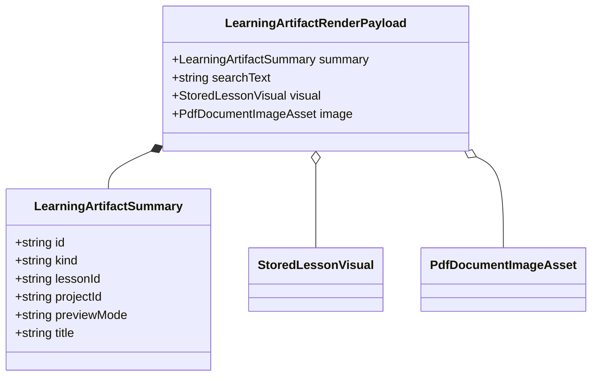

Relevant source files

The following files were used as context for generating this wiki page:

- [apps/web/utils/reader/readingText.ts](../../../apps/web/utils/reader/readingText.ts)
- [packages/shared-types/lessonVisualContracts.ts](../../../packages/shared-types/lessonVisualContracts.ts)
- [apps/web/types.ts](../../../apps/web/types.ts)
- [apps/web/services/openrouter/research.ts](../../../apps/web/services/openrouter/research.ts)
- [packages/shared-types/lessonWritingContract.ts](../../../packages/shared-types/lessonWritingContract.ts)
- [apps/backend/src/services/lessonGenerationPrompt.ts](../../../apps/backend/src/services/lessonGenerationPrompt.ts)
- [apps/web/utils/learning/artifacts.ts](../../../apps/web/utils/learning/artifacts.ts) (Referenced via [apps/web/tests/utils/learning/artifacts.test.ts](../../../apps/web/tests/utils/learning/artifacts.test.ts))

# Multimedia: TTS, STT & Visuals

The Lumina-Reader project incorporates a multi-modal learning environment designed to be ADHD-friendly and pedagogically rigorous. This system handles the transformation of text for high-quality speech synthesis, the generation and rendering of pedagogical visuals (SVG, HTML, Mermaid, and Raster), and the integration of supplemental YouTube video evidence.

Multimedia elements are not decorative; they are governed by strict pedagogical rules to ensure that every visual or audio component aids in the comprehension of complex subjects without creating cognitive overload.

## Text-to-Speech (TTS) Processing

The TTS subsystem is responsible for preparing generated lesson content and original source text for audio playback. This involves a specialized pipeline that sanitizes Markdown, handles math notation, and calculates reading weights to ensure natural pauses.

### Speech Preparation Pipeline
Before text is sent to the TTS engine, it undergoes significant normalization to remove elements that are visually helpful but verbally disruptive (e.g., image placeholders, LaTeX blocks).

*This diagram illustrates the sequence of text transformations required to create a clean text stream for audio synthesis.*
Sources: [apps/web/utils/reader/readingText.ts:241-260](../../../apps/web/utils/reader/readingText.ts#L241-L260)

### Key TTS Implementation Details
*  **Placeholder Stripping:** The system explicitly removes custom tokens like `{{VISUAL_EXAMPLE:...}}` and `{{YOUTUBE_CLIP_SOURCE:...}}` as well as standard Markdown images to prevent the reader from reciting technical metadata. Sources: [apps/web/utils/reader/readingText.ts:242-245](../../../apps/web/utils/reader/readingText.ts#L242-L245)
*  **Reading Weight Calculation:** To synchronize highlighting with audio, segments are assigned weights based on character length and punctuation. Periods (`.!?`) add a significant weight (60 units) while commas add 20 units. Sources: [apps/web/utils/reader/readingText.ts:213-218](../../../apps/web/utils/reader/readingText.ts#L213-L218)
*  **Block Pauses:** A standard `BLOCK_PAUSE_WEIGHT` of 200 is added between distinct readable elements (paragraphs, headings, list items) to ensure natural spacing in the speech stream. Sources: [apps/web/utils/reader/readingText.ts:285-288](../../../apps/web/utils/reader/readingText.ts#L285-L288)

## Pedagogical Visuals

Lumina-Reader differentiates between original document images (extracted from PDFs) and generated visuals created by AI to explain missing or complex concepts.

### Visual Types and Selection Logic
Visuals are categorized into specific formats, each with unique rendering rules and pedagogical purposes.

| Visual Type | Pedagogical Use Case | Technical Format |
| :--- | :--- | :--- |
| `illustrative_image` | Physical reality, texture, anatomy, perspective. | Raster (JPEG/PNG) |
| `flowchart_svg` | Abstract relationships, pipelines, decision trees. | SVG |
| `structural_svg` | Containment, architecture, system layers. | SVG |
| `interactive_html` | Lab environments requiring real interaction. | HTML/CSS/JS |
| `mermaid_erd` | Entity-Relationship diagrams. | Mermaid.js |
| `mermaid_class` | Object-oriented class structures. | Mermaid.js |
| `chart_html` | Quantitative data, trends, distributions. | HTML/CSS/JS |

Sources: [packages/shared-types/lessonVisualContracts.ts:145-163](../../../packages/shared-types/lessonVisualContracts.ts#L145-L163), [apps/web/types.ts:446-455](../../../apps/web/types.ts#L446-L455)

### Visual Generation Constraints
*  **Density:** A maximum of 3 generated visuals are allowed per lesson to prevent distraction. Sources: [packages/shared-types/lessonVisualContracts.ts:121](../../../packages/shared-types/lessonVisualContracts.ts#L121)
*  **Accessibility:** Every visual must include `altText` and an `anchorHeading` that exactly matches a heading in the lesson Markdown for precise placement. Sources: [apps/backend/src/services/lessonGenerationPrompt.ts:21-25](../../../apps/backend/src/services/lessonGenerationPrompt.ts#L21-L25), [packages/shared-types/lessonVisualContracts.ts:314-318](../../../packages/shared-types/lessonVisualContracts.ts#L314-L318)
*  **Language Coherence:** All visible text within a visual (labels, legends, controls) must be in the same language as the lesson. Sources: [packages/shared-types/lessonVisualContracts.ts:333-335](../../../packages/shared-types/lessonVisualContracts.ts#L333-L335)

*Architecture of the visual planning and rendering decision flow.*
Sources: [packages/shared-types/lessonVisualContracts.ts:145-167](../../../packages/shared-types/lessonVisualContracts.ts#L145-L167)

## YouTube Integration

YouTube content is used supplementally when movement or temporal successions are required for comprehension.

### Pedagogical Rules for Video
Clips are only selected if they are "self-sufficient" at the point they appear. The writing contract mandates that the student should not need to watch preceding or following parts of the video to understand the specific interval provided. Sources: [packages/shared-types/lessonWritingContract.ts:25-27](../../../packages/shared-types/lessonWritingContract.ts#L25-L27)

### Research and Selection Process
The research model evaluates YouTube candidates based on transcript relevance rather than social metrics (views/likes).
1.  **Candidate Classification:** Videos are classified as either `selected-source` or `rejected`.
2.  **Evidence-Based Selection:** Selection is based on whether the transcript materially helps the lesson's progression or practical demonstrations.
3.  **Timestamped Clips:** The system selects specific `startSeconds` and `endSeconds` intervals to ensure focused learning.

Sources: [apps/web/services/openrouter/research.ts:380-405](../../../apps/web/services/openrouter/research.ts#L380-L405), [apps/web/types.ts:63-71](../../../apps/web/types.ts#L63-L71)

## Multimedia Data Models

### Learning Artifacts
Visuals and PDF images are normalized into "Artifacts" for consistent rendering and searchability.

*Class structure representing the unified payload for all multimedia artifacts.*
Sources: [apps/web/types.ts:503-535](../../../apps/web/types.ts#L503-L535)

### Content Blocks
Multimedia is integrated into the lesson via `contentBlocks`, ensuring order preservation.
*  **MarkdownBlock:** Standard text content.
*  **InlineQuizBlock:** Active pauses with specific exercise types (e.g., classification, prediction).
*  **YouTubeClipsBlock:** A collection of targeted video segments.
*  **GeneratedVisualBlock:** A placeholder for an AI-generated pedagogical aid.

Sources: [apps/web/types.ts:77-108](../../../apps/web/types.ts#L77-L108)

## Summary
The multimedia system in Lumina-Reader is a strictly regulated pedagogical framework. By sanitizing text for TTS, limiting the density of AI-generated visuals, and requiring timestamped evidence for video clips, the platform ensures that audio-visual aids directly support specific learning objectives defined in the course plan. All multimedia elements are cross-referenced to original source materials or AI-generated plans to maintain factual integrity.
