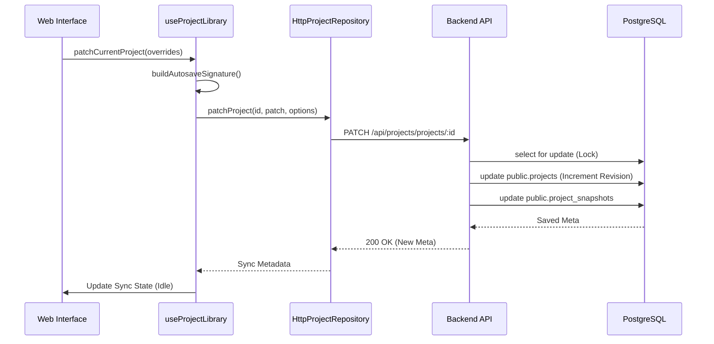
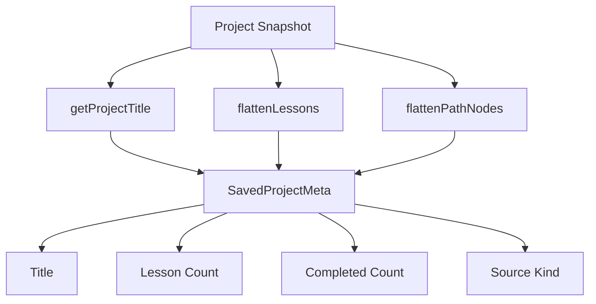
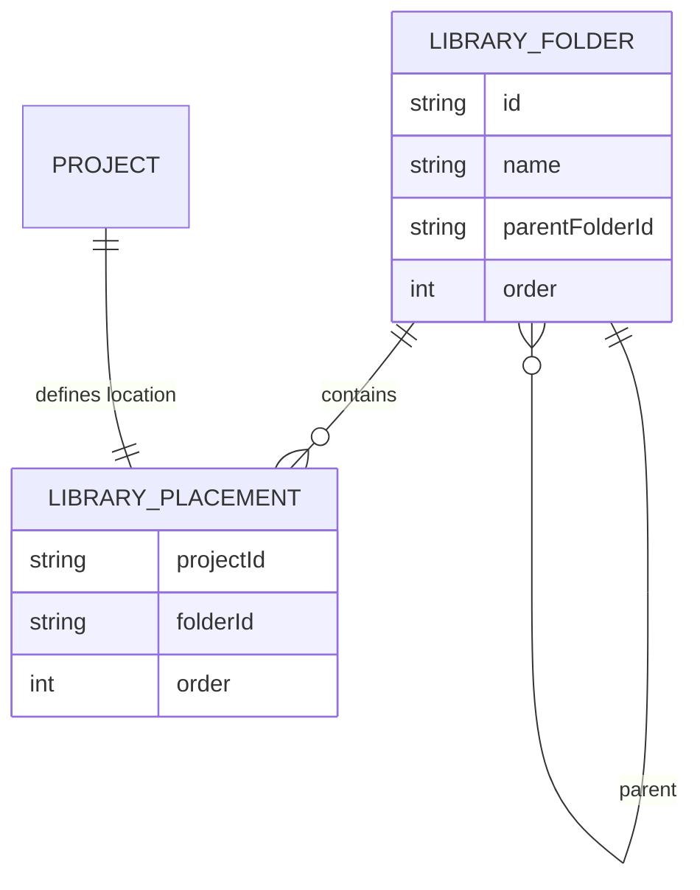

Relevant source files

The following files were used as context for generating this wiki page:

- [apps/backend/src/projects/postgresProjectStore.ts](apps/backend/src/projects/postgresProjectStore.ts)
- [apps/backend/src/projects/types.ts](apps/backend/src/projects/types.ts)
- [apps/web/services/projects/projectSnapshot.ts](apps/web/services/projects/projectSnapshot.ts)
- [apps/web/hooks/library/useProjectLibrary.ts](apps/web/hooks/library/useProjectLibrary.ts)
- [apps/backend/tests/routes/projects.test.ts](apps/backend/tests/routes/projects.test.ts)
- [apps/backend/src/projects/projectImportConfig.ts](apps/backend/src/projects/projectImportConfig.ts)

# Project & Workspace Management

Project & Workspace Management is the core system responsible for handling the lifecycle, persistence, and organization of user-generated learning environments (projects) and their structural containers (folders). This system ensures that complex data structures—including AI-generated learning plans, syllabus items, and original source documents (PDFs, archives)—are consistently synchronized between the client and the PostgreSQL backend.

The system facilitates multi-source handling, allowing users to build courses from single documents, codebase archives, or broader research topics. It provides a robust synchronization layer that manages optimistic updates, conflict resolution via revision tracking, and binary data management for large file uploads.

## System Architecture

The architecture follows a clear separation between persistence logic, service-level orchestration, and client-side state management.

### Persistence Layer
The backend utilizes `PostgresProjectStore` to manage relational data and document snapshots. It interacts with several specialized tables:
*  `public.projects`: Stores metadata, favorite status, and revision numbers.
*  `public.project_snapshots`: Stores the full JSON configuration of the learning environment.
*  `public.project_sources`: Manages references to external binary storage (e.g., Supabase Storage).
*  `public.library_folders` & `public.library_placements`: Handle the hierarchical organization of the user's workspace.

Sources: [apps/backend/src/projects/postgresProjectStore.ts:133-145](apps/backend/src/projects/postgresProjectStore.ts#L133-L145), [apps/backend/src/projects/postgresProjectStore.ts:311-344](apps/backend/src/projects/postgresProjectStore.ts#L311-L344)

### Data Flow for Project Updates
When a user modifies a workspace (e.g., completes a lesson or highlights a section), the client attempts a granular update.

The system employs a "Revision Conflict" mechanism. If the `expectedRevision` sent by the client does not match the current database revision, the update is rejected with a `409 Conflict`, triggering a rebase or refresh on the client.

Sources: [apps/web/hooks/library/useProjectLibrary.ts:474-550](apps/web/hooks/library/useProjectLibrary.ts#L474-L550), [apps/backend/src/projects/postgresProjectStore.ts:518-548](apps/backend/src/projects/postgresProjectStore.ts#L518-L548)

## Project Snapshots and Metadata

A `ProjectSnapshot` is the definitive state of a workspace at any given time. It is a comprehensive JSON object that includes the learning plan, user profile, and document indices.

### Snapshot Structure
The `createProjectSnapshot` function ensures that every project follows a standardized format (Version 4.1).

| Field | Type | Description |
| :--- | :--- | :--- |
| `id` | `ProjectId` | Unique identifier for the project. |
| `version` | `string` | Format version (currently 4.1). |
| `sourceKind` | `ProjectSourceKind` | Identifies if the source is a `document`, `codebase`, or `learn-mode`. |
| `learningPlan` | `LearningPlan` | The AI-generated curriculum structure. |
| `documentIndex` | `PdfTextIndex` | Extracted text and chunks for searchable source content. |
| `revision` | `number` | Incremental counter managed by the server for sync consistency. |

Sources: [apps/web/services/projects/projectSnapshot.ts:145-177](apps/web/services/projects/projectSnapshot.ts#L145-L177), [apps/backend/src/projects/types.ts:114-142](apps/backend/src/projects/types.ts#L114-L142)

### Metadata Generation
Metadata (`SavedProjectMeta`) is derived from the snapshot to provide a lightweight overview for the library view without loading the full multi-megabyte snapshot.

Sources: [apps/web/services/projects/projectSnapshot.ts:116-143](apps/web/services/projects/projectSnapshot.ts#L116-L143)

## Source and Binary Management

Projects can be backed by physical files. The system separates the JSON snapshot from binary data to optimize performance.

### Binary Handling Logic
1.  **PDF/Text Sources**: Stored as Base64 in transient states but detached during persistence into `public.project_sources`.
2.  **Archive Sources (Codebases)**: The backend indexes zip files, creating entries in `public.project_source_entries` to allow for granular file-level queries within a codebase without re-downloading the entire archive.
3.  **Durable Object Storage**: The `PostgresProjectStore` interacts with an object storage provider (e.g., Supabase) to host actual file bytes.

Sources: [apps/backend/src/projects/postgresProjectStore.ts:553-615](apps/backend/src/projects/postgresProjectStore.ts#L553-L615), [apps/backend/src/projects/postgresProjectStore.ts:896-940](apps/backend/src/projects/postgresProjectStore.ts#L896-L940)

### Import Configuration
The system defines strict limits for project imports to maintain stability.

| Config Option | Value | Description |
| :--- | :--- | :--- |
| `directMaxBytes` | 20,000,000 | Max size for a single-request upload. |
| `maxChunkBytes` | 16,000,000 | Size of individual chunks for large uploads. |
| `maxChunkCount` | 32 | Maximum number of chunks allowed per file. |
| `maxSerializedBytes` | 280,000,000 | Total limit for the serialized project JSON. |

Sources: [apps/backend/src/projects/projectImportConfig.ts:5-11](apps/backend/src/projects/projectImportConfig.ts#L5-L11)

## Workspace Organization (Folders & Placements)

Users organize projects into a hierarchical structure using folders. This is managed via sibling ordering to allow custom sorting.

### Library Tree Relationship
The library organization uses a `SiblingItem` model where both folders and project placements exist in the same ordering space.

Sources: [apps/backend/src/projects/postgresProjectStore.ts:1146-1185](apps/backend/src/projects/postgresProjectStore.ts#L1146-L1185), [apps/web/hooks/library/useProjectLibrary.ts:178-185](apps/web/hooks/library/useProjectLibrary.ts#L178-L185)

### Key Management Functions
*  `moveProjects`: Moves a batch of project IDs to a target folder and recalculates their `order_index` using `SIBLING_ORDER_STEP` (1024).
*  `deleteFolder`: Implements a "soft-reparent" strategy where children of a deleted folder are moved to the deleted folder's parent rather than being deleted.
*  `ensurePlacement`: Guarantees that every project owned by a user has a corresponding entry in the library organization, placing new projects at the root by default.

Sources: [apps/backend/src/projects/postgresProjectStore.ts:1056-1087](apps/backend/src/projects/postgresProjectStore.ts#L1056-L1087), [apps/backend/src/projects/postgresProjectStore.ts:1107-1144](apps/backend/src/projects/postgresProjectStore.ts#L1107-L1144)

## Summary
Project & Workspace Management provides a robust foundation for the Nous Reader environment. It bridges the gap between complex AI-driven data structures and reliable database persistence through revision-based synchronization, granular patching of large JSON documents, and a flexible hierarchical organization system for both projects and their original source materials. Sources: [apps/backend/src/projects/postgresProjectStore.ts](apps/backend/src/projects/postgresProjectStore.ts), [apps/web/hooks/library/useProjectLibrary.ts](apps/web/hooks/library/useProjectLibrary.ts)
