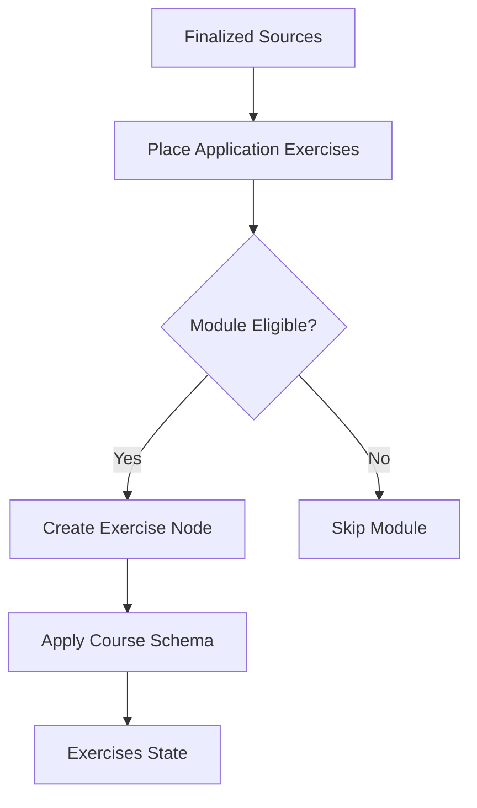
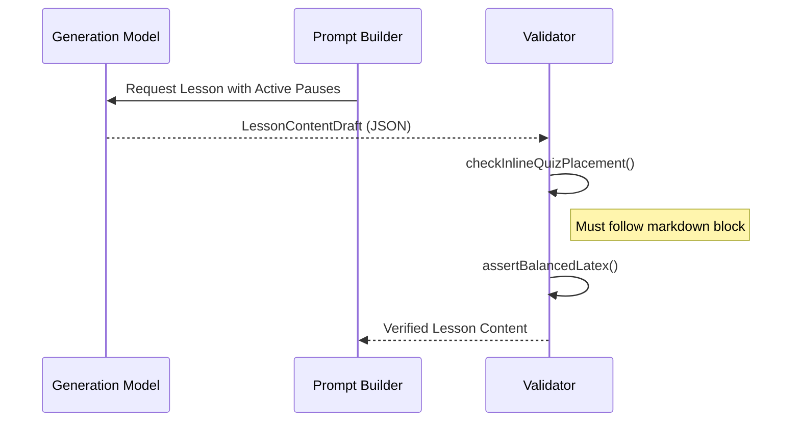
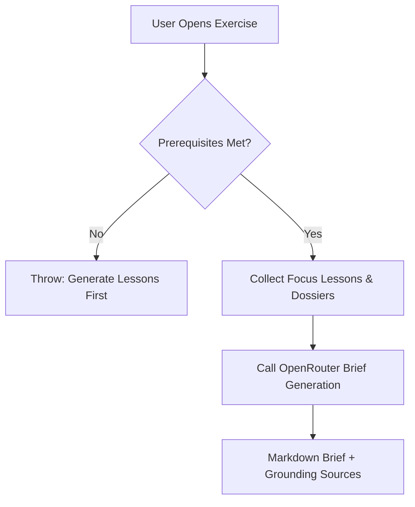

<details>
<summary>Relevant source files</summary>

The following files were used as context for generating this wiki page:

- [apps/backend/src/workflows/courseExercisePlanning.ts](../../../apps/backend/src/workflows/courseExercisePlanning.ts)
- [apps/backend/src/services/lessonGenerationModel.ts](../../../apps/backend/src/services/lessonGenerationModel.ts)
- [apps/web/services/openrouter/exercises/brief.ts](../../../apps/web/services/openrouter/exercises/brief.ts)
- [apps/backend/src/workflows/courseGenerationWorkflowContract.ts](../../../apps/backend/src/workflows/courseGenerationWorkflowContract.ts)
- [apps/web/components/workspace/shell/WorkspaceReaderContent.tsx](../../../apps/web/components/workspace/shell/WorkspaceReaderContent.tsx)
- [apps/web/types.ts](../../../apps/web/types.ts)
- [apps/backend/src/services/lessonGenerationPrompt.ts](../../../apps/backend/src/services/lessonGenerationPrompt.ts)

</details>

# Interactive Exercises & Quizzes

The **Interactive Exercises & Quizzes** system in Lumina-Reader provides pedagogical assessment layers designed to verify practical application, diagnosis, and decision-making skills. The system distinguishes between **Active Pauses** (short, inline quizzes during a lesson) and **Application Exercises** (larger, module-level practical tasks). These elements are strategically placed to ensure the student can transition from passive reading to active knowledge application.

Sources: [apps/backend/src/workflows/courseExercisePlanning.ts:145-155](../../../apps/backend/src/workflows/courseExercisePlanning.ts#L145-L155), [apps/backend/src/services/lessonGenerationPrompt.ts:79-88](../../../apps/backend/src/services/lessonGenerationPrompt.ts#L79-L88)

## System Architecture and Lifecycle

The exercise system operates through a multi-stage lifecycle involving planning, brief generation, and evaluation. Initially, the system selects eligible modules for exercises, ensuring that theoretical content is followed by practical challenges.

### Exercise Planning Workflow
The planning stage determines the position, title, and pedagogical objectives of exercises. It enforces a constraint of at most one application exercise per module, specifically targeting modules containing lessons.



Sources: [apps/backend/src/workflows/courseExercisePlanning.ts:28-48](../../../apps/backend/src/workflows/courseExercisePlanning.ts#L28-L48), [apps/backend/src/workflows/courseExercisePlanning.ts:162-175](../../../apps/backend/src/workflows/courseExercisePlanning.ts#L162-L175)

### Application Exercise Structure
Application exercises are represented as `ApplicationExerciseNode` types, distinct from standard `LessonNode` types. They include metadata for tracking completion, feedback, and student-provided attachments.

| Field | Type | Description |
| :--- | :--- | :--- |
| `assessedObjective` | `string` | The specific skill or knowledge being tested (max 280 chars). |
| `brief` | `string` | The detailed instructions/scenario for the student. |
| `internalText` | `string` | Student-written response in the editor. |
| `attachments` | `ExerciseAttachment[]` | Files or archives uploaded by the user. |
| `currentFeedback` | `ExerciseFeedback` | AI-generated qualitative feedback and score. |
| `feedbackStale` | `boolean` | Indicates if the feedback matches the current submission. |

Sources: [apps/backend/src/workflows/courseGenerationWorkflowContract.ts:192-225](../../../apps/backend/src/workflows/courseGenerationWorkflowContract.ts#L192-L225), [apps/web/types.ts:489-514](../../../apps/web/types.ts#L489-L514)

## Active Pauses (Inline Quizzes)

Active Pauses are `inline-quiz` blocks embedded within lesson content. They are designed to be self-sufficient, requiring the student to apply information found in the preceding markdown block.

### Quiz Logic and Constraints
The system enforces specific placement rules: a quiz must follow an explanatory markdown block and cannot be placed immediately after another quiz. Each quiz consists of four distinct options with one correct answer, and utilizes specific distraction types such as "prediction," "diagnosis," or "inference."



Sources: [apps/backend/src/services/lessonGenerationModel.ts:165-177](../../../apps/backend/src/services/lessonGenerationModel.ts#L165-L177), [apps/backend/src/services/lessonGenerationPrompt.ts:89-95](../../../apps/backend/src/services/lessonGenerationPrompt.ts#L89-L95)

### Exercise Types for Active Pauses
| Type | Pedagogical Intent |
| :--- | :--- |
| `application` | Applying a concept to a new scenario. |
| `comparison` | Differentiating between two similar concepts. |
| `inference` | Drawing a conclusion from given premises. |
| `diagnosis` | Identifying a problem based on symptoms. |
| `sequencing` | Determining the correct order of operations. |

Sources: [apps/backend/src/services/lessonGenerationPrompt.ts:98-100](../../../apps/backend/src/services/lessonGenerationPrompt.ts#L98-L100), [apps/backend/src/services/lessonGenerationModel.ts:38-42](../../../apps/backend/src/services/lessonGenerationModel.ts#L38-L42)

## Laboratory Brief Generation

When a student opens an application exercise, the system generates a "Brief" (consigna). This is not a lesson; it is a concise track that makes the task autonomous and evaluable.

### Grounding and Sources
Brief generation uses a "Dossier" of research and focus lessons to ensure the task is grounded in the course material. The prompt explicitly forbids asking the student to search for external material; all required data must be provided within the brief.



Sources: [apps/web/services/openrouter/exercises/brief.ts:128-150](../../../apps/web/services/openrouter/exercises/brief.ts#L128-L150), [apps/web/services/openrouter/exercises/brief.ts:208-230](../../../apps/web/services/openrouter/exercises/brief.ts#L208-L230)

## User Interface and Evaluation

The `WorkspaceReaderContent` component manages the rendering of both inline quizzes and application exercises. It includes a text editor for student responses and an attachment handler for file uploads.

### Evaluation Lifecycle
1. **Student Submission**: The student provides text via the `ExerciseInternalTextEditor` or uploads files via `ExerciseAttachmentCard`.
2. **Feedback Request**: Triggering `onRequestFeedback` sends the internal text and attachments for AI evaluation.
3. **Feedback Rendering**: The AI returns a `qualitativeLabel`, a `summary`, `strengths`, and `improvements`.

Sources: [apps/web/components/workspace/shell/WorkspaceReaderContent.tsx:476-500](../../../apps/web/components/workspace/shell/WorkspaceReaderContent.tsx#L476-L500), [apps/web/components/workspace/shell/WorkspaceReaderContent.tsx:645-660](../../../apps/web/components/workspace/shell/WorkspaceReaderContent.tsx#L645-L660)

### Code Snippet: Inline Quiz Implementation

```typescript
// apps/backend/src/services/lessonGenerationModel.ts:31-45
const QUIZ_SCHEMA = {
  additionalProperties: false,
  properties: {
    correctIndex: { maximum: 3, minimum: 0, type: 'integer' },
    exerciseType: {
      enum: ACTIVE_PAUSE_EXERCISE_PROMPT_GUIDE.map(exercise => exercise.type),
      type: 'string',
    },
    options: { items: { type: 'string' }, maxItems: 4, minItems: 4, type: 'array' },
    question: { type: 'string' },
  },
  required: ['exerciseType', 'question', 'options', 'correctIndex'],
  type: 'object',
} as const;
```

## Summary
The Interactive Exercises & Quizzes system transitions the Lumina-Reader from a content viewer to a learning environment. By enforcing strict placement rules for Active Pauses and generating grounded, autonomous briefs for Application Exercises, the architecture ensures that every assessment is pedagogically sound and directly tied to the student's learning progress.
