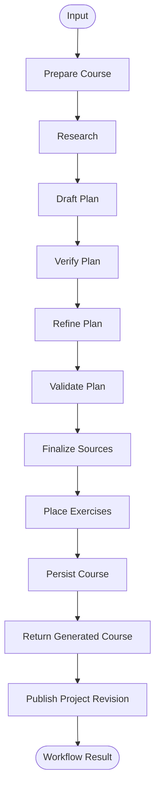

Relevant source files

- [apps/backend/src/workflows/courseGenerationWorkflow.ts](../../../apps/backend/src/workflows/courseGenerationWorkflow.ts)
- [apps/backend/src/workflows/courseGenerationPlanning.ts](../../../apps/backend/src/workflows/courseGenerationPlanning.ts)
- [apps/backend/src/workflows/courseGenerationWorkflowContract.ts](../../../apps/backend/src/workflows/courseGenerationWorkflowContract.ts)
- [apps/backend/src/workflows/courseSourceFinalization.ts](../../../apps/backend/src/workflows/courseSourceFinalization.ts)
- [apps/backend/src/workflows/courseGenerationPreparation.ts](../../../apps/backend/src/workflows/courseGenerationPreparation.ts)
- [apps/backend/src/workflows/courseGenerationProduction.ts](../../../apps/backend/src/workflows/courseGenerationProduction.ts)
- [apps/backend/src/services/lessonGenerationPrompt.ts](../../../apps/backend/src/services/lessonGenerationPrompt.ts)
- [apps/backend/src/services/lessonGenerationVerification.ts](../../../apps/backend/src/services/lessonGenerationVerification.ts)
- [packages/shared-types/lessonWritingContract.ts](../../../packages/shared-types/lessonWritingContract.ts)

# Course Generation Workflow

The **Course Generation Workflow** is the durable pipeline that transforms educational requirements and source material into a structured learning path. It separates course-level planning and source mapping from the later generation of individual lessons.

The workflow supports retries, idempotent persistence and semantic validation. It can build a course from a topic or from retained source material such as PDFs and source archives.

## High-level lifecycle

Each stage produces a schema-validated state so durable retries do not depend on implicit in-memory context. After the saved course is finalized, `publish-course-project-revision` emits the durable project-revision event consumed by listeners before the workflow completes.

## Planning and quality verification

Planning uses an explicit draft → verify → refine sequence. The verifier checks dimensions such as coverage, prerequisite order, fragmentation and module cohesion. Refinement corrects the reported findings before final validation.

Provider-effect boundaries persist paid planning outputs so operational retries can replay completed work rather than repeating model calls. Corrective attempts receive new durable identities only when new feedback requires a fresh provider call.

## Source finalization and mapping

For document-backed courses, generated lessons are mapped back to source chunks. The mapping process can combine batch LLM mapping, targeted repair and deterministic fallback. Mapping quality records coverage and gaps rather than assuming that every source byte must become a lesson.

The objective is pedagogical coverage: the course should preserve the important structure and detail needed for the requested learning path, while still being a usable linear course rather than a complete documentation dump of every source artifact.

## Lesson generation prompt architecture

Course planning and lesson writing are separate concerns. When an individual lesson is generated, the lesson service uses a layered prompt architecture:

1. `SYSTEM_INSTRUCTION_TEACHER` contains only the stable Professor Nous role and highest-level grounding/priority invariants.
2. `buildLessonGenerationReferenceContext()` contains the reusable lesson data: student notes, pedagogical context, source material, research and media references.
3. `buildLessonGenerationPrompt()` adds the detailed canonical writer contract, including shared writing rules, scope, progression, source precedence, active pauses and applicable media constraints.
4. `buildLessonVerificationPrompt()` reuses the reference context and the generated draft, but **does not receive the complete writer prompt again**. It receives the mandatory semantic checklist, shared continuity/focus/source invariants and a focused structural contract.

This separation reduces duplicated instructions while keeping lesson behavior explicit. Student personalization notes remain executable task instructions; instructions encountered inside untrusted source material remain data.

### Writing rule highlights

- **Propedeutic order:** a lesson should require only concepts already introduced or explained locally.
- **Conceptual bridges:** new abstractions should have a concise reason for appearing where they do.
- **Positive definitions:** new concepts are introduced by first saying what they are or do, before relying on contrasts or negations.
- **Clarity:** acronyms and abbreviations are expanded and clarified on first occurrence.
- **Heading discipline:** the lesson title is not repeated inside Markdown and headings cannot be filler or near-duplicates.
- **Scope discipline:** future lessons may be named when useful but not prematurely taught in detail.
- **Continuity discipline:** first lessons cannot fabricate backward references, later lessons can only refer to completed lesson titles supplied by the workflow, and they should not re-teach generic foundations already covered merely to create continuity.
- **Source precedence and attribution:** for source-backed courses, a merely alternative dossier convention cannot silently replace a valid convention specific to the primary material; explicit attribution uses the source/author name when known instead of opaque “the document says” wording.
- **Self-sufficiency:** the generated lesson must work without the original document open beside it.
- **Formula relevance and syntax:** mathematical notation is used only when it adds real precision; literal LaTeX commands are rendered as inline code so they are not mistaken for active environments.
- **Active pauses:** questions should require discrimination, application, inference or synthesis rather than copying a nearby definition, and `exerciseType` must describe the operation actually required.
- **Visual integrity:** ASCII pseudo-visuals are rejected in favor of dedicated visual renderers.

## Verification of individual lessons

The verifier returns a required report item for **every semantic and structural check ID**. Each item includes status, non-empty evidence and action; the output schema requires the exact combined number of checks and runtime validation rejects missing/duplicate IDs or whitespace-only evidence.

The universal structural contract includes Markdown/heading structure, positive definition order, self-sufficiency, ASCII-visual rejection, code structure and math/KaTeX structure. Code and math validation are intentionally unconditional because malformed technical content can be defined by missing or broken syntax; if a lesson contains no such content, the verifier marks that check `not-applicable` instead of relying on semantic guessing.

The semantic checklist is enriched only where a shared invariant belongs: `core.clarity` keeps first-occurrence acronym expansion; source-backed `core.correctness` keeps primary-source precedence and named attribution. The continuity/focus block also reuses the shared no-repetition rule whenever completed lessons exist.

Other structural checks remain scoped to concrete media state and available source assets. `image-reference` runs when the draft already contains `imageRefs` **or** original image candidates are available, so the verifier can catch invalid references and omission of a clearly useful source image. Source-image selection remains proportional when multiple equivalent candidates exist. Generated-visual and YouTube rules run only when those blocks exist; generated visuals re-apply the full visual planning contract and source-image priority, while YouTube verification removes duplicate/equivalent intervals. Quiz-specific checks run only for inline quizzes and verify both the quality of the operation and consistency of `exerciseType`.

The verifier is not allowed to introduce a new optional feature type that was outside the structural contract computed for the verification pass. After the model returns, the service recomputes applicable structural IDs and rejects the result if a newly introduced quiz, image reference, generated visual or YouTube block would require a check that was not run.

The complete draft is still reviewed semantically, but its JSON is compactly serialized to avoid unnecessary prompt tokens.

## Evaluation requirement

Structured composition tests protect the verifier contract and feature gating, but they are not substitutes for model evals. Changes to the lesson prompt stack should still be tested with representative generated lessons before merge, including known failure cases such as tautological quizzes, missing conceptual bridges, repetition, unsupported assumptions and scope drift. Token usage and latency should be compared alongside quality when simplifying the prompt.
