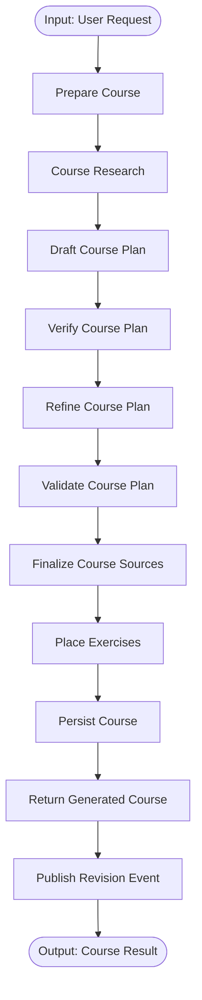
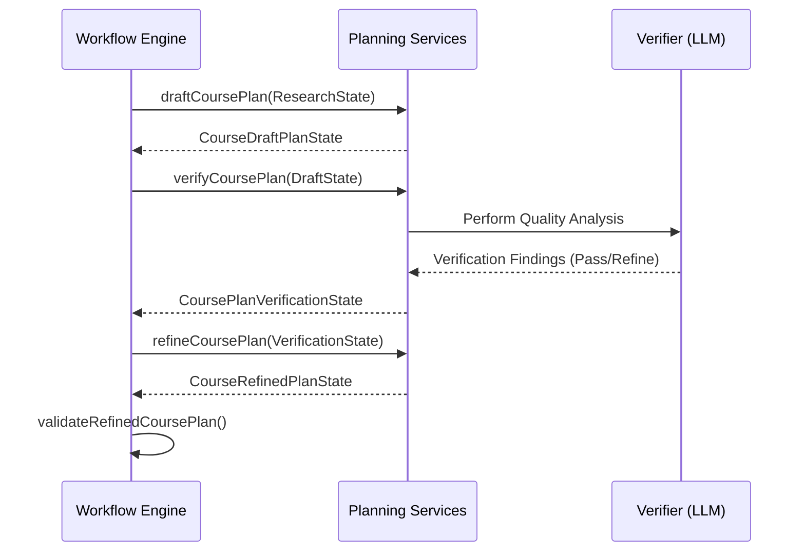

Relevant source files

The following files were used as context for generating this wiki page:

- [apps/backend/src/workflows/courseGenerationWorkflow.ts](../../../apps/backend/src/workflows/courseGenerationWorkflow.ts)
- [apps/backend/src/workflows/courseGenerationPlanning.ts](../../../apps/backend/src/workflows/courseGenerationPlanning.ts)
- [apps/backend/src/workflows/courseGenerationWorkflowContract.ts](../../../apps/backend/src/workflows/courseGenerationWorkflowContract.ts)
- [apps/backend/src/workflows/courseSourceFinalization.ts](../../../apps/backend/src/workflows/courseSourceFinalization.ts)
- [apps/backend/src/workflows/courseGenerationPreparation.ts](../../../apps/backend/src/workflows/courseGenerationPreparation.ts)
- [apps/backend/src/workflows/courseGenerationProduction.ts](../../../apps/backend/src/workflows/courseGenerationProduction.ts)
- [apps/backend/src/services/lessonGenerationPrompt.ts](../../../apps/backend/src/services/lessonGenerationPrompt.ts)
- [apps/backend/src/services/lessonGenerationVerification.ts](../../../apps/backend/src/services/lessonGenerationVerification.ts)
- [packages/shared-types/lessonInstructionPacks.ts](../../../packages/shared-types/lessonInstructionPacks.ts)
- [packages/shared-types/lessonWritingContract.ts](../../../packages/shared-types/lessonWritingContract.ts)

# Course Generation Workflow

The **Course Generation Workflow** is a multi-stage durable execution pipeline responsible for transforming raw educational requirements and source materials into a structured, pedagogical learning path. It handles everything from initial content research and syllabus planning to source mapping and persistent storage of the generated course.

This system is designed to be resilient, utilizing a step-based architecture that supports retries, idempotent commits, and semantic validation of AI-generated plans. It differentiates between various strategies such as `learn` mode (generating a path based on a topic) and `document` mode (generating a path based on specific uploaded PDF or archive sources).

Sources: [apps/backend/src/workflows/courseGenerationWorkflow.ts:69-95](../../../apps/backend/src/workflows/courseGenerationWorkflow.ts#L69-L95), [apps/backend/src/workflows/courseGenerationPreparation.ts:107-124](../../../apps/backend/src/workflows/courseGenerationPreparation.ts#L107-L124)

## Workflow Architecture and Lifecycle

The workflow is defined as a sequence of discrete nodes, including preparation, research, planning, finalization, and persistence. Each stage produces a specific state object validated by Zod schemas to ensure data integrity across durable execution boundaries.

### High-Level Execution Flow
The following diagram illustrates the standard "current" topology of the course generation process.

*This flowchart represents the linear progression of stages within the `course-generation` workflow.*
Sources: [apps/backend/src/workflows/courseGenerationWorkflow.ts:333-348](../../../apps/backend/src/workflows/courseGenerationWorkflow.ts#L333-L348)

### Workflow States
The workflow transitions through several defined states, each serving as the input for the subsequent step:

| State | Purpose | Schema Reference |
| :--- | :--- | :--- |
| **Preparation** | Analyzes project revision and determines strategy (`learn`, `archive`, `source-set`). | `CoursePreparationStateSchema` |
| **Research** | Aggregates web and YouTube research data for the given topic. | `CourseResearchStateSchema` |
| **Draft Plan** | Contains the initial AI-generated modules and lessons. | `CourseDraftPlanStateSchema` |
| **Verification** | Stores semantic quality findings (coverage, progression, fragmentation). | `CoursePlanVerificationStateSchema` |
| **Refined Plan** | The final plan after correcting structural quality issues. | `CourseRefinedPlanStateSchema` |
| **Persistence** | Contains fingerprints and IDs for the committed database records. | `CoursePersistenceStateSchema` |

Sources: [apps/backend/src/workflows/courseGenerationWorkflowContract.ts:251-365](../../../apps/backend/src/workflows/courseGenerationWorkflowContract.ts#L251-L365)

## Planning and Quality Verification

The planning stage is critical as it involves LLM-driven creation of the course structure. The system utilizes a "Refinement" loop to ensure the generated plan meets pedagogical standards.

### Refinement Loop Logic
1.  **Drafting**: The `draftCoursePlan` service generates a raw plan based on research and source materials.
2.  **Verification**: The `verifyCoursePlan` service evaluates the draft against dimensions like granularity, prerequisites, and module cohesion.
3.  **Refinement**: If the verdict is `refine`, the `refineCoursePlan` service attempts to fix the identified issues.
4.  **Final Validation**: The `validateRefinedCoursePlan` function ensures no structural quality findings remain before proceeding.

Refinement generation and verification are persisted as a paired provider-effect boundary. The initial refinement retains the legacy effect identities for in-flight replay compatibility. After a corrective failure, both identities derive from the durable attempt that produced the corrective feedback. Operational retries keep that identity and replay paid outputs, while a later corrective failure supplies a new identity and reaches fresh provider calls.

*The planning sequence incorporates an explicit verification and refinement step to ensure pedagogical quality.*
Sources: [apps/backend/src/workflows/courseGenerationPlanning.ts:396-476](../../../apps/backend/src/workflows/courseGenerationPlanning.ts#L396-L476), [apps/backend/src/workflows/courseGenerationArchivePlanning.ts:242-292](../../../apps/backend/src/workflows/courseGenerationArchivePlanning.ts#L242-L292), [apps/backend/src/workflows/courseGenerationWorkflowContract.ts:378-403](../../../apps/backend/src/workflows/courseGenerationWorkflowContract.ts#L378-L403)

### Quality Dimensions
The `CoursePlanVerificationSchema` tracks the following specific metrics:
*  **Coverage**: Feedback on whether the plan sufficiently covers the source material.
*  **Progression**: Ensures a coherent learning path from basics to advanced topics.
*  **Fragmentation**: Checks if modules are too small or disconnected.
*  **Prerequisites**: Validates that concepts are introduced in the correct order.

Sources: [apps/backend/src/workflows/courseGenerationWorkflowContract.ts:285-303](../../../apps/backend/src/workflows/courseGenerationWorkflowContract.ts#L285-L303)

## Source Finalization and Mapping

For courses based on documents (`document` mode), the workflow must map generated lessons back to specific chunks of the source material (e.g., PDF pages).

### Mapping Process
1.  **Index Building**: A document index is created from the source materials.
2.  **Batch Mapping**: Lessons are mapped to document chunks in parallel batches.
3.  **Repair Phase**: If some lessons fail to map during the "fast" phase, a repair phase targets specifically missing mappings.
4.  **Fallback**: If LLM mapping fails completely after retries, a deterministic fallback assigns chunks based on proportional distribution across the document.

Sources: [apps/backend/src/workflows/courseSourceFinalization.ts:291-368](../../../apps/backend/src/workflows/courseSourceFinalization.ts#L291-L368)

### Mapping Quality Metrics
The workflow records `mappingQuality` within the `CourseDocumentIndexSchema`, including:
*  **coverageRatio**: The percentage of substantive document pages covered by lessons.
*  **gapCount**: The number of significant gaps found in the mapping.
*  **mappingSource**: Indicates if the mapping is `mapped` (LLM-driven) or `fallback`.

Sources: [apps/backend/src/workflows/courseGenerationWorkflowContract.ts:213-228](../../../apps/backend/src/workflows/courseGenerationWorkflowContract.ts#L213-L228)

## Pedagogical Context and Prompting

Lesson writing uses explicit prompt layers rather than placing every pedagogical rule in the system message. `SYSTEM_INSTRUCTION_TEACHER` keeps the stable Professor Nous role, grounding rules and instruction/data boundary; `buildLessonGenerationReferenceContext()` carries lesson-specific context; `buildLessonGenerationPrompt()` adds the canonical writer contract and applicable specialist packs.

The final verification pass reuses the same reference context and the generated draft, but it does not embed the complete writer prompt again. Instead it combines the semantic checklist with focused shared invariants and structural checks, reducing duplicated instructions while retaining the rules that must hold before publication.

### Writing Rule Highlights
*  **Propedeutic Order**: Concepts must be explained using only previously introduced terms or definitions within the same local block; the verifier reuses the complete local propedeutic rule family rather than a hand-copied subset.
*  **Self-Sufficiency**: Lessons must work as standalone texts without requiring the student to have the source document open.
*  **Source Integrity**: Primary-source conventions take precedence over merely alternative research conventions, and meaningful structured comparisons remain structurally legible.
*  **Formula Relevance**: Mathematical formulas should only be used when natural to the subject; KaTeX delimiters, braces and active LaTeX environments must remain balanced.
*  **Active Pauses**: Inline quizzes should require discrimination, application, inference or synthesis rather than simple paraphrase.
*  **Visual Selection**: Original source images are preferred when they are clear and pedagogically equivalent; generated visuals and YouTube clips remain subject to their dedicated planning contracts.

### Focused lesson verification

The verifier requires one `verificationReport` entry with non-empty evidence for every semantic and structural check ID. Markdown/prose integrity, positive definitions, self-sufficiency, ASCII pseudo-visual rejection, code formatting, math formatting, active-pause quality and generated-visual planning are always available checks; checks that do not apply return `not-applicable` only where the contract explicitly allows it.

Image-reference verification is enabled when an image reference already exists or original image candidates are available. YouTube verification is enabled when a clip exists or a timestamped transcript is available. These source-driven checks let the verifier repair a relevant omission without authorizing media that the task cannot support. After the model returns, structural requirements are recomputed against the corrected draft so newly introduced source-dependent media cannot bypass its own validation.

Sources: [packages/shared-types/lessonWritingContract.ts](../../../packages/shared-types/lessonWritingContract.ts), [apps/backend/src/services/lessonGenerationPrompt.ts](../../../apps/backend/src/services/lessonGenerationPrompt.ts), [apps/backend/src/services/lessonGenerationVerification.ts](../../../apps/backend/src/services/lessonGenerationVerification.ts)

## Summary of Key Services

The workflow relies on a set of services defined in `CourseGenerationWorkflowServices`, typically implemented in `courseGenerationProduction.ts`.

| Service | Description |
| :--- | :--- |
| `prepareCourse` | Loads project snapshots and determines strategy. |
| `draftCoursePlan` | Orchestrates LLM prompt for initial syllabus generation. |
| `verifyCoursePlan` | Performs semantic analysis on the generated structure. |
| `persistCourse` | Atomic database commit of modules, lessons, and exercises. |
| `undoCourse` | Idempotent cleanup in case of workflow failure during persistence. |

Sources: [apps/backend/src/workflows/courseGenerationWorkflow.ts:70-95](../../../apps/backend/src/workflows/courseGenerationWorkflow.ts#L70-L95), [apps/backend/src/workflows/courseGenerationProduction.ts:58-90](../../../apps/backend/src/workflows/courseGenerationProduction.ts#L58-L90)
