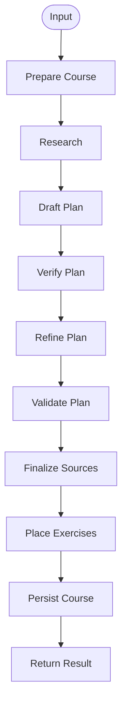

Relevant source files

- [apps/backend/src/workflows/courseGenerationWorkflow.ts](../../../apps/backend/src/workflows/courseGenerationWorkflow.ts)
- [apps/backend/src/workflows/courseGenerationPlanning.ts](../../../apps/backend/src/workflows/courseGenerationPlanning.ts)
- [apps/backend/src/workflows/courseGenerationWorkflowContract.ts](../../../apps/backend/src/workflows/courseGenerationWorkflowContract.ts)
- [apps/backend/src/workflows/courseSourceFinalization.ts](../../../apps/backend/src/workflows/courseSourceFinalization.ts)
- [apps/backend/src/workflows/courseGenerationPreparation.ts](../../../apps/backend/src/workflows/courseGenerationPreparation.ts)
- [apps/backend/src/workflows/courseGenerationProduction.ts](../../../apps/backend/src/workflows/courseGenerationProduction.ts)
- [apps/backend/src/services/lessonGenerationPrompt.ts](../../../apps/backend/src/services/lessonGenerationPrompt.ts)
- [apps/backend/src/services/lessonGenerationVerification.ts](../../../apps/backend/src/services/lessonGenerationVerification.ts)
- [packages/shared-types/lessonWritingContract.ts](../../../packages/shared-types/lessonWritingContract.ts)

# Course Generation Workflow

The **Course Generation Workflow** is the durable pipeline that transforms educational requirements and source material into a structured learning path. It separates course-level planning and source mapping from the later generation of individual lessons.

The workflow supports retries, idempotent persistence and semantic validation. It can build a course from a topic or from retained source material such as PDFs and source archives.

## High-level lifecycle

Each stage produces a schema-validated state so durable retries do not depend on implicit in-memory context.

## Planning and quality verification

Planning uses an explicit draft → verify → refine sequence. The verifier checks dimensions such as coverage, prerequisite order, fragmentation and module cohesion. Refinement corrects the reported findings before final validation.

Provider-effect boundaries persist paid planning outputs so operational retries can replay completed work rather than repeating model calls. Corrective attempts receive new durable identities only when new feedback requires a fresh provider call.

## Source finalization and mapping

For document-backed courses, generated lessons are mapped back to source chunks. The mapping process can combine batch LLM mapping, targeted repair and deterministic fallback. Mapping quality records coverage and gaps rather than assuming that every source byte must become a lesson.

The objective is pedagogical coverage: the course should preserve the important structure and detail needed for the requested learning path, while still being a usable linear course rather than a complete documentation dump of every source artifact.

## Lesson generation prompt architecture

Course planning and lesson writing are separate concerns. When an individual lesson is generated, the lesson service now uses a layered prompt architecture:

1. `SYSTEM_INSTRUCTION_TEACHER` contains only the stable Professor Nous role and highest-level grounding/priority invariants.
2. `buildLessonGenerationReferenceContext()` contains the reusable lesson data: student notes, pedagogical context, source material, research and media references.
3. `buildLessonGenerationPrompt()` adds the detailed canonical writer contract, including shared writing rules, scope, progression, active pauses and applicable media constraints.
4. `buildLessonVerificationPrompt()` reuses the reference context and the generated draft, but **does not receive the complete writer prompt again**. It receives the mandatory semantic checklist, lesson scope rules and only structural checks that apply to features actually present in the draft.

This separation reduces duplicated instructions while keeping lesson behavior explicit. Student personalization notes remain executable task instructions; instructions encountered inside untrusted source material remain data.

### Writing rule highlights

- **Propedeutic order:** a lesson should require only concepts already introduced or explained locally.
- **Conceptual bridges:** new abstractions should have a concise reason for appearing where they do.
- **Scope discipline:** future lessons may be named when useful but not prematurely taught in detail.
- **Self-sufficiency:** the generated lesson must work without the original document open beside it.
- **Formula relevance:** mathematical notation is used only when it adds real precision.
- **Active pauses:** questions should require discrimination, application, inference or synthesis rather than copying a nearby definition.
- **Visual integrity:** ASCII pseudo-visuals are rejected in favor of dedicated visual renderers.

## Verification of individual lessons

The verifier returns a required report item for every semantic checklist entry. Each item includes status, evidence and action; code rejects a report that omits required check IDs.

Structural rules are feature-scoped from the actual draft. Selectable image candidates do not trigger image-reference validation unless `imageRefs` are present, and a specialist code pack alone does not imply that the draft contains a code block. The complete draft is still reviewed semantically, but its JSON is compactly serialized to avoid unnecessary prompt tokens.

## Evaluation requirement

Prompt-composition tests protect the architectural separation and feature gating, but they are not substitutes for model evals. Changes to the lesson prompt stack should still be tested with representative generated lessons before merge, including known failure cases such as tautological quizzes, missing conceptual bridges, repetition, unsupported assumptions and scope drift. Token usage and latency should be compared alongside quality when simplifying the prompt.
