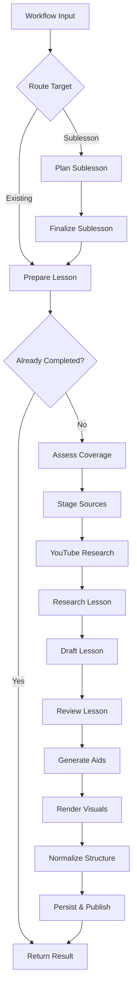
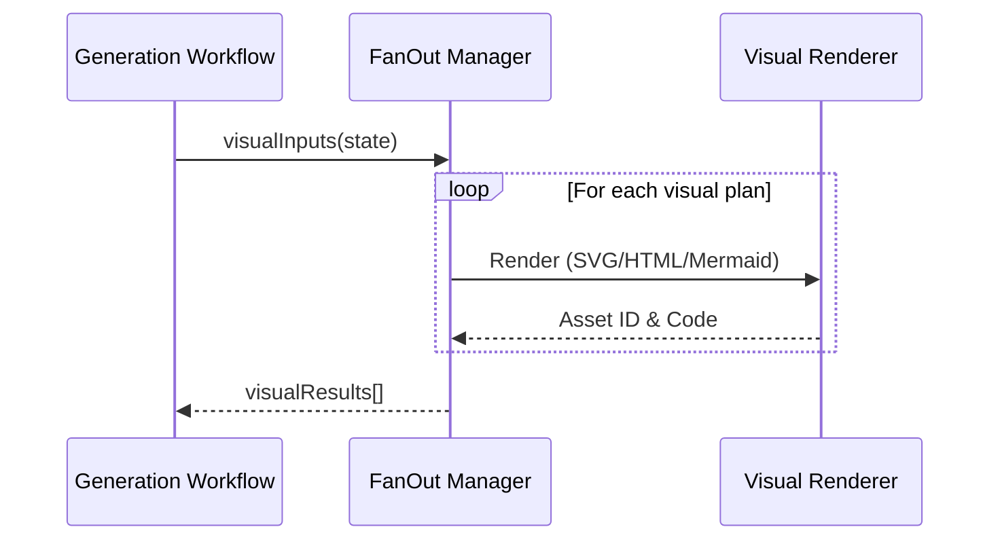

Relevant source files

The following files were used as context for generating this wiki page:

- [apps/backend/src/workflows/lessonGenerationWorkflow.ts](../../../apps/backend/src/workflows/lessonGenerationWorkflow.ts)
- [apps/backend/src/services/lessonGenerationPrompt.ts](../../../apps/backend/src/services/lessonGenerationPrompt.ts)
- [packages/shared-types/lessonWritingContract.ts](../../../packages/shared-types/lessonWritingContract.ts)
- [apps/backend/src/workflows/lessonGenerationStageServices.ts](../../../apps/backend/src/workflows/lessonGenerationStageServices.ts)
- [apps/backend/src/services/lessonGenerationModel.ts](../../../apps/backend/src/services/lessonGenerationModel.ts)
- [apps/backend/src/workflows/lessonGenerationWorkflowSchemas.ts](../../../apps/backend/src/workflows/lessonGenerationWorkflowSchemas.ts)
- [apps/backend/src/services/lessonGenerationNormalization.ts](../../../apps/backend/src/services/lessonGenerationNormalization.ts)

# Lesson Generation Pipeline

The **Lesson Generation Pipeline** is a complex, multi-stage workflow designed to transform raw source materials, research data, and pedagogical requirements into structured, high-quality educational content. Orchestrated by the `lesson-generation` workflow, it integrates Large Language Models (LLMs), research tools, and visual rendering engines to produce autonomous lessons enriched with markdown, active pauses (quizzes), YouTube clips, and generated visuals.

The pipeline ensures pedagogical rigor by adhering to strict propedeutic rules, continuity constraints, and informational density requirements. It supports both the generation of new core lessons and "deep-dive" sublessons based on specific user focus areas.
Sources: [apps/backend/src/workflows/lessonGenerationWorkflow.ts:639-655](../../../apps/backend/src/workflows/lessonGenerationWorkflow.ts#L639-L655), [packages/shared-types/lessonWritingContract.ts:47-75](../../../packages/shared-types/lessonWritingContract.ts#L47-L75)

## Pipeline Architecture

The pipeline is implemented as a durable sequence of steps, utilizing a state machine pattern to handle long-running operations, retries, and idempotency.

This diagram illustrates the high-level progression from initial request to the final publication of a lesson revision.
Sources: [apps/backend/src/workflows/lessonGenerationWorkflow.ts:607-655](../../../apps/backend/src/workflows/lessonGenerationWorkflow.ts#L607-L655)

### 1. Preparation and Sublesson Planning
The pipeline begins by determining if the request is for an existing lesson or a new sublesson. Sublessons are planned using a dedicated stage that creates metadata and source associations before feeding back into the main generation path.
*  **Key Function:** `planSublesson` defines the deep-dive context.
*  **Key Function:** `prepareLesson` loads the project snapshot and determines if a previous generation exists.
Sources: [apps/backend/src/workflows/lessonGenerationWorkflow.ts:153-228](../../../apps/backend/src/workflows/lessonGenerationWorkflow.ts#L153-L228), [apps/backend/src/workflows/lessonGenerationStageServices.ts:139-215](../../../apps/backend/src/workflows/lessonGenerationStageServices.ts#L139-L215)

### 2. Research and Source Staging
The system assesses the primary source material for coverage gaps. If the lesson is a "prerequisite" type, it identifies missing topics that require external research.
*  **YouTube Research:** A branching path that plans specific and fallback queries to find timestamped transcripts.
*  **Research Dossier:** The `generateResearchSummary` service creates a dense factual dossier, including controversies and recent developments, which serves as the "source of truth" for the LLM during drafting.
Sources: [apps/backend/src/workflows/lessonGenerationWorkflow.ts:258-360](../../../apps/backend/src/workflows/lessonGenerationWorkflow.ts#L258-L360), [apps/backend/src/services/lessonGenerationModel.ts:311-336](../../../apps/backend/src/services/lessonGenerationModel.ts#L311-L336)

### 3. Content Drafting and Review
The `draftLesson` stage uses the `Professor Nous` system prompt to generate the lesson body. This process is governed by a complex writing contract.

| Rule Category | Description |
| :--- | :--- |
| **Continuity** | Prevents repetition of concepts from `previousLessonTitles`. |
| **Formatting** | Enforces standard Markdown and KaTeX for mathematical formulas. |
| **Active Pauses** | Injects 0-3 inline quizzes that require higher-order thinking (classification, sequence, etc.). |
| **Visual Planning** | Identifies specific points where a `generated-visual` or `youtube-clips` block improves understanding. |

Sources: [apps/backend/src/services/lessonGenerationPrompt.ts:38-99](../../../apps/backend/src/services/lessonGenerationPrompt.ts#L38-L99), [packages/shared-types/lessonWritingContract.ts:21-45](../../../packages/shared-types/lessonWritingContract.ts#L21-L45)

## Technical Implementation Details

### Writing Contract and Pedagogy
The pipeline enforces a "Propedeutic Order," meaning every technical term or symbol must be explained in common words immediately upon introduction. When a new concept, question, technique, or abstraction appears, the writer must also make its motivation from the preceding reasoning explicit: state the learner-facing question, problem, limit, or need it addresses, or move the concept after that rationale. The reviewer applies the same rule and corrects or requests a bridge when the transition is only implicit, even if the new content is factually correct. The system prompt explicitly forbids ASCII art or meta-discourse (e.g., "In this section, we will see...").
Sources: [packages/shared-types/lessonWritingContract.ts:4-21](../../../packages/shared-types/lessonWritingContract.ts#L4-L21), [apps/backend/src/services/lessonGenerationPrompt.ts:65-75](../../../apps/backend/src/services/lessonGenerationPrompt.ts#L65-L75)

### Visual Rendering Fan-Out
The rendering of visuals is handled as a `fanOut` operation, allowing multiple visual plans to be processed in parallel.

This sequence ensures that a failure in one visual does not terminate the entire lesson generation; failed visuals are flagged for retry in the normalized structure.
Sources: [apps/backend/src/workflows/lessonGenerationWorkflow.ts:503-524](../../../apps/backend/src/workflows/lessonGenerationWorkflow.ts#L503-L524), [apps/backend/src/services/lessonGenerationNormalization.ts:98-124](../../../apps/backend/src/services/lessonGenerationNormalization.ts#L98-L124)

### Normalization and Sanitization
The `normalizeLessonStructure` function performs critical cleanup:
1.  **Markdown Sanitization:** Replaces internal `assetId` strings with user-friendly labels (e.g., "Figure 1") and removes unauthorized embedded image tags.
2.  **Quiz Validation:** Ensures quizzes are placed after explanatory markdown and do not exceed the `MAX_LESSON_QUIZ_QUESTIONS` limit.
3.  **Visual Mapping:** Associates successfully rendered visuals with their respective `slotId` in the content blocks.
Sources: [apps/backend/src/services/lessonGenerationNormalization.ts:34-47](../../../apps/backend/src/services/lessonGenerationNormalization.ts#L34-L47), [apps/backend/src/services/lessonGenerationNormalization.ts:145-188](../../../apps/backend/src/services/lessonGenerationNormalization.ts#L145-L188)

### Workflow Schemas
The pipeline relies on Zod schemas to ensure contract safety between stages.
*  **`LessonContentDraftSchema`**: Validates the structure of the LLM output, including `contentBlocks` and `generatedVisuals`.
*  **`LessonResearchDossierSchema`**: Ensures the research dossier contains factual summaries and YouTube candidate decisions.
*  **`LessonResultBlockSchema`**: A union type that defines valid output blocks (Markdown, Quiz, Clips, or Visuals).
Sources: [apps/backend/src/workflows/lessonGenerationWorkflowSchemas.ts:167-171](../../../apps/backend/src/workflows/lessonGenerationWorkflowSchemas.ts#L167-L171), [apps/backend/src/workflows/lessonGenerationWorkflowSchemas.ts:200-206](../../../apps/backend/src/workflows/lessonGenerationWorkflowSchemas.ts#L200-L206)

## Conclusion
The Lesson Generation Pipeline represents a sophisticated orchestration of AI services and deterministic post-processing. By separating research, drafting, and visual rendering into distinct, schema-validated stages, the system maintains high pedagogical standards while providing a resilient and extensible framework for automated education.
Sources: [apps/backend/src/workflows/lessonGenerationWorkflow.ts:639-655](../../../apps/backend/src/workflows/lessonGenerationWorkflow.ts#L639-L655), [apps/backend/src/services/lessonGenerationNormalization.ts:218-228](../../../apps/backend/src/services/lessonGenerationNormalization.ts#L218-L228)
