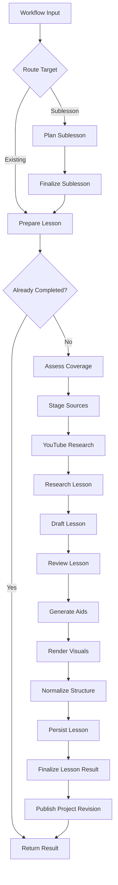
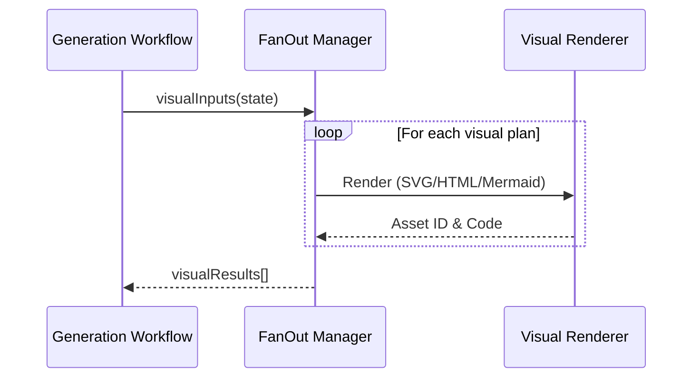

Relevant source files

The following files were used as context for generating this wiki page:

- [apps/backend/src/workflows/lessonGenerationWorkflow.ts](../../../apps/backend/src/workflows/lessonGenerationWorkflow.ts)
- [apps/backend/src/services/lessonGenerationPrompt.ts](../../../apps/backend/src/services/lessonGenerationPrompt.ts)
- [packages/shared-types/lessonWritingContract.ts](../../../packages/shared-types/lessonWritingContract.ts)
- [packages/shared-types/lessonInstructionPacks.ts](../../../packages/shared-types/lessonInstructionPacks.ts)
- [packages/shared-types/lessonGenerationPolicy.ts](../../../packages/shared-types/lessonGenerationPolicy.ts)
- [apps/backend/src/services/lessonGenerationCorrection.ts](../../../apps/backend/src/services/lessonGenerationCorrection.ts)
- [apps/backend/src/workflows/lessonGenerationStageServices.ts](../../../apps/backend/src/workflows/lessonGenerationStageServices.ts)
- [apps/backend/src/services/lessonGenerationModel.ts](../../../apps/backend/src/services/lessonGenerationModel.ts)
- [apps/backend/src/workflows/lessonGenerationWorkflowSchemas.ts](../../../apps/backend/src/workflows/lessonGenerationWorkflowSchemas.ts)
- [apps/backend/src/services/lessonGenerationNormalization.ts](../../../apps/backend/src/services/lessonGenerationNormalization.ts)
- [apps/web/components/shared/GenerationProgress.tsx](../../../apps/web/components/shared/GenerationProgress.tsx)
- [apps/backend/src/workflows/lessonGenerationDocumentStage.ts](../../../apps/backend/src/workflows/lessonGenerationDocumentStage.ts)
- [apps/backend/src/services/lessonGenerationSources.ts](../../../apps/backend/src/services/lessonGenerationSources.ts)

# Lesson Generation Pipeline

The **Lesson Generation Pipeline** is a complex, multi-stage workflow designed to transform raw source materials, research data, and pedagogical requirements into structured, high-quality educational content. Orchestrated by the `lesson-generation` workflow, it integrates Large Language Models (LLMs), research tools, and visual rendering engines to produce autonomous lessons enriched with markdown, active pauses (quizzes), YouTube clips, and generated visuals.

The pipeline ensures pedagogical rigor by adhering to strict propedeutic rules, continuity constraints, and informational density requirements. It supports both the generation of new core lessons and "deep-dive" sublessons based on specific user focus areas.
Sources: [apps/backend/src/workflows/lessonGenerationWorkflow.ts](../../../apps/backend/src/workflows/lessonGenerationWorkflow.ts), [packages/shared-types/lessonWritingContract.ts](../../../packages/shared-types/lessonWritingContract.ts)

## Pipeline Architecture

The pipeline is implemented as a durable sequence of steps, utilizing a state machine pattern to handle long-running operations, retries, and idempotency.

This diagram illustrates the high-level progression from initial request to the final publication of a lesson revision.
Sources: [apps/backend/src/workflows/lessonGenerationWorkflow.ts](../../../apps/backend/src/workflows/lessonGenerationWorkflow.ts)

### 1. Preparation and Sublesson Planning
The pipeline begins by determining if the request is for an existing lesson or a new sublesson. Sublessons are planned using a dedicated stage that creates metadata and source associations before feeding back into the main generation path.
* **Key Function:** `planSublesson` defines the deep-dive context.
* **Key Function:** `prepareLesson` loads the project snapshot and determines if a previous generation exists.
Sources: [apps/backend/src/workflows/lessonGenerationWorkflow.ts](../../../apps/backend/src/workflows/lessonGenerationWorkflow.ts), [apps/backend/src/workflows/lessonGenerationStageServices.ts](../../../apps/backend/src/workflows/lessonGenerationStageServices.ts)

### 2. Research and Source Staging
The system assesses the primary source material for coverage gaps. If the lesson is a "prerequisite" type, it identifies missing topics that require external research.
* **YouTube Research:** A branching path that plans specific and fallback queries to find timestamped transcripts.
* **Research Dossier:** The `generateResearchSummary` service creates a dense factual dossier, including controversies and recent developments, which serves as factual support for drafting.
Sources: [apps/backend/src/workflows/lessonGenerationWorkflow.ts](../../../apps/backend/src/workflows/lessonGenerationWorkflow.ts), [apps/backend/src/services/lessonGenerationModel.ts](../../../apps/backend/src/services/lessonGenerationModel.ts)

For stored PDFs, `stage-document-sources` keeps extracted data URLs local to one provider effect operation. It stages every selected image in project asset storage before starting optional captions, then returns only `ProjectAssetRef` values and textual metadata. A storage failure therefore cannot leave paid caption calls inside an unrecorded effect. The provider effect records the durable result under a payload-versioned key. Retries after that point reuse extraction, assets, and captions; failures before persistence rerun the idempotent operation and cannot replay the old data-URL payload as durable metadata. Image metadata identity includes the source ID, source content hash, and image hash. The single-source storage fallback uses the same authoritative ID reader as extraction. It prefers `source.ref.id` and supports legacy snapshots that only retain `source.file.sourceId`; it never derives identity from the filename. A fresh extraction replaces stored placement, nearby text, and captions even when the source version and image bytes are unchanged. This covers repeated figures selected from different pages in different lessons. Metadata from older source versions is excluded when the new PDF changes or removes an image. Named associations outside the snapshot's current source IDs are excluded too, which removes records produced by the old filename fallback. Anonymous records remain eligible only while the snapshot declares no source IDs. Once source authority exists, fresh extraction reconstructs current metadata and removed anonymous images stay removed. When a current source hash is available, the stage refreshes durable records created before image metadata carried that hash. Fresh versioned extraction also replaces anonymous legacy metadata for the same bytes, which prevents duplicate captions and stale records. Binary reuse stays separate and uses the byte hash plus MIME type. Caption batches run one document source at a time. Sources: [apps/backend/src/workflows/lessonGenerationDocumentStage.ts](../../../apps/backend/src/workflows/lessonGenerationDocumentStage.ts), [apps/backend/src/services/lessonGenerationSources.ts](../../../apps/backend/src/services/lessonGenerationSources.ts)

### 3. Content Drafting and Review
The `draftLesson` stage uses the `Professor Nous` system prompt to generate the lesson body. The writer and focused verifier share canonical pedagogical contracts without sending the complete generation prompt through verification a second time.

| Rule Category | Description |
| :--- | :--- |
| **Continuity** | Prevents repetition of concepts from `previousLessonTitles`. |
| **Propedeutic order** | Requires prerequisites and first concept exposures to be understandable before later abstractions, contrasts or negations depend on them. |
| **Formatting** | Enforces standard Markdown and KaTeX for mathematical formulas. |
| **Active Pauses** | Injects 0-3 inline quizzes that require higher-order thinking (classification, sequence, etc.). |
| **Visual Planning** | Identifies specific points where a `generated-visual` or `youtube-clips` block improves understanding. An active `visual-learning` pack is itself an explicit requirement for a necessary visual representation: source media are preferred when adequate, otherwise the verifier may restore the minimum generated visual needed. |

Sources: [apps/backend/src/services/lessonGenerationPrompt.ts](../../../apps/backend/src/services/lessonGenerationPrompt.ts), [packages/shared-types/lessonWritingContract.ts](../../../packages/shared-types/lessonWritingContract.ts), [packages/shared-types/lessonInstructionPacks.ts](../../../packages/shared-types/lessonInstructionPacks.ts), [packages/shared-types/lessonGenerationPolicy.ts](../../../packages/shared-types/lessonGenerationPolicy.ts)

### Corrective Retry Lifecycle

Model-backed lesson stages distinguish **corrective** failures from **operational** failures. Coverage assessment, research, drafting and final lesson review all consume durable `retryFeedback` when a known output-contract or deterministic validation problem caused the previous attempt to be rejected. The feedback is injected into the next request so the model repairs the identified defect instead of receiving the same prompt again.

Examples of corrective failures include malformed structured output, incomplete YouTube candidate classification, an incomplete verifier report, an unauthorized structural feature introduced during verification, invalid inline-quiz placement and unbalanced LaTeX environments. Each uses a stable developer-authored failure code and safe corrective instruction. The workflow persists that structured failure on the attempt and supplies its feedback to the next claim.

Provider/network failures remain operational. Their diagnostics stay bounded and sanitized rather than persisting arbitrary provider exception text. This gives support tooling a concrete reason for deterministic model-contract retries without weakening the error-redaction boundary.

Recoverable retries are also neutral in the learner-facing generation UI: while the workflow is automatically retrying, the progress surface reports another attempt in progress rather than presenting a temporary internal rejection as a user-visible failure. Terminal workflow failure remains handled by the normal error surface.

Sources: [apps/backend/src/workflows/lessonGenerationStageServices.ts](../../../apps/backend/src/workflows/lessonGenerationStageServices.ts), [apps/backend/src/workflows/retryPolicy.ts](../../../apps/backend/src/workflows/retryPolicy.ts), [apps/backend/src/workflows/postgresWorkflowStepStore.ts](../../../apps/backend/src/workflows/postgresWorkflowStepStore.ts), [apps/web/components/shared/GenerationProgress.tsx](../../../apps/web/components/shared/GenerationProgress.tsx)

## Technical Implementation Details

### Writing Contract and Pedagogy
The pipeline enforces a "Propedeutic Order," meaning every technical term or symbol must be explained in common words immediately upon introduction. When a new concept, question, technique, or abstraction follows the prior reasoning, drafting and review require a concise conceptual bridge that explains why it belongs there; a missing bridge must be corrected even when the content is factually correct, while already explicit links must not receive ritual boilerplate.

The first-exposure contract is stricter than a later positive definition: a concept cannot first appear as an unexplained metaphor, negative heading or contrastive label and only be defined afterward. Its first meaningful heading/lead/label exposure must establish enough positive meaning for the reader to understand what is being discussed. The system also forbids ASCII pseudo-visuals and unnecessary metadiscourse.
Sources: [packages/shared-types/lessonWritingContract.ts](../../../packages/shared-types/lessonWritingContract.ts), [packages/shared-types/lessonInstructionPacks.ts](../../../packages/shared-types/lessonInstructionPacks.ts), [packages/shared-types/lessonGenerationPolicy.ts](../../../packages/shared-types/lessonGenerationPolicy.ts), [apps/backend/src/services/lessonGenerationPrompt.ts](../../../apps/backend/src/services/lessonGenerationPrompt.ts)

### Visual Rendering Fan-Out
The rendering of visuals is handled as a `fanOut` operation, allowing multiple visual plans to be processed in parallel.

This sequence ensures that a failure in one visual does not terminate the entire lesson generation; failed visuals are flagged for retry in the normalized structure. Visual planning/render review already uses the same corrective-retry pattern for deterministic model-output defects.
Sources: [apps/backend/src/workflows/lessonGenerationWorkflow.ts](../../../apps/backend/src/workflows/lessonGenerationWorkflow.ts), [apps/backend/src/workflows/lessonVisualWorkflow.ts](../../../apps/backend/src/workflows/lessonVisualWorkflow.ts), [apps/backend/src/services/lessonGenerationNormalization.ts](../../../apps/backend/src/services/lessonGenerationNormalization.ts)

### Normalization and Sanitization
The `normalizeLessonStructure` function performs critical cleanup:
1. **Markdown Sanitization:** Replaces internal `assetId` strings with user-friendly labels (e.g., "Figure 1") and removes unauthorized embedded image tags.
2. **Quiz Validation:** Ensures quizzes are placed after explanatory markdown and do not exceed the `MAX_LESSON_QUIZ_QUESTIONS` limit.
3. **Visual Mapping:** Associates successfully rendered visuals with their respective `slotId` in the content blocks.
Sources: [apps/backend/src/services/lessonGenerationNormalization.ts](../../../apps/backend/src/services/lessonGenerationNormalization.ts)

### Workflow Schemas
The pipeline relies on Zod schemas to ensure contract safety between stages.
* **`LessonContentDraftSchema`**: Validates the structure of the LLM output, including `contentBlocks` and `generatedVisuals`.
* **`LessonResearchDossierSchema`**: Ensures the research dossier contains factual summaries and YouTube candidate decisions.
* **`LessonResultBlockSchema`**: A union type that defines valid output blocks (Markdown, Quiz, Clips, or Visuals).
Sources: [apps/backend/src/workflows/lessonGenerationWorkflowSchemas.ts](../../../apps/backend/src/workflows/lessonGenerationWorkflowSchemas.ts)

## Conclusion
The Lesson Generation Pipeline separates research, drafting, verification, optional aids, rendering, normalization and persistence into durable schema-validated stages. Known model-contract failures carry explicit corrective feedback into the next attempt, while transient operational failures retain the workflow engine's safe retry and diagnostic behavior. This keeps the pipeline resilient without turning deterministic validation failures into blind repeated model calls.
Sources: [apps/backend/src/workflows/lessonGenerationWorkflow.ts](../../../apps/backend/src/workflows/lessonGenerationWorkflow.ts), [apps/backend/src/workflows/lessonGenerationStageServices.ts](../../../apps/backend/src/workflows/lessonGenerationStageServices.ts)
