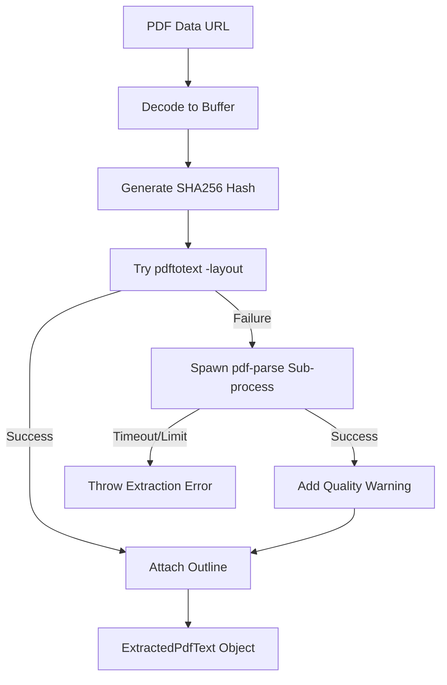
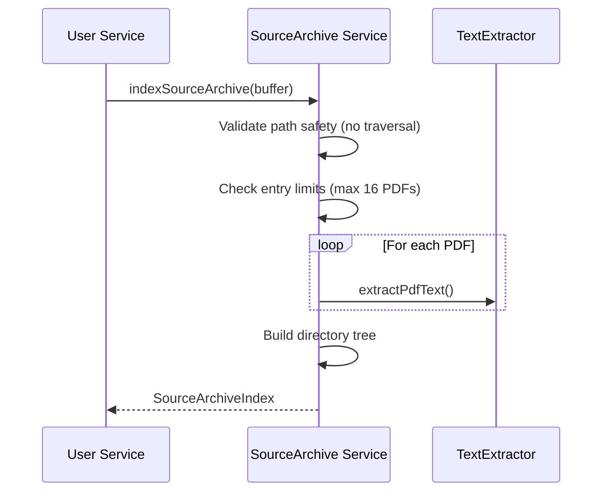

<details>
<summary>Relevant source files</summary>

The following files were used as context for generating this wiki page:

- [apps/backend/src/services/pdfTextExtractor.ts](../../../apps/backend/src/services/pdfTextExtractor.ts)
- [apps/backend/src/services/pdfImageExtractor.ts](../../../apps/backend/src/services/pdfImageExtractor.ts)
- [packages/shared-types/pdfTextIndex.ts](../../../packages/shared-types/pdfTextIndex.ts)
- [apps/backend/src/services/lessonGenerationSources.ts](../../../apps/backend/src/services/lessonGenerationSources.ts)
- [apps/web/services/projects/courseSources.ts](../../../apps/web/services/projects/courseSources.ts)
- [apps/backend/src/projects/postgresProjectStore.ts](../../../apps/backend/src/projects/postgresProjectStore.ts) (Referenced via tests)
- [apps/backend/src/projects/sourceArchive.ts](../../../apps/backend/src/projects/sourceArchive.ts) (Referenced via tests)

</details>

# Document Processing & PDF Extraction

Document Processing and PDF Extraction within the Nous platform is a multi-layered system designed to transform raw file uploads (PDFs, Markdown, and ZIP archives) into structured, queryable data for AI-driven lesson generation. The system handles text extraction, image recovery, and hierarchical indexing to ensure that pedagogical content remains grounded in the original source material.

The pipeline emphasizes resilience through a multi-parser fallback strategy for PDFs, ensuring that even complex layouts can be converted into usable text. This processed data is then segmented into semantic chunks and indexed by page number and heading path, allowing for precise citations within the generated lessons.

## Text Extraction Pipeline

The core of the document processing system is the `extractPdfText` function, which utilizes a primary high-fidelity parser with a robust fallback mechanism.

### Multi-Stage Parsing
1.  **pdftotext**: The primary parser. It is invoked via a sub-process with `-layout` flags to preserve the original visual structure, which is critical for table and column detection.
2.  **pdf-parse**: A secondary fallback parser utilized if `pdftotext` is missing from the environment or fails to produce output.
3.  **Fallback Process**: For memory safety and isolation, `pdf-parse` is often run in a dedicated Node.js sub-process (`pdfTextFallbackProcess.mjs`) with strict memory limits (`--max-old-space-size`).

Sources: [apps/backend/src/services/pdfTextExtractor.ts:326-373](../../../apps/backend/src/services/pdfTextExtractor.ts#L326-L373), [apps/backend/src/services/pdfTextExtractor.ts:149-198](../../../apps/backend/src/services/pdfTextExtractor.ts#L149-L198)



The diagram shows the decision flow between high-fidelity layout preservation and isolated fallback extraction. 
Sources: [apps/backend/src/services/pdfTextExtractor.ts:375-395](../../../apps/backend/src/services/pdfTextExtractor.ts#L375-L395)

### Extraction Specifications

| Parameter | Default / Limit | Description |
| :--- | :--- | :--- |
| `maxOutputBytes` | Variable | Caps the total text volume to prevent heap exhaustion. |
| `pdftotextTimeoutMs` | 15,000ms (Archive) | Max time allowed for the primary OS-level parser. |
| `fallbackTimeoutMs` | 15,000ms (Archive) | Max time for the isolated Node.js fallback process. |
| `max-old-space-size` | ~272MB (Typical) | Memory limit for the fallback sub-process. |

Sources: [apps/backend/tests/projects/sourceArchive.test.ts:114-120](../../../apps/backend/tests/projects/sourceArchive.test.ts#L114-L120), [apps/backend/tests/services/pdfTextExtractor.test.ts:86-90](../../../apps/backend/tests/services/pdfTextExtractor.test.ts#L86-L90)

## Image Extraction & Contextualization

Beyond text, the system extracts standalone figures and images from PDFs using `pdfjs-dist`. Unlike simple extraction, this module attempts to reconstruct the semantic context surrounding each image.

### Filtering Logic
To avoid extracting incidental UI elements (icons, watermarks, or lines), the system applies strict thresholds based on both rendered and intrinsic dimensions.
*  **Standalone Figures**: Requires a minimum area (e.g., 24,000 intrinsic pixels) or specific side length ratios.
*  **Inline Images**: Higher area requirements to distinguish between decorative icons and substantive diagrams.

Sources: [apps/backend/src/services/pdfImageExtractor.ts:7-22](../../../apps/backend/src/services/pdfImageExtractor.ts#L7-L22), [apps/backend/src/services/pdfImageExtractor.ts:219-257](../../../apps/backend/src/services/pdfImageExtractor.ts#L219-L257)

### Spatial Context Reconstruction
The `buildLocalImageTextContext` function analyzes the `centerY` coordinates of text lines relative to the bounding box of the extracted image.
*  **textBefore**: The last 5 lines appearing above the image.
*  **textCurrent**: Lines overlapping the vertical span of the image.
*  **textAfter**: The first 5 lines appearing below the image.

Sources: [apps/backend/src/services/pdfImageExtractor.ts:98-120](../../../apps/backend/src/services/pdfImageExtractor.ts#L98-L120)

## Content Indexing and Segmentation

Once text is extracted, it is transformed into a `PdfTextIndex`. This structure is the basis for AI retrieval and user-facing citations.

### Chunking Strategy
Text is not stored as a single block but divided into `PdfTextChunk` objects.
*  **Target Size**: Chunks target approximately 8,000 characters (on web) or smaller semantic segments defined by headings.
*  **Heading Inference**: The system detects headings using regex patterns (e.g., `1.1 Concetti`) or visual cues (high ratio of uppercase/title-case characters).
*  **Overlapping**: Paragraphs are preserved, and chunks may include overlapping context to maintain flow.

Sources: [packages/shared-types/pdfTextIndex.ts:36-65](../../../packages/shared-types/pdfTextIndex.ts#L36-L65), [apps/web/services/projects/courseSources.ts:6-7](../../../apps/web/services/projects/courseSources.ts#L6-L7)

### Page Mapping
For PDF sources, every chunk is mapped to a physical page range. If exact layout data is missing, the system uses a progress-based estimation:
`startPage = floor(startOffset / totalChars * pageCount) + 1`

Sources: [packages/shared-types/pdfTextIndex.ts:118-136](../../../packages/shared-types/pdfTextIndex.ts#L118-L136)

## Source Archive Preparation

For `codebase` projects, the system processes ZIP archives. This involves a high-intensity "Admission" phase to prevent server overload.



The sequence illustrates the validation and selective extraction of PDF content hidden within source code archives.
Sources: [apps/backend/tests/projects/sourceArchive.test.ts:96-150](../../../apps/backend/tests/projects/sourceArchive.test.ts#L96-L150), [apps/backend/tests/projects/sourceArchive.test.ts:373-388](../../../apps/backend/tests/projects/sourceArchive.test.ts#L373-L388)

### Safety Constraints
*  **Path Validation**: Rejects traversal attacks (`../`), absolute paths, or duplicate entries.
*  **Safety Limits**: Caps PDF processing to the first 16 eligible files or a cumulative 64MB budget per archive to prevent DoS.
*  **Lexicographic Stability**: Archives are processed and indexed in a stable alphabetical order to ensure deterministic IDs.

Sources: [apps/backend/tests/projects/sourceArchive.test.ts:241-260](../../../apps/backend/tests/projects/sourceArchive.test.ts#L241-L260), [apps/backend/tests/projects/sourceArchive.test.ts:291-305](../../../apps/backend/tests/projects/sourceArchive.test.ts#L291-L305)

## Data Structures

### ExtractedPdfText
The primary result of a successful extraction.

```typescript
interface ExtractedPdfText {
  text: string;
  pages: ExtractedPdfTextPage[];
  sourceHash: string;
  parser: 'pdftotext' | 'pdf-parse';
  usedFallbackParser: boolean;
  outline: ExtractedPdfOutlineNode[];
  outlineOrigin: 'deterministic' | 'native' | 'none';
}
```

Sources: [apps/backend/src/services/pdfTextExtractor.ts:89-102](../../../apps/backend/src/services/pdfTextExtractor.ts#L89-L102)

### PdfTextChunk
The unit of content used during lesson generation.
| Field | Type | Description |
| :--- | :--- | :--- |
| `id` | `string` | Unique identifier (e.g., `source-hash:chunk-001`). |
| `text` | `string` | The actual text content. |
| `headingPath` | `string[]` | Hierarchy of headings leading to this chunk. |
| `pageStart` | `number` | The physical page where this chunk begins. |

Sources: [packages/shared-types/pdfTextIndex.ts:20-31](../../../packages/shared-types/pdfTextIndex.ts#L20-L31)

## Conclusion
The Document Processing system acts as a robust gateway between unstructured user uploads and structured pedagogical data. By combining isolated sub-process extraction for stability, dimension-based filtering for images, and semantic chunking for text, it provides a highly reliable foundation for generating accurate, cited educational content. Significant emphasis is placed on security and resource management, particularly when handling untrusted ZIP archives and complex PDF structures.
