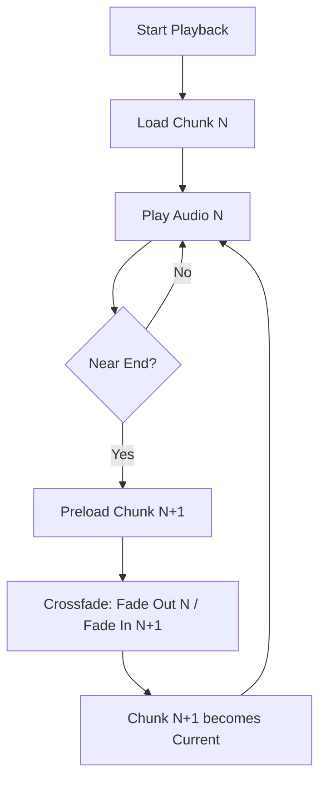

<details>
<summary>Relevant source files</summary>

The following files were used as context for generating this wiki page:

- [apps/web/hooks/reader/useTtsPlayer.ts](../../../apps/web/hooks/reader/useTtsPlayer.ts)
- [apps/web/utils/reader/readingText.ts](../../../apps/web/utils/reader/readingText.ts)
- [packages/shared-types/lessonVisualContracts.ts](../../../packages/shared-types/lessonVisualContracts.ts)
- [apps/backend/src/services/lessonGenerationPrompt.ts](../../../apps/backend/src/services/lessonGenerationPrompt.ts)
- [apps/backend/src/workflows/lessonGenerationWorkflowSchemas.ts](../../../apps/backend/src/workflows/lessonGenerationWorkflowSchemas.ts)
- [apps/web/tests/components/shared/GeneratedVisualFrame.test.tsx](../../../apps/web/tests/components/shared/GeneratedVisualFrame.test.tsx)
- [apps/backend/tests/workflows/lessonVisualWorkflow.test.ts](../../../apps/backend/tests/workflows/lessonVisualWorkflow.test.ts)
</details>

# Multimedia: TTS, STT & Generated Visuals

The multimedia system in Nous provides an immersive learning experience by integrating Text-to-Speech (TTS) capabilities and dynamically generated pedagogical visuals. The system is designed to handle complex content transformation, converting raw lesson markdown into speech-optimized text and structured visual artifacts such as SVGs, HTML simulations, and Mermaid diagrams.

The scope of this module includes content preprocessing (whitespace collapse, link normalization, and removal of non-speech elements), real-time audio playback management with crossfading, and a robust workflow for generating and rendering multi-format visual aids. These components work together to ensure that lessons are both accessible through audio and enhanced by relevant, context-aware imagery.

## Text-to-Speech (TTS) Architecture

The TTS system centers around the `useTtsPlayer` hook, which manages the lifecycle of audio generation and playback. It utilizes a chunk-based approach to handle long lesson content, ensuring low latency and smooth transitions between audio segments.

### Content Preprocessing for Speech
Before text is sent to the TTS provider, it undergoes rigorous cleaning to remove visual-only elements and formatting artifacts. This is handled primarily by `prepareMarkdownForSpeech` in `apps/web/utils/reader/readingText.ts`.

*  **Placeholder Removal**: Strips tokens for PDF images, visual examples, and YouTube clips.
*  **Markdown Normalization**: Removes formatting markers (`*`, `_`, `~`), list markers, and converts links to their text labels.
*  **HTML Stripping**: Drops specific tags like `figure`, `picture`, and `figcaption` while preserving content in tags like `mark` or `span`.
*  **Whitespace Collapsing**: Collapses multiple newlines and tabs into a clean, speech-friendly format.

Sources: `[apps/web/utils/reader/readingText.ts:316-339](../../../apps/web/utils/reader/readingText.ts#L316-L339)`, `[apps/web/hooks/reader/useTtsPlayer.ts:187-236](../../../apps/web/hooks/reader/useTtsPlayer.ts#L187-L236)`

### Playback Management & Crossfading
The player splits content into chunks of approximately 580 characters to optimize API calls and memory usage. To prevent audible gaps between these chunks, the system implements a crossfading mechanism.



The crossfade duration is set to a precise `0.035` seconds, triggered when the current chunk is nearly finished.

Sources: `[apps/web/hooks/reader/useTtsPlayer.ts:13-17](../../../apps/web/hooks/reader/useTtsPlayer.ts#L13-L17)`, `[apps/web/hooks/reader/useTtsPlayer.ts:1012-1110](../../../apps/web/hooks/reader/useTtsPlayer.ts#L1012-L1110)`

## Pedagogical Visuals Generation

The project employs a structured workflow to generate visuals that complement the text. These visuals are not decorative; they are intended to facilitate the understanding of complex concepts that prose alone cannot fully explain.

### Visual Types and Planning Rules
The system supports multiple visual formats, each selected based on the pedagogical goal.

| Visual Type | Description |
| :--- | :--- |
| `illustrative_image` | Raster illustration for physical reality, textures, or anatomy. |
| `flowchart_svg` | Abstract relations between process steps or trees. |
| `structural_svg` | Architectural schemas or layers within a system. |
| `interactive_html` | HTML/JS labs for hands-on exploration. |
| `chart_html` | Quantitative data, distributions, and trends. |
| `mermaid_erd` | Entity-Relationship diagrams. |
| `mermaid_class` | Class hierarchies and OOP structures. |

Sources: `[packages/shared-types/lessonVisualContracts.ts:145-163](../../../packages/shared-types/lessonVisualContracts.ts#L145-L163)`, `[apps/backend/src/workflows/lessonGenerationWorkflowSchemas.ts:133-149](../../../apps/backend/src/workflows/lessonGenerationWorkflowSchemas.ts#L133-L149)`

### Generation Logic & Prompts
The generation is governed by strict planning rules defined in `LESSON_VISUAL_PLANNING_RULES`. Key constraints include:
*  **Limit**: Maximum of 3 visuals per lesson.
*  **Relevance**: Every visual must teach something new; no decorative variations.
*  **Language**: Visuals must use the same language as the lesson text.
*  **Anchoring**: Visuals must be anchored to specific headings (`anchorHeading`) within the markdown.

Sources: [packages/shared-types/lessonVisualContracts.ts:153-164](../../../packages/shared-types/lessonVisualContracts.ts#L153-L164)

## Visual Rendering and Sandboxing

Generated visuals, especially HTML and SVG artifacts, are rendered within a secured environment to protect the host application.

### Safety and Security
HTML artifacts are rendered inside an `iframe` with a strict `sandbox="allow-scripts"` attribute and a restrictive Content Security Policy (CSP).

```mermaid
sequenceDiagram
    participant Web as Web App
    participant Frame as GeneratedVisualFrame
    participant Iframe as Content Iframe
    Web->>Frame: Provide Visual Code (HTML/JS)
    Frame->>Iframe: Inject srcDoc with CSP & Base Styles
    Note over Iframe: default-src 'none'; script-src 'unsafe-inline'
    Iframe->>Iframe: Execute Replay Scripts
    Iframe--xWeb: Report Runtime Errors (PostMessage)
```

The system specifically blocks external network requests (`connect-src 'none'`), form actions, and non-inline scripts.

Sources: `[apps/web/tests/components/shared/GeneratedVisualFrame.test.tsx:165-177](../../../apps/web/tests/components/shared/GeneratedVisualFrame.test.tsx#L165-L177)`, `[packages/shared-types/lessonVisualContracts.ts:258-274](../../../packages/shared-types/lessonVisualContracts.ts#L258-L274)`

### Dark Mode Normalization
Since generated visuals may contain hardcoded colors, the `GeneratedVisualFrame` component injects a normalization script (`normalizeDarkHtmlTheme`) to adjust light-mode surface colors to dark-mode equivalents when the user preference is set to dark mode.

Sources: `[apps/web/tests/components/shared/GeneratedVisualFrame.test.tsx:135-146](../../../apps/web/tests/components/shared/GeneratedVisualFrame.test.tsx#L135-L146)`

## Data Structures and Schemas

The following Zod schemas define the structure of multimedia content throughout the backend workflows.

### Lesson Content Blocks
Lesson content is organized into discrete blocks, where multimedia (YouTube clips and visuals) are first-class citizens alongside markdown.

```typescript
const LessonDraftBlockSchema = z.union([
  MarkdownBlockSchema,
  InlineQuizBlockSchema,
  YouTubeClipsBlockSchema,
  GeneratedVisualSlotSchema,
]);
```

Sources: `[apps/backend/src/workflows/lessonGenerationWorkflowSchemas.ts:168-173](../../../apps/backend/src/workflows/lessonGenerationWorkflowSchemas.ts#L168-L173)`

### Audio Player State
The frontend maintains a detailed state for the TTS player to track progress and chunk loading status.

| Field | Type | Description |
| :--- | :--- | :--- |
| `isPlaying` | `boolean` | Current playback status. |
| `currentVoice` | `VoiceProfileId` | The ID of the selected TTS voice. |
| `chunks` | `AudioChunk[]` | Array of text segments and their associated blob URLs. |
| `playbackRate` | `number` | Speed of audio playback. |

Sources: `[apps/web/types.ts:600-608](../../../apps/web/types.ts#L600-L608)`, `[apps/web/hooks/reader/useTtsPlayer.ts:262-273](../../../apps/web/hooks/reader/useTtsPlayer.ts#L262-L273)`

## Summary
The Multimedia module in Nous provides a robust bridge between static text and interactive learning. By combining a sophisticated TTS player that handles real-time audio chunking and crossfading with a secure, multi-format visual generation engine, the system ensures that content is delivered effectively across different sensory channels. Security is maintained through strict sandboxing of AI-generated code, while pedagogical integrity is enforced through explicit planning rules and language consistency.
