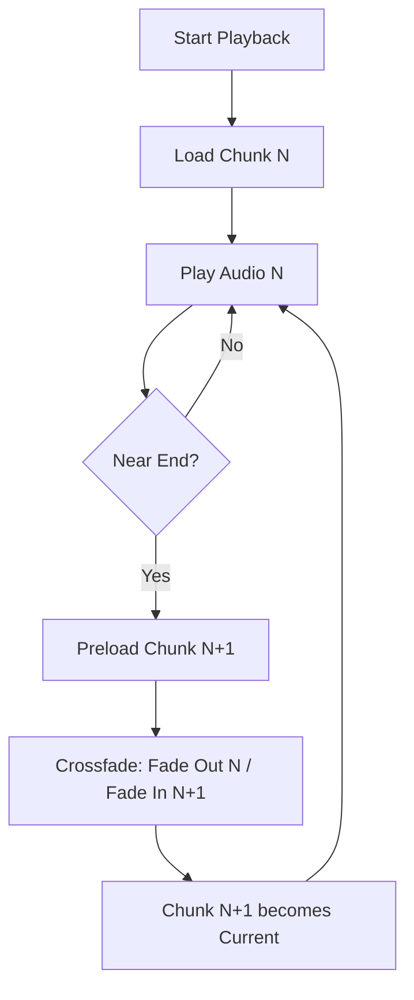

<details>
<summary>Relevant source files</summary>

The following files were used as context for generating this wiki page:

- [apps/web/hooks/reader/useTtsPlayer.ts](../../../apps/web/hooks/reader/useTtsPlayer.ts)
- [apps/web/utils/reader/readingText.ts](../../../apps/web/utils/reader/readingText.ts)
- [packages/shared-types/lessonVisualContracts.ts](../../../packages/shared-types/lessonVisualContracts.ts)
- [apps/backend/src/services/lessonGenerationPrompt.ts](../../../apps/backend/src/services/lessonGenerationPrompt.ts)
- [apps/backend/src/workflows/lessonGenerationWorkflowSchemas.ts](../../../apps/backend/src/workflows/lessonGenerationWorkflowSchemas.ts)
- [apps/web/tests/components/shared/GeneratedVisualFrame.test.tsx](../../../apps/web/tests/components/shared/GeneratedVisualFrame.test.tsx)
- [apps/backend/tests/workflows/lessonVisualWorkflow.test.ts](../../../apps/backend/tests/workflows/lessonVisualWorkflow.test.ts)
</details>

# Multimedia: TTS, STT & Generated Visuals

The multimedia system in Nous provides an immersive learning experience by integrating Text-to-Speech (TTS) capabilities and dynamically generated pedagogical visuals. The system is designed to handle complex content transformation, converting raw lesson markdown into speech-optimized text and structured visual artifacts such as SVGs, HTML simulations, and Mermaid diagrams.

The scope of this module includes content preprocessing (whitespace collapse, link normalization, and removal of non-speech elements), real-time audio playback management with crossfading, and a robust workflow for generating and rendering multi-format visual aids. These components work together to ensure that lessons are both accessible through audio and enhanced by relevant, context-aware imagery.

## Text-to-Speech (TTS) Architecture

The TTS system centers around the `useTtsPlayer` hook, which manages the lifecycle of audio generation and playback. It utilizes a chunk-based approach to handle long lesson content, ensuring low latency and smooth transitions between audio segments.

### Model, voices, and audio format

The default model is `google/gemini-3.8-flash-tts` through OpenRouter's `/audio/speech` endpoint. The reader offers Zephyr, Puck, Charon, Kore, and Fenrir, with Zephyr as its default. Saved reader preferences outside that catalog reset to Zephyr. The backend selects the model from the global configuration and resolves the requested voice before contacting OpenRouter.

During the Grok-to-Gemini transition, the speech service converts legacy Grok voices and `coral` to Zephyr for Gemini. For a persisted Grok model, it converts the reader's Gemini voices and `coral` to Ara. Other provider-specific voice values pass through. This normalization covers both reader requests and the configured administrative voice.

Gemini requests use `response_format: pcm`. The service reads the PCM media type and its `rate` and `channels` parameters independently, then wraps the 16-bit samples in a WAV header. The API returns `audio/wav`, which the reader preserves when creating its audio blob. Other configured models request MP3 and retain the provider's content type and bytes. Gemini catalog metadata always carries the Gemini model ID, including when an environment variable selects another default model.

Fresh databases receive Gemini and Zephyr from the global configuration seed. The seed uses `ON CONFLICT DO NOTHING`, so existing saved model choices remain authoritative. For production deployment, back up persistent state, deploy the compatible backend, then update the saved model and voice to Gemini and Zephyr together and align `TTS_VOICE`. Verify that the deployed TTS route returns a playable WAV response.

Sources: [speech service](../../../apps/backend/src/services/ttsClient.ts), [TTS route](../../../apps/backend/src/routes/tts.ts), [global configuration seed](../../../supabase/migrations/20260814203920_restore_global_model_config_seed.sql), [reader voices](../../../apps/web/services/audio/voiceProfile.ts).

### Playback block preparation

`prepareLessonPlaybackBlock` prepares one `LessonPlaybackBlock` and returns `prepared` plus MP3 bytes, duration, and the model and voice actually used by TTS. Gemini PCM16 WAV is downmixed to mono and encoded at 64 kb/s with `@breezystack/lamejs` 1.2.7; duration comes from the PCM sample count. Existing MP3 responses retain their bytes and use MPEG Layer III frame durations. Cancellation reaches the TTS request.

A block without visuals receives a validated lesson scene generated from its complete speech without a visual plan. When a scene is needed, speech exceeding the generator's existing text limit fails explicitly rather than being marked prepared from an excerpt. Existing scenes, including resolved `generated-visual` references, are reused; visuals without scene data receive audio and an empty motion list. Multiple available scenes remain static because the block's motion events have a single target namespace.

The `playbackPreparation` model uses the laboratory motion prompt and a Zod-derived output schema. `motionTargets` in the shared playback contract supplies the same element IDs to preparation and the future player. Validation requires exact, unique speech quotations, known targets, complete focus coverage or none, and complete single-target reveals only for checklist, steps, hypothesis, timeline, and parts scenes. List forms require reveals; empty events are valid. Sequence scenes and scenes without targets remain static, as in the laboratory. Scene generation and motion planning each allow up to three attempts including the initial request, feeding validation problems into the next request; operational failures propagate. The returned events contain quotes rather than timestamps, and the caller supplies the eventual audio asset reference. When `block.prepared` already exists, preparation reuses its scene and motion while generating audio for the requested voice.

Sources: [block preparation](../../../apps/backend/src/services/lessonPlayback/prepareLessonPlaybackBlock.ts), [audio preparation](../../../apps/backend/src/services/lessonPlayback/playbackAudio.ts), [motion planning](../../../apps/backend/src/services/lessonPlayback/playbackMotion.ts), [shared playback contract](../../../packages/shared-types/lessonPlayback.ts).

### Durable playback storage and API

Each lesson section can store `playback: LessonPlayback`. `lessonKey` hashes the canonical content blocks, their referenced generated visuals, and `lastGenerationRunId`; legacy lessons use their Markdown as one content block. Notes and project revisions leave the key unchanged. Asset references contribute their content hashes rather than project-local IDs, so importing an image or HTML visual keeps the prepared lesson reusable. Playback is excluded from lesson-generation input fingerprints and rollback snapshots.

| Request | Result |
| --- | --- |
| `GET /api/projects/:projectId/sections/:sectionId/playback` | `{ lessonKey, blocks }`, with current segmentation merged with saved preparation and audio for that key. Reading never starts generation. |
| `POST /api/projects/:projectId/sections/:sectionId/playback/blocks/:blockId/prepare` with `{ lessonKey, voice }` | `200 { block }` when scene/motion preparation and audio for the resolved voice and configured TTS model are already saved; otherwise `202 { runId, blockId, voice }`. A stale key returns `409`; another user's project or a missing target returns `404`. |

Both routes use the authenticated owner's project. The existing workflow-run route reports progress, and the existing project-asset route downloads the MP3. `lessonPlaybackClient.ts` exposes the two requests to the player. Concurrent requests share one active run per project incarnation and lesson, including requests for different blocks or voices. The `202` response identifies the block and requested voice of that active run; after that run finishes, the player must read playback again and repeat its own request if necessary.

`prepare-lesson-playback-block` rechecks the lesson key and project incarnation before calling `prepareLessonPlaybackBlock`. It records scene, motion and audio provider results separately, so retries reuse successful parts, then stages the MP3 under the preparation node. Existing scene and motion data are reused across voice changes. The TTS model is fixed when the run starts. The workflow reuses the visual workflow's attempt count and timeout. Its final checkpoint adopts the audio, checks the locked project's lesson key and incarnation, merges only the prepared block into the latest section, and publishes the project revision in the same transaction. Concurrent notes, other blocks and audio for other voice/model pairs are preserved.

Lesson generation explicitly clears playback in its content replacement patch. `commitProjectRevision` also invalidates playback when another save changes the lesson inputs, including a visual retry, while ordinary saves preserve the server's prepared blocks even if the client carries older playback. Asset collection and import remapping include every saved audio reference; removed audio enters the existing deletion queue, and abandoned staged assets follow terminal-run cleanup. As with visual generation, provider-result records hold an intermediate base64 copy of paid media until the preparation node completes, fails or is cancelled; the existing database trigger then clears that copy. A process failure between a provider response and recording its result can still repeat that provider call.

Sources: [playback identity and invalidation](../../../apps/backend/src/projects/lessonPlayback.ts), [workflow](../../../apps/backend/src/workflows/lessonPlaybackWorkflow.ts), [transactional save](../../../apps/backend/src/workflows/lessonPlaybackPersistence.ts), [API](../../../apps/backend/src/routes/lessonPlayback.ts), [client](../../../apps/web/services/openrouter/lessonPlaybackClient.ts), [asset collection and remapping](../../../packages/shared-types/projectBackupAssets.ts).

### Content Preprocessing for Speech
Before text is sent to the TTS provider, it undergoes rigorous cleaning to remove visual-only elements and formatting artifacts. This is handled primarily by `prepareMarkdownForSpeech` in `apps/web/utils/reader/readingText.ts`.

*  **Placeholder Removal**: Strips tokens for PDF images, visual examples, and YouTube clips.
*  **Markdown Normalization**: Removes formatting markers (`*`, `_`, `~`), list markers, and converts links to their text labels.
*  **HTML Stripping**: Drops non-speech figures and images, removes renderer-hidden comments and declarations, and strips supported `mark` tags while keeping their visible text. Unsupported tags remain literal because the lesson renderer escapes and displays them.
*  **Whitespace Collapsing**: Collapses multiple newlines and tabs into a clean, speech-friendly format.

Sources: `[apps/web/utils/reader/readingText.ts:316-339](../../../apps/web/utils/reader/readingText.ts#L316-L339)`, `[apps/web/hooks/reader/useTtsPlayer.ts:187-236](../../../apps/web/hooks/reader/useTtsPlayer.ts#L187-L236)`

### Playback Management & Crossfading
The player splits content into chunks of approximately 580 characters to optimize API calls and memory usage. To prevent audible gaps between these chunks, the system implements a crossfading mechanism.


```mermaid
flowchart TD
    Start[Start Playback] --> Chunk1[Load Chunk N]
    Chunk1 --> Play1[Play Audio N]
    Play1 --> Check{Near End?}
    Check -- No --> Play1
    Check -- Yes --> LoadNext[Preload Chunk N+1]
    LoadNext --> Fade[Crossfade: Fade Out N / Fade In N+1]
    Fade --> Promote[Chunk N+1 becomes Current]
    Promote --> Play1
```

The crossfade duration is set to a precise `0.035` seconds, triggered when the current chunk is nearly finished.

Sources: `[apps/web/hooks/reader/useTtsPlayer.ts:13-17](../../../apps/web/hooks/reader/useTtsPlayer.ts#L13-L17)`, `[apps/web/hooks/reader/useTtsPlayer.ts:1012-1110](../../../apps/web/hooks/reader/useTtsPlayer.ts#L1012-L1110)`

## Pedagogical Visuals Generation

The project employs a structured workflow to generate visuals that complement the text. These visuals are not decorative; they are intended to facilitate the understanding of complex concepts that prose alone cannot fully explain.

### Visual Types and Planning Rules
The system supports multiple visual formats, each selected based on the pedagogical goal.

| Visual Type | Description |
| :--- | :--- |
| `illustrative_image` | Raster illustration for physical reality, textures, or anatomy. |
| `lesson_scene` | Abstract structures, relations, quantities, and diagrams drawn from the scene catalog. |
| `interactive_html` | HTML/JS labs for hands-on exploration; charts that need interaction belong here. |

New planning chooses only these three types (`PLANNABLE_LESSON_VISUAL_TYPES`). Stored plans may still carry the legacy `flowchart_svg`, `structural_svg`, `chart_html`, `mermaid_erd`, and `mermaid_class` types; current retries render them as lesson scenes, while retries resumed on pre-scene workflow definitions keep the legacy renderer. Visuals already stored as `svg` or `mermaid` remain readable; current definitions never produce them again.

Sources: [packages/shared-types/lessonGenerationPolicy.ts:96-117](../../../packages/shared-types/lessonGenerationPolicy.ts#L96-L117), [apps/backend/src/workflows/lessonGenerationWorkflowSchemas.ts:419-454](../../../apps/backend/src/workflows/lessonGenerationWorkflowSchemas.ts#L419-L454)

### Generation Logic & Prompts
The generation is governed by strict planning rules defined in `LESSON_VISUAL_PLANNING_RULES`. Key constraints include:
*  **Limit**: Maximum of 3 visuals per lesson.
*  **Relevance**: Every visual must teach something new; no decorative variations.
*  **Language**: Visuals must use the same language as the lesson text.
*  **Anchoring**: Visuals must be anchored to specific headings (`anchorHeading`) within the markdown.

Sources: [packages/shared-types/lessonVisualContracts.ts:153-164](../../../packages/shared-types/lessonVisualContracts.ts#L153-L164)

### Lesson Scenes

A lesson scene is a validated JSON description of one visual, built from a fixed catalog of 35 forms (definitions, checklists, comparisons, steps, timelines, hierarchies, quantities, flowcharts, message sequences, journeys, and others). The model chooses the form and fills content; the reader components own geometry and style, so stored scenes follow later design changes without regeneration.

1. **Contract.** `packages/shared-types/lessonScene.ts` owns the catalog, the scene type, and `findLessonSceneProblems`. With the lesson text, validation requires exact quotations, quantities stated in the lesson, the group count each form needs, and connected, grounded diagrams; without it, it checks the stored shape. Persisted visuals use the `scene` kind of `ProjectVisual`.
2. **Generation.** The `render-scene` step of the lesson visual workflow calls `generateLessonScene` with the `scene` model slot. Closing text is empty by default: only an essential question or a necessary limit warrants one, and generation rejects both together. Quote and decision forms use `quote` as their main content rather than a closing question. Contract problems become corrective retry feedback. Each item and group entry carries three English icon search phrases.
3. **Icons.** `lessonSceneIcons.ts` embeds the name, category, and tags of every Tabler outline icon with the configured embedding model and caches the index per model and Tabler version (`LESSON_SCENE_ICON_INDEX_DIR`, a Docker volume). Each entry runs four queries (its three phrases plus its text) and keeps the 12 nearest icons for each. The `sceneIcon` slot then chooses among those candidates, seeing their category and tags, may not reuse an icon for different meanings (up to three attempts; the attempt with the fewest missing or reused icons is kept), and depicts negation as negation. Each embedding request is bounded to 30 seconds. If retrieval or choice fails, the validated scene is kept with the neutral `point` icon in every slot.
4. **Rendering.** `LessonSceneVisual` renders scenes inline in the reader, not in the sandboxed frame. It shows at most one closing text; if a stored scene contains both a closing question and a note, both additions are omitted while the main scene remains visible. Whitespace-only fields add no box. Network connectors share their spacing and branch anchors; on narrow screens, a single vertical stem joins the hub to the branches with the same stroke width. Hierarchies show a centered list below the main concept, without connectors; the main concept's orange background fills the scene's inner width. Charts use Observable Plot and d3 (line points sit on a continuous axis at the times the lesson states, so gaps keep their real length). A chart rendering failure exposes its numeric caption; later resize events or theme changes can attempt the drawing again. Flowcharts and sequences use Mermaid built from the validated graph, and icons load lazily from the Tabler outline path data. Repeated model labels and messages remain distinct entries in rendered lists.
5. **Models.** The `scene` and `sceneIcon` slots and `embeddingModel` are configurable in the admin panel. They follow the global provider and always run fast on Codex; durable workflow config omits them, so the scene services read the live configuration.
6. **Durable compatibility.** Visual-bearing schemas are built per visual contract. Historical lesson, retry, and artifact-draft definitions keep the legacy contract and their exact hashes; `lessonSceneCompatibility.test.ts` pins the pre-scene definitions.

Sources: [packages/shared-types/lessonScene.ts](../../../packages/shared-types/lessonScene.ts), [apps/backend/src/services/lessonScenes](../../../apps/backend/src/services/lessonScenes), [apps/web/components/shared/lessonScene](../../../apps/web/components/shared/lessonScene), [apps/backend/src/workflows/lessonGenerationWorkflowSchemas.ts](../../../apps/backend/src/workflows/lessonGenerationWorkflowSchemas.ts)

## Visual Rendering and Sandboxing

Generated and revised Mermaid drafts must pass the bundled Mermaid parser before acceptance. `normalizeArtifactDraft` returns `null` for invalid syntax, which sends generation through the existing corrective retry. The parser runs in a disposable child process with JSDOM because Mermaid's sanitizer requires a DOM even for parsing. The child closes its DOM after validation and follows caller cancellation. Process failures propagate separately from syntax rejection. This check establishes parseability; visual review remains a separate step.

Generated visuals, especially HTML and SVG artifacts, are rendered within a secured environment to protect the host application.

### Safety and Security
HTML artifacts are rendered inside an `iframe` with a strict `sandbox="allow-scripts"` attribute and a restrictive Content Security Policy (CSP).

```mermaid
sequenceDiagram
    participant Web as Web App
    participant Frame as GeneratedVisualFrame
    participant Iframe as Content Iframe
    Web->>Frame: Provide Visual Code (HTML/JS)
    Frame->>Iframe: Inject srcDoc with CSP & Base Styles
    Note over Iframe: default-src 'none'; script-src 'unsafe-inline'
    Iframe->>Iframe: Execute Replay Scripts
    Iframe--xWeb: Report Runtime Errors (PostMessage)
```

The system specifically blocks external network requests (`connect-src 'none'`), form actions, and non-inline scripts.

Sources: `[apps/web/tests/components/shared/GeneratedVisualFrame.test.tsx:165-177](../../../apps/web/tests/components/shared/GeneratedVisualFrame.test.tsx#L165-L177)`, `[packages/shared-types/lessonVisualContracts.ts:258-274](../../../packages/shared-types/lessonVisualContracts.ts#L258-L274)`

### Dark Mode Normalization
Since generated visuals may contain hardcoded colors, the `GeneratedVisualFrame` component injects a normalization script (`normalizeDarkHtmlTheme`) to adjust light-mode surface colors to dark-mode equivalents when the user preference is set to dark mode.

Sources: `[apps/web/tests/components/shared/GeneratedVisualFrame.test.tsx:135-146](../../../apps/web/tests/components/shared/GeneratedVisualFrame.test.tsx#L135-L146)`

## Data Structures and Schemas

The following Zod schemas define the structure of multimedia content throughout the backend workflows.

### Lesson Content Blocks
Lesson content is organized into discrete blocks, where multimedia (YouTube clips and visuals) are first-class citizens alongside markdown.

```typescript
const LessonDraftBlockSchema = z.union([
  MarkdownBlockSchema,
  InlineQuizBlockSchema,
  YouTubeClipsBlockSchema,
  GeneratedVisualSlotSchema,
]);
```

Sources: `[apps/backend/src/workflows/lessonGenerationWorkflowSchemas.ts:168-173](../../../apps/backend/src/workflows/lessonGenerationWorkflowSchemas.ts#L168-L173)`

### Audio Player State
The frontend maintains a detailed state for the TTS player to track progress and chunk loading status.

| Field | Type | Description |
| :--- | :--- | :--- |
| `isPlaying` | `boolean` | Current playback status. |
| `currentVoice` | `VoiceProfileId` | The ID of the selected TTS voice. |
| `chunks` | `AudioChunk[]` | Array of text segments and their associated blob URLs. |
| `playbackRate` | `number` | Speed of audio playback. |

Sources: `[apps/web/types.ts:600-608](../../../apps/web/types.ts#L600-L608)`, `[apps/web/hooks/reader/useTtsPlayer.ts:262-273](../../../apps/web/hooks/reader/useTtsPlayer.ts#L262-L273)`

## Summary
The Multimedia module in Nous provides a robust bridge between static text and interactive learning. By combining a sophisticated TTS player that handles real-time audio chunking and crossfading with a secure, multi-format visual generation engine, the system ensures that content is delivered effectively across different sensory channels. Security is maintained through strict sandboxing of AI-generated code, while pedagogical integrity is enforced through explicit planning rules and language consistency.
