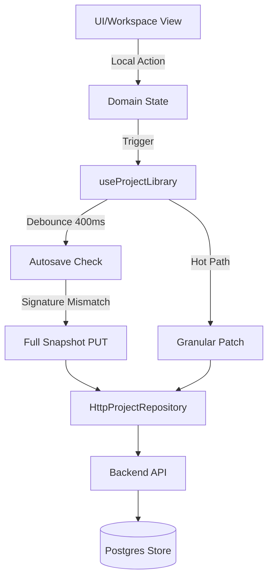
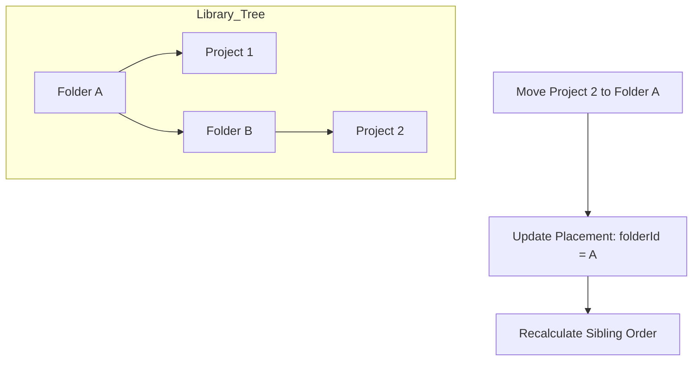

<details>
<summary>Relevant source files</summary>

The following files were used as context for generating this wiki page:

- [apps/web/services/projects/projectSnapshot.ts](../../../apps/web/services/projects/projectSnapshot.ts)
- [apps/web/hooks/library/useProjectLibrary.ts](../../../apps/web/hooks/library/useProjectLibrary.ts)
- [apps/backend/tests/routes/projects.test.ts](../../../apps/backend/tests/routes/projects.test.ts)
- [apps/web/services/projects/courseSources.ts](../../../apps/web/services/projects/courseSources.ts)
- [apps/backend/tests/helpers/inMemoryProjectStore.ts](../../../apps/backend/tests/helpers/inMemoryProjectStore.ts)
- [apps/backend/tests/projects/postgresProjectStore.test.ts](../../../apps/backend/tests/projects/postgresProjectStore.test.ts)

</details>

# Project & Workspace Management

Project & Workspace Management is the core system responsible for handling the lifecycle, persistence, and organization of learning environments within Nous. It facilitates the transition from raw source materials (PDFs, text, or codebase archives) into structured educational projects, maintaining synchronization between local client state and server-side storage.

The system encompasses project creation, metadata tracking, folder-based organization, and sophisticated synchronization strategies, including granular patches and full snapshot updates to prevent data loss during concurrent sessions.

## Architecture and Data Flow

The architecture follows a clear separation between the UI-layer hooks, the service-layer repositories, and the backend persistence stores.

### Synchronization Logic
Nous employs a multi-tiered synchronization strategy to ensure client-side changes are safely persisted. This includes an **Autosave** mechanism that triggers after a short debounce (400ms) when local signatures differ from the last persisted state, and a **Granular Patch** system for high-frequency updates like annotations or navigation changes.



*The diagram shows the flow from user action to persistent storage, highlighting the distinction between full snapshots and granular patches.*
Sources: [apps/web/hooks/library/useProjectLibrary.ts:1145-1175](../../../apps/web/hooks/library/useProjectLibrary.ts#L1145-L1175), [apps/web/hooks/library/useProjectLibrary.ts:684-725](../../../apps/web/hooks/library/useProjectLibrary.ts#L684-L725)

### Source and Metadata Handling
Projects are categorized by `sourceKind` (e.g., `document`, `codebase`, `learn-mode`). The system differentiates between the **Project Snapshot** (the full state including learning plans) and **Project Meta** (lightweight information used for library listings).

| Field | Description | Type |
| :--- | :--- | :--- |
| `id` | Unique identifier for the project | `ProjectId` |
| `sourceKind` | The type of source (document, codebase, learn-mode) | `ProjectSourceKind` |
| `lessonCount` | Total number of lessons in the learning plan | `number` |
| `completedCount` | Number of lessons marked as completed | `number` |
| `revision` | Incremental version number for conflict detection | `number` |

Sources: [apps/web/services/projects/projectSnapshot.ts:113-138](../../../apps/web/services/projects/projectSnapshot.ts#L113-L138), [apps/web/hooks/library/useProjectLibrary.ts:108-118](../../../apps/web/hooks/library/useProjectLibrary.ts#L108-L118)

## Project Persistence Strategies

### Full Snapshots vs. Granular Patches
To optimize performance and reduce payload sizes, the system utilizes specialized patch operations for frequent UI interactions:

1.  **Full Snapshot (PUT):** Saves the entire project state. Used for major structural changes or as a final safety net for the autosave loop. Sources: [apps/web/hooks/library/useProjectLibrary.ts:608-662](../../../apps/web/hooks/library/useProjectLibrary.ts#L608-L662)
2.  **Navigation Patch:** Specifically targets `activeSectionId` and `state`. It uses a `navigation` rebase mode to merge navigation changes even if the server revision has advanced due to background generation. Sources: [apps/web/hooks/library/useProjectLibrary.ts:738-780](../../../apps/web/hooks/library/useProjectLibrary.ts#L738-L780)
3.  **Annotation Patch:** High-performance path for updates to specific lesson notes or highlights, avoiding the transmission of the entire learning plan. Sources: [apps/web/hooks/library/useProjectLibrary.ts:800-848](../../../apps/web/hooks/library/useProjectLibrary.ts#L800-L848)

### Conflict Resolution
Nous uses an `expectedRevision` pattern. If a client attempts to save with a revision number that does not match the server's current version, a `ProjectRevisionConflictError` (HTTP 409) is raised. This triggers the client to either rebase or reload the latest state to prevent overwriting concurrent changes.
Sources: [apps/backend/tests/routes/projects.test.ts:740-770](../../../apps/backend/tests/routes/projects.test.ts#L740-L770), [apps/backend/tests/helpers/inMemoryProjectStore.ts:286-302](../../../apps/backend/tests/helpers/inMemoryProjectStore.ts#L286-L302)

## Library and Workspace Organization

The workspace is organized into a hierarchical structure using folders and placements.

### Folder Management
Users can create, rename, move, and delete folders. Deleting a folder does not delete the contained projects; instead, it reparents them to the deleted folder's parent.



*Visual representation of how projects are repositioned within the library folder structure.*
Sources: [apps/backend/tests/helpers/inMemoryProjectStore.ts:515-540](../../../apps/backend/tests/helpers/inMemoryProjectStore.ts#L515-L540), [apps/web/hooks/library/useProjectLibrary.ts:1210-1230](../../../apps/web/hooks/library/useProjectLibrary.ts#L1210-L1230)

### Multi-Source Management
Projects can support multiple source files simultaneously. The `courseSources` service handles the sorting (alphabetical), indexing, and merging of these files.

*  **Deduplication:** The system generates stable hashes for source files to avoid redundant storage of identical content across projects. Sources: [apps/web/services/projects/courseSources.ts:145-165](../../../apps/web/services/projects/courseSources.ts#L145-L165)
*  **Archiving:** For `codebase` sources, a `SourceArchiveIndex` tracks directory structures and file previews within ZIP archives. Sources: [apps/backend/tests/projects/postgresProjectStore.test.ts:660-720](../../../apps/backend/tests/projects/postgresProjectStore.test.ts#L660-L720)

## Implementation Details

### Snapshot Normalization
When a project is loaded or imported, it undergoes normalization to ensure compatibility across different versions (`CURRENT_PROJECT_VERSION` is `4.1`). This process converts legacy "sections-shaped" plans into the modern "module-shaped" structure.

```typescript
// Example of normalization logic
export const normalizeStoredProject = (data: unknown): ProjectSnapshot => {
  const wire = decodeProjectSnapshotWire(data);
  const learningPlan = parseLearningPlan(wire.learningPlan ?? wire);
  // ... maps fields and ensures structure
  return createProjectSnapshot({ ... });
};
```

Sources: [apps/web/services/projects/projectSnapshot.ts:600-630](../../../apps/web/services/projects/projectSnapshot.ts#L600-L630)

### Storage Backend (PostgreSQL)
In production, `PostgresProjectStore` manages atomicity using database transactions. It ensures that source bytes are stored in immutable object storage while metadata is kept in Postgres. A failure in the metadata transaction triggers a cleanup of the orphaned binary objects in storage.
Sources: [apps/backend/tests/projects/postgresProjectStore.test.ts:250-290](../../../apps/backend/tests/projects/postgresProjectStore.test.ts#L250-L290), [apps/backend/tests/projects/postgresProjectStore.test.ts:400-440](../../../apps/backend/tests/projects/postgresProjectStore.test.ts#L400-L440)

## Summary
Project & Workspace Management provides a robust foundation for educational workflows in Nous. By balancing high-frequency granular updates with robust conflict detection and hierarchical organization, the system ensures a seamless user experience across multiple devices while maintaining the integrity of complex, multi-source learning materials.
