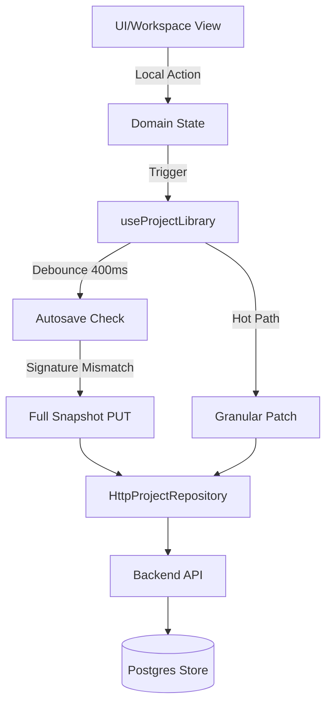
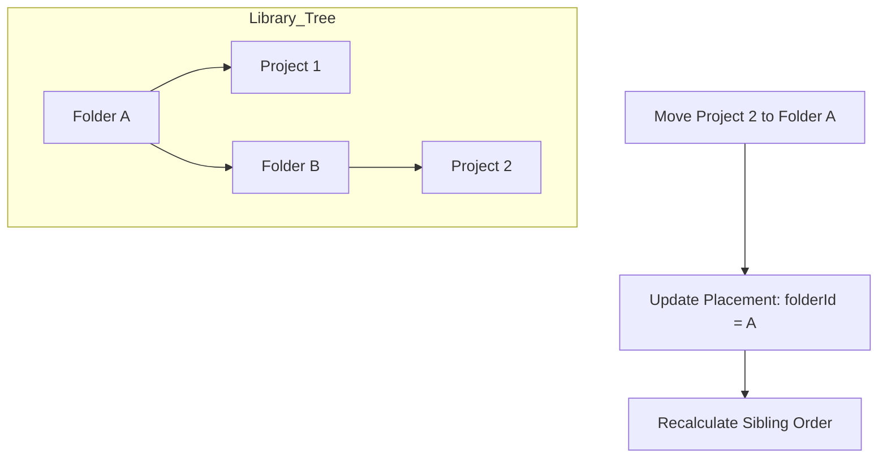

<details>
<summary>Relevant source files</summary>

The following files were used as context for generating this wiki page:

- [apps/web/services/projects/projectSnapshot.ts](../../../apps/web/services/projects/projectSnapshot.ts)
- [apps/web/hooks/library/useProjectLibrary.ts](../../../apps/web/hooks/library/useProjectLibrary.ts)
- [apps/backend/tests/routes/projects.test.ts](../../../apps/backend/tests/routes/projects.test.ts)
- [apps/web/services/projects/courseSources.ts](../../../apps/web/services/projects/courseSources.ts)
- [apps/backend/tests/helpers/inMemoryProjectStore.ts](../../../apps/backend/tests/helpers/inMemoryProjectStore.ts)
- [apps/backend/tests/projects/postgresProjectStore.test.ts](../../../apps/backend/tests/projects/postgresProjectStore.test.ts)
- [packages/shared-types/learningArtifact.ts](../../../packages/shared-types/learningArtifact.ts)
- [packages/shared-types/projectBackupAssets.ts](../../../packages/shared-types/projectBackupAssets.ts)
- [apps/backend/src/projects/libraryExport.ts](../../../apps/backend/src/projects/libraryExport.ts)
- [apps/backend/src/projects/libraryExportWorkspace.ts](../../../apps/backend/src/projects/libraryExportWorkspace.ts)
- [packages/shared-types/libraryExportContract.ts](../../../packages/shared-types/libraryExportContract.ts)

</details>

# Project & Workspace Management

Project & Workspace Management is the core system responsible for handling the lifecycle, persistence, and organization of learning environments within Nous. It facilitates the transition from raw source materials (PDFs, text, or codebase archives) into structured educational projects, maintaining synchronization between local client state and server-side storage.

The system encompasses project creation, metadata tracking, folder-based organization, and sophisticated synchronization strategies, including granular patches and full snapshot updates to prevent data loss during concurrent sessions.

## Architecture and Data Flow

The architecture follows a clear separation between the UI-layer hooks, the service-layer repositories, and the backend persistence stores.

### Synchronization Logic
Nous employs a multi-tiered synchronization strategy to ensure client-side changes are safely persisted. This includes an **Autosave** mechanism that triggers after a short debounce (400ms) when local signatures differ from the last persisted state, and a **Granular Patch** system for high-frequency updates like annotations or navigation changes.



*The diagram shows the flow from user action to persistent storage, highlighting the distinction between full snapshots and granular patches.*
Sources: [apps/web/hooks/library/useProjectLibrary.ts:1145-1175](../../../apps/web/hooks/library/useProjectLibrary.ts#L1145-L1175), [apps/web/hooks/library/useProjectLibrary.ts:684-725](../../../apps/web/hooks/library/useProjectLibrary.ts#L684-L725)

### Source and Metadata Handling
Projects are categorized by `sourceKind` (e.g., `document`, `codebase`, `learn-mode`). The system differentiates between the **Project Snapshot** (the full state including learning plans) and **Project Meta** (lightweight information used for library listings).

| Field | Description | Type |
| :--- | :--- | :--- |
| `id` | Unique identifier for the project | `ProjectId` |
| `sourceKind` | The type of source (document, codebase, learn-mode) | `ProjectSourceKind` |
| `lessonCount` | Total number of lessons in the learning plan | `number` |
| `completedCount` | Number of lessons marked as completed | `number` |
| `revision` | Incremental version number for conflict detection | `number` |

Sources: [apps/web/services/projects/projectSnapshot.ts:113-138](../../../apps/web/services/projects/projectSnapshot.ts#L113-L138), [apps/web/hooks/library/useProjectLibrary.ts:108-118](../../../apps/web/hooks/library/useProjectLibrary.ts#L108-L118)

## Project Persistence Strategies

### Full Snapshots vs. Granular Patches
To optimize performance and reduce payload sizes, the system utilizes specialized patch operations for frequent UI interactions:

1.  **Full Snapshot (PUT):** Saves the entire project state. Used for major structural changes or as a final safety net for the autosave loop. Sources: [apps/web/hooks/library/useProjectLibrary.ts:608-662](../../../apps/web/hooks/library/useProjectLibrary.ts#L608-L662)
2.  **Navigation Patch:** Specifically targets `activeSectionId` and `state`. It uses a `navigation` rebase mode to merge navigation changes even if the server revision has advanced due to background generation. Sources: [apps/web/hooks/library/useProjectLibrary.ts:738-780](../../../apps/web/hooks/library/useProjectLibrary.ts#L738-L780)
3.  **Annotation Patch:** High-performance path for updates to specific lesson notes or highlights, avoiding the transmission of the entire learning plan. Sources: [apps/web/hooks/library/useProjectLibrary.ts:800-848](../../../apps/web/hooks/library/useProjectLibrary.ts#L800-L848)

### Conflict Resolution
Nous uses an `expectedRevision` pattern. If a client attempts to save with a revision number that does not match the server's current version, a `ProjectRevisionConflictError` (HTTP 409) is raised. This triggers the client to either rebase or reload the latest state to prevent overwriting concurrent changes.

Cover and favorite writes read the expected revision when their turn in the tracked write queue begins and pass it through the HTTP route to the conditional database update. A rejected write does not advance local metadata. This prevents an unrelated cover or favorite change from adopting a remote revision while the active snapshot is still stale; a subsequent edit must still report the revision conflict.
Sources: [apps/backend/tests/routes/projects.test.ts:740-770](../../../apps/backend/tests/routes/projects.test.ts#L740-L770), [apps/backend/tests/helpers/inMemoryProjectStore.ts:286-302](../../../apps/backend/tests/helpers/inMemoryProjectStore.ts#L286-L302)

## Library and Workspace Organization

The workspace is organized into a hierarchical structure using folders and placements.

### Folder Management
Users can create, rename, move, and delete folders. Deleting a folder does not delete the contained projects; instead, it reparents them to the deleted folder's parent.



*Visual representation of how projects are repositioned within the library folder structure.*
Sources: [apps/backend/tests/helpers/inMemoryProjectStore.ts:515-540](../../../apps/backend/tests/helpers/inMemoryProjectStore.ts#L515-L540), [apps/web/hooks/library/useProjectLibrary.ts:1210-1230](../../../apps/web/hooks/library/useProjectLibrary.ts#L1210-L1230)

### Full Library Export

The browser starts one backend-owned export run and polls its persisted progress instead of loading every project snapshot into a client-side ZIP. The status query reads scalar run fields and a checkpoint count without loading checkpoint paths or checksums. The backend processes one project at a time, writes each compatible project archive atomically to a durable workspace, and records its project incarnation UUID, revision, byte count, and SHA-256 checkpoint before streaming those files into the outer library archive. In Compose deployments the workspace is a named volume, so a restarted or recreated backend reuses a checkpoint only when its file and both project identity fields still match the run snapshot.

The backend checks every expected project identity again before building the outer archive. Saving a separate course cover increments the same project revision in the cover-write transaction, because the cover is part of the nested project archive. Both generated and explicitly saved covers use the frontend's tracked write queue and apply returned metadata before the next edit. For the final transition, PostgreSQL locks the expected project rows in stable order, compares their incarnation UUIDs and revisions, and keeps those locks through publication; an overlapping snapshot save, cover save, or deletion must therefore serialize before or after completion. A failed run whose project set or identities changed is cancelled and replaced from a new library snapshot rather than mixing checkpoints from different project versions. Runs persisted before these identity fields existed are explicitly cancelled as non-resumable. The completed archive retains the established library manifest and nested project archive format. It is exposed for download only after the final file has been closed, reread, and verified. The browser receives a one-use download token and submits a native form, leaving the archive stream outside application memory. After a successful response, the run is marked as downloaded; its workspace is retained until no valid unclaimed ticket or active reader remains. The browser reports only that the native download request was sent, not that the file response succeeded. Interrupted cleanup is retried from durable state. Sources: [apps/backend/src/projects/libraryExport.ts](../../../apps/backend/src/projects/libraryExport.ts), [apps/backend/src/projects/libraryExportRunStore.ts](../../../apps/backend/src/projects/libraryExportRunStore.ts), [apps/backend/src/projects/libraryExportWorkspace.ts](../../../apps/backend/src/projects/libraryExportWorkspace.ts), [apps/backend/src/projects/postgresProjectStore.ts](../../../apps/backend/src/projects/postgresProjectStore.ts), [packages/shared-types/libraryExportContract.ts](../../../packages/shared-types/libraryExportContract.ts), [apps/web/services/projects/httpProjectRepository.ts](../../../apps/web/services/projects/httpProjectRepository.ts), [compose.yml](../../../compose.yml)

The supported single backend process admits archive preparations through a configurable FIFO queue.
Queued identifiers count as owned work, so progress polling cannot mistake them for an interrupted
execution. Startup recovery reads ordered run identifiers without loading every checkpoint collection.
Only scalar identifiers are retained by pending execution callbacks. The default is one preparation
at a time. Capacity bounds active preparation, not the number of waiting users or request frequency.

Completed and failed runs have configurable retention, defaulting to 24 hours from the persisted
completion or failure transition. Progress polling and download tokens do not extend retention.
Startup and periodic cleanup cancel expired terminal runs with `LIBRARY_EXPORT_RETENTION_EXPIRED`,
revoke their tokens, and remove only the export workspace. Queued and executing runs are excluded.
Per-run state serialization and active-reader counts prevent expiry or a successful response from
removing a file still used by another admitted download or protected by an unclaimed ticket. Errors and disconnections release readers;
failed cleanup remains durably retryable. A fresh request replaces an expired run once no reader is
active. The public progress states and archive formats remain unchanged. Configuration and limits are
documented in [Deployment](../../../docs/DEPLOYMENT.md#durable-full-library-export-workspace).

Outstanding tickets survive process restart and the first successful response until the original
archive deadline, without enabling new ticket issuance after delivery. Failed or cancelled runs
revoke their tickets. Shutdown stops HTTP admission first, aborts preparation steps and local archive
streams, and stops cleanup between asynchronous operations. Pending remote reads do not delay other
resource shutdown, and completed checkpoints or unfinished cleanup remain recoverable. Organization
validation shares checked ancestor state, so a deep folder chain does not repeat each ancestry walk.

Sources: [libraryExportCoordinator.ts](../../../apps/backend/src/projects/libraryExportCoordinator.ts),
[libraryExportDelivery.ts](../../../apps/backend/src/projects/libraryExportDelivery.ts),
[libraryExportConfig.ts](../../../apps/backend/src/projects/libraryExportConfig.ts).

### Multi-Source Management
Projects can support multiple source files simultaneously. The `courseSources` service handles the sorting (alphabetical), indexing, and merging of these files.

*  **Deduplication:** The system generates stable hashes for source files to avoid redundant storage of identical content across projects. Sources: [apps/web/services/projects/courseSources.ts:145-165](../../../apps/web/services/projects/courseSources.ts#L145-L165)
*  **Archiving:** For `codebase` sources, a `SourceArchiveIndex` tracks directory structures and file previews within ZIP archives. Sources: [apps/backend/tests/projects/postgresProjectStore.test.ts:660-720](../../../apps/backend/tests/projects/postgresProjectStore.test.ts#L660-L720)

## Implementation Details

### Snapshot Normalization
When a project is loaded or imported, it undergoes normalization to ensure compatibility across different versions (`CURRENT_PROJECT_VERSION` is `4.1`). This process converts legacy "sections-shaped" plans into the modern "module-shaped" structure.

```typescript
// Example of normalization logic
export const normalizeStoredProject = (data: unknown): ProjectSnapshot => {
  const wire = decodeProjectSnapshotWire(data);
  const learningPlan = parseLearningPlan(wire.learningPlan ?? wire);
  // ... maps fields and ensures structure
  return createProjectSnapshot({ ... });
};
```

Sources: [apps/web/services/projects/projectSnapshot.ts:600-630](../../../apps/web/services/projects/projectSnapshot.ts#L600-L630)

### Archive Import Identity Remapping

Project archive imports may restore a snapshot under a new project ID. The import boundary clones
the snapshot and builds an artifact-ID lookup from the generated visuals and PDF images owned by
the snapshot. It replaces matching annotation references with destination-project IDs while
preserving annotation note text and other metadata. References absent from that owned-artifact
lookup remain unchanged, including foreign and unknown references. `future-asset` is a supported
annotation kind, but snapshots do not yet persist an authoritative inventory for it, so imports
preserve those references rather than inferring ownership from the concatenated ID.

Sources: [packages/shared-types/learningArtifact.ts:1-18](../../../packages/shared-types/learningArtifact.ts#L1-L18), [packages/shared-types/projectBackupAssets.ts:152-264](../../../packages/shared-types/projectBackupAssets.ts#L152-L264), [apps/backend/src/projects/projectAssetImport.ts:105-137](../../../apps/backend/src/projects/projectAssetImport.ts#L105-L137)

### Storage Backend (PostgreSQL)
In production, `PostgresProjectStore` manages atomicity using database transactions. It ensures that source bytes are stored in immutable object storage while metadata is kept in Postgres. A failure in the metadata transaction triggers a cleanup of the orphaned binary objects in storage.
Sources: [apps/backend/tests/projects/postgresProjectStore.test.ts:250-290](../../../apps/backend/tests/projects/postgresProjectStore.test.ts#L250-L290), [apps/backend/tests/projects/postgresProjectStore.test.ts:400-440](../../../apps/backend/tests/projects/postgresProjectStore.test.ts#L400-L440)

## Summary
Project & Workspace Management provides a robust foundation for educational workflows in Nous. By balancing high-frequency granular updates with robust conflict detection and hierarchical organization, the system ensures a seamless user experience across multiple devices while maintaining the integrity of complex, multi-source learning materials.
