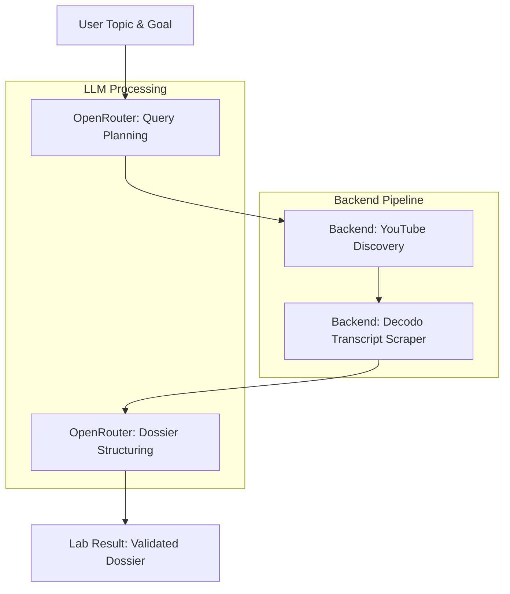
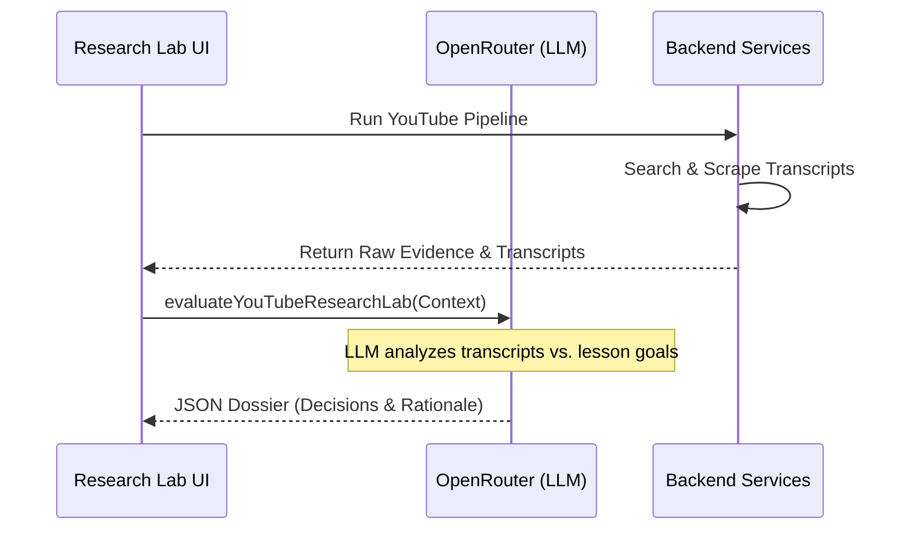

<details>
<summary>Relevant source files</summary>

The following files were used as context for generating this wiki page:

- [apps/backend/src/services/youtubeResearch.ts](../../../apps/backend/src/services/youtubeResearch.ts)
- [apps/web/services/openrouter/research.ts](../../../apps/web/services/openrouter/research.ts)
- [apps/web/components/admin/YouTubeResearchLab.tsx](../../../apps/web/components/admin/YouTubeResearchLab.tsx)
- [apps/backend/src/workflows/courseGenerationResearch.ts](../../../apps/backend/src/workflows/courseGenerationResearch.ts)
- [apps/backend/src/workflows/lessonGenerationStageServices.ts](../../../apps/backend/src/workflows/lessonGenerationStageServices.ts)
- [apps/web/tests/components/admin/YouTubeResearchLab.test.tsx](../../../apps/web/tests/components/admin/YouTubeResearchLab.test.tsx)

</details>

# YouTube Research Lab

The **YouTube Research Lab** is a specialized diagnostic and evaluation system within the Nous platform designed to discover, analyze, and integrate educational YouTube content into structured learning paths. It serves as a testing ground for the platform's YouTube research pipeline, allowing administrators to simulate and verify how the system handles query planning, video discovery, transcript extraction, and pedagogical classification.

This module acts as a bridge between raw video data and high-quality educational material. It utilizes a multi-stage process involving LLM-driven structuring to ensure that only relevant, factually dense, and recent video content is included in course dossiers. The Lab specifically focuses on evaluating the effectiveness of the transcript-based research and the subsequent decision-making logic performed by the AI models.
Sources: [apps/web/components/admin/YouTubeResearchLab.tsx](../../../apps/web/components/admin/YouTubeResearchLab.tsx), [apps/web/services/openrouter/research.ts:468-490](../../../apps/web/services/openrouter/research.ts#L468-L490)

## System Architecture

The YouTube Research Lab operates through a coordinated flow involving the web frontend, a dedicated backend service, and OpenRouter-based LLM agents. The architecture is designed to handle the high token costs of transcripts by implementing a strict token budget and cascading search strategies.

### Research Workflow

The research process follows a structured sequence from initial topic input to the final generation of a lesson dossier containing validated video clips.



The diagram shows the transition from user intent to a structured learning resource, highlighting the separation between LLM reasoning and data retrieval.
Sources: [apps/backend/src/services/youtubeResearch.ts:449-530](../../../apps/backend/src/services/youtubeResearch.ts#L449-L530), [apps/web/services/openrouter/research.ts:326-380](../../../apps/web/services/openrouter/research.ts#L326-L380)

## Core Components and Logic

### 1. YouTube Discovery and Scrapping
The system uses the `DecodoDiscoveryProvider` to perform searches and expand playlists. It targets specific video metadata and transcripts to build "evidence" for the educational value of a video.
*  **Decodo Integration:** A scraping API (`scraper-api.decodo.com`) is used to fetch search results, video metadata (likes, views), and subtitle events.
*  **Transcript Handling:** Transcripts are categorized as `manual`, `automatic`, or `translated`. The system prefers manual transcripts in the user's primary language.

Sources: [apps/backend/src/services/youtubeResearch.ts:184-260](../../../apps/backend/src/services/youtubeResearch.ts#L184-L260), [apps/backend/src/services/youtubeResearch.ts:340-365](../../../apps/backend/src/services/youtubeResearch.ts#L340-L365)

### 2. Token Budgeting and Context Management
Transcripts are often very long and can easily exceed LLM context windows. The system calculates a `YouTubeResearchBudget` to fit multiple transcripts into a single prompt.

| Parameter | Default Value | Description |
| :--- | :--- | :--- |
| `contextWindowTokens` | 128,000 | Total tokens allowed for the model. |
| `reservedOutputTokens` | 32,000 | Tokens reserved for the model's response. |
| `nonYouTubePromptTokens` | 8,000 | Tokens reserved for instructions and context. |
| `perTranscriptMaxTokens` | 50% of residual | Maximum tokens allowed per individual video transcript. |

Sources: [apps/backend/src/services/youtubeResearch.ts:7-15](../../../apps/backend/src/services/youtubeResearch.ts#L7-L15), [apps/backend/src/services/youtubeResearch.ts:427-446](../../../apps/backend/src/services/youtubeResearch.ts#L427-L446)

### 3. LLM Classification and Structuring
Once transcripts are retrieved, they are passed to a "Dossier Structurer" model. This model makes the final decision on whether a video is a `selected-source` or `rejected`.



The sequence illustrates how the Lab UI orchestrates the raw backend data and LLM reasoning to produce an evaluation.
Sources: [apps/web/services/openrouter/research.ts:326-380](../../../apps/web/services/openrouter/research.ts#L326-L380), [apps/web/tests/components/admin/YouTubeResearchLab.test.tsx:142-165](../../../apps/web/tests/components/admin/YouTubeResearchLab.test.tsx#L142-L165)

## Data Structures

### Research Lesson Dossier
The primary output of the research lab is the `ResearchLessonDossier`. It contains structured pedagogical information derived from the research.

```typescript
// apps/web/services/openrouter/research.ts:40-65
const RESEARCH_LESSON_DOSSIER_RESPONSE_SCHEMA = {
  properties: {
    factualSummary: { type: 'string' },
    keyExamples: { type: 'array', items: { type: 'string' } },
    difficultSteps: { type: 'array', items: { type: 'string' } },
    sources: { type: 'array', items: SOURCE_REFERENCE_SCHEMA },
    avoidOversimplifying: { type: 'array', items: { type: 'string' } },
    controversies: { type: 'array', items: { type: 'string' } },
    recentDevelopments: { type: 'array', items: { type: 'string' } },
    youtubeCandidateDecisions: {
      type: 'array',
      items: {
        type: 'object',
        properties: {
          url: { type: 'string' },
          decision: { enum: ['selected-source', 'rejected'] },
          reason: { type: 'string' }
        }
      }
    }
  }
};
```

Sources: [apps/web/services/openrouter/research.ts:40-65](../../../apps/web/services/openrouter/research.ts#L40-L65)

## Research source selection

Production course and lesson workflows call `planResearchSources` before retrieval. The configured `context` model decides whether supplied material is sufficient and returns one selected or skipped decision, with a reason, for each available capability. Available capabilities are web and YouTube. The planner receives source excerpts or archive-index previews, the topic, the learning context, and assessed lesson coverage gaps. A decision declaring insufficient supplied sources must select at least one capability. Capability selection contains no provider names.

`plan-course-research-sources` persists the decision before creating only the selected parallel branches. `plan-lesson-research-sources` persists the decision before YouTube discovery and controls web access in the lesson research model. A skipped channel performs no retrieval or query-planning calls. Stored dossiers remain reusable. Previous workflow definitions retain their schemas for in-flight runs.

A temporary provider failure in optional research can leave a course or lesson on its sufficient supplied sources. Selected research failures propagate when supplied sources are insufficient. Cancellation, invalid structured output, configuration errors, and authentication errors remain failures. Unclassified discovered videos are excluded from that result. Existing query limits, transcript context limits and retry policies remain the retrieval boundaries; the router adds no numerical ranking or request policy.

Course and lesson backend callers explicitly set `includeEngagementMetadata: false`: they retain transcript evidence but do not consume engagement counts. The public research endpoint and administrator lab retain the default metadata behavior because their dossier prompt consumes those counts.

The routing decision is retained in workflow state alongside step outcomes and attempt counts. Full selected transcript segments continue to reach source selection; downstream evidence extraction owns any further reduction. `bun run eval:research-routing --live` exercises the production Codex adapter with GPT-5.6 Luna on controlled subject scenarios and checks structured selections rather than prose.

## Workflow Integration

The Research Lab implementation mimics the actual production workflows used during course generation.

*  **Course Research Workflow:** Uses `createCourseResearchServices` to plan multiple complementary YouTube queries, deduplicate results, and merge outcomes into a single aggregate rationale.
*  **Lesson Generation Workflow:** Employs `finalizeYouTubeResearch` and `researchLesson` stages to filter candidates based on transcript availability and pedagogical fit.

Sources: [apps/backend/src/workflows/courseGenerationResearch.ts:160-230](../../../apps/backend/src/workflows/courseGenerationResearch.ts#L160-L230), [apps/backend/src/workflows/lessonGenerationStageServices.ts:333-360](../../../apps/backend/src/workflows/lessonGenerationStageServices.ts#L333-L360)

## Diagnostic Capabilities
The Lab UI provides detailed diagnostics not visible to end-users, including:
*  **Transcript Attempts:** Detailed logs of language detection and availability outcomes.
*  **Operation Counts:** Tracks the number of discovery requests, playlist expansions, and transcript lookups.
*  **Timing Metrics:** Breakdown of time spent on discovery vs. transcript extraction.
*  **Decision Rationale:** The explicit reasoning provided by the LLM for selecting or rejecting specific videos.

Sources: [apps/backend/src/services/youtubeResearch.ts:100-138](../../../apps/backend/src/services/youtubeResearch.ts#L100-L138), [apps/web/tests/components/admin/YouTubeResearchLab.test.tsx:55-100](../../../apps/web/tests/components/admin/YouTubeResearchLab.test.tsx#L55-L100)

## Conclusion
The YouTube Research Lab is a critical diagnostic tool that ensures the reliability of the automated research pipeline. By isolating the YouTube discovery and AI-classification logic, it allows for fine-tuning of token budgets, scraping strategies, and pedagogical selection rules, ensuring that generated lessons are grounded in high-quality, verified video evidence.
