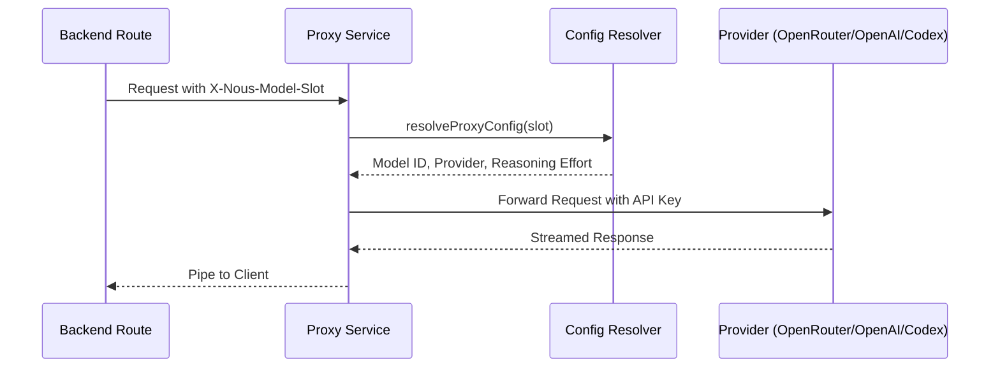

<details>
<summary>Relevant source files</summary>

The following files were used as context for generating this wiki page:

- [apps/web/components/library/HomeChatComposer.tsx](apps/web/components/library/HomeChatComposer.tsx)
- [apps/backend/src/routes/contextChat.ts](apps/backend/src/routes/contextChat.ts)
- [apps/backend/src/routes/chatPrompts.ts](apps/backend/src/routes/chatPrompts.ts)
- [apps/backend/tests/routes/chat.test.ts](apps/backend/tests/routes/chat.test.ts)
- [apps/backend/src/routes/openRouterProxy.ts](apps/backend/src/routes/openRouterProxy.ts)
- [apps/web/types.ts](apps/web/types.ts)
</details>

# Chat UI & AI Context Assistant

The **Chat UI & AI Context Assistant** system provides a sophisticated, context-aware interaction layer within the Nous platform. It enables users to engage with an AI tutor that understands the specific pedagogical context of the current view—whether it be a specific text selection, an entire lesson, or the broader library. This system bridges the frontend user interface, which captures user intent and context, with a backend orchestration layer that leverages Large Language Models (LLMs) via providers like OpenRouter, OpenAI, and a proprietary Codex service.

The primary purpose of the assistant is to act as a "Professor Nous," providing clarifications, generating visual artifacts, and performing web-based research to supplement learning materials. It utilizes a tool-calling architecture to interact with the library's data, such as retrieving lesson details or proposing new study notes based on the conversation flow.

## System Architecture

The architecture is divided into a React-based frontend for user interaction and an Express-based backend for context processing and AI orchestration.

### Data Flow Overview
The following diagram illustrates the lifecycle of a context-aware chat request, from the user's interaction in the UI to the final streamed response.

```mermaid
flowchart TD
    subgraph UI[Frontend UI]
        Composer[HomeChatComposer / Selection]
        Picker[Context Picker]
    end

    subgraph Backend[Backend API]
        Router[contextChatRouter]
        PromptBuilder[buildContextSystemPrompt]
        ToolSet[buildContextToolSet]
        Model[Configured Text Model]
        CodexStream[Codex Chat Stream]
    end

    subgraph AI[AI Services]
        OpenRouter
        OpenAI
        Codex[Codex App Server]
    end

    Composer -->|POST /api/chat/context| Router
    Router --> PromptBuilder
    Router --> ToolSet
    Router -->|createConfiguredTextModel + streamText| Model
    Model --> OpenRouter
    Model --> OpenAI
    Router -->|createCodexChatStream| CodexStream
    CodexStream --> Codex
    AI -->>|Streamed UI Messages| Router
    Router -->>|pipeUIMessageStream| Composer
```

*The flow demonstrates how frontend components package context (selections, references) for the backend, which resolves the model configuration and streams directly through the configured provider or Codex chat service.*
Sources: [apps/backend/src/routes/contextChat.ts:605-632](apps/backend/src/routes/contextChat.ts#L605-L632), [apps/web/components/library/HomeChatComposer.tsx:432-452](apps/web/components/library/HomeChatComposer.tsx#L432-L452)

## Frontend Components

### HomeChatComposer
The `HomeChatComposer` is a specialized input component designed for the library view. It supports two primary modes: `new-course` for onboarding/assessment and `library-query` for interacting with the existing library.

Key features include:
*  **Context Attachment:** A "paperclip" menu allows users to attach specific folders or projects as context for their queries.
*  **Tool Preferences:** Users can toggle "Web Search" and "Generate Visual Artifacts" directly from the UI.
*  **Speech Input:** Integration with `SpeechInputButton` for voice-to-text capabilities.
*  **Floating Menus:** Intelligent placement logic (`getMenuVerticalPlacement`) to ensure menus stay within the viewport.

Sources: [apps/web/components/library/HomeChatComposer.tsx:41-58](apps/web/components/library/HomeChatComposer.tsx#L41-L58), [apps/web/components/library/HomeChatComposer.tsx:210-238](apps/web/components/library/HomeChatComposer.tsx#L210-L238)

### Context Scopes
The system defines three distinct scopes for contextual interaction:
| Scope | Description |
| :--- | :--- |
| `selection` | Focused on specific text highlighted by the user. |
| `lesson` | Provides the entire content of the current lesson as context. |
| `annotation` | Tied to a specific pre-existing note or highlight. |

Sources: [apps/backend/src/routes/contextChat.ts:43](apps/backend/src/routes/contextChat.ts#L43), [apps/web/types.ts:471](apps/web/types.ts#L471)

## Backend Orchestration

### Context Processing
The backend `contextChatRouter` validates incoming requests, ensuring that the required context (like `selectedText` for selection-scoped chats) is present. It sanitizes and serializes source references to ensure they fit within the AI prompt budget.

```typescript
// Example of context serialization
export const serializeContextSourceReferencesForPrompt = (
  sourceReferences?: readonly ContextSourceReference[]
): string =>
  JSON.stringify(
    (sourceReferences || []).map(({ chunkIds, name, pageEnd, pageStart, sourceId }) => ({
      chunkIds: chunkIds.map(sanitizeContextSourcePromptToken),
      name: sanitizeContextSourceDisplayName(name),
      ...(pageEnd === undefined ? {} : { pageEnd }),
      ...(pageStart === undefined ? {} : { pageStart }),
      sourceId: sanitizeContextSourcePromptToken(sourceId),
    })),
    null,
    2
  );
```

Sources: [apps/backend/src/routes/chatPrompts.ts:384-398](apps/backend/src/routes/chatPrompts.ts#L384-L398), [apps/backend/src/routes/contextChat.ts:404-450](apps/backend/src/routes/contextChat.ts#L404-L450)

### AI Toolset
The assistant uses a "Tool Calling" pattern to perform actions. The `buildContextToolSet` includes:
*  **Web Search:** Uses the `searchWeb` tool (powered by OpenRouter or OpenAI) to perform external cross-checks.
*  **Artifact Generation:** `generateCurrentLessonArtifact` for creating dynamic SVG, Mermaid, or HTML visualizations.
*  **Library Retrieval:** Tools like `getLessonDetails` and `listLibraryTree` for querying the user's stored knowledge.
*  **Note Management:** `requestAddToNotes` for proposing new study notes based on AI clarifications.

Sources: [apps/backend/src/routes/contextChat.ts:182-316](apps/backend/src/routes/contextChat.ts#L182-L316), [apps/backend/src/routes/chatPrompts.ts:503-549](apps/backend/src/routes/chatPrompts.ts#L503-L549)

### AI Proxy and Model Resolution
The `openRouterProxy` acts as a centralized gatekeeper for all AI requests. It resolves the appropriate model based on the "Model Slot" (e.g., `context`, `research`, `artifact`) and the user's specific provider overrides.



*The sequence illustrates how the system abstracts individual model choices from the functional routes.*
Sources: [apps/backend/src/routes/openRouterProxy.ts:74-124](apps/backend/src/routes/openRouterProxy.ts#L74-L124), [apps/backend/tests/routes/chat.test.ts:373-395](apps/backend/tests/routes/chat.test.ts#L373-L395)

## API Reference: `/api/chat/context`

| Parameter | Type | Description |
| :--- | :--- | :--- |
| `messages` | `UIMessage[]` | The chat history. |
| `contextScope` | `string` | `selection`, `lesson`, or `annotation`. |
| `selectedText` | `string` | The text currently highlighted (required for `selection` scope). |
| `sourceReferences` | `object[]` | Metadata for source files (PDF name, page ranges, chunk IDs). |
| `toolPreferences` | `object` | Booleans for `webSearch`, `annotate`, and `generateArtifacts`. |

Sources: [apps/backend/src/routes/contextChat.ts:404-440](apps/backend/src/routes/contextChat.ts#L404-L440), [apps/backend/tests/routes/chat.test.ts:245-280](apps/backend/tests/routes/chat.test.ts#L245-L280)

## Summary
The Chat UI & AI Context Assistant is a multi-layered system that leverages the AI-SDK for streaming responses and tool execution. By strictly coupling the UI selection context with backend prompt engineering and a robust proxy layer, it provides a seamless "Professor Nous" experience that remains grounded in the user's specific study materials.
