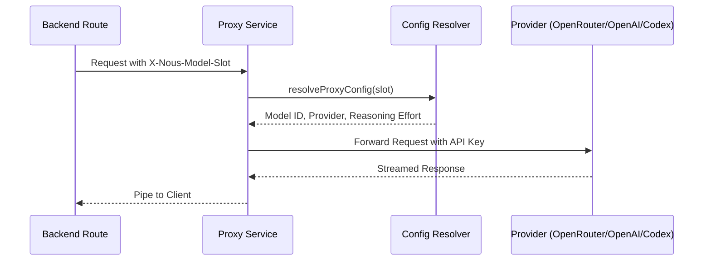

<details>
<summary>Relevant source files</summary>

The following files were used as context for generating this wiki page:

- [apps/web/components/library/HomeChatPanel.tsx](../../../apps/web/components/library/HomeChatPanel.tsx)
- [apps/web/components/library/HomeChatPanelFrame.tsx](../../../apps/web/components/library/HomeChatPanelFrame.tsx)
- [apps/web/components/library/useHomeChatPanelState.ts](../../../apps/web/components/library/useHomeChatPanelState.ts)
- [apps/web/components/library/HomeChatComposer.tsx](../../../apps/web/components/library/HomeChatComposer.tsx)
- [apps/backend/src/routes/contextChat.ts](../../../apps/backend/src/routes/contextChat.ts)
- [apps/backend/src/routes/contextSourceArchiveTool.ts](../../../apps/backend/src/routes/contextSourceArchiveTool.ts)
- [apps/backend/src/routes/contextSourceArchiveSearch.ts](../../../apps/backend/src/routes/contextSourceArchiveSearch.ts)
- [apps/backend/src/routes/chatPrompts.ts](../../../apps/backend/src/routes/chatPrompts.ts)
- [apps/backend/tests/routes/chat.test.ts](../../../apps/backend/tests/routes/chat.test.ts)
- [apps/web/tests/components/library/HomeChatPanel.test.tsx](../../../apps/web/tests/components/library/HomeChatPanel.test.tsx)
- [apps/backend/src/routes/openRouterProxy.ts](../../../apps/backend/src/routes/openRouterProxy.ts)
- [apps/web/types.ts](../../../apps/web/types.ts)
</details>

# Chat UI & AI Context Assistant

Nous chat answers questions about selected text, lessons, and courses. The React interface sends the selected context to the backend, which builds the model instructions and streams the answer. Model tools can retrieve lesson details, research sources, and generate visuals.

- [System architecture](#system-architecture)
- [Frontend components](#frontend-components)
  - [Initial knowledge collection](#initial-knowledge-collection)
- [Backend orchestration](#backend-orchestration)
- [Context chat API](#api-reference-apichatcontext)

## System Architecture

The architecture is divided into a React-based frontend for user interaction and an Express-based backend for context processing and AI orchestration.

### Data Flow Overview
The following diagram illustrates the lifecycle of a context-aware chat request, from the user's interaction in the UI to the final streamed response.

```mermaid
flowchart TD
    subgraph UI[Frontend UI]
        Composer[HomeChatComposer / Selection]
        Picker[Context Picker]
    end

    subgraph Backend[Backend API]
        Router[contextChatRouter]
        PromptBuilder[buildContextSystemPrompt]
        ToolSet[buildContextToolSet]
        Model[Configured Text Model]
        CodexStream[Codex Chat Stream]
    end

    subgraph AI[AI Services]
        OpenRouter
        OpenAI
        Codex[Codex App Server]
    end

    Composer -->|POST /api/chat/context| Router
    Router --> PromptBuilder
    Router --> ToolSet
    Router -->|createConfiguredTextModel + streamText| Model
    Model --> OpenRouter
    Model --> OpenAI
    Router -->|createCodexChatStream| CodexStream
    CodexStream --> Codex
    AI -->>|Streamed UI Messages| Router
    Router -->>|pipeUIMessageStream| Composer
```

*The flow demonstrates how frontend components package context (selections, references) for the backend, which resolves the model configuration and streams directly through the configured provider or Codex chat service.*
Sources: [apps/backend/src/routes/contextChat.ts:605-632](../../../apps/backend/src/routes/contextChat.ts#L605-L632), [apps/web/components/library/HomeChatComposer.tsx:432-452](../../../apps/web/components/library/HomeChatComposer.tsx#L432-L452)

## Frontend Components

### Home Chat Panel Boundaries

`HomeChatPanel` coordinates the conversation and composer while delegating the responsive shell, mode selector, and clear action to `HomeChatPanelFrame`. `useHomeChatPanelState` owns transient surfaces, active-message selection, loading state, compact presentation, mobile viewport state, and mode-change cleanup. A parent-driven mode change also clears any open attachment or tool surface so returning to the previous mode cannot restore stale controls.

Assessment completion contributes to an active chat only in `new-course` mode. An empty `library-query` remains compact even when the course assessment has already completed, while visible library messages or library loading expand it normally.

Selecting the current mode does not dispatch another mode change or clear the active surface. Keyboard activation of the selected tab preserves an open attachment or tool menu; pointer clicks outside the composer still dismiss menus normally.

Sources: [apps/web/components/library/HomeChatPanel.tsx](../../../apps/web/components/library/HomeChatPanel.tsx), [apps/web/components/library/HomeChatPanelFrame.tsx](../../../apps/web/components/library/HomeChatPanelFrame.tsx), [apps/web/components/library/useHomeChatPanelState.ts](../../../apps/web/components/library/useHomeChatPanelState.ts), [apps/web/tests/components/library/HomeChatPanel.test.tsx](../../../apps/web/tests/components/library/HomeChatPanel.test.tsx)

### Initial knowledge collection

Learners select depth and lesson size, then confirm the choices in the chat. Their selected values remain visible as a message while the first diagnostic pass is prepared. `HomeChatConversation` displays `DiagnosticFlow` in a taller scrollable chat body and hides the regular composer. The generation screen opens after the diagnostic collection finishes.

The diagnostic uses the chat's readable width and bounded sliders. Desktop and mobile use the same slider, with four verbal self-assessment categories and a separate uncertain stop. Answering a parent reveals its children. Completed branches stay open until the learner closes them. Only the active slider shows its description. When the previous description collapses, scroll compensation keeps the active control in view.

Targeted questions reuse the lesson quiz option layout. Learners move between questions in a fixed pass while the client keeps their answer drafts. The final action submits the pass directly, including explicit omissions. Feedback appears after the whole collection ends and explains the starting point without a grade.

Each submission keeps its original wait and request identity. If the network response is lost, the client retries the same submission. Learners can navigate the submitted answers but cannot edit them until the outcome is known. Terminal failures preserve visible answers and stop offering submission retries.

A repeated approval adopts a diagnostic that already started, provided the course is still selected. After feedback, continuation opens the exact generation run, including one that completed while the learner was reading.

The development route `/dev/diagnostic` uses the real chat and question components with fixed synthetic stages. It is enabled only in development.

Proposal events identify support for course preferences. Resumed historical interviews keep their original controls. The [diagnostic workflow](01-p-course-gen.md#diagnostic-evidence-before-generation) owns evidence storage and evaluation.

Sources: [DiagnosticFlow.tsx](../../../apps/web/components/library/diagnostic/DiagnosticFlow.tsx), [SelfAssessmentControl.tsx](../../../apps/web/components/library/diagnostic/SelfAssessmentControl.tsx), [assessmentPlanning.ts](../../../apps/web/hooks/workspace/controller/assessmentPlanning.ts), [courseInterviewClient.ts](../../../apps/web/services/openrouter/courseInterviewClient.ts)

### HomeChatComposer
The `HomeChatComposer` is a specialized input component designed for the library view. It supports two primary modes: `new-course` for onboarding/assessment and `library-query` for interacting with the existing library.

Key features include:
*  **Context Attachment:** A "paperclip" menu allows users to attach specific folders or projects as context for their queries.
*  **Tool Preferences:** Users can toggle "Web Search" and "Generate Visual Artifacts" directly from the UI.
*  **Speech Input:** Integration with `SpeechInputButton` for voice-to-text capabilities.
*  **Floating Menus:** Intelligent placement logic (`getMenuVerticalPlacement`) to ensure menus stay within the viewport.

Sources: [apps/web/components/library/HomeChatComposer.tsx:41-58](../../../apps/web/components/library/HomeChatComposer.tsx#L41-L58), [apps/web/components/library/HomeChatComposer.tsx:210-238](../../../apps/web/components/library/HomeChatComposer.tsx#L210-L238)

### Context Scopes
The system defines three distinct scopes for contextual interaction:
| Scope | Description |
| :--- | :--- |
| `selection` | Focused on specific text highlighted by the user. |
| `lesson` | Provides the entire content of the current lesson as context. |
| `annotation` | Tied to a specific pre-existing note or highlight. |

Sources: [apps/backend/src/routes/contextChat.ts:43](../../../apps/backend/src/routes/contextChat.ts#L43), [apps/web/types.ts:471](../../../apps/web/types.ts#L471)

### Contextual Follow-up Panel

The reader keeps contextual follow-ups in a session panel bound to the lesson and course where the conversation started. Retrieved material is appended only after the corresponding assistant response completes and is collapsed by default, so streaming remains readable. Opening a recovered lesson reference may retain the panel for that explicit lesson transition; ordinary lesson changes close it. Project-only references and references to the lesson already visible close the panel when there is no annotation target to reveal, so an enabled open control always produces a visible result.

Artifact tools in a retained conversation continue to query the origin lesson. Successful saves and replacements update that origin snapshot immediately, so later tool calls observe the same artifacts that were persisted without rebinding the conversation to the currently displayed lesson.

Artifact retrieval also includes temporary drafts displayed in that conversation, while saved versions take precedence over earlier displayed copies. Editing generated visuals requires an explicit replacement mode and the exact source artifact identity; PDF images and future assets support retrieval only. The generation result makes the replacement draft available before it can be reported as successful. Approval replaces a temporary source in the conversation and keeps the revised draft available to save; replacing a saved source updates the lesson and the tool results with the persisted identity for subsequent edits. Replacement completion considers only the final tool step, so an earlier artifact lookup does not restart a completed replacement. New generation retains the existing continuation behavior for subsequent save tools.

The contextual artifact resolver validates the origin lesson throughout a draft chain and resolves the original replacement target. Approving a revision of a revision persists that original target in one action. Approval updates displayed drafts, generation and retrieval results, and pending note confirmations to reference the approved artifact. Cross-lesson artifacts remain available for retrieval but cannot become contextual replacement sources.

The origin snapshot also controls Save availability: temporary artifacts can be saved, while saved or replaced artifacts keep their preview and regeneration action without offering another save that would create a duplicate attachment.

Replacement approval waits for an in-flight save of its source, including saves through note confirmation. It uses the completed persistence result when deciding whether to replace the saved original or update a temporary draft, so a slower save cannot overwrite the approved revision afterward.

Contextual note proposals are accepted only when the annotation resolver can anchor the proposed text in the origin lesson markdown. The resolver matches the text that the reader renders, including normalized prose indentation and raw HTML after unsupported tags are escaped. It excludes Markdown syntax that has no rendered text, fenced code, math, images, placeholders, link destinations, and footnote labels such as `[^note]`. The visible body of a footnote remains anchorable. When the model narrows the selected text, the original source position keeps a repeated phrase on the occurrence the learner selected. Missing text and text available only through an artifact or unsupported viewer are rejected before the approval prompt, even when contextual chat could read that material.

Sources: [apps/web/components/workspace/shell/ContextAnswerPanel.tsx](../../../apps/web/components/workspace/shell/ContextAnswerPanel.tsx), [apps/web/components/workspace/ReadingScreenContainer.tsx](../../../apps/web/components/workspace/ReadingScreenContainer.tsx), [apps/web/hooks/reader/useReaderContext.ts](../../../apps/web/hooks/reader/useReaderContext.ts), [apps/web/utils/context/conversationNote.ts](../../../apps/web/utils/context/conversationNote.ts), [apps/web/utils/learning/sectionAnnotationProjection.ts](../../../apps/web/utils/learning/sectionAnnotationProjection.ts), [apps/web/utils/markdown/codeRanges.ts](../../../apps/web/utils/markdown/codeRanges.ts), [apps/web/utils/markdown/textProjection.ts](../../../apps/web/utils/markdown/textProjection.ts)

## Backend Orchestration

### Context Processing
The backend `contextChatRouter` validates incoming requests, ensuring that the required context (like `selectedText` for selection-scoped chats) is present. It sanitizes and serializes source references to ensure they fit within the AI prompt budget.

```typescript
// Example of context serialization
export const serializeContextSourceReferencesForPrompt = (
  sourceReferences?: readonly ContextSourceReference[]
): string =>
  JSON.stringify(
    (sourceReferences || []).map(
      ({ archiveSelectors, chunkIds, name, pageEnd, pageStart, sourceId }) => ({
        ...(archiveSelectors
          ? {
              archiveSelectors: archiveSelectors.map(selector => ({
                kind: selector.kind,
                path: sanitizeContextSourceArchivePath(selector.path),
              })),
            }
          : {}),
        chunkIds: chunkIds.map(sanitizeContextSourcePromptToken),
        name: sanitizeContextSourceDisplayName(name),
        ...(pageEnd === undefined ? {} : { pageEnd }),
        ...(pageStart === undefined ? {} : { pageStart }),
        sourceId: sanitizeContextSourcePromptToken(sourceId),
      })
    ),
    null,
    2
  );
```

Sources: [apps/backend/src/routes/chatPrompts.ts:384-398](../../../apps/backend/src/routes/chatPrompts.ts#L384-L398), [apps/backend/src/routes/contextChat.ts:404-450](../../../apps/backend/src/routes/contextChat.ts#L404-L450)

### AI Toolset
The assistant uses a "Tool Calling" pattern to perform actions. The `buildContextToolSet` includes:
*  **Web Search:** Uses the `searchWeb` tool (powered by OpenRouter or OpenAI) to perform external cross-checks.
*  **Artifact Generation:** `generateCurrentLessonArtifact` for creating dynamic SVG, Mermaid, or HTML visualizations.
*  **Library Retrieval:** Tools like `getLessonDetails` and `listLibraryTree` for querying the user's stored knowledge.
*  **Note Management:** `requestAddToNotes` for proposing new study notes based on AI clarifications.

Sources: [apps/backend/src/routes/contextChat.ts:182-316](../../../apps/backend/src/routes/contextChat.ts#L182-L316), [apps/backend/src/routes/chatPrompts.ts:503-549](../../../apps/backend/src/routes/chatPrompts.ts#L503-L549)

### Retained Source Archive Retrieval

For an archive-backed lesson, contextual chat carries the retained source identity, archive representation version, and the lesson's exact archive selectors without sending archive bytes. The backend exposes `retrieveSourceArchive` only when that complete retained-source context is present. Each tool call resolves the authenticated user from the request, reloads the current project's archive index, and requires an exact version match before reusing the existing bounded archive access layer.

The tool can resolve the lesson selectors, page through the ordered archive index or one exact directory, search textual entries for a literal string, and read a bounded page from one exact indexed path. Index and directory pages use numeric `entryCursor`/`nextEntryCursor` offsets, literal searches use a separately typed, signed `searchCursor`/`nextSearchCursor`, and exact reads use `cursorBytes`/`nextCursorBytes`. The compact search cursor is bound to the authenticated tenant, project, exact archive version, and query, so it can resume across bounded contextual-chat requests without trusting client-provided state or embedding retained source text. Each search call reads one forward text page plus only the bounded prior-byte tail needed to detect a literal crossing the page boundary, so an archive-wide miss cannot synchronously load and decode every retained file. JSON-escaped text is shortened at a valid UTF-8 boundary when needed to keep the complete serialized result bounded, retained previews are stripped from browsing pages, and an index entry or search match too large to serialize is reported as omitted while pagination remains truthful. Successful outputs carry the archive name and exact path citations; literal-search citations also carry line, column, and a UTF-8-safe `cursorBytes` that can be passed directly to `read-file`, including for matches that span two search pages. Search continuation state remembers whether any earlier page matched, so a final empty page remains `ok` instead of falsely becoming `no-match`. Its result states are intentionally distinct: `no-match` means a completed search or selector resolution found nothing, `unavailable` means the archive is missing or changed, `limit-reached` means either the selector/access layer or serialized contextual retrieval budget is exhausted, and `error` means retrieval failed technically. All terminal responses count against the same cumulative bounded result budget. A generic `searchLibrary` miss is not evidence that retained archive files are absent.

Archive identity metadata remains available when the aggregate source preview exceeds the contextual prompt budget, allowing the tool to find entries omitted from that preview. Complete serialized tool results share the existing contextual-chat budget, and an interrupted HTTP response cancels pending archive reads. Archive-specific model instructions are emitted only when the versioned tool is actually registered; legacy snapshots without a usable archive version receive an honest context-limited rule instead of being told to call a missing tool. When registered, the system prompt classifies every returned archive field and file body as untrusted source data rather than instructions. Tenant/project authorization, archive-version checks, path validation, text-only reads, and exact selectors remain authoritative on the backend. The shared activity strip presents this operation as the localized “Consulta sorgente” action instead of exposing its internal tool name.

Sources: [apps/web/utils/context/sourceMaterial.ts](../../../apps/web/utils/context/sourceMaterial.ts), [apps/web/components/workspace/shell/ContextAnswerPanel.tsx](../../../apps/web/components/workspace/shell/ContextAnswerPanel.tsx), [apps/backend/src/routes/contextChat.ts](../../../apps/backend/src/routes/contextChat.ts), [apps/backend/src/routes/contextSourceArchiveTool.ts](../../../apps/backend/src/routes/contextSourceArchiveTool.ts), [apps/backend/src/routes/contextSourceArchiveSearch.ts](../../../apps/backend/src/routes/contextSourceArchiveSearch.ts), [apps/backend/src/projects/sourceArchiveAccess.ts](../../../apps/backend/src/projects/sourceArchiveAccess.ts)

### AI Proxy and Model Resolution
The `openRouterProxy` acts as a centralized gatekeeper for all AI requests. It resolves the appropriate model based on the "Model Slot" (e.g., `context`, `research`, `artifact`) and the user's specific provider overrides.



*The sequence illustrates how the system abstracts individual model choices from the functional routes.*
Sources: [apps/backend/src/routes/openRouterProxy.ts:74-124](../../../apps/backend/src/routes/openRouterProxy.ts#L74-L124), [apps/backend/tests/routes/chat.test.ts:373-395](../../../apps/backend/tests/routes/chat.test.ts#L373-L395)

## API Reference: `/api/chat/context`

| Parameter | Type | Description |
| :--- | :--- | :--- |
| `messages` | `UIMessage[]` | The chat history. |
| `contextScope` | `string` | `selection`, `lesson`, or `annotation`. |
| `selectedText` | `string` | The text currently highlighted (required for `selection` scope). |
| `sourceReferences` | `object[]` | Metadata for source files (PDF name, page ranges, chunk IDs). |
| `toolPreferences` | `object` | Booleans for `webSearch`, `annotate`, and `generateArtifacts`. |

Sources: [apps/backend/src/routes/contextChat.ts:404-440](../../../apps/backend/src/routes/contextChat.ts#L404-L440), [apps/backend/tests/routes/chat.test.ts:245-280](../../../apps/backend/tests/routes/chat.test.ts#L245-L280)
