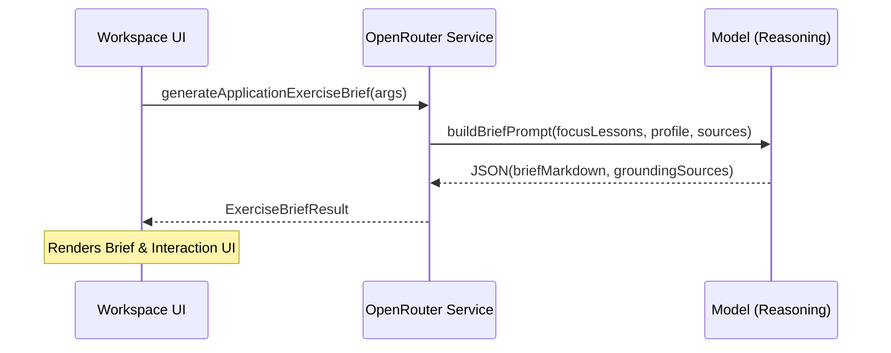

<details>
<summary>Relevant source files</summary>

The following files were used as context for generating this wiki page:

- [apps/backend/src/services/lessonGenerationModel.ts](../../../apps/backend/src/services/lessonGenerationModel.ts)
- [apps/backend/src/services/lessonGenerationPrompt.ts](../../../apps/backend/src/services/lessonGenerationPrompt.ts)
- [apps/web/services/openrouter/exercises/brief.ts](../../../apps/web/services/openrouter/exercises/brief.ts)
- [apps/web/components/workspace/shell/WorkspaceReaderContent.tsx](../../../apps/web/components/workspace/shell/WorkspaceReaderContent.tsx)
- [packages/shared-types/lessonWritingContract.ts](../../../packages/shared-types/lessonWritingContract.ts)
- [apps/web/types.ts](../../../apps/web/types.ts)
- [apps/web/tests/components/workspace/shell/WorkspaceReaderContent.test.tsx](../../../apps/web/tests/components/workspace/shell/WorkspaceReaderContent.test.tsx)
</details>

# Interactive Exercises & Quizzes

Interactive Exercises and Quizzes represent the active learning layer of the Nous platform. This system is designed to transform passive reading into an engaging pedagogical experience by integrating two primary types of interaction: **Inline Quizzes** (referred to as "Active Pauses") and **Application Exercises** (hands-on labs). These elements are strategically placed within the lesson flow to require application, inference, diagnosis, or synthesis from the student.

The system ensures that these interactive components are self-sufficient, meaning all information required to solve a quiz or complete an exercise is provided within the preceding lesson content or the exercise brief itself. This architecture supports the project's manifesto of being an ADHD-friendly, step-by-step learning environment.

Sources: [apps/backend/src/services/lessonGenerationPrompt.ts:84-90](../../../apps/backend/src/services/lessonGenerationPrompt.ts#L84-L90), [apps/web/services/openrouter/exercises/brief.ts:182-195](../../../apps/web/services/openrouter/exercises/brief.ts#L182-L195), [AGENTS.md:104-108](../../../AGENTS.md#L104-L108)

## Inline Quizzes (Active Pauses)

Inline quizzes, internally typed as `inline-quiz`, are micro-assessments embedded directly within the markdown content blocks of a lesson. They are governed by strict pedagogical rules to ensure they consume the preceding explanatory context and do not merely ask for simple paraphrasing.

### Architecture and Data Flow

Quizzes are generated as part of the `contentBlocks` array within a lesson. A lesson can contain between zero and three active pauses. The backend enforces a contract where an `inline-quiz` must be preceded by at least one `markdown` block that provides the necessary context for the question.

```mermaid
flowchart TD
    LG[Lesson Generator] -->|Produces| CB[Content Blocks Array]
    CB --> M1[Markdown Block]
    CB --> Q1[Inline Quiz Block]
    CB --> M2[Markdown Block]
    Q1 -.->|Consumes Context| M1
    
    subgraph Quiz Structure
        QS[Question Text]
        OP[4 Distinct Options]
        CI[Correct Index 0-3]
        ET[Exercise Type]
    end
    Q1 --- Quiz Structure
```

*The diagram shows the sequential requirement where a quiz must follow a markdown block that provides its factual grounding.*
Sources: [apps/backend/src/services/lessonGenerationModel.ts:31-40](../../../apps/backend/src/services/lessonGenerationModel.ts#L31-L40), [apps/backend/src/services/lessonGenerationPrompt.ts:84-90](../../../apps/backend/src/services/lessonGenerationPrompt.ts#L84-L90)

### Quiz Configuration and Types

Quizzes must use one of the approved `exerciseType` values, such as `prediction`, `application-card`, `diagnosis`, or `sequencing`. The data structure is strictly validated via JSON schema to ensure four options and a valid correct index.

| Field | Type | Description |
| :--- | :--- | :--- |
| `question` | string | The pedagogical query posed to the student. |
| `options` | string[] | Array of exactly 4 plausible distractors and one correct answer. |
| `correctIndex` | integer | Index (0-3) of the correct option. |
| `exerciseType` | string | The cognitive task required (e.g., inference, classification). |

Sources: [apps/backend/src/services/lessonGenerationModel.ts:31-40](../../../apps/backend/src/services/lessonGenerationModel.ts#L31-L40), [apps/web/types.ts:251-257](../../../apps/web/types.ts#L251-L257)

## Application Exercises (Labs)

Application Exercises are high-level tasks where students produce artifacts such as reports, procedures, or code. Unlike inline quizzes, these are standalone nodes within the `LearningPlan` that focus on assessed objectives.

### Exercise Brief Generation

The system generates an "Exercise Brief" (consign) that provides a realistic scenario. The generation logic strictly forbids asking the student to search for external material; all data or datasets required must be included in the brief.



*Sequence of generating the hands-on exercise brief based on focus lessons and student profile.*
Sources: [apps/web/services/openrouter/exercises/brief.ts:173-205](../../../apps/web/services/openrouter/exercises/brief.ts#L173-L205), [apps/web/components/workspace/shell/WorkspaceReaderContent.tsx:431-450](../../../apps/web/components/workspace/shell/WorkspaceReaderContent.tsx#L431-L450)

### Student Interaction and Evaluation

The `ApplicationExerciseViewer` provides a multi-modal interface for exercise completion:
1.  **Internal Text Editor:** A markdown-enabled editor for writing reports or procedures with live preview.
2.  **File Attachments:** Support for uploading `.zip` archives, code files, or text documents.
3.  **AI Feedback:** Students can request feedback, which returns a score (0-100), qualitative labels, strengths, and improvements.

Sources: [apps/web/components/workspace/shell/WorkspaceReaderContent.tsx:498-580](../../../apps/web/components/workspace/shell/WorkspaceReaderContent.tsx#L498-L580), [apps/web/types.ts:402-411](../../../apps/web/types.ts#L402-L411)

## Implementation Details

### Validation and Logic

The backend performs strict validation of interactive components during the generation phase to prevent broken pedagogical flows.

```typescript
// apps/backend/src/services/lessonGenerationModel.ts:279-289
const hasInvalidQuizPlacement = (draft: LessonContentDraft): boolean => {
  let hasExplanatoryMarkdown = false;
  for (const block of draft.contentBlocks) {
    if (block.type === 'markdown') {
      hasExplanatoryMarkdown = Boolean(block.markdown.trim());
      continue;
    }
    if (block.type !== 'inline-quiz') continue;
    if (!hasExplanatoryMarkdown) return true; // Error: Quiz without preceding context
    hasExplanatoryMarkdown = false; // Reset: Next quiz needs new markdown
  }
  return false;
};
```

Sources: [apps/backend/src/services/lessonGenerationModel.ts:279-291](../../../apps/backend/src/services/lessonGenerationModel.ts#L279-L291), [apps/web/tests/utils/reader/lessonContentBlocks.test.ts:31-49](../../../apps/web/tests/utils/reader/lessonContentBlocks.test.ts#L31-L49)

### UI Components

The `WorkspaceReaderContent` component acts as the orchestrator for rendering these interactions. It manages the state of quiz answers and visibility of exercise deliverables.

*  `WorkspaceReaderInlineQuestion`: Renders the four-option quiz card.
*  `WorkspaceReaderQuizFooter`: Controls the ability to advance to the next section; completion is blocked until all inline questions are answered.
*  `ExerciseInternalTextEditor`: Provides the workspace for application exercise output.

Sources: [apps/web/components/workspace/shell/WorkspaceReaderContent.tsx:758-769](../../../apps/web/components/workspace/shell/WorkspaceReaderContent.tsx#L758-L769), [apps/web/components/workspace/shell/WorkspaceReaderContent.tsx:498-508](../../../apps/web/components/workspace/shell/WorkspaceReaderContent.tsx#L498-L508)

## Summary

Interactive exercises and quizzes support active learning when a lesson or learning plan needs them. A lesson may contain zero to three active pauses, each grounded in preceding explanatory content, while application exercises remain standalone learning-plan nodes with their own briefs.

Sources: [apps/backend/src/services/lessonGenerationPrompt.ts:84-90](../../../apps/backend/src/services/lessonGenerationPrompt.ts#L84-L90), [apps/web/types.ts:590-598](../../../apps/web/types.ts#L590-L598)
