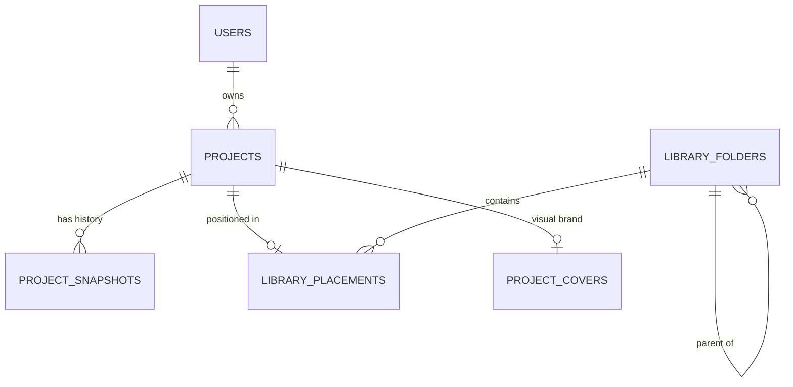
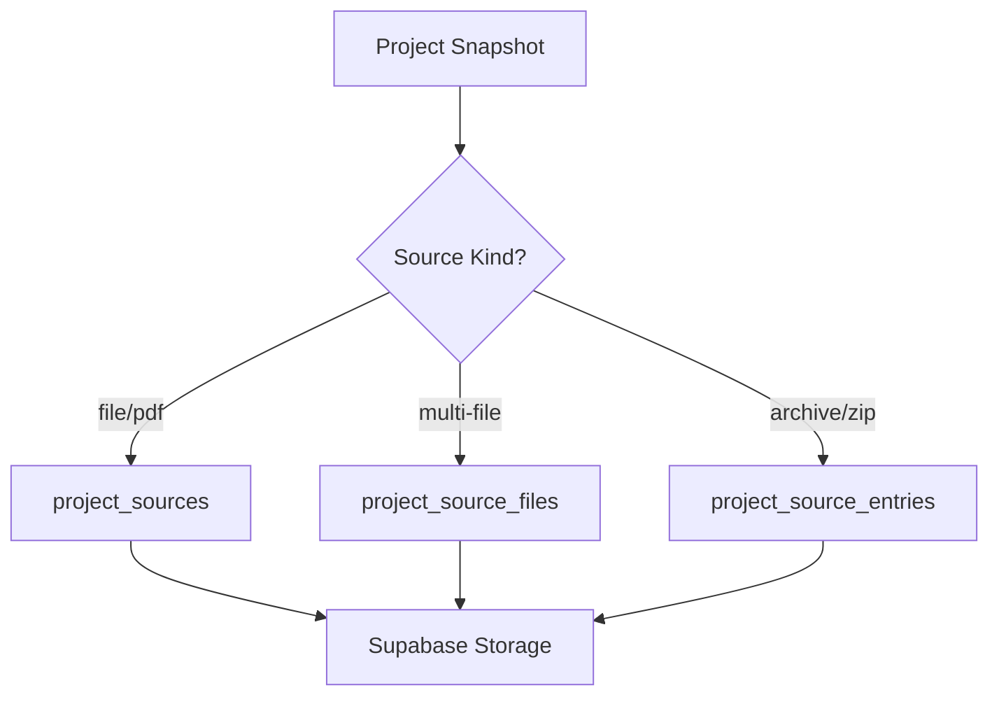
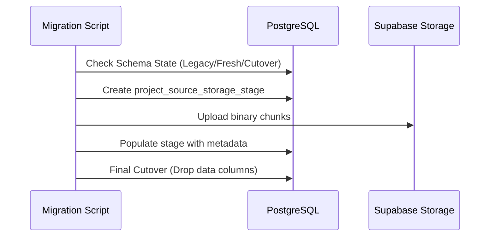

Relevant source files

The following files were used as context for generating this wiki page:

- [apps/backend/src/projects/postgresProjectStore.ts](apps/backend/src/projects/postgresProjectStore.ts)
- [apps/backend/tests/integration/supabaseLocal.integration.test.ts](apps/backend/tests/integration/supabaseLocal.integration.test.ts)
- [scripts/migrate-project-sources-to-storage.ts](scripts/migrate-project-sources-to-storage.ts)
- [scripts/project-source-storage-artifact.ts](scripts/project-source-storage-artifact.ts)
- [apps/backend/src/workflows/courseGenerationWorkflowContract.ts](apps/backend/src/workflows/courseGenerationWorkflowContract.ts)

# Supabase PostgreSQL Schema

The Supabase PostgreSQL schema serves as the primary persistence layer for the Nous Reader application. It manages user authentication integration, project metadata, learning plan snapshots, and complex relationships between courses and their underlying source materials. The schema is designed to work in conjunction with Supabase Storage for large binary assets while maintaining metadata integrity and Row Level Security (RLS) within the database.

Sources: [apps/backend/tests/integration/supabaseLocal.integration.test.ts:151-160](apps/backend/tests/integration/supabaseLocal.integration.test.ts#L151-L160), [README.md](README.md)

## Core Entities and Project Management

The schema centers around the `projects` table, which acts as the authoritative source for course metadata and versioning. Each project is owned by a `user_id` linked to Supabase Auth. A project's state is captured in `project_snapshots`, which separates high-frequency metadata updates from the relatively heavy learning plan data and document indices.

### Entity Relationship Diagram

The following diagram illustrates the core relationships between projects, snapshots, and user library organization.

Sources: [apps/backend/src/projects/postgresProjectStore.ts:192-230](apps/backend/src/projects/postgresProjectStore.ts#L192-L230), [apps/backend/src/projects/postgresProjectStore.ts:742-760](apps/backend/src/projects/postgresProjectStore.ts#L742-L760)

### Key Tables

| Table | Description | Primary Key |
| :--- | :--- | :--- |
| `public.projects` | Core project metadata, including titles and revisions. | `(user_id, id)` |
| `public.project_snapshots` | JSON snapshots of the learning plan and document index. | `(user_id, id)` |
| `public.library_folders` | User-defined folder structures for organizing courses. | `(user_id, id)` |
| `public.library_placements` | Links projects to folders with specific display ordering. | `(user_id, project_id)` |
| `public.model_config` | Global and per-user configuration for AI models. | `id` |

Sources: [apps/backend/src/projects/postgresProjectStore.ts:192-205](apps/backend/src/projects/postgresProjectStore.ts#L192-L205), [apps/backend/tests/integration/supabaseLocal.integration.test.ts:315-325](apps/backend/tests/integration/supabaseLocal.integration.test.ts#L315-L325)

## Source Material Persistence

Nous Reader employs a hybrid storage strategy for source files (PDFs, text, archives). Metadata is stored in PostgreSQL to support queries and RLS, while binary data is offloaded to Supabase Storage. The schema tracks both "primary" sources and individual entries within archive files (ZIPs).

### Source Metadata Flow

The application manages source files through several specialized tables that track object paths within the `project-sources` storage bucket.

Sources: [apps/backend/src/projects/postgresProjectStore.ts:980-1015](apps/backend/src/projects/postgresProjectStore.ts#L980-L1015), [scripts/migrate-project-sources-to-storage.ts:15-35](scripts/migrate-project-sources-to-storage.ts#L15-L35)

### Source Tracking Tables

*  **`project_sources`**: Stores primary source references, content hashes (SHA-256), and object paths. It also maintains a `representation_hash` for archives to version extracted text separately from the raw ZIP.
*  **`project_source_files`**: Handles ordered sets of source files for projects with multiple documents.
*  **`project_source_entries`**: Tracks individual files inside ZIP archives, including content kind (text vs binary) and warning reasons (e.g., `no-usable-text`).
*  **`project_source_deletions`**: A queue for background cleanup of orphaned storage objects after database rows are deleted.

Sources: [apps/backend/src/projects/postgresProjectStore.ts:133-180](apps/backend/src/projects/postgresProjectStore.ts#L133-L180), [apps/backend/src/projects/postgresProjectStore.ts:1020-1040](apps/backend/src/projects/postgresProjectStore.ts#L1020-L1040)

## Workflow and Diagnostic Schema

To manage long-running course generation tasks, the schema includes structures for tracking workflow state and import diagnostics.

### Diagnostic Monitoring

The `project_import_diagnostics` table records failures and metrics during library imports, allowing administrators to debug batch processing issues. It includes fields for correlation IDs, error codes, and progress markers (e.g., `project_index` vs `project_count`).

Sources: [apps/backend/src/projects/postgresProjectStore.ts:114-131](apps/backend/src/projects/postgresProjectStore.ts#L114-L131), [apps/backend/tests/integration/supabaseLocal.integration.test.ts:175-185](apps/backend/tests/integration/supabaseLocal.integration.test.ts#L175-L185)

### User Feedback Integration

The schema includes a `feedback_reports` table that synchronizes with GitHub issues. It captures user-reported bugs or suggestions and tracks their status from "pending" to "closed" based on the linked GitHub issue state.

Sources: [apps/backend/tests/integration/supabaseLocal.integration.test.ts:340-360](apps/backend/tests/integration/supabaseLocal.integration.test.ts#L340-L360)

## Security and Isolation

Nous Reader strictly enforces **Row Level Security (RLS)** across all tables. Every table using a `user_id` column ensures that authenticated users can only see or modify their own data.

*  **Project Isolation**: RLS policies prevent cross-tenant access. A request by User A to read Project B (owned by User B) returns null or a 403 error.
*  **Administrative Access**: Specific service-role tokens or claims (e.g., `app_metadata.role = 'admin'`) bypass RLS for maintenance and diagnostic viewing.
*  **Storage Access**: Direct access to storage objects via Supabase URLs is typically restricted; the backend acts as a proxy to verify authentication before serving binary source data.

Sources: [apps/backend/tests/integration/supabaseLocal.integration.test.ts:151-170](apps/backend/tests/integration/supabaseLocal.integration.test.ts#L151-L170), [apps/backend/tests/integration/supabaseLocal.integration.test.ts:255-265](apps/backend/tests/integration/supabaseLocal.integration.test.ts#L255-L265)

## Migration and Schema Evolution

The project uses a staged migration process for moving legacy data (previously stored in `bytea` columns) into Supabase Storage.

Sources: [scripts/migrate-project-sources-to-storage.ts:125-155](scripts/migrate-project-sources-to-storage.ts#L125-L155), [scripts/migrate-project-sources-to-storage.ts:600-620](scripts/migrate-project-sources-to-storage.ts#L600-L620)

### Legacy Transition State
The `project_source_storage_stage` table is used during transitions to hold binary-to-path mappings before the final schema cutover where the `data` column is removed from `project_sources`.

Sources: [scripts/migrate-project-sources-to-storage.ts:15-35](scripts/migrate-project-sources-to-storage.ts#L15-L35)

## Conclusion

The Supabase PostgreSQL schema for Nous Reader is optimized for course lifecycle management and library organization. By combining relational integrity for metadata with content-addressed object storage for documents, it provides a scalable and secure foundation for AI-driven learning. The extensive use of RLS and snapshotting ensures that user data remains isolated and recoverable across multiple generation attempts.
