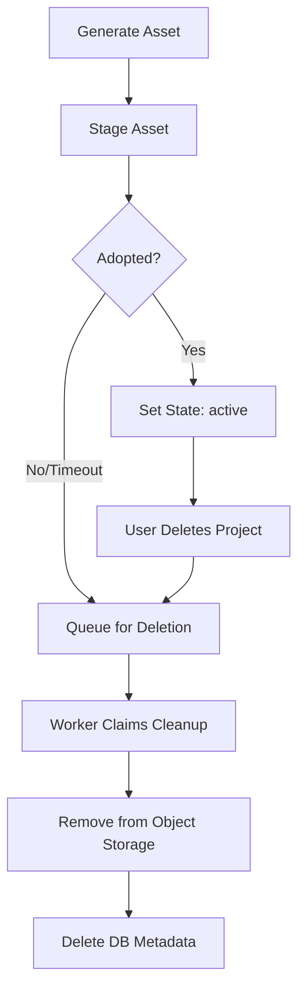
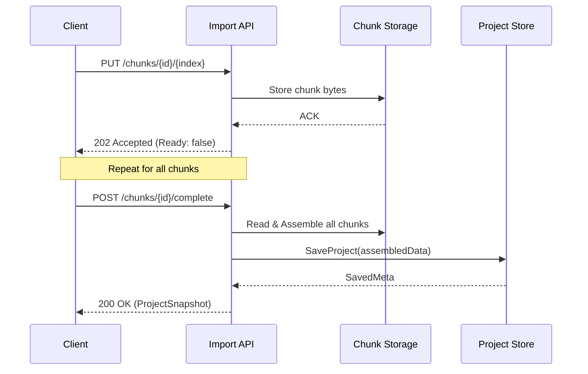

<details>
<summary>Relevant source files</summary>

The following files were used as context for generating this wiki page:

- [apps/backend/src/projects/postgresProjectAssetStore.ts](apps/backend/src/projects/postgresProjectAssetStore.ts)
- [apps/backend/src/projects/projectAssetImport.ts](apps/backend/src/projects/projectAssetImport.ts)
- [apps/backend/src/projects/projectImportChunks.ts](apps/backend/src/projects/projectImportChunks.ts)
- [apps/backend/src/projects/postgresProjectStore.ts](apps/backend/src/projects/postgresProjectStore.ts)
- [apps/backend/src/projects/projectAsset.ts](apps/backend/src/projects/projectAsset.ts)
- [packages/shared-types/projectBackupAssets.ts](packages/shared-types/projectBackupAssets.ts)
- [scripts/project-source-storage-artifact.ts](scripts/project-source-storage-artifact.ts)
</details>

# Project Assets & Storage Archives

The Project Assets & Storage Archives system is responsible for the management, persistence, and lifecycle of immutable objects and metadata associated with user projects. This includes primary source documents (e.g., PDFs, ZIP archives), generated visuals, and project-specific media. The system leverages a combination of PostgreSQL for metadata and relational consistency, and an immutable object storage (typically Supabase Storage) for large binary payloads.

The architecture emphasizes idempotency, transactional integrity, and efficient handling of large-scale imports via chunked uploads. It ensures that large project sources are detached from the primary project snapshots to maintain database performance while providing mechanisms for rehydration during export or backup operations.
Sources: [apps/backend/src/projects/postgresProjectStore.ts:1-120](apps/backend/src/projects/postgresProjectStore.ts#L1-L120), [apps/backend/src/projects/projectAsset.ts:1-30](apps/backend/src/projects/projectAsset.ts#L1-L30)

## Asset Lifecycle Management

Project assets progress through several states, from initial staging during a workflow run to becoming active parts of a project, and eventually being queued for deletion.

### Staging and Adoption
Assets are typically generated within a workflow. They are first "staged" in the `project_assets` table with a `staged` state. To ensure idempotency, a unique `idempotency_key` is used, often derived from the workflow run ID and node instance ID. Once a workflow successfully completes or a user accepts the output, the assets are "adopted" by updating their state to `active`.
Sources: [apps/backend/src/projects/postgresProjectAssetStore.ts:50-100](apps/backend/src/projects/postgresProjectAssetStore.ts#L50-L100), [apps/backend/src/projects/projectAsset.ts:80-105](apps/backend/src/projects/projectAsset.ts#L80-L105)

### Deletion and Cleanup
The system uses a "tombstone" approach for deletion. When a project or asset is deleted, it is not immediately removed from object storage. Instead, the reference is added to a deletion queue (`project_source_deletions` or `project_asset_deletions`). A background process claims these "claims" using advisory locks to prevent concurrent cleanup attempts by multiple workers.
Sources: [apps/backend/src/projects/postgresProjectStore.ts:1145-1215](apps/backend/src/projects/postgresProjectStore.ts#L1145-L1215), [apps/backend/src/projects/postgresProjectAssetStore.ts:140-180](apps/backend/src/projects/postgresProjectAssetStore.ts#L140-L180)



The diagram above illustrates the transition states of a project asset from creation to permanent removal.
Sources: [apps/backend/src/projects/postgresProjectAssetStore.ts:50-180](apps/backend/src/projects/postgresProjectAssetStore.ts#L50-L180)

## Project Source Persistence

Project sources (the primary documents) are handled differently than generic assets to optimize for size and retrieval speed.

### Detachment and Rehydration
When a project is saved, the binary data of the source is "detached" from the `ProjectSnapshot`. The bytes are uploaded to storage, and a `ProjectSourceRef` (containing the hash, size, and object path) is stored in the `project_sources` table. During export, the system "rehydrates" the snapshot by downloading the bytes and re-attaching them to the JSON structure.
Sources: [apps/backend/src/projects/postgresProjectStore.ts:740-850](apps/backend/src/projects/postgresProjectStore.ts#L740-L850), [apps/backend/src/projects/postgresProjectStore.ts:470-490](apps/backend/src/projects/postgresProjectStore.ts#L470-L490)

### Archive Indexing
ZIP archives undergo a preparation phase where they are decompressed, and individual files are indexed. This allows the system to serve specific files from within an archive without requiring the client to download the entire ZIP. The index is stored in `project_source_entries`.
Sources: [apps/backend/src/projects/postgresProjectStore.ts:854-950](apps/backend/src/projects/postgresProjectStore.ts#L854-L950), [apps/backend/src/projects/postgresProjectStore.ts:1075-1140](apps/backend/src/projects/postgresProjectStore.ts#L1075-L1140)

| Component | Responsibility | Relevant Files |
| :--- | :--- | :--- |
| `PostgresProjectStore` | Coordination of snapshots, revisions, and sources. | `postgresProjectStore.ts` |
| `PostgresProjectAssetStore` | Management of generated visuals and workflow assets. | `postgresProjectAssetStore.ts` |
| `SupabaseProjectSourceStorage` | Interaction with the immutable object storage API. | `projectSourceStorage.ts` |
| `ProjectAssetImporter` | Re-identifying and uploading assets during project restore. | `projectAssetImport.ts` |
Sources: [apps/backend/src/projects/postgresProjectStore.ts](apps/backend/src/projects/postgresProjectStore.ts), [apps/backend/src/projects/postgresProjectAssetStore.ts](apps/backend/src/projects/postgresProjectAssetStore.ts), [apps/backend/src/projects/projectAssetImport.ts](apps/backend/src/projects/projectAssetImport.ts)

## Chunked Import System

To handle large project backups or sources that exceed standard HTTP request limits, the system implements a chunked upload mechanism.

### Upload Flow
1. **Initiate**: The client receives a unique `uploadId`.
2. **Transfer**: Data is sent in bounded segments (chunks). Each chunk is stored temporarily on the server (either in a temporary directory or a specialized table).
3. **Assemble**: Upon completion, the server verifies the number of received chunks against the expected `chunkCount`.
4. **Finalize**: The assembled data is parsed as a project backup or source and persisted to the permanent store.
Sources: [apps/backend/src/projects/projectImportChunks.ts:10-90](apps/backend/src/projects/projectImportChunks.ts#L10-L90)



This sequence diagram shows the asynchronous nature of the chunked import process.
Sources: [apps/backend/src/projects/projectImportChunks.ts:1-120](apps/backend/src/projects/projectImportChunks.ts#L1-L120)

## Data Schema: Storage Metadata

The following tables are central to the storage metadata managed by PostgreSQL.

### Table: `project_sources`
Stores the primary reference for a project's main source file.
| Field | Type | Description |
| :--- | :--- | :--- |
| `user_id` | `uuid` | Owner of the project. |
| `project_id` | `text` | Unique project identifier. |
| `object_path` | `text` | URI in the immutable object storage. |
| `source_hash` | `text` | SHA-256 hash of the source bytes. |
| `source_kind` | `text` | Enum: `file`, `archive`. |
| `representation_hash` | `text` | Hash of the prepared index (for archives). |
Sources: [apps/backend/src/projects/postgresProjectStore.ts:1000-1040](apps/backend/src/projects/postgresProjectStore.ts#L1000-L1040)

### Table: `project_source_entries`
Stores individual file metadata for indexed archives.
| Field | Type | Description |
| :--- | :--- | :--- |
| `path` | `text` | Relative path within the ZIP. |
| `kind` | `text` | `file` or `directory`. |
| `content_kind` | `text` | `text` (extractable) or `binary`. |
| `preview` | `text` | Text snippet for search/preview. |
Sources: [apps/backend/src/projects/postgresProjectStore.ts:1050-1070](apps/backend/src/projects/postgresProjectStore.ts#L1050-L1070)

## Storage Artifact Scripts

For deployment and maintenance, the system includes scripts to synchronize the object storage with the database metadata. The `project-source-storage-artifact.ts` script performs three primary operations:
- **Backup**: Downloads every object referenced in the database to a local directory and creates a `manifest.json`.
- **Verify**: Checks a local backup directory for integrity against its manifest and recalculates SHA-256 hashes for all files.
- **Restore**: Uploads missing objects from a local backup to the object storage bucket, ensuring the remote state matches the database reference set.
Sources: [scripts/project-source-storage-artifact.ts:250-400](scripts/project-source-storage-artifact.ts#L250-L400)

```typescript
// Example of object path derivation for security and isolation
export const buildProjectSourceObjectPath = (
  userId: string,
  projectId: string,
  sourceId: string,
  hash: string
): string => {
  return [
    'users',
    userId,
    'projects',
    sha256(projectId), // Project ID is hashed for path safety
    sourceId,
    hash,
    'original'
  ].join('/');
};
```

Sources: [apps/backend/src/projects/postgresProjectStore.ts:1220-1235](apps/backend/src/projects/postgresProjectStore.ts#L1220-L1235)

## Conclusion

The Project Assets & Storage Archives system provides a robust foundation for handling project data. By separating large binary blobs from relational metadata and implementing transactional safeguards (like advisory locks and deletion queues), the system maintains high performance and data integrity. The support for chunked imports and granular archive indexing further enables the platform to scale to large datasets while providing a seamless user experience.
