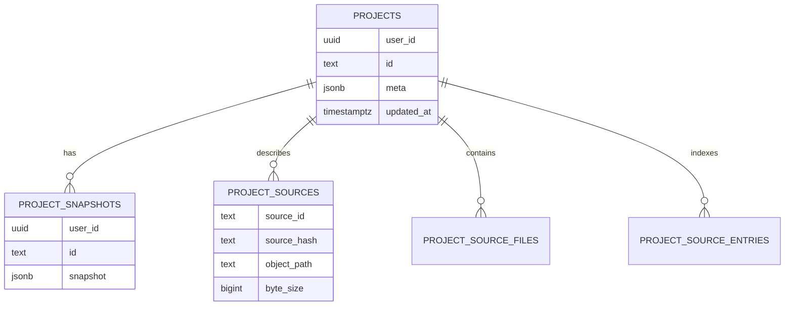
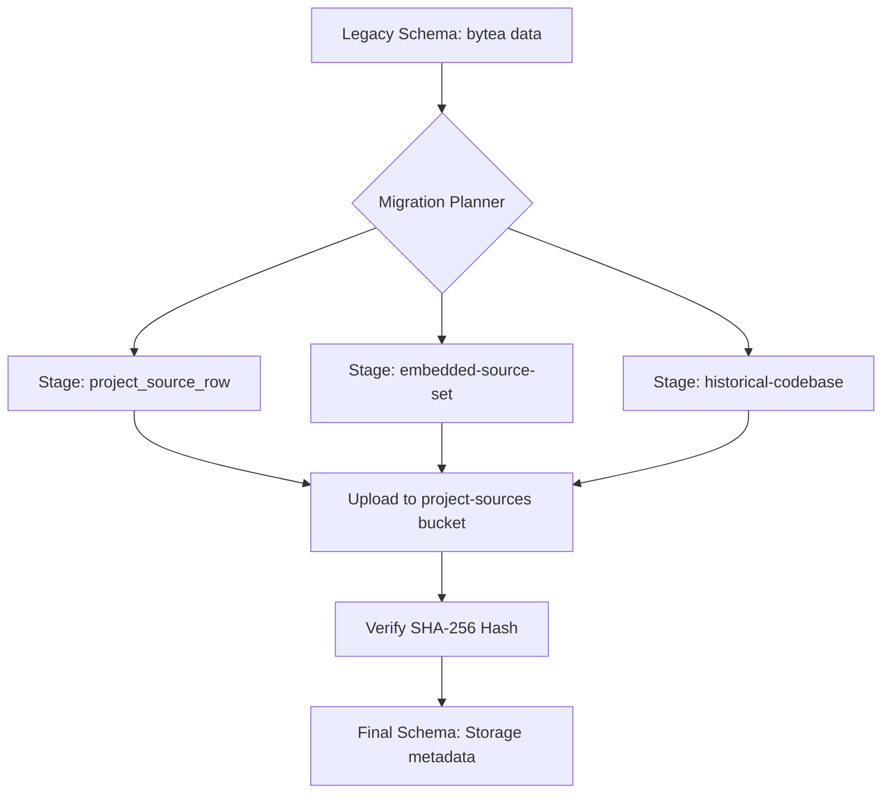
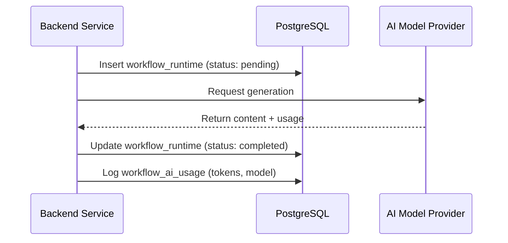

Relevant source files

The following files were used as context for generating this wiki page:

- [supabase/migrations/202607070001_initial_user_backend.sql](supabase/migrations/202607070001_initial_user_backend.sql)
- [supabase/migrations/20260729113844_create_workflow_runtime.sql](supabase/migrations/20260729113844_create_workflow_runtime.sql)
- [supabase/migrations/20260801150000_create_workflow_ai_usage.sql](supabase/migrations/20260801150000_create_workflow_ai_usage.sql)
- [apps/backend/tests/integration/supabaseLocal.integration.test.ts](apps/backend/tests/integration/supabaseLocal.integration.test.ts)
- [scripts/migrate-project-sources-to-storage.ts](scripts/migrate-project-sources-to-storage.ts)
- [scripts/project-source-storage-artifact.ts](scripts/project-source-storage-artifact.ts)

# Supabase PostgreSQL Schema

The Supabase PostgreSQL Schema serves as the persistence layer for Nous Reader, managing user projects, multi-source content, workflow states, and AI usage tracking. It is designed to support a multi-tenant environment where user data is isolated via Row Level Security (RLS) and integrated with Supabase Auth.

The schema has evolved from a legacy structure where source data was stored directly in the database as `bytea` columns to a modern architecture utilizing Supabase Storage for large objects, with the database maintaining metadata and integrity hashes.

## Core Project & Content Management

The project management system centers around the `projects` table and its associated snapshots. A project represents a learning environment consisting of documents, researched topics, and generated courses.

### Entity Relationship Diagram
The following diagram illustrates the relationships between projects, their snapshots, and the underlying source materials.

Sources: [apps/backend/tests/integration/supabaseLocal.integration.test.ts:250-280](apps/backend/tests/integration/supabaseLocal.integration.test.ts#L250-L280), [scripts/migrate-project-sources-to-storage.ts:18-40](scripts/migrate-project-sources-to-storage.ts#L18-L40)

### Database Tables Summary

| Table | Description | Primary Key |
| :--- | :--- | :--- |
| `projects` | Master table for project metadata and user ownership. | `(user_id, id)` |
| `project_snapshots` | Versioned states of the project, including lesson plans and progress. | `(user_id, id)` |
| `project_sources` | Metadata for primary source files (PDFs, docs) stored in Supabase Storage. | `(user_id, project_id, source_id)` |
| `project_source_files` | Tracking for individual files within a multi-source project. | `(user_id, project_id, source_id)` |
| `project_source_entries` | Indexing for archive contents (e.g., zip file directories/files). | `(user_id, project_id, path)` |

Sources: [apps/backend/tests/integration/supabaseLocal.integration.test.ts:265-275](apps/backend/tests/integration/supabaseLocal.integration.test.ts#L265-L275), [scripts/migrate-project-sources-to-storage.ts:20-35](scripts/migrate-project-sources-to-storage.ts#L20-L35)

## Storage Migration & Staging

The system implements a migration path for legacy data stored as `bytea` in the `public.project_sources` table. The `project_source_storage_stage` table acts as a temporary buffer to ensure data integrity during the transition to content-addressed storage.

### Migration Lifecycle
The migration process involves planning candidates from legacy rows and snapshots, uploading them to a private bucket, and updating metadata.

Sources: [scripts/migrate-project-sources-to-storage.ts:200-240](scripts/migrate-project-sources-to-storage.ts#L200-L240), [scripts/migrate-project-sources-to-storage.ts:740-780](scripts/migrate-project-sources-to-storage.ts#L740-L780)

### Integrity Constraints
The schema enforces strict validation on source objects:
- **Object Paths**: Encoded as `users/{user_id}/projects/{project_id}/{source_id}/{hash}/original`.
- **Content Addressing**: Every file is verified using a SHA-256 hash to detect collisions or corruption.
- **Privacy**: The `project-sources` bucket is explicitly checked to ensure it is not public.

Sources: [scripts/project-source-storage-artifact.ts:50-70](scripts/project-source-storage-artifact.ts#L50-L70), [scripts/migrate-project-sources-to-storage.ts:850-870](scripts/migrate-project-sources-to-storage.ts#L850-L870)

## Workflow & AI Runtime Tracking

The schema includes dedicated tables for managing the lifecycle of AI-driven workflows, specifically for course generation and planning.

### Runtime Tables
- **Workflow State**: Persists the progress of asynchronous operations, allowing for recovery and retry logic.
- **AI Usage Tracking**: Logs token consumption and model interactions to monitor costs and performance.

Sources: [supabase/migrations/20260729113844_create_workflow_runtime.sql](supabase/migrations/20260729113844_create_workflow_runtime.sql), [supabase/migrations/20260801150000_create_workflow_ai_usage.sql](supabase/migrations/20260801150000_create_workflow_ai_usage.sql)

## Security and Tenancy

Data security is managed through PostgreSQL Row Level Security (RLS), ensuring that users can only access their own projects and feedback reports.

1.  **Identity Isolation**: Most tables include a `user_id uuid` column linked to `auth.users`.
2.  **Access Control**: The backend uses a `service_role` key for administrative tasks (like migrations), while client requests are restricted by user-specific JWT tokens.
3.  **Auth Integration**: The schema supports Supabase Auth features, including magic links and password setup requirements for invited users.

Sources: [apps/backend/tests/integration/supabaseLocal.integration.test.ts:175-195](apps/backend/tests/integration/supabaseLocal.integration.test.ts#L175-L195), [apps/backend/tests/integration/supabaseLocal.integration.test.ts:470-500](apps/backend/tests/integration/supabaseLocal.integration.test.ts#L470-L500)

## Summary

The Supabase PostgreSQL Schema provides a robust foundation for Nous Reader by combining traditional relational structures with content-addressed object storage. The migration utilities (`migrate-project-sources-to-storage.ts`) ensure that historical data is safely transitioned to this modern architecture, maintaining strict SHA-256 integrity and RLS-based tenant isolation across all project and workflow data.
