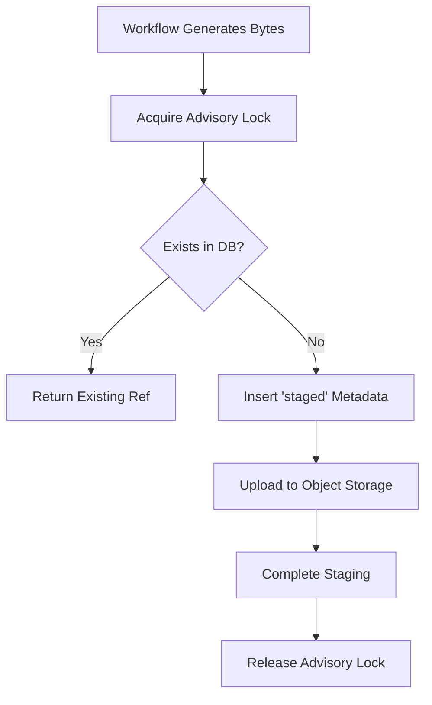
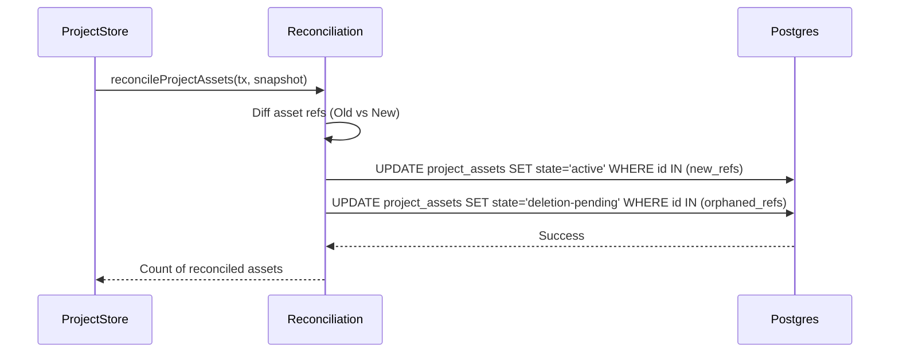

Relevant source files

The following files were used as context for generating this wiki page:

- [apps/backend/src/projects/postgresProjectAssetStore.ts](apps/backend/src/projects/postgresProjectAssetStore.ts)
- [apps/backend/src/projects/projectAsset.ts](apps/backend/src/projects/projectAsset.ts)
- [apps/backend/src/projects/sourceArchive.ts](apps/backend/src/projects/sourceArchive.ts)
- [apps/backend/src/projects/postgresProjectStore.ts](apps/backend/src/projects/postgresProjectStore.ts)
- [apps/backend/src/projects/projectAssetImport.ts](apps/backend/src/projects/projectAssetImport.ts)
- [apps/backend/src/projects/projectAssetReconciliation.ts](apps/backend/src/projects/projectAssetReconciliation.ts)

# Project Assets & Storage Archives

The Project Assets and Storage Archive system provides a robust infrastructure for managing immutable binary data associated with user projects, such as generated images, PDF documents, and source codebase archives. The system is designed around the principles of content-addressable storage, idempotency, and strict isolation between users and projects. It ensures that heavy binary data is stored efficiently in object storage (e.g., Supabase Storage) while metadata and relational constraints are managed in a PostgreSQL database.

This module handles the full lifecycle of assets—from initial staging during AI workflows to permanent adoption in project snapshots and eventual cleanup of orphaned objects. It also manages complex "source archives" (ZIP files), providing specialized indexing to allow granular access to individual files within an archive without requiring a full download of the container.

## Asset Lifecycle & Persistence Architecture

Project assets move through a defined state machine to ensure data integrity and prevent the accumulation of orphaned binary objects. The system distinguishes between "staged" assets (temporary data from a workflow) and "active" assets (data committed to a project snapshot).

### Asset States
| State | Description |
| :--- | :--- |
| **Staged** | Initial state when bytes are uploaded but not yet associated with a project snapshot. |
| **Active** | Asset is currently referenced by at least one active project snapshot. |
| **Deletion Pending** | Asset is no longer reachable by any project snapshot and is queued for background cleanup. |

Sources: [apps/backend/src/projects/postgresProjectAssetStore.ts:31-35](apps/backend/src/projects/postgresProjectAssetStore.ts#L31-L35), [apps/backend/src/projects/projectAsset.ts](apps/backend/src/projects/projectAsset.ts)

### The Staging Process
When a workflow node (e.g., an image generator) produces binary data, it calls `stage()`. This function performs the following steps:
1. **Deduplication**: Checks for an existing asset with the same idempotency key and bytes.
2. **Metadata Registration**: Commits a "staged" record to the database to ensure the upload is recoverable.
3. **Storage Upload**: Transmits bytes to the immutable object storage.
4. **Advisory Locking**: Uses PostgreSQL advisory locks to prevent concurrent uploads of the same logical asset.

Sources: [apps/backend/src/projects/postgresProjectAssetStore.ts:50-130](apps/backend/src/projects/postgresProjectAssetStore.ts#L50-L130)

This diagram illustrates the idempotent staging flow for new project assets. Sources: [apps/backend/src/projects/postgresProjectAssetStore.ts:50-130](apps/backend/src/projects/postgresProjectAssetStore.ts#L50-L130)

## Source Archives & Indexing

Source archives represent project source data provided as ZIP files (e.g., for codebase analysis). Instead of treating these as opaque blobs, the system indexes individual entries to support partial reads.

### Archive Indexing Logic
The `indexSourceArchive` function processes ZIP buffers and extracts a lexicographic tree of entries. This allows the backend to:
- Generate text previews for code files.
- Calculate content-hashes for individual files.
- Enforce strict security boundaries (e.g., rejecting directory traversal paths like `../`).
- Respect size limits for both individual entries and total expanded bytes.

Sources: [apps/backend/src/projects/sourceArchive.ts:108-200](apps/backend/src/projects/sourceArchive.ts#L108-L200)

### Limits for Source Archives
| Configuration | Default Value | Description |
| :--- | :--- | :--- |
| `maxEntries` | 10,000 | Maximum number of files and directories in an archive. |
| `maxEntryBytes` | 10 MB | Maximum uncompressed size for a single entry. |
| `maxExpandedBytes` | 100 MB | Maximum cumulative size of all entries. |
| `maxCompressedBytes` | 50 MB | Maximum size of the uploaded ZIP file. |

Sources: [apps/backend/src/projects/sourceArchive.ts:16-25](apps/backend/src/projects/sourceArchive.ts#L16-L25), [apps/backend/src/projects/postgresProjectStore.ts:121](apps/backend/src/projects/postgresProjectStore.ts#L121)

## Project Asset Reconciliation

Asset reconciliation is the process of updating the database when a project snapshot changes. This ensures that assets that are no longer reachable are marked for deletion, while new assets are "adopted."

The `reconcileProjectAssets` function compares the asset references in the `previousSnapshot` and the `snapshot`. It calculates the set of assets to keep and the set to retire. 

### Adoption Logic
- **Adoption**: When a staged asset is first included in a project snapshot, its state changes to 'active'.
- **Retirement**: If an asset was active in the previous snapshot but is missing in the new one, it is transitioned to 'deletion-pending' unless it is still reachable via other parts of the project.

Sources: [apps/backend/src/projects/projectAssetReconciliation.ts:25-85](apps/backend/src/projects/projectAssetReconciliation.ts#L25-L85)

This sequence shows the transactional update of asset states during a project save operation. Sources: [apps/backend/src/projects/projectAssetReconciliation.ts:25-85](apps/backend/src/projects/projectAssetReconciliation.ts#L25-L85)

## Storage Implementation

The system interacts with object storage via a generic `ProjectAssetObjectStorage` interface, allowing for different backends. The primary implementation is `SupabaseProjectSourceStorage`.

### Content-Addressable Paths
Object paths are deterministic and follow a strict hierarchy to ensure privacy and deduplication:
`users/{userId}/projects/{projectHash}/assets/{assetIdentityHash}/{contentHash}`

- **Project Hash**: SHA-256 of the project ID.
- **Asset Identity Hash**: A hash derived from the origin (e.g., workflow run ID and node instance).
- **Content Hash**: SHA-256 of the actual bytes.

Sources: [apps/backend/src/projects/projectAsset.ts:80-110](apps/backend/src/projects/projectAsset.ts#L80-L110), [apps/backend/src/projects/postgresProjectAssetStore.ts:983-990](apps/backend/src/projects/postgresProjectAssetStore.ts#L983-L990)

### Transactional Integrity
Binary uploads occur outside the main PostgreSQL transaction because object storage does not support distributed transactions. To maintain consistency, the system uses a "Cleanup Intent" pattern:
1. Before uploading, a record is inserted into `project_asset_deletions`.
2. If the upload fails or the process crashes, the background cleaner uses this record to remove the partial object.
3. Upon successful project commitment, the deletion record is removed.

Sources: [apps/backend/src/projects/projectAssetImport.ts:65-85](apps/backend/src/projects/projectAssetImport.ts#L65-L85), [apps/backend/src/projects/postgresProjectAssetStore.ts:580-620](apps/backend/src/projects/postgresProjectAssetStore.ts#L580-L620)

## Import & Export Mechanism

Importing project archives requires remapping asset identities to the new user/project context while preserving the content-addressable nature of the data.

The `PostgresProjectAssetImporter` handles:
1. **Asset Validation**: Verifying that every attachment in the ZIP matches the hashes declared in the project JSON manifest.
2. **ID Remapping**: Generating new internal IDs and storage paths for the target user.
3. **Durable Publication**: Inserting metadata for imported assets and clearing cleanup intents in a single database transaction.

Sources: [apps/backend/src/projects/projectAssetImport.ts:95-155](apps/backend/src/projects/projectAssetImport.ts#L95-L155)

## Background Cleanup

Orphaned assets (those in `deletion-pending` state or those whose project has been deleted) are removed by a background worker system.

1. **Claiming**: Workers claim a lease on a batch of objects in `project_asset_deletions` or orphaned `project_assets`.
2. **Fencing**: Uses a `fencingToken` (a monotonically increasing counter) to ensure that if a worker's lease expires, a subsequent worker can safely take over without race conditions.
3. **Execution**: The storage object is deleted first, followed by the database metadata.

Sources: [apps/backend/src/projects/postgresProjectAssetStore.ts:200-280](apps/backend/src/projects/postgresProjectAssetStore.ts#L200-L280), [apps/backend/src/projects/postgresProjectAssetStore.ts:400-450](apps/backend/src/projects/postgresProjectAssetStore.ts#L400-L450)

## Summary

The Project Assets & Storage Archive system provides a resilient layer for handling Lumina-Reader's heavy data requirements. By combining content-addressable storage with PostgreSQL metadata tracking and advisory locking, it achieves high performance through deduplication while maintaining strict user data isolation and transactional consistency.
