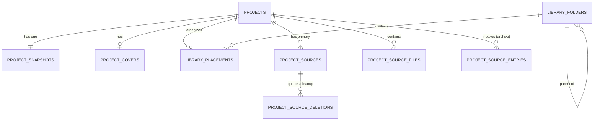
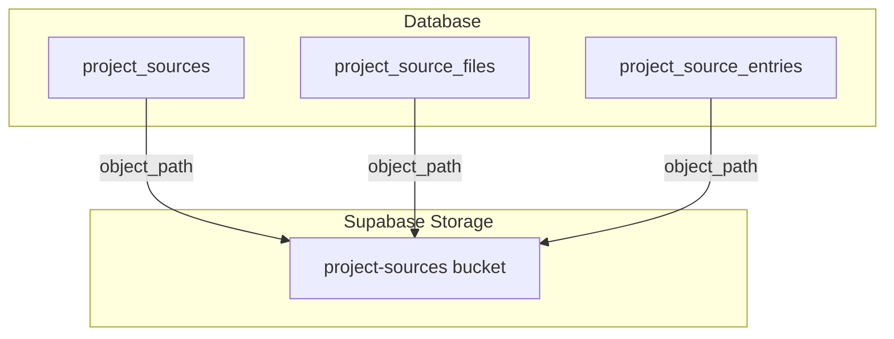
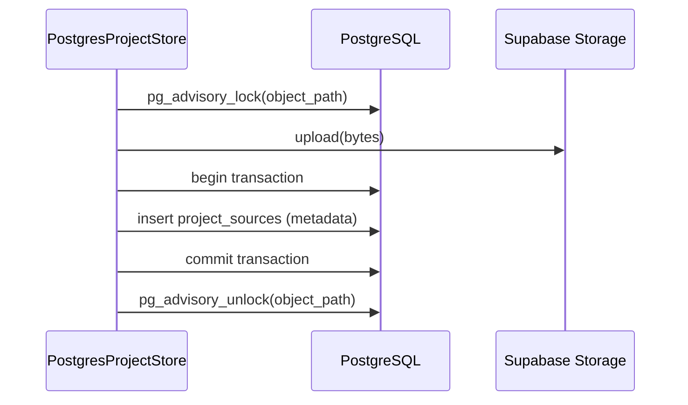

Relevant source files

The following files were used as context for generating this wiki page:

- [apps/backend/src/projects/postgresProjectStore.ts](../../../apps/backend/src/projects/postgresProjectStore.ts)
- [supabase/migrations/202607190002_project_sources_storage.sql](../../../supabase/migrations/202607190002_project_sources_storage.sql)
- [docs/DEPLOYMENT.md](../../../docs/DEPLOYMENT.md)
- [apps/backend/tests/integration/supabaseLocal.integration.test.ts](../../../apps/backend/tests/integration/supabaseLocal.integration.test.ts)
- [scripts/project-source-storage-artifact.ts](../../../scripts/project-source-storage-artifact.ts)
- [apps/backend/tests/projects/postgresProjectStore.test.ts](../../../apps/backend/tests/projects/postgresProjectStore.test.ts)
- [apps/backend/src/workflows/courseGenerationWorkflowContract.ts](../../../apps/backend/src/workflows/courseGenerationWorkflowContract.ts)

# PostgreSQL Database Schema

The Nous project utilizes a PostgreSQL database schema designed to manage complex educational content, user-generated courses, and multi-modal project sources. The schema is built to work seamlessly with Supabase, leveraging Row Level Security (RLS) for multi-tenant isolation and integrating with external object storage for large binary assets like PDFs and ZIP archives.

The primary purpose of the schema is to provide a robust persistence layer for the `PostgresProjectStore`, handling transactional updates to project metadata, snapshots (including learning plans and syllabi), and maintaining integrity references to assets stored in Supabase Storage.

## Core Entity Relationship Diagram

The following diagram illustrates the relationships between projects, their snapshots, sources, and the library organization structure.

*Description: The ER diagram shows the central role of the `projects` table and its connection to content snapshots, asset metadata, and the library's hierarchical folder structure.*
Sources: [apps/backend/src/projects/postgresProjectStore.ts:503-605](../../../apps/backend/src/projects/postgresProjectStore.ts#L503-L605), [supabase/migrations/202607190002_project_sources_storage.sql:104-163](../../../supabase/migrations/202607190002_project_sources_storage.sql#L104-L163)

## Project and Content Persistence

The schema separates project metadata from the heavy content snapshots to optimize library listing operations. 

### Projects Table

Stores high-level metadata such as titles, favorite status, and revision counters used for optimistic concurrency control.
Sources: [apps/backend/src/projects/postgresProjectStore.ts:251-260](../../../apps/backend/src/projects/postgresProjectStore.ts#L251-L260)

| Field | Type | Description |
| :--- | :--- | :--- |
| `user_id` | `uuid` | Owner of the project (Primary Key / Partition Key). |
| `id` | `text` | Unique project identifier (Primary Key). |
| `meta` | `jsonb` | Metadata including `isFavorite`, `lessonCount`, and `exerciseCount`. |
| `revision` | `integer` | Incremental version for conflict detection. |
| `updated_at` | `timestamptz` | Last modification time. |

### Project Snapshots Table

Stores the full state of a project, including the learning plan, user profile, and document index.
Sources: [apps/backend/src/projects/postgresProjectStore.ts:587-605](../../../apps/backend/src/projects/postgresProjectStore.ts#L587-L605)

| Field | Type | Description |
| :--- | :--- | :--- |
| `snapshot` | `jsonb` | Complete project state (excluding heavy indices). |
| `document_index` | `jsonb` | Extracted text and chunk mapping for search and AI grounding. |

## Project Source Management

Nous employs an "immutable object" strategy for project sources. Large files are stored in Supabase Storage, while the database maintains integrity metadata (hashes and object paths).

### Storage Metadata Tables

*  **`public.project_sources`**: Tracks the primary source for a project (e.g., the original PDF or ZIP).
*  **`public.project_source_files`**: Tracks individual files within a multi-source project, ordered by `position`.
*  **`public.project_source_entries`**: Indexes the contents of an archive source, storing previews and warning reasons (e.g., if a PDF has no usable text).
Sources: [apps/backend/src/projects/postgresProjectStore.ts:795-883](../../../apps/backend/src/projects/postgresProjectStore.ts#L795-L883)

*Description: The link between database metadata and the Supabase Storage bucket based on content-addressed object paths.*
Sources: [supabase/migrations/202607190002_project_sources_storage.sql:104-194](../../../supabase/migrations/202607190002_project_sources_storage.sql#L104-L194), [apps/backend/src/projects/postgresProjectStore.ts:1094-1110](../../../apps/backend/src/projects/postgresProjectStore.ts#L1094-L1110)

### Historical Cutover and Current Contract

The versioned storage-cutover migration used `public.project_source_storage_stage` to verify a one-time transition from embedded source bytes, then removed both staging and legacy tables. Current deployments require the post-cutover schema and apply versioned Supabase migrations directly; the runtime migrator has been retired. The deployment preflight rejects legacy columns, transitional tables, and embedded source snapshots before release.
Sources: [supabase/migrations/202607190002_project_sources_storage.sql:1-100](../../../supabase/migrations/202607190002_project_sources_storage.sql#L1-L100), [supabase/migrations/202607190002_project_sources_storage.sql:228-285](../../../supabase/migrations/202607190002_project_sources_storage.sql#L228-L285), [docs/DEPLOYMENT.md](../../../docs/DEPLOYMENT.md)

## Library and Organization

The library structure supports nested folders and custom ordering for projects and folders using a step-based ordering system (`SIBLING_ORDER_STEP = 1024`).

### Folders and Placements

*  **`public.library_folders`**: Defines the hierarchy. Folders can have a `parent_folder_id` (null for root).
*  **`public.library_placements`**: Links projects to folders and defines their position within that folder.
Sources: [apps/backend/src/projects/postgresProjectStore.ts:1145-1165](../../../apps/backend/src/projects/postgresProjectStore.ts#L1145-L1165), [apps/backend/src/projects/postgresProjectStore.ts:1248-1262](../../../apps/backend/src/projects/postgresProjectStore.ts#L1248-L1262)

## Workflow and Feedback Systems

The schema includes support for background workflow runtime and user feedback reporting.

### Workflow Runtime

The `public.model_config` table (id='global') stores system-wide settings for AI models used in course generation, such as `context_model`, `course_model`, and `lesson_model`. Durable rows in `public.workflow_runs` also store a non-null UUID `correlation_id`, indexed for operational lookup and preserved when a request deduplicates onto an existing run. This joins request lifecycle records to worker, retry, cancellation, undo, and recovery events without storing prompt or source payloads in logs.
Sources: [apps/backend/tests/integration/supabaseLocal.integration.test.ts:445-475](../../../apps/backend/tests/integration/supabaseLocal.integration.test.ts#L445-L475), [supabase/migrations/20260816120000_add_workflow_correlation_id.sql](../../../supabase/migrations/20260816120000_add_workflow_correlation_id.sql), [apps/backend/src/workflows/persistence/postgresWorkflowStore.ts](../../../apps/backend/src/workflows/persistence/postgresWorkflowStore.ts)

### Feedback Reports

The `public.feedback_reports` table stores user-submitted bugs and feature requests, which can be synchronized with GitHub issues.
Sources: [apps/backend/tests/integration/supabaseLocal.integration.test.ts:480-520](../../../apps/backend/tests/integration/supabaseLocal.integration.test.ts#L480-L520)

| Field | Type | Description |
| :--- | :--- | :--- |
| `id` | `uuid` | Primary Key. |
| `reporter_email` | `text` | Submitter's email. |
| `github_issue_number` | `integer` | Linked GitHub issue (nullable). |
| `status` | `text` | Current state (e.g., 'pending', 'submitted'). |

## Transactional Integrity and Concurrency

The system uses `pg_advisory_xact_lock` and `pg_advisory_lock` to prevent race conditions during complex operations like library sibling reordering and project source uploads.
Sources: [apps/backend/src/projects/postgresProjectStore.ts:1072-1090](../../../apps/backend/src/projects/postgresProjectStore.ts#L1072-L1090), [apps/backend/src/projects/postgresProjectStore.ts:1336-1348](../../../apps/backend/src/projects/postgresProjectStore.ts#L1336-L1348)

*Description: The locking sequence ensures that concurrent uploads to the same content-addressed path do not result in corrupted metadata or orphaned files.*
Sources: [apps/backend/src/projects/postgresProjectStore.ts:983-1070](../../../apps/backend/src/projects/postgresProjectStore.ts#L983-L1070)

## Conclusion

The PostgreSQL database schema for Nous Reader is a sophisticated multi-tenant design that balances the need for fast library browsing with the storage of complex, high-volume AI-generated educational content. By offloading binary data to immutable object storage and utilizing JSONB for flexible snapshots, the schema provides a scalable foundation for the project's pedagogical features.
