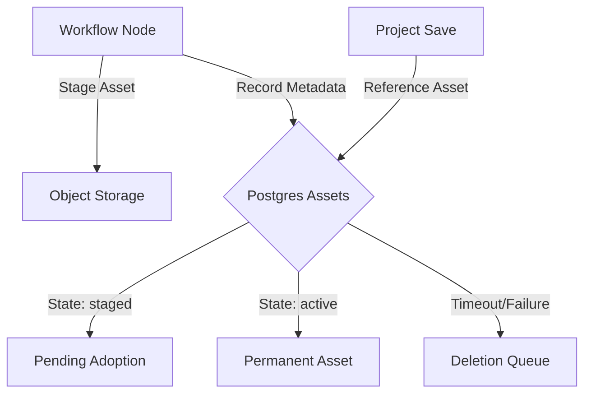
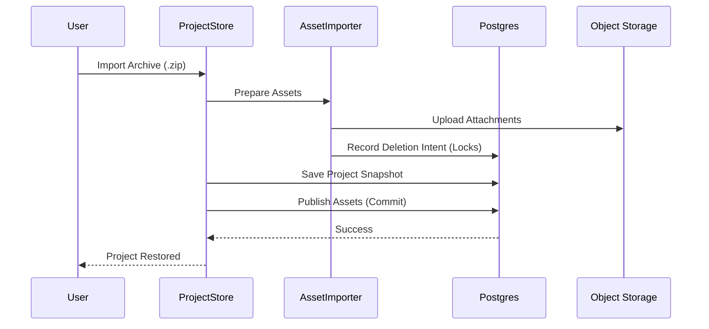

Relevant source files

The following files were used as context for generating this wiki page:

- [apps/backend/src/projects/postgresProjectAssetStore.ts](apps/backend/src/projects/postgresProjectAssetStore.ts)
- [apps/backend/src/projects/projectAssetReconciliation.ts](apps/backend/src/projects/projectAssetReconciliation.ts)
- [apps/backend/src/projects/projectAssetImport.ts](apps/backend/src/projects/projectAssetImport.ts)
- [apps/backend/src/projects/postgresProjectStore.ts](apps/backend/src/projects/postgresProjectStore.ts)
- [packages/shared-types/projectBackupAssets.ts](packages/shared-types/projectBackupAssets.ts)
- [apps/backend/src/projects/projectAssetDeletionQueue.ts](apps/backend/src/projects/projectAssetDeletionQueue.ts)

# Project Assets & Storage Archives

The Project Assets and Storage Archive system provides a robust infrastructure for managing binary content associated with learning projects, such as images, PDFs, and ZIP archives. It decouples heavy binary data from metadata stored in Postgres, utilizing specialized object storage for immutable content while maintaining strict referential integrity through database-backed state management and reconciliation processes.

This system handles the full lifecycle of project content, including idempotent staging during AI workflow runs, atomic publication during project saves, and deferred cleanup of orphaned objects. It also supports portable project backups through a versioned archive format that packages project snapshots with their associated binary attachments.

## Asset Lifecycle and Staging

Assets in the system transition through several states to ensure that only content actually referenced by a project remains in permanent storage. AI workflows "stage" generated assets (like lesson visuals) before they are formally "adopted" into a project snapshot.

### Staging and Adoption
When an AI workflow generates an image or document, it is uploaded to storage and recorded in the `project_assets` table with a `staged` state. This process is idempotent, keyed by an `idempotencyKey` and `workflowRunId`. If a project is saved and includes references to these assets, they are "adopted" (moved to an `active` state). Assets that are never adopted or belong to failed workflow runs are eventually queued for deletion.

Sources: [apps/backend/src/projects/postgresProjectAssetStore.ts:5-40](apps/backend/src/projects/postgresProjectAssetStore.ts#L5-L40), [apps/backend/src/projects/projectAssetReconciliation.ts:10-30](apps/backend/src/projects/projectAssetReconciliation.ts#L10-L30)

*This diagram illustrates the transition of assets from initial staging by workflows to final adoption or cleanup.*

## Archive Storage and Ingestion

The system differentiates between primary "sources" (the input documents for a course) and generated "assets." Sources can be complex, such as multi-file ZIP archives, which are indexed and stored with high granularity.

### Source Preparation
When a ZIP archive is uploaded as a project source, the `PostgresProjectStore` performs a "preparation" phase. It extracts the archive, indexes its contents (files and directories), and uploads each entry as a distinct immutable object. This allows the backend to serve specific files from an archive without re-downloading the entire ZIP.

Sources: [apps/backend/src/projects/postgresProjectStore.ts:1140-1200](apps/backend/src/projects/postgresProjectStore.ts#L1140-L1200), [apps/backend/src/projects/postgresProjectStore.ts:1210-1250](apps/backend/src/projects/postgresProjectStore.ts#L1210-L1250)

### Database Schema for Sources
| Table | Description |
| :--- | :--- |
| `project_sources` | Tracks the primary source (e.g., the original PDF or ZIP). |
| `project_source_files` | Stores metadata for individual files in a multi-source project. |
| `project_source_entries` | Indexes the internal file tree of extracted ZIP archives. |
| `project_source_deletions` | A tombstone table for objects that need removal from storage. |

Sources: [apps/backend/src/projects/postgresProjectStore.ts:100-150](apps/backend/src/projects/postgresProjectStore.ts#L100-L150)

## Import and Export Architectures

To support portability and backups, the project uses a specialized archive format (`project-asset-import-v1`) that bundles the JSON snapshot with its binary dependencies.

### Portable Backup Structure
A project backup is a ZIP file containing a `project.json` manifest and an `assets/` directory. The system uses a deterministic remapping strategy to ensure that assets can be restored to a new project ID or user while maintaining their content-addressed identity.

Sources: [packages/shared-types/projectBackupAssets.ts:10-45](packages/shared-types/projectBackupAssets.ts#L10-L45), [packages/shared-types/projectBackupAssets.ts:130-155](packages/shared-types/projectBackupAssets.ts#L130-L155)

*Sequence of operations during a project archive import, emphasizing the "prepare-then-publish" pattern.*

## Deletion and Reconciliation

The system employs a "tombstone" pattern for deletions. Instead of deleting from storage immediately, the application records the intent in a deletion queue. This prevents data loss during transaction rollbacks and allows for background cleanup.

### Deletion Workflow
1.  **Queueing**: When a project or source is deleted, its `object_path` is inserted into `project_source_deletions` or `project_asset_deletions`.
2.  **Claiming**: A background worker claims a batch of objects using an advisory lease.
3.  **Verification**: The worker checks if any other project still references the object (deduplication check).
4.  **Cleanup**: If unreferenced, the object is removed from the physical storage bucket.

Sources: [apps/backend/src/projects/projectAssetDeletionQueue.ts:5-45](apps/backend/src/projects/projectAssetDeletionQueue.ts#L5-L45), [apps/backend/src/projects/postgresProjectStore.ts:1470-1510](apps/backend/src/projects/postgresProjectStore.ts#L1470-L1510)

## Data Models

### Project Asset Reference
A `ProjectAssetRef` is the standard contract for referencing binary content within a project snapshot.

| Field | Type | Description |
| :--- | :--- | :--- |
| `id` | `string` | Unique identifier for the asset instance. |
| `hash` | `string` | SHA-256 content hash for integrity. |
| `byteSize` | `number` | Size of the asset in bytes. |
| `mediaType` | `string` | MIME type (e.g., `image/png`). |

Sources: [packages/shared-types/projectBackupAssets.ts:15-25](packages/shared-types/projectBackupAssets.ts#L15-L25)

## Conclusion
The Project Assets & Storage Archives module ensures that Nous remains performant and scalable by moving binary data out of the relational database. Through a combination of idempotent staging, deterministic remapping for imports, and a reliable background deletion queue, it maintains a clean and consistent storage state even across complex AI generation workflows and multi-user environments.
