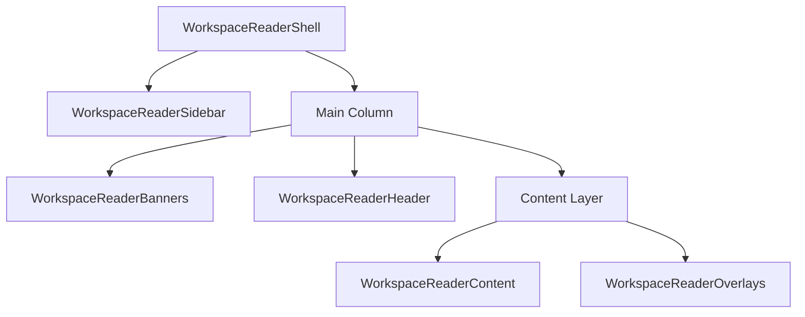
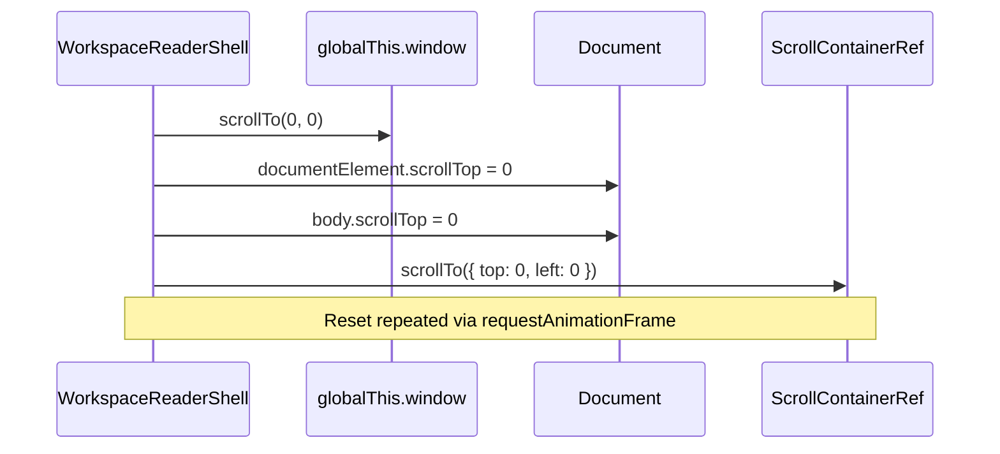

<details>
<summary>Relevant source files</summary>

The following files were used as context for generating this wiki page:

- [apps/web/components/workspace/WorkspaceReaderShell.tsx](apps/web/components/workspace/WorkspaceReaderShell.tsx)
- [apps/web/tests/components/workspace/WorkspaceReaderShell.test.tsx](apps/web/tests/components/workspace/WorkspaceReaderShell.test.tsx)
- [apps/web/components/workspace/shell/WorkspaceReaderContent.tsx](apps/web/components/workspace/shell/WorkspaceReaderContent.tsx)
- [apps/web/components/workspace/ReadingScreenContainer.tsx](apps/web/components/workspace/ReadingScreenContainer.tsx)
- [apps/web/hooks/workspace/controller/controllerContext.ts](https://github.com/immagiov4/Lumina-Reader/blob/09d39de84e3ec6de12fa4cb218ecfcd31773aab9/apps/web/hooks/workspace/controller/controllerContext.ts)

</details>

# Workspace Reader Shell Interface

The Workspace Reader Shell Interface serves as the primary structural container for the Nous learning environment. It orchestrates the layout of headers, sidebars, content areas, and overlays, ensuring a consistent user experience across different display modes. Its primary responsibility is managing the viewport constraints, scroll behaviors, and responsive layout adjustments required for an ADHD-friendly, focused learning session.

The shell supports two primary display modes: `application` and `embedded`. In application mode, it locks the document viewport to provide a specialized reading environment, whereas embedded mode allows the interface to reside within a standard document flow without hijacking global scroll behaviors.

## Architectural Overview

The interface is built as a memoized React component that wraps several specialized sub-components. It utilizes a flexbox-based layout to manage the relationship between the navigation sidebar and the main reading column.



*Figure 1: Component hierarchy within the Workspace Reader Shell.*
Sources: [apps/web/components/workspace/WorkspaceReaderShell.tsx:94-118](apps/web/components/workspace/WorkspaceReaderShell.tsx#L94-L118)

### Core Components
| Component | Responsibility |
| :--- | :--- |
| `WorkspaceReaderSidebar` | Manages module navigation, exercise selection, and project exports. |
| `WorkspaceReaderHeader` | Displays lesson titles, sync status, and provides access to audio/TTS controls. |
| `WorkspaceReaderContent` | The primary rendering area for lesson markdown, quizzes, and learning aids. |
| `WorkspaceReaderBanners` | Displays critical notifications such as storage errors or missing source files. |
| `WorkspaceReaderOverlays` | Handles contextual menus, AI assistant answers, and highlighting tools. |

Sources: [apps/web/components/workspace/WorkspaceReaderShell.tsx:8-12](apps/web/components/workspace/WorkspaceReaderShell.tsx#L8-L12), [apps/web/tests/components/workspace/WorkspaceReaderShell.test.tsx:55-160](apps/web/tests/components/workspace/WorkspaceReaderShell.test.tsx#L55-L160)

## Display Modes and Viewport Management

The shell dynamically adjusts its CSS and DOM behavior based on the `displayMode` prop.

### Application Mode
In the default `application` mode, the shell assumes control of the entire browser viewport. It implements a scroll-lock on the `html` and `body` elements to prevent double-scrolling and ensures that overscroll behavior is disabled. This is critical for mobile devices where keyboard offsets can disrupt the layout.
Sources: [apps/web/components/workspace/WorkspaceReaderShell.tsx:21-41](apps/web/components/workspace/WorkspaceReaderShell.tsx#L21-L41), [apps/web/tests/components/workspace/WorkspaceReaderShell.test.tsx:230-234](apps/web/tests/components/workspace/WorkspaceReaderShell.test.tsx#L230-L234)

### Embedded Mode
When `displayMode` is set to `embedded`, the shell relaxes these constraints. The height becomes flexible (`min-h-[34rem]`), and the overflow is set to `visible`, allowing the shell to be integrated into larger pages without interfering with the parent container's scroll behavior.
Sources: [apps/web/components/workspace/WorkspaceReaderShell.tsx:81-84](apps/web/components/workspace/WorkspaceReaderShell.tsx#L81-L84), [apps/web/tests/components/workspace/WorkspaceReaderShell.test.tsx:273-282](apps/web/tests/components/workspace/WorkspaceReaderShell.test.tsx#L273-L282)

## Scroll Management Logic

The shell manages scroll synchronization between the window and its internal content container. When the component mounts or the display mode changes, it resets the scroll position to the top to prevent previous screen positions from leaking into new lesson views.



*Figure 2: Scroll reset sequence during shell mounting.*
Sources: [apps/web/components/workspace/WorkspaceReaderShell.tsx:47-64](apps/web/components/workspace/WorkspaceReaderShell.tsx#L47-L64), [apps/web/tests/components/workspace/WorkspaceReaderShell.test.tsx:213-228](apps/web/tests/components/workspace/WorkspaceReaderShell.test.tsx#L213-L228)

## Layout Constants and Styles

The interface relies on specific layout constants to maintain alignment between the sidebar and the main content.

*  **Sidebar Width:** The desktop sidebar uses a fixed width defined by `READER_SIDEBAR_WIDTH_PX`. 
*  **Dynamic Margin:** The main column applies a `marginLeft` equal to the sidebar width only when `shouldUseDesktopSidebar` is true.
*  **Mobile Adaptivity:** The shell uses a `useMobileKeyboardOffset` hook to calculate the `viewportHeight`, ensuring the interface fills the dynamic visual viewport on mobile browsers.

Sources: [apps/web/components/workspace/WorkspaceReaderShell.tsx:2-15](apps/web/components/workspace/WorkspaceReaderShell.tsx#L2-L15), [apps/web/components/workspace/WorkspaceReaderShell.tsx:90-101](apps/web/components/workspace/WorkspaceReaderShell.tsx#L90-L101), [apps/web/tests/components/workspace/WorkspaceReaderShell.test.tsx:246-255](apps/web/tests/components/workspace/WorkspaceReaderShell.test.tsx#L246-L255)

## State Hydration and Context

The shell is typically controlled via a `WorkspaceControllerContext`, which handles the loading of project source files and the hydration of snapshots.

```typescript
// Example of hydrating the reader through the controller context
persistHydratedSnapshot: (snapshot, revision) => {
  projectLibrary.setCurrentProjectId(snapshot.id);
  projectLibrary.setProjectHydrated(false);
  domain.hydrateSnapshot(snapshot);
  state.resetSessionState();
  state.setScreenState(resolveScreenStateForSnapshot(snapshot));
  scheduleHydration(() => {
    projectLibrary.completeProjectHydration({ revision, snapshot });
  });
}
```

Sources: [apps/web/hooks/workspace/controller/controllerContext.ts:133-146](apps/web/hooks/workspace/controller/controllerContext.ts#L133-L146)

## Conclusion

The Workspace Reader Shell Interface provides the foundational structural integrity for the Nous reader. By managing complex viewport requirements, display mode transitions, and internal scroll containers, it allows the sub-components to focus exclusively on lesson delivery and pedagogical interaction. The strict display mode logic ensures that the application remains usable both as a standalone web app and as an embedded learning widget.
