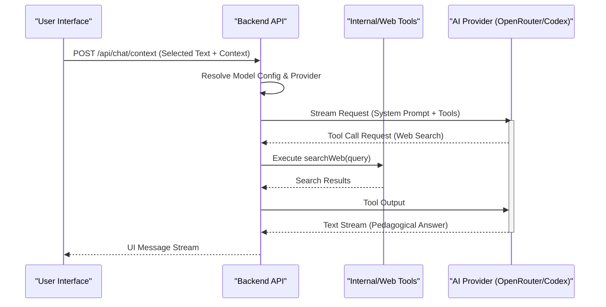
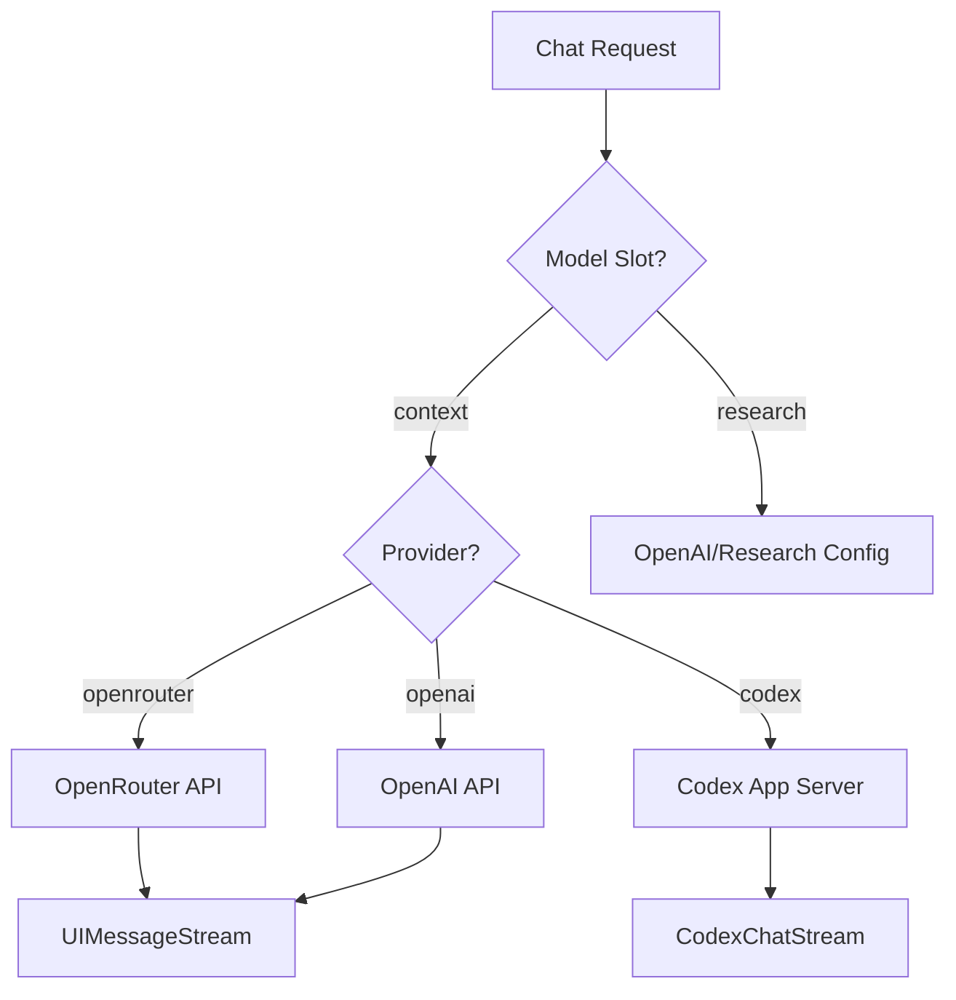

Relevant source files

The following files were used as context for generating this wiki page:

- [apps/web/components/library/HomeChatComposer.tsx](apps/web/components/library/HomeChatComposer.tsx)
- [apps/backend/src/routes/contextChat.ts](apps/backend/src/routes/contextChat.ts)
- [apps/backend/src/routes/chatPrompts.ts](apps/backend/src/routes/chatPrompts.ts)
- [apps/backend/src/services/codexChatStream.ts](apps/backend/src/services/codexChatStream.ts)
- [apps/backend/src/routes/openRouterProxy.ts](apps/backend/src/routes/openRouterProxy.ts)
- [apps/web/types.ts](apps/web/types.ts)

# Chat UI & AI Context Assistant

The **Chat UI & AI Context Assistant** is a sophisticated system within Nous Reader designed to provide context-aware pedagogical support. It bridges the gap between static learning material (PDFs, lessons, and notes) and interactive AI assistance. The system allows users to highlight specific text, query their entire library, or engage in deep research while maintaining strict adherence to the pedagogical context of the current study session.

The architecture is split between a React-based frontend that manages complex UI states (selections, attachments, and tool preferences) and a Node.js backend that orchestrates multiple AI providers (OpenRouter, OpenAI, Codex) and local library retrieval tools. It supports real-time streaming of AI responses, web searches for cross-checking facts, and the proactive generation of visual artifacts to aid understanding.

## System Architecture & Data Flow

The system operates on a request-response cycle where the frontend captures the user's intent along with localized context (selected text, surrounding sentences, or lesson metadata) and transmits it to the `/api/chat/context` or `/api/chat/library` endpoints.

### Interaction Flow
The following sequence diagram illustrates the lifecycle of a contextual chat request, including the use of external research tools.

Sources: [apps/backend/src/routes/contextChat.ts:400-500](apps/backend/src/routes/contextChat.ts#L400-L500), [apps/backend/src/services/codexChatStream.ts:130-150](apps/backend/src/services/codexChatStream.ts#L130-L150)

## Frontend Components

The Chat UI is primarily driven by the `HomeChatComposer`, which adapts its interface based on the active mode (`new-course` or `library-query`).

### HomeChatComposer
This component manages the input area, speech-to-text integration, and floating menus for attachments and tool configurations. It uses a "surface" state to manage overlays like the context picker or tool options without cluttering the primary input flow.

*  **Attachment Menu:** Allows users to attach folders or specific projects from the library to the chat context.
*  **Tool Options:** Provides toggles for "Web Search" and "Generate Visual Artifacts".
*  **Speech Input:** Integrates `SpeechInputButton` for voice-to-text drafting.

Sources: [apps/web/components/library/HomeChatComposer.tsx:30-100](apps/web/components/library/HomeChatComposer.tsx#L30-L100), [apps/web/components/library/HomeChatComposer.tsx:550-600](apps/web/components/library/HomeChatComposer.tsx#L550-L600)

### UI State Types
The system uses several specialized types to handle the "Context Menu" and "Selection" states.

| Type | Description |
| :--- | :--- |
| `ContextScope` | Defines the chat focus: `annotation`, `lesson`, or `selection`. |
| `SelectionContextMenuState` | Stores the exact text selected, the text before/after, and its start position. |
| `AnnotationContextMenuState` | Links a chat session to an existing note ID and its associated artifact references. |

Sources: [apps/web/types.ts:600-650](apps/web/types.ts#L600-L650)

## Backend Context Orchestration

The backend route `/api/chat/context` acts as the brain of the assistant, gathering various data points to build a "System Prompt" that grounds the AI's behavior.

### Context Gathering
The system aggregates information from multiple sources to ensure the AI understands the student's current position:
1.  **Primary Context:** The `selectedText` and its immediate surrounding `contextBefore` and `contextAfter`.
2.  **Lesson Metadata:** `lessonTitle`, `lessonDescription`, and the full `lessonContent`.
3.  **Project Context:** `projectId` and `projectTitle` to identify the course.
4.  **Existing Annotations:** Any note or text already associated with the selection.
5.  **Source Provenance:** `sourceReferences` containing sanitized metadata about the original PDF/document (chunk IDs, page numbers).

Sources: [apps/backend/src/routes/contextChat.ts:415-450](apps/backend/src/routes/contextChat.ts#L415-L450), [apps/backend/src/routes/chatPrompts.ts:380-420](apps/backend/src/routes/chatPrompts.ts#L380-L420)

### Tool Integration
The Assistant has access to several specialized tools defined in the backend:

*  **`searchWeb`:** Performs a real-time web search for cross-checking information. It is constrained to return a short paragraph, 3-5 bullet points, and markdown source links.
*  **`requestAddToNotes`:** Proposes saving a clarification as a study note. The UI determines if this is a new note or an update to an existing one.
*  **`generateCurrentLessonArtifact`:** Creates temporary visual aids (HTML, SVG, Mermaid, or Images) on demand.
*  **Library Retrieval:** Accesses `getProjectStructures`, `getLessonDetails`, and `searchLibrary` to query other parts of the user's workspace.

Sources: [apps/backend/src/routes/contextChat.ts:135-250](apps/backend/src/routes/contextChat.ts#L135-L250), [apps/backend/src/routes/chatPrompts.ts:100-150](apps/backend/src/routes/chatPrompts.ts#L100-L150)

## AI Provider & Proxy Logic

The `openRouterProxy.ts` handles the heavy lifting of routing requests to the appropriate AI model based on the "Model Slot" (e.g., `context`, `research`, `artifact`).

### Provider Mapping
The system supports multiple backends, specifically optimizing for:
*  **OpenRouter:** Used for high-reasoning models and standard context chat.
*  **OpenAI:** Utilized specifically for research-intensive tasks and web-search models (e.g., `gpt-4o`).
*  **Codex:** An internal service for pedagogical turns that doesn't require standard API credentials for specific tier-based requests.

Sources: [apps/backend/src/routes/openRouterProxy.ts:100-180](apps/backend/src/routes/openRouterProxy.ts#L100-L180), [apps/backend/src/services/codexChatStream.ts:10-40](apps/backend/src/services/codexChatStream.ts#L10-L40)

### Prompt Safety & Sanitization
To prevent prompt injection and ensure deterministic behavior, the system sanitizes source references. The `serializeContextSourceReferencesForPrompt` function ensures that metadata like filenames and chunk IDs are escaped and bounded within a character limit (`MAX_CONTEXT_CHARS`).

Sources: [apps/backend/src/routes/chatPrompts.ts:355-375](apps/backend/src/routes/chatPrompts.ts#L355-L375)

## Conclusion
The **Chat UI & AI Context Assistant** is a central pillar of the Nous Reader experience, transforming a standard chat interface into a context-aware learning partner. By integrating local library data, real-time web research, and specialized pedagogical tools, it provides students with a seamless way to clarify complex subjects while ensuring all information is grounded in their specific study materials.
