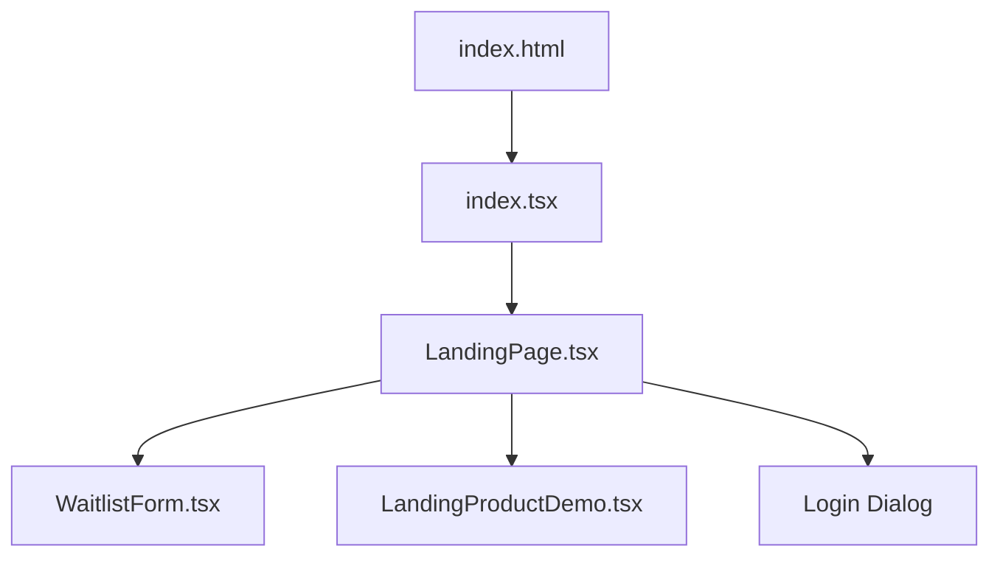
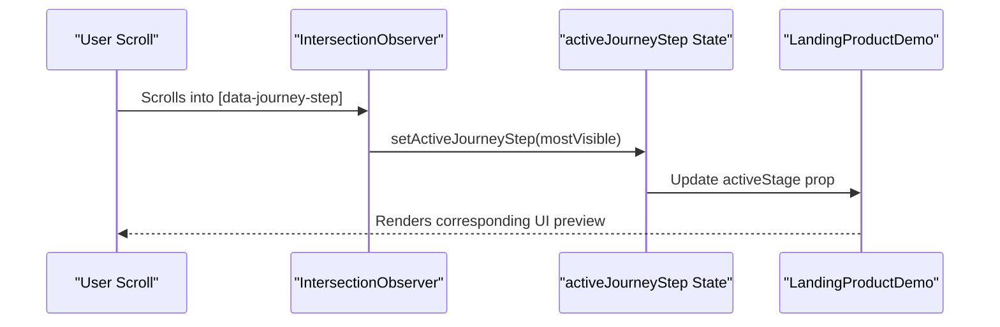
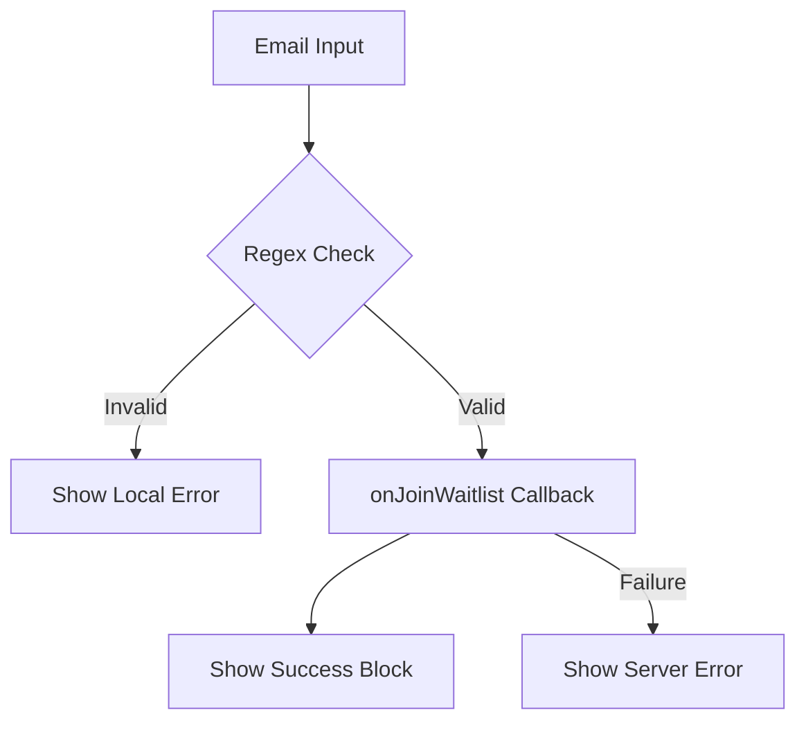

<details>
<summary>Relevant source files</summary>

The following files were used as context for generating this wiki page:

- [apps/web/components/marketing/LandingPage.tsx](apps/web/components/marketing/LandingPage.tsx)
- [apps/web/components/marketing/WaitlistForm.tsx](apps/web/components/marketing/WaitlistForm.tsx)
- [apps/web/components/marketing/marketing.css](apps/web/components/marketing/marketing.css)
- [apps/web/index.html](apps/web/index.html)
- [scripts/feature-map.ts](scripts/feature-map.ts)
- [apps/backend/tests/integration/supabaseLocal.integration.test.ts](apps/backend/tests/integration/supabaseLocal.integration.test.ts)
</details>

# Marketing Landing & Waitlist Views

The Marketing Landing and Waitlist views constitute the public-facing entry point of the Nous Reader application. This system is designed to provide a high-level product overview, demonstrate the core learning journey through interactive previews, and facilitate user acquisition via a waitlist subscription mechanism. It serves as the initial layer of the application before users reach the authenticated product environment.

The architecture separates concerns between visual presentation (handled by React components and CSS), user interaction logic (waitlist forms and intersection observers), and the underlying infrastructure that handles access control and preview authentication.

## System Architecture and Entry Points

The landing experience is initiated via the `production-shell` entry point. The application utilizes a Vite module entry point discovered through the root `index.html`.



Sources: [apps/web/index.html:1-76](apps/web/index.html#L1-L76), [scripts/feature-map.ts:182-198](scripts/feature-map.ts#L182-L198)

### Key Components

| Component | Responsibility |
| :--- | :--- |
| `LandingPage` | Orchestrates the primary marketing layout, hero section, and product journey. |
| `WaitlistForm` | Manages email input, validation, and submission for early access. |
| `LandingProductDemo` | Provides a visual stage-based demonstration of the application's capabilities. |
| `LoginDialog` | A modal interface for existing testers to access the private anteprima. |

Sources: [apps/web/components/marketing/LandingPage.tsx:28-219](apps/web/components/marketing/LandingPage.tsx#L28-L219), [apps/web/components/marketing/WaitlistForm.tsx:1-5](apps/web/components/marketing/WaitlistForm.tsx#L1-L5)

## The Interactive Journey System

The `LandingPage` implements a "Journey" section that explains the product workflow through four stages: Plan, Generation, Lesson, and Library. The system dynamically adapts its behavior based on the user's viewport and scroll position.

### Scroll-Based Stage Synchronization
On desktop viewports, the application uses the `IntersectionObserver` API to track which journey step is currently most visible to the user. This visibility data is used to synchronize the state of the `LandingProductDemo`.



Sources: [apps/web/components/marketing/LandingPage.tsx:64-95](apps/web/components/marketing/LandingPage.tsx#L64-L95), [apps/web/components/marketing/marketing.css:169-218](apps/web/components/marketing/marketing.css#L169-L218)

### Adaptive Layout Logic
The system distinguishes between mobile and desktop experiences using a media query threshold of `52rem`. 
- **Desktop**: Side-by-side layout with sticky demo panel and scroll-synchronized steps.
- **Mobile**: Linear stack with manual stage controls and simplified copy display.

Sources: [apps/web/components/marketing/LandingPage.tsx:39-62](apps/web/components/marketing/LandingPage.tsx#L39-L62), [apps/web/components/marketing/marketing.css:761-840](apps/web/components/marketing/marketing.css#L761-L840)

## Waitlist and Access Control

User acquisition is managed via the `WaitlistForm`. While the frontend provides immediate feedback (success/error states), the backend enforces access control through Supabase integration.

### Waitlist Data Flow
The waitlist submission is handled as a prop-driven callback `onJoinWaitlist`, allowing the parent environment to inject the specific API implementation.



Sources: [apps/web/components/marketing/WaitlistForm.tsx:1-10](apps/web/components/marketing/WaitlistForm.tsx#L1-L10), [apps/web/components/marketing/LandingPage.tsx:143-150](apps/web/components/marketing/LandingPage.tsx#L143-L150)

### Access Restrictions
Integration tests reveal that the system enforces server-owned invite setups. Users attempting to sign up or request OTPs without an existing invitation are blocked by the backend to maintain the "invite-only" status of the anteprima.
- **Signup**: Disabled for unknown emails.
- **OTP/Magic Links**: Returns `otp_disabled` for unauthorized users.

Sources: [apps/backend/tests/integration/supabaseLocal.integration.test.ts:503-535](apps/backend/tests/integration/supabaseLocal.integration.test.ts#L503-L535)

## Visual Design and Theming

The marketing views use a specific design system defined in `marketing.css`, characterized by a "paper" aesthetic. It utilizes CSS variables to manage a distinct color palette separate from the main application theme.

### Core Design Constants
| Variable | Value/Usage |
| :--- | :--- |
| `--marketing-paper` | `#fcfaf7` (Primary background) |
| `--marketing-ink` | `#1a1917` (Primary text) |
| `--marketing-accent` | `#c4622a` (Brand highlights) |
| `--marketing-serif` | `"Playfair Display"` (Headings) |
| `--marketing-sans` | `"Inter"` (Body text) |

Sources: [apps/web/components/marketing/marketing.css:20-33](apps/web/components/marketing/marketing.css#L20-L33)

### Responsive Breakpoints
The marketing layout adapts at three major breakpoints:
1.  **70rem**: Adjusts hero and journey grid proportions.
2.  **52rem**: Switches to mobile navigation, full-width sections, and vertical stacks.
3.  **36rem**: Optimizes hero typography and comparison tables for small screens.

Sources: [apps/web/components/marketing/marketing.css:738-868](apps/web/components/marketing/marketing.css#L738-L868)

## Implementation Details

### Landing Page State Management

```typescript
// apps/web/components/marketing/LandingPage.tsx:37-52
const [isLoginOpen, setIsLoginOpen] = useState(loginInitiallyOpen);
const [isMenuOpen, setIsMenuOpen] = useState(false);
const [activeJourneyStep, setActiveJourneyStep] = useState(0);
const [isMobileJourney, setIsMobileJourney] = useState(
  () =>
    typeof globalThis.window !== 'undefined' &&
    typeof globalThis.window.matchMedia === 'function' &&
    globalThis.window.matchMedia(MOBILE_JOURNEY_MEDIA_QUERY).matches
);
```

Sources: [apps/web/components/marketing/LandingPage.tsx:37-52](apps/web/components/marketing/LandingPage.tsx#L37-L52)

The `isMobileJourney` state is initialized via a lazy initializer to safely handle server-side rendering (SSR) environments before the `useEffect` hook synchronizes it with actual media query changes via `subscribeToMediaQuery`.

### Waitlist Interaction
The form utilizes standard HTML validation combined with React state to manage the submission lifecycle:

```typescript
// apps/web/components/marketing/WaitlistForm.tsx (derived logic)
// - Handles submission via e.preventDefault()
// - Triggers onJoinWaitlist(email)
// - Displays status messages based on promise resolution
```

Sources: [apps/web/components/marketing/WaitlistForm.tsx:1-10](apps/web/components/marketing/WaitlistForm.tsx#L1-L10), [apps/web/components/marketing/marketing.css:140-165](apps/web/components/marketing/marketing.css#L140-L165)

## Summary

The Marketing Landing & Waitlist Views provide a sophisticated, responsive entry point for Nous Reader. By leveraging the `IntersectionObserver` for desktop interactivity and strict Supabase-backed access controls, the system balances high-quality product storytelling with secure, invite-only user onboarding. The separation of the marketing design system (CSS variables) from the core application ensures a distinct brand identity for the landing experience.
