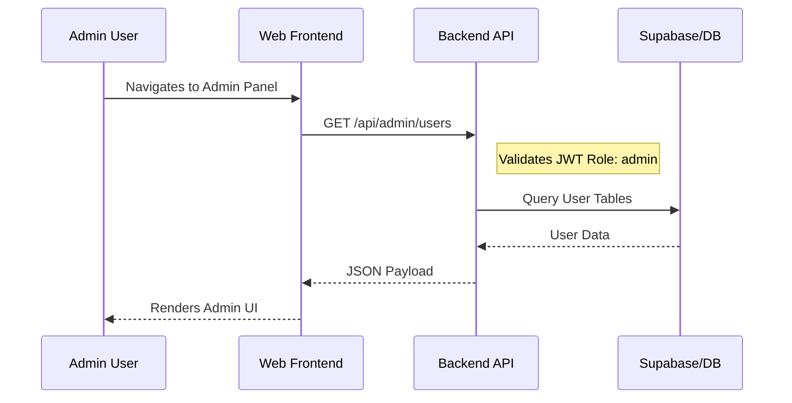
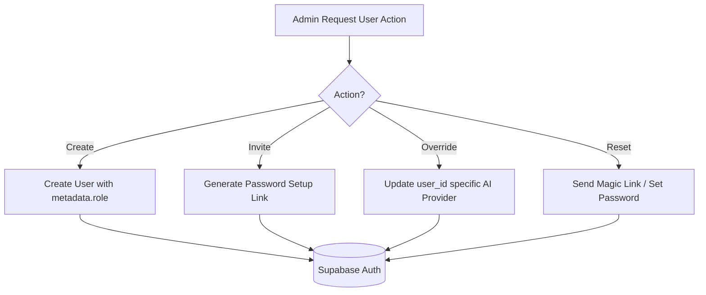

Relevant source files

The following files were used as context for generating this wiki page:

- [apps/web/tests/components/admin/AdminPanel.test.tsx](apps/web/tests/components/admin/AdminPanel.test.tsx)
- [apps/backend/tests/integration/supabaseLocal.integration.test.ts](apps/backend/tests/integration/supabaseLocal.integration.test.ts)
- [apps/backend/tests/routes/projects.test.ts](apps/backend/tests/routes/projects.test.ts)
- [apps/backend/tests/scripts/supabaseAuthTemplates.test.ts](apps/backend/tests/scripts/supabaseAuthTemplates.test.ts)
- [README.md](README.md)
- [apps/backend/tests/projects/postgresProjectStore.test.ts](apps/backend/tests/projects/postgresProjectStore.test.ts)

# Admin Panels & Tools

The Admin Panels & Tools within the Nous project provide centralized management for system configuration, user accounts, pedagogical model steering, and diagnostic monitoring. These tools are designed for administrators to oversee the AI-driven learning environment, manage service integrations like Supabase and OpenRouter, and handle user feedback loops.

Access to these tools is restricted via Role-Based Access Control (RBAC), specifically requiring an `admin` role within the Supabase authentication metadata. The administration layer bridges the gap between high-level project management and low-level service configuration, ensuring the platform remains healthy and correctly tuned for ADHD-friendly learning flows.
Sources: [apps/web/tests/components/admin/AdminPanel.test.tsx:112-117](apps/web/tests/components/admin/AdminPanel.test.tsx#L112-L117), [apps/backend/tests/integration/supabaseLocal.integration.test.ts:50-61](apps/backend/tests/integration/supabaseLocal.integration.test.ts#L50-L61)

## System Architecture & RBAC

The administrative infrastructure relies on a secure communication path between the React-based frontend and the Express/Postgres backend. Admin requests are validated using JWT tokens containing specific claims.

### Security Flow
Administrative operations require tokens with `app_metadata.role` set to `admin`. The backend validates these tokens before executing privileged operations like listing diagnostic reports or creating users.

Sources: [apps/backend/tests/integration/supabaseLocal.integration.test.ts:54-61](apps/backend/tests/integration/supabaseLocal.integration.test.ts#L54-L61), [apps/backend/tests/routes/projects.test.ts:683-705](apps/backend/tests/routes/projects.test.ts#L683-L705)

## Model Configuration & AI Steering

The AI behavior is managed through a comprehensive `AdminModelConfig`. This allow administrators to map specific AI providers (OpenRouter, OpenAI, or Codex) to different pedagogical functions like lesson generation, assessment, and artifact creation.

### Pedagogical Model Slots
The system categorizes AI tasks into "slots," allowing for granular performance tuning. For example, an administrator might assign a high-reasoning model for complex lessons while using a faster, cheaper model for progress tracking.

| Slot | Description | Default Target (Example) |
| :--- | :--- | :--- |
| `lesson` | Full lesson content generation | `openai/gpt-5.6-luna` |
| `artifact` | Static visual pedagogical aids | `deepseek/deepseek-v4-pro` |
| `artifactInteractive` | HTML/JS interactive labs | `openai/gpt-5.6-terra` |
| `assessment` | Quiz and evaluation logic | `google/gemini-3.1-flash-lite` |
| `research` | Deep search and dossier creation | `perplexity/sonar-pro-search` |
| `tts` | Text-to-speech generation | `x-ai/grok-voice-tts-1.0` |

Sources: [apps/web/tests/components/admin/AdminPanel.test.tsx:50-70](apps/web/tests/components/admin/AdminPanel.test.tsx#L50-L70), [apps/web/tests/components/admin/AdminPanel.test.tsx:135-155](apps/web/tests/components/admin/AdminPanel.test.tsx#L135-L155)

### Reasoning Effort Control
Administrators can configure the "reasoning effort" (e.g., `none`, `low`, `medium`, `high`) for specific providers to balance response quality against latency and cost.
Sources: [apps/web/tests/components/admin/AdminPanel.test.tsx:156-180](apps/web/tests/components/admin/AdminPanel.test.tsx#L156-L180)

## User Management & Access Controls

The Admin Panel provides tools for direct user lifecycle management, which is critical for private or self-hosted deployments.

### Administrative Capabilities
*  **User Creation:** Admins can manually create accounts, specifying initial AI providers and passwords.
*  **Password Setup:** For invited users, admins can generate links that enforce a password setup step before platform access is granted.
*  **Provider Overrides:** Specific users can be pinned to certain AI backends, overriding global system defaults.
*  **Magic Links:** Sending authenticated access links to users to bypass standard login flows.

Sources: [apps/web/tests/components/admin/AdminPanel.test.tsx:210-235](apps/web/tests/components/admin/AdminPanel.test.tsx#L210-L235), [apps/web/tests/components/admin/AdminPanel.test.tsx:249-265](apps/web/tests/components/admin/AdminPanel.test.tsx#L249-L265), [apps/backend/tests/integration/supabaseLocal.integration.test.ts:404-435](apps/backend/tests/integration/supabaseLocal.integration.test.ts#L404-L435)

## Diagnostics & Feedback Monitoring

Administrators monitor system health through two primary data streams: Import Diagnostics and User Feedback.

### Import Diagnostics
Used to debug failures during large-scale library migrations or project imports. The system records correlation IDs and failure stages (e.g., `manifest-read`, `project-import`).
Sources: [apps/backend/tests/routes/projects.test.ts:660-681](apps/backend/tests/routes/projects.test.ts#L660-L681)

### Feedback Reporting Loop
User-submitted feedback (bugs, suggestions) is captured along with technical metadata (console logs, page URLs, screenshots). Admins can:
1.  **Review Technical Context:** Inspect the exact state of the application when the error occurred.
2.  **GitHub Synchronization:** The system can mirror these reports as GitHub issues, synchronizing states (open/closed) between the platform and the repository.
3.  **Retry Delivery:** Manually re-trigger failed external service deliveries.

Sources: [apps/web/tests/components/admin/AdminPanel.test.tsx:343-375](apps/web/tests/components/admin/AdminPanel.test.tsx#L343-L375), [apps/backend/tests/integration/supabaseLocal.integration.test.ts:303-345](apps/backend/tests/integration/supabaseLocal.integration.test.ts#L303-L345)

## Self-Hosted & Codex Tools

For instances using a shared ChatGPT/Codex account, special settings are available:
*  **Codex App-Server:** Toggle enabled status and monitor account connection.
*  **Device Login:** Admins can initiate a device login flow to link the Nous instance to a specific Codex account without exposing credentials in environment variables.

Sources: [README.md:21-26](README.md#L21-L26), [apps/web/tests/components/admin/AdminPanel.test.tsx:32-37](apps/web/tests/components/admin/AdminPanel.test.tsx#L32-L37)

The administrative layer ensures that the system's pedagogical integrity is maintained by allowing human oversight of the underlying AI models and user access patterns.
