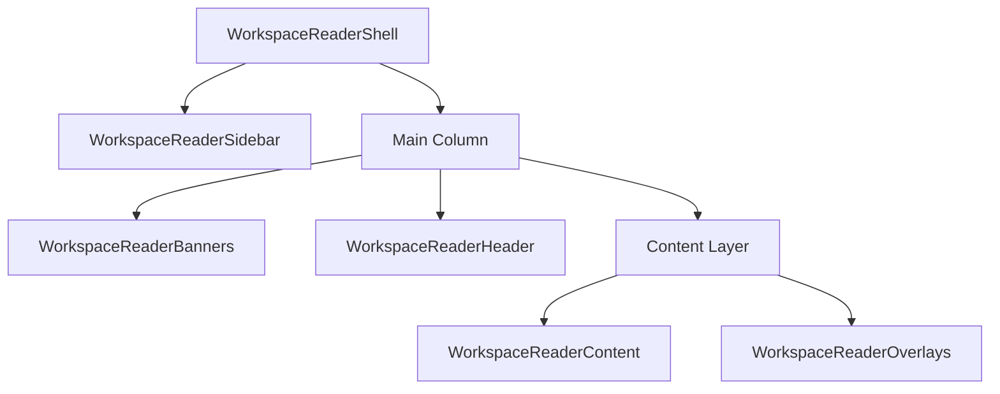
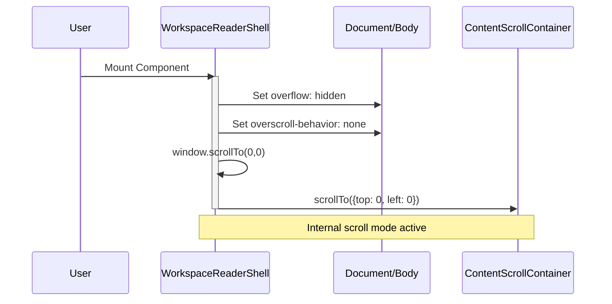
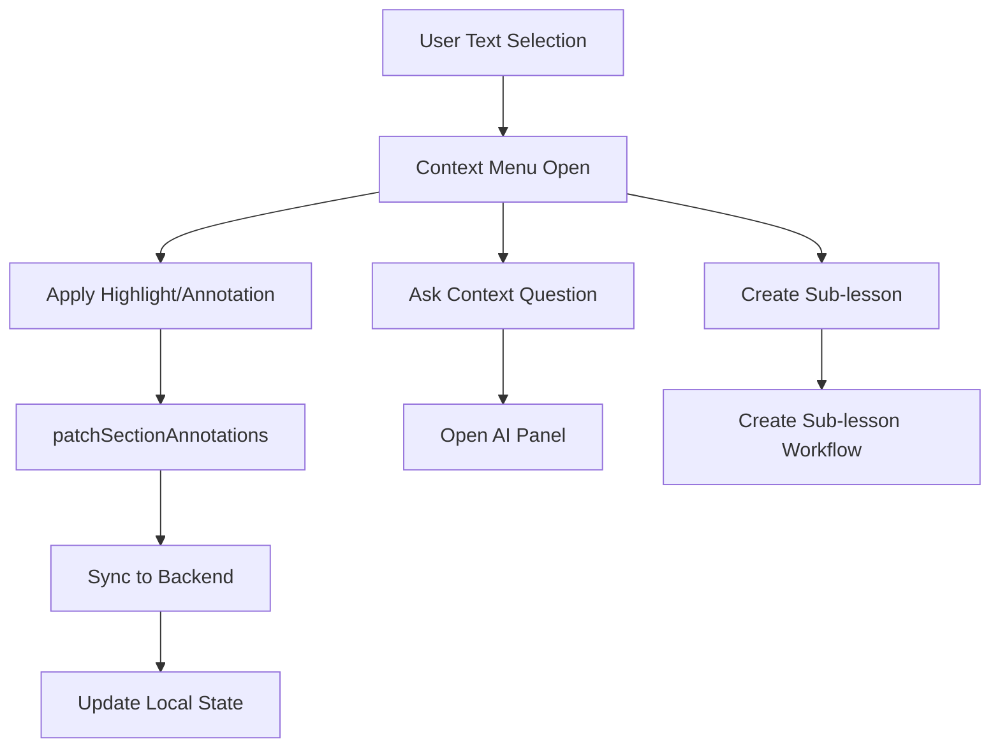

<details>
<summary>Relevant source files</summary>

The following files were used as context for generating this wiki page:

- [apps/web/components/workspace/WorkspaceReaderShell.tsx](../../../apps/web/components/workspace/WorkspaceReaderShell.tsx)
- [apps/web/components/workspace/shell/WorkspaceReaderContent.tsx](../../../apps/web/components/workspace/shell/WorkspaceReaderContent.tsx)
- [apps/web/components/workspace/shell/types.ts](../../../apps/web/components/workspace/shell/types.ts)
- [apps/web/hooks/workspace/useWorkspaceReaderActions.ts](../../../apps/web/hooks/workspace/useWorkspaceReaderActions.ts)
- [apps/web/components/workspace/shell/LessonDocumentSources.tsx](../../../apps/web/components/workspace/shell/LessonDocumentSources.tsx)
- [apps/web/tests/components/workspace/WorkspaceReaderShell.test.tsx](../../../apps/web/tests/components/workspace/WorkspaceReaderShell.test.tsx)
</details>

# Workspace Reader Shell Interface

The Workspace Reader Shell Interface serves as the primary pedagogical environment for the Nous application. It is designed as an ADHD-friendly, step-by-step learning interface that facilitates deep understanding of complex subjects through structured lessons, interactive aids, and integrated source materials. The interface transitions between a full application shell and an embedded reader mode, managing complex layouts, viewport constraints, and internal scroll states to ensure a focused learning experience.

Sources: [apps/web/components/workspace/WorkspaceReaderShell.tsx:11-20](../../../apps/web/components/workspace/WorkspaceReaderShell.tsx#L11-L20), [AGENTS.md:120-130](../../../AGENTS.md#L120-L130)

## Core Architecture and Layout

The shell is structured as a high-level container that orchestrates multiple functional layers, including navigation (Sidebar), metadata (Banners), controls (Header), and primary interaction (Content/Overlays).

### Component Composition
The layout utilizes a flexbox-based structure to manage the spatial relationship between the sidebar and the main reading column. In desktop view, it maintains a fixed sidebar width while the content area expands to fill the remaining horizontal space.



The content layer is specifically isolated to ensure that interactive overlays (like context menus or AI chat panels) are visually and functionally constrained to the active reading area rather than the global application frame.
Sources: [apps/web/components/workspace/WorkspaceReaderShell.tsx:90-112](../../../apps/web/components/workspace/WorkspaceReaderShell.tsx#L90-L112), [apps/web/tests/components/workspace/WorkspaceReaderShell.test.tsx:210-218](../../../apps/web/tests/components/workspace/WorkspaceReaderShell.test.tsx#L210-L218)

### Component Registry
| Component | Responsibility |
| :--- | :--- |
| `WorkspaceReaderSidebar` | Manages learning plan navigation, module toggling, and exercise selection. |
| `WorkspaceReaderBanners` | Displays critical status alerts, storage errors, and PDF mapping warnings. |
| `WorkspaceReaderHeader` | Provides learning plan controls, TTS settings, music volume, and dark mode toggling. |
| `WorkspaceReaderContent` | Renders the primary lesson Markdown, quizzes, YouTube clips, and artifacts. |
| `WorkspaceReaderOverlays` | Orchestrates context menus, AI assistant answers, and annotation tools. |

Sources: [apps/web/components/workspace/shell/types.ts:74-192](../../../apps/web/components/workspace/shell/types.ts#L74-L192), [apps/web/components/workspace/WorkspaceReaderShell.tsx:7-12](../../../apps/web/components/workspace/WorkspaceReaderShell.tsx#L7-L12)

## Lifecycle and Viewport Management

The shell implements strict viewport control to prevent "scroll leaking" between the global document and the internal reading container.

### Scroll Locking and Reset
When mounted in `application` mode, the shell enforces `overflow: hidden` on the HTML and Body elements. It also utilizes a layout effect to reset scroll positions across the window, document, and internal container to ensure that transitioning between lessons starts the user at the beginning of the text.



Sources: [apps/web/components/workspace/WorkspaceReaderShell.tsx:22-54](../../../apps/web/components/workspace/WorkspaceReaderShell.tsx#L22-L54), [apps/web/tests/components/workspace/WorkspaceReaderShell.test.tsx:175-185](../../../apps/web/tests/components/workspace/WorkspaceReaderShell.test.tsx#L175-L185)

### Display Modes
The shell supports two distinct display modes:
*  **Application**: A full-screen mode (`100dvh`) where the shell owns the entire viewport and manages internal scrolling.
*  **Embedded**: A mode with `overflow: visible` where the shell allows the parent document to handle scrolling, typically used for previews or integrated widgets.

Sources: [apps/web/components/workspace/WorkspaceReaderShell.tsx:65-90](../../../apps/web/components/workspace/WorkspaceReaderShell.tsx#L65-L90), [apps/web/components/workspace/shell/types.ts:246-248](../../../apps/web/components/workspace/shell/types.ts#L246-L248)

## Content Rendering and Interactivity

The `WorkspaceReaderContent` component is the engine for rendering multi-modal pedagogical content. It handles the projection of raw Markdown into a structured flow of blocks.

### Block-Based Projection
Content is split into distinct `LessonContentBlock` types:
1.  **Markdown**: Standard pedagogical text enhanced with LaTeX/KaTeX for formulas.
2.  **Inline Quiz**: Active pause blocks for student self-assessment.
3.  **YouTube Clips**: Carousels showing specific timestamped segments.
4.  **Generated Visuals**: Interactive HTML/SVG artifacts or raster illustrations.

Sources: [apps/web/components/workspace/shell/WorkspaceReaderContent.tsx:680-750](../../../apps/web/components/workspace/shell/WorkspaceReaderContent.tsx#L680-L750), [apps/web/components/workspace/shell/types.ts:194-220](../../../apps/web/components/workspace/shell/types.ts#L194-L220)

### Interaction Handling Logic
Interaction is centralized through the `useWorkspaceReaderActions` hook, which manages the relationship between text selection, annotations, and AI-driven deep research.

When a user opens sublesson creation from an annotation with a saved note, the creation confirmation replaces the note panel for that interaction. The saved note and its attachments remain in memory and return when the confirmation closes.



Sources: [apps/web/hooks/workspace/useWorkspaceReaderActions.ts:125-265](../../../apps/web/hooks/workspace/useWorkspaceReaderActions.ts#L125-L265), [apps/web/components/workspace/shell/WorkspaceReaderContent.tsx:830-860](../../../apps/web/components/workspace/shell/WorkspaceReaderContent.tsx#L830-L860)

## Source Material Attribution

The shell provides a dedicated mechanism for citing and opening original source materials (PDFs or Archives) used to generate the lesson. 

### Resolved Source References
Sources are rendered in a structured grid, allowing users to open the original PDF at a specific page cited in the lesson. The interface uses `URL.createObjectURL` to handle detached files (files not yet in memory) and provides a safe viewer experience by setting `viewerWindow.opener = null`.

| Property | Description | Source |
| :--- | :--- | :--- |
| `sourceId` | Unique identifier for the source document. | `ResolvedLessonSourceReference` |
| `pageStart` | The specific page number where the concept originates. | `ResolvedLessonSourceReference` |
| `kind` | Whether the source is a `pdf` or `archive`. | `ResolvedLessonSourceReference` |
| `archiveSelectors` | Specific paths within a ZIP archive used for the lesson. | `ResolvedLessonSourceReference` |

Sources: [apps/web/components/workspace/shell/LessonDocumentSources.tsx:30-85](../../../apps/web/components/workspace/shell/LessonDocumentSources.tsx#L30-L85), [apps/web/tests/components/workspace/shell/LessonDocumentSources.test.tsx:16-50](../../../apps/web/tests/components/workspace/shell/LessonDocumentSources.test.tsx#L16-L50)

## Active Learning Aids

The shell integrates "Learning Aids" which are persistent tools configured for the specific needs of the lesson or student profile.

### Aid Categories
*  **TTS (Text-to-Speech)**: Managed via `WorkspaceReaderTtsModel`, supporting skip-chunk, playback rate adjustment, and voice profiles (e.g., `coral`).
*  **Audio/Music**: The header manages background music URLs and volume to facilitate concentration.
*  **Focus Mode**: A UI toggle that optimizes the reading column (narrowing the max-width to ~76ch) and hides secondary distractions.

Sources: [apps/web/components/workspace/shell/types.ts:120-170](../../../apps/web/components/workspace/shell/types.ts#L120-L170), [apps/web/components/workspace/shell/WorkspaceReaderContent.tsx:645-660](../../../apps/web/components/workspace/shell/WorkspaceReaderContent.tsx#L645-L660)

## Technical Implementation Details

### Prop Interfaces
The shell is highly typed to ensure contract stability between the backend generation workflows and the frontend presentation layer.

```typescript
// From apps/web/components/workspace/shell/types.ts:245-252
export interface WorkspaceReaderShellProps {
  banners: WorkspaceReaderBannersModel;
  content: WorkspaceReaderContentModel;
  displayMode?: 'application' | 'embedded';
  header: WorkspaceReaderHeaderModel;
  overlays: WorkspaceReaderOverlaysModel;
  shouldUseDesktopSidebar: boolean;
  sidebar: WorkspaceReaderSidebarModel;
}
```

### Mobile Optimization
The interface uses `useMobileKeyboardOffset` to calculate available height, especially important for iOS devices where the virtual keyboard shifts the viewport. It dynamically adjusts the container height using `dvh` units or absolute pixel values derived from the hook.
Sources: [apps/web/components/workspace/WorkspaceReaderShell.tsx:18-20](../../../apps/web/components/workspace/WorkspaceReaderShell.tsx#L18-L20), [apps/web/tests/components/workspace/WorkspaceReaderShell.test.tsx:219-223](../../../apps/web/tests/components/workspace/WorkspaceReaderShell.test.tsx#L219-L223)
